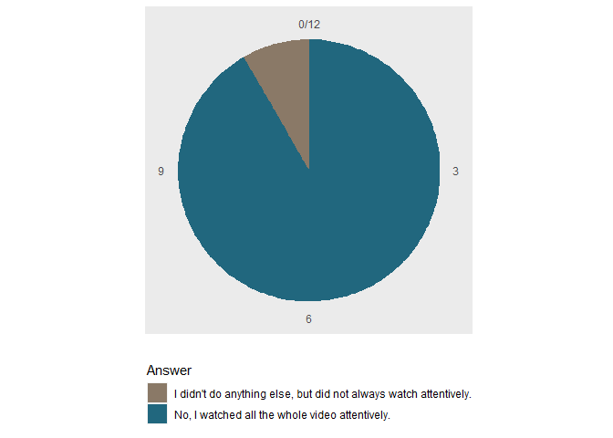
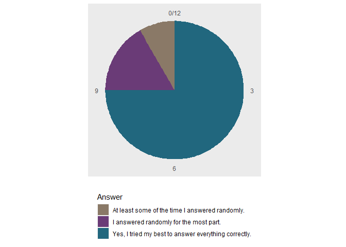
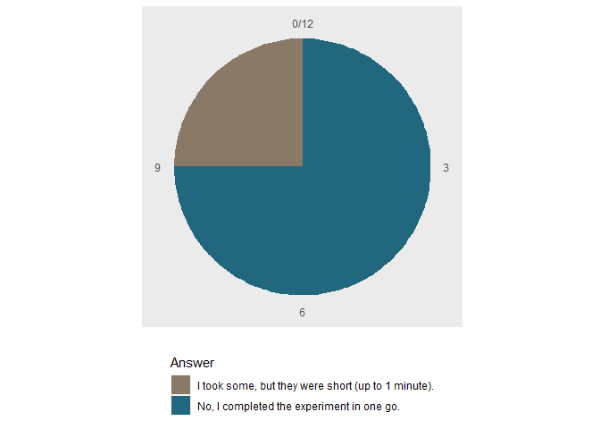
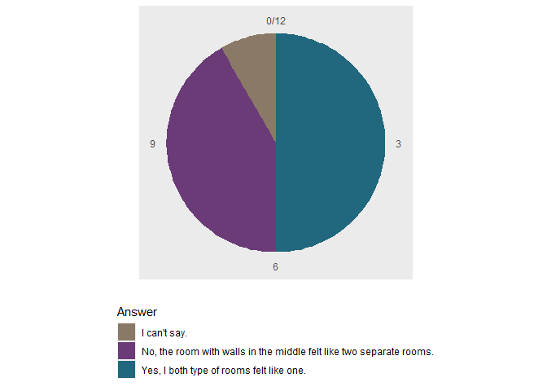
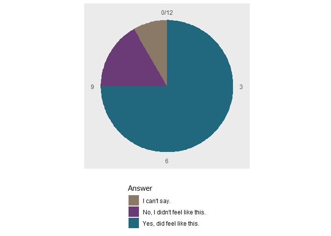
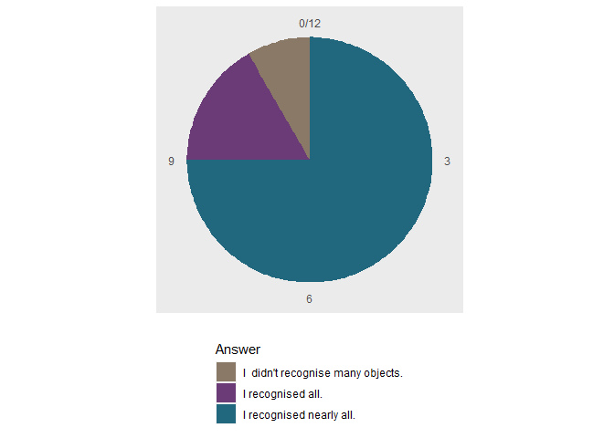
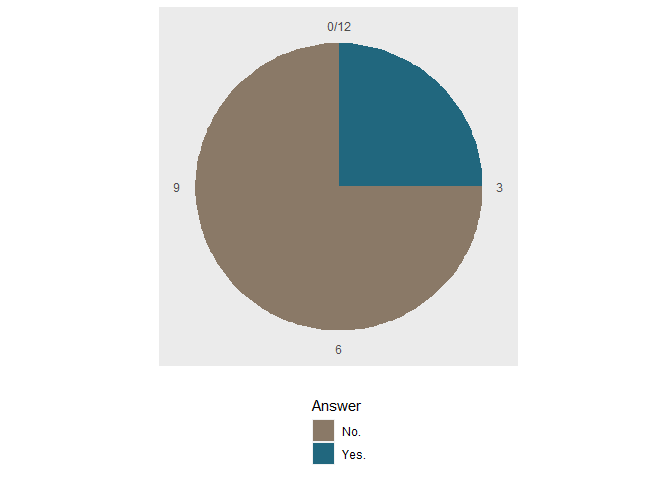
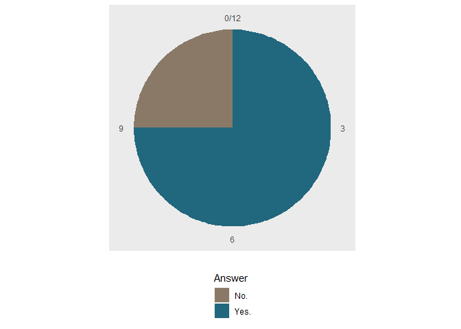
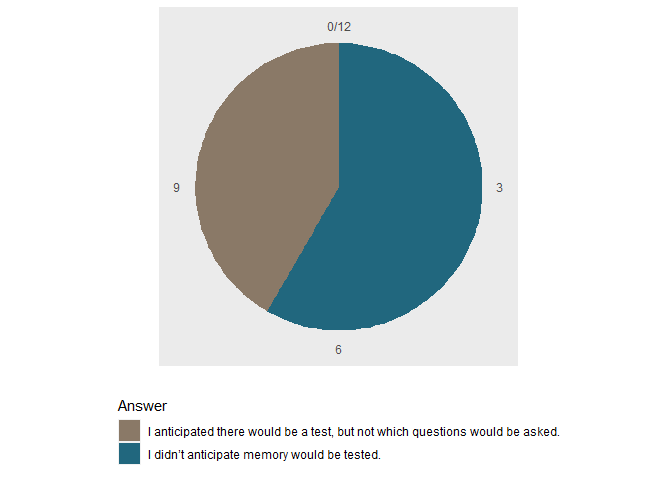
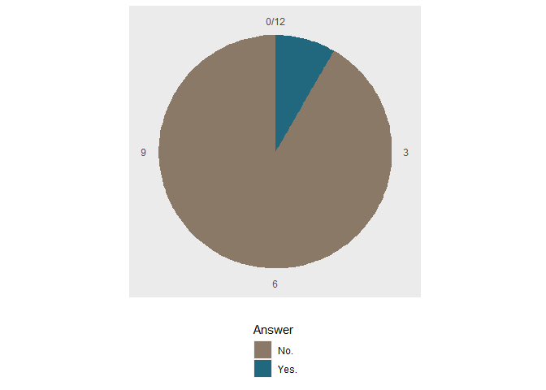

Analysis of debrief questionnaire
================

# Questions

    ## Did you do anything else while watching the video?

<!-- -->

    ## Did you do your best to answer the questions correctly?

<!-- -->

    ## Did you take breaks during the experiment?

<!-- -->

    ## Did rooms with a partition feel like they were a single room (similar to the room without a partition) 
    ## or did they feel like two separate rooms? (Please elaborate below.)

<!-- -->

    ## 1 The wall in the middle seems to be in more than half of the size of normal wall. Such a construction gives feeling of new room  
    ## 3 it was very hard to take this in and remember 
    ## 4 I think the first person view had a lot to do with the room feeling separated as when you first walk into the room with the partition, you see the wall so it did make the room feel separated for me. As well as the wall color for the '2' position was different than the '1' position with the wall color being the same when I first walked in as it was in the '1' so I think that also added to that feeling.  
    ## 6 yes, because the walls felt like they didn't cover the whole length of the room 
    ## 12 it looks like two separate rooms 
    ## 
    ## 
    ## Did you feel it was harder/easier to remember the order of objects in the rooms without a partition 
    ## relative to those with a partition?

<!-- -->

    ## 3 There were just too many rooms and images to remember. plus the rooms had different colours. it was hard to keep up 
    ## 4 It was hard to remember either way, but I noticed with a lot of the piece I could place the object after it in the corner or '1' position easier with the partition.  
    ## 12 focusing on objects there was not much difference
    ##   
    ## 
    ## 
    ## When crossing from one part of the room to the next in a partitioned room, did that feel like you were 
    ## moving to a new room (a bit like walking through a door)?

<!-- -->

    ## 1 Yes it felt like going through doors 
    ## 4 The wall itself made it feel like a new room, it was also the layout too as the partition extended a far bit into the room and from my view-point, it felt large. The wall color as mentioned in my previous response also helped this feeling of walking into a new room as well.  
    ## 12 I definitely feel like that
    ##  
    ## 
    ## 
    ## Did you recognise all objects in the video and in the memory task? (If you can, please try describe 
    ## the/those object(s) briefly.)

<!-- -->

    ## 1 coffee percolator, ball, chess, some toys, chair, guitar, violin, boots, gramophone,  
    ## 3 I would say i recognised at least 80% of them  
    ## 4 I have to say I remember all of the objects for the most part but I do not recall a calculator. Maybe I was not able to see it clearly enough in my mind and instead just thought it was a blob or a shape but that's okay! 
    ## 5 I recognised the large majority of them, most of them had a pretty distinctive shape. There were a couple of smaller items I was less sure of, bags etc, which I felt I might be mistaking for something else. 
    ## 6 no, some i didn't, it was extremely difficult to remember, especially the order. There were many objects 
    ## 10 i recognised some more than others...i dont remember seeing a bowl of fruit for example 
    ## 12 yes, I have recognized all the objects, these are the objects we mostly use on a daily basis such as tv, shoes, ball, printer, toothbrushes, towels, toaster, kettle etc
    ##  
    ## 
    ## 
    ## Did you experience any problems viewing the videos? Or problems in the experiment in general? (If yes,
    ## please elaborate.)

<!-- -->

    ## 1 My eyes felt tired 
    ## 5 My only issue was that I was unsure if when watching the video, it was detecting my button presses. Some kind of visual confirmation of a button press would have been really helpful. 
    ## 12 I didn't have any problem with the video, it loaded quickly and I watched it without a problem 
    ## 
    ## 
    ## Did the navigation feel too fast?

<!-- -->

    ## Did you think the time the objects were visible was long enough?

<!-- -->

    ## Did you anticipate there would be a memory test on the objects? If so, did you anticipate you would be 
    ## asked about the order of the objects?

<!-- -->

    ## Did you use any strategy to remember the objects and their order? (If yes, please elaborate.)

<!-- -->

    ## 3 I tried to but after a while i realised the video was too fast and there was too much information to take in  
    ## 6 i tried to remember accordding to the rooms colors but they were very similar 
    ## 12 I tried to remember all the objects shown best, but it was hard to remember their order because there were a lot of them, so most of them I remembered from memory
    ##  
    ## 
    ## 
    ## Now, you've completed the task. Can we somehow improve our instructions? (If yes, please elaborate.)

<!-- -->

    ## 3 I think the instructions were fine.  
    ## 9 Maybe saying more about the ongoing experiment. 
    ## 12 All instructions were accurate and legible, I have no objections
    ## 

# General comments

    ## 4 I cannot imagine all the work that went into designing and implementing this experiment and I just wanted to say it was engaging and smooth!  
    ## 5 As I said earlier, a visual confirmation of some kind that it detected a button press when watching the video would have been useful. I was worried it wasn't detecting them, so a couple of times I clicked on the video or the area of the window next to the video to make sure it was focused properly.  
    ## 10 very difficult to remember where objects were in rooms,at the time i was just focused on the size of the object  
    ## 12 Very interesting study, it required a great deal of concentration and I tried to do it best ;-)
