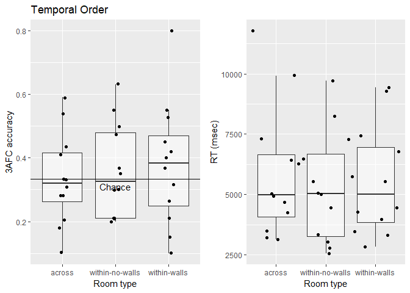
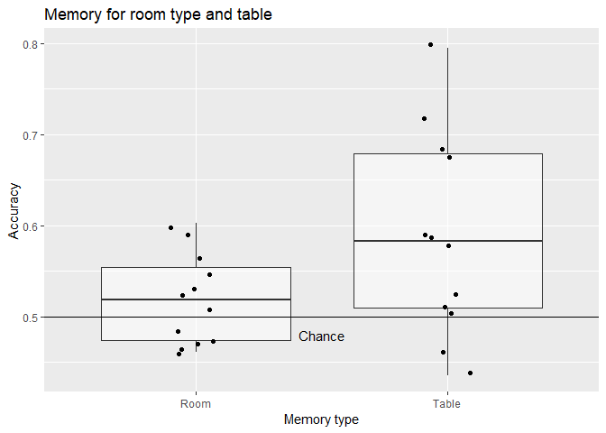
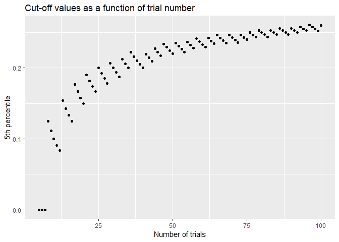
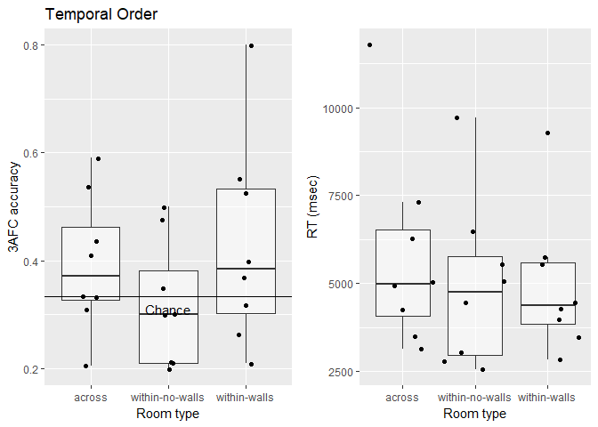
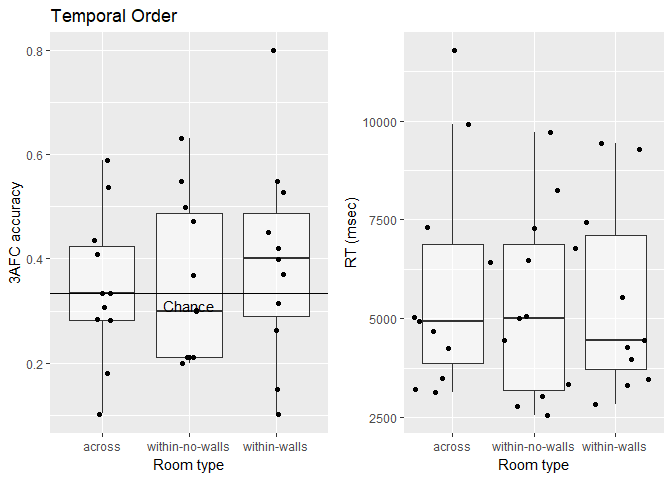
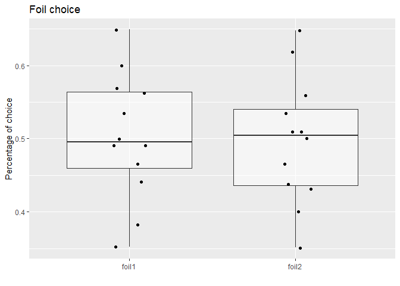
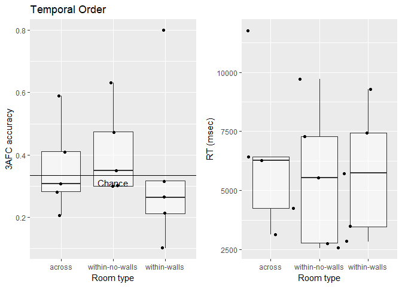

Analysis of memory task
================

Analyse data
============

Analysis of raw data
--------------------

### Temporal order memory

``` r
# Aggregate data
temporalOrder_agg <- ddply(temporalOrder_comb, c('id', 'context'), summarise, 
                           n = length(rt),
                           acc = mean(accuracy), 
                           rt = mean(rt))

afcPlot <- ggplot(temporalOrder_agg, aes(x = context, y = acc)) + 
  geom_boxplot(alpha = 0.5,outlier.shape = NA) + 
  geom_jitter(width = 0.1) +
  geom_hline(yintercept = 1/3) +
  annotate('text', x = 2, y = 0.31, label = 'Chance') +
  labs(y = '3AFC accuracy', x = "Room type", title = 'Temporal Order')


rtPlot <- ggplot(temporalOrder_agg, aes(x = context, y = rt)) + 
  geom_boxplot(alpha = 0.5, outlier.shape = NA) + 
  geom_jitter(width = 0.5) +
  labs(y = 'RT (msec)', x = "Room type", title = '')

plot_grid(afcPlot, rtPlot)
```



As can be seen above, some participants seems to significantly perform below chance. To show this, I simulated a null distribution (see below). In an ANOVA, there were no difference between the conditions:

``` r
ezANOVA(temporalOrder_agg, dv = acc, wid = id, within = context)
```

    ## $ANOVA
    ##    Effect DFn DFd         F         p p<.05        ges
    ## 2 context   2  22 0.2556536 0.7766791       0.01447536
    ## 
    ## $`Mauchly's Test for Sphericity`
    ##    Effect         W        p p<.05
    ## 2 context 0.7082561 0.178218      
    ## 
    ## $`Sphericity Corrections`
    ##    Effect       GGe     p[GG] p[GG]<.05       HFe     p[HF] p[HF]<.05
    ## 2 context 0.7741473 0.7212708           0.8770658 0.7486132

### Room and table question

``` r
#Aggregate data
roomType_comb_agg <- ddply(roomType_comb, c('id'), summarise, acc = mean(accuracy), rt = mean(rt))
tableNum_comb_agg <- ddply(tableNum_comb, c('id'), summarise, acc = mean(accuracy), rt = mean(rt))

roomTable_agg <- data.frame(id = rep(1:n, 2),
                            Type = rep(c('Room', 'Table'), each = n),
                            acc = c(roomType_comb_agg$acc, tableNum_comb_agg$acc))

ggplot(roomTable_agg, aes(x = Type, y = acc)) + 
  geom_boxplot(alpha = 0.5,outlier.shape = NA) + 
  geom_jitter(width = 0.1) +
  geom_hline(yintercept = 0.5) +
  annotate('text', x = 1.5, y = 0.48, label = 'Chance') +
  labs(y = 'Accuracy', x = "Memory type", title = 'Memory for room type and table')
```



While performance for the room task was not above chance

``` r
t.test(roomType_comb_agg$acc -0.5)
```

    ## 
    ##  One Sample t-test
    ## 
    ## data:  roomType_comb_agg$acc - 0.5
    ## t = 1.3498, df = 11, p-value = 0.2042
    ## alternative hypothesis: true mean is not equal to 0
    ## 95 percent confidence interval:
    ##  -0.01212586  0.05058740
    ## sample estimates:
    ##  mean of x 
    ## 0.01923077

the performance for the table question was:

``` r
t.test(tableNum_comb_agg$acc - 0.5)
```

    ## 
    ##  One Sample t-test
    ## 
    ## data:  tableNum_comb_agg$acc - 0.5
    ## t = 2.794, df = 11, p-value = 0.01746
    ## alternative hypothesis: true mean is not equal to 0
    ## 95 percent confidence interval:
    ##  0.01882183 0.15852860
    ## sample estimates:
    ##  mean of x 
    ## 0.08867521

Simulating a null distribution for temporal memory
==================================================

With random guesses participants should get an average accuracy of 1/3 in the 3AFC task. However, some participants' accuracy is extremely low. To exclude those participants that actually perform below chance, I simulated a null distribution (N = 10000) for each condition since each condition has different number of trials.

``` r
# Simulation parameters
nSims     <- 10000
nTrials   <- c(39, 20, 19) # trials per condiiton
accDist1  <- c()
accDist2  <- c()
accDist3  <- c()

# Simulation
for(i in 1:nSims){
  accDist1[i] <- mean(rbinom(nTrials[1], 1, 1/3))
  accDist2[i] <- mean(rbinom(nTrials[2], 1, 1/3))
  accDist3[i] <- mean(rbinom(nTrials[3], 1, 1/3))
}

# Bind to df
accDists <- data.frame(Context = rep(c('across', 'within-no-walls', 'within-walls'), each = nSims),
                       Accuracy = c(accDist1, accDist2, accDist3))
cutOffs  <-  data.frame(Context = c('across', 'within-no-walls', 'within-walls'),
                        Accuracy = c(quantile(accDist1, 0.05),
                                     quantile(accDist2, 0.05),
                                     quantile(accDist3, 0.05)))

# Plot distributions
ggplot(accDists, aes(x = Accuracy)) + 
  facet_grid(.~ Context) + 
  geom_histogram() + 
  geom_vline(data = cutOffs, aes(xintercept = Accuracy), linetype = 'dashed')
```


Above, you see the null distribution that we would expect if participants answer randomly. We will re-ran the analysis using the following cut-offs

``` r
kable(cutOffs)
```

| Context         |   Accuracy|
|:----------------|----------:|
| across          |  0.2051282|
| within-no-walls |  0.1500000|
| within-walls    |  0.1578947|

and exclude anyone scoring below any of these cut-offs. As can be seen above, the trial number per condition influences the cut-off. This is because with a smaller trial number, fewer response patterns are possible.

``` r
nTrials        <- 5:100
percentile_5th <- c()

# Run simulation
for(i in 1:length(nTrials)){
  tempDist <- c()
  
  for(j in 1:nSims){
    tempDist[j] <- mean(rbinom(nTrials[i], 1, 1/3))
  }
  percentile_5th[i] <- quantile(tempDist, 0.05)
}

trial_sim <- data.frame(nTrials = nTrials,
                        per_5th = percentile_5th)

ggplot(trial_sim, aes(x = nTrials, y = per_5th)) + 
  geom_point() +
  labs(x = 'Number of trials', 
       y = '5th percentile', 
       title = 'Cut-off values as a function of trial number')
```



The graphic above shows the 5th percentile varies as function of the trial number. For situations with small trial numbers, lower values are still probable under the null distribution. This is because the probability of getting all trials right is higher if you have only 2 trials compared if you have a 100 trials. Hence, I would argue it's appropriate to have different cut-offs for the different conditions. While the across condition has 39 trials, the within-walls only has 19. If participants randomly guessed, I expect different null distributions even though in both cases the success probability is 1/3.

Exlcuding participants that are below 5th percentile of null distribution
=========================================================================

With condition specific cut-offs
--------------------------------

``` r
# Create exlusion var and set to 0 as default
exclude <- rep(0, n)
context <- c('across', 'within-no-walls', 'within-walls')

for(i in 1:dim(temporalOrder_agg)[1]){
  # Exclude if accuracy is below cut-off for given condition
  if(temporalOrder_agg$acc[i] < cutOffs$Accuracy[cutOffs$Context == temporalOrder_agg$context[i]]){
    exclude[temporalOrder_agg$id[i]] <- 1
  }
}

# Create subset
temporalOrder_agg$exclude <- rep(exclude, each = 3)
temporalOrder_agg_sub     <- temporalOrder_agg[temporalOrder_agg$exclude == 0, ]
```

Based on the cut-offs, I excluded 4 participants from the analysis.

Temporal order memory on subset
===============================

``` r
# Aggregate data
afcPlot <- ggplot(temporalOrder_agg_sub, aes(x = context, y = acc)) + 
  geom_boxplot(alpha = 0.5,outlier.shape = NA) + 
  geom_jitter(width = 0.1) +
  geom_hline(yintercept = 1/3) +
  annotate('text', x = 2, y = 0.31, label = 'Chance') +
  labs(y = '3AFC accuracy', x = "Room type", title = 'Temporal Order')


rtPlot <- ggplot(temporalOrder_agg_sub, aes(x = context, y = rt)) + 
  geom_boxplot(alpha = 0.5, outlier.shape = NA) + 
  geom_jitter(width = 0.5) +
  labs(y = 'RT (msec)', x = "Room type", title = '')

plot_grid(afcPlot, rtPlot)
```



However, there are still no significant difference between the conditions:

``` r
ezANOVA(temporalOrder_agg_sub, dv = acc, wid = id, within = context)
```

    ## $ANOVA
    ##    Effect DFn DFd        F         p p<.05       ges
    ## 2 context   2  14 1.849404 0.1937707       0.1006296
    ## 
    ## $`Mauchly's Test for Sphericity`
    ##    Effect         W        p p<.05
    ## 2 context 0.5406862 0.158065      
    ## 
    ## $`Sphericity Corrections`
    ##    Effect       GGe     p[GG] p[GG]<.05       HFe     p[HF] p[HF]<.05
    ## 2 context 0.6852536 0.2091039           0.7961692 0.2039348

Unexpectedly, the effect size increased with increased memory for the across and the within-walls condition.

Cut-off across conditions
-------------------------

Overall, there are 78 trials in the experiment. Below chance performance for that case would be 0.2435897.

``` r
temporalOrder_agg2 <- ddply(temporalOrder_comb, c('id'), summarise, 
                           n = length(accuracy),
                           acc = mean(accuracy))

# How many participants are excluded becuase they're below or equal to that cut-off
cutOff78 <- trial_sim[trial_sim$nTrials == 78, 2]
exclude  <- temporalOrder_agg2$id[which(temporalOrder_agg2$acc <= cutOff78)]
```

There is 1 participant(s), to which that applies. If we exclude this participant from the analysis.

``` r
temporalOrder_agg_sub2 <- temporalOrder_agg[temporalOrder_agg$id != exclude, ]
```

Temporal order memory on subset
===============================

``` r
# Aggregate data
afcPlot <- ggplot(temporalOrder_agg_sub2, aes(x = context, y = acc)) + 
  geom_boxplot(alpha = 0.5,outlier.shape = NA) + 
  geom_jitter(width = 0.1) +
  geom_hline(yintercept = 1/3) +
  annotate('text', x = 2, y = 0.31, label = 'Chance') +
  labs(y = '3AFC accuracy', x = "Room type", title = 'Temporal Order')


rtPlot <- ggplot(temporalOrder_agg_sub2, aes(x = context, y = rt)) + 
  geom_boxplot(alpha = 0.5, outlier.shape = NA) + 
  geom_jitter(width = 0.5) +
  labs(y = 'RT (msec)', x = "Room type", title = '')

plot_grid(afcPlot, rtPlot)
```



As expected, excluding that participant didn't change the interpretation.

``` r
ezANOVA(temporalOrder_agg_sub2, dv = acc, wid = id, within = context)
```

    ## $ANOVA
    ##    Effect DFn DFd        F        p p<.05        ges
    ## 2 context   2  20 0.269512 0.766482       0.01724896
    ## 
    ## $`Mauchly's Test for Sphericity`
    ##    Effect         W         p p<.05
    ## 2 context 0.7219926 0.2308859      
    ## 
    ## $`Sphericity Corrections`
    ##    Effect       GGe     p[GG] p[GG]<.05       HFe     p[HF] p[HF]<.05
    ## 2 context 0.7824681 0.7138664           0.9018485 0.7445744

Additional analysis after rabble
================================

During rabble, we came up with two additional analyses to figure out why our performance is so low.

Is there a bias towards one foil?
---------------------------------

In the first step, I need to add the respective information from the [R-script](https://github.com/JAQuent/boundaryVR/blob/master/onlineExperiment/r_supportFiles/createTrials.R) that creates the trial information.

``` r
temporalOrder_comb_incorrect <- subset(temporalOrder_comb, temporalOrder_comb$accuracy == 0)
temporalOrder_foils <- ddply(temporalOrder_comb_incorrect, c('id'), 
                             summarise,
                             n   = length(choice),
                             foil1 = table(choice)[1],
                             foil2 = table(choice)[2])

# Create percentages
temporalOrder_foils$foil1 <- temporalOrder_foils$foil1 / temporalOrder_foils$n
temporalOrder_foils$foil2 <- temporalOrder_foils$foil2 / temporalOrder_foils$n

# Melt for plotting
temporalOrder_foils <- melt(temporalOrder_foils, id.vars =c("id"), measure.vars = c('foil1', 'foil2'))

# Plot
ggplot(temporalOrder_foils, aes(x = variable, y = value)) + 
  geom_boxplot(alpha = 0.5,outlier.shape = NA) + 
  geom_jitter(width = 0.1) +
  labs(y = 'Percentage of choice', x = '', title = 'Foil choice')
```



Foil 1 is behind the target and foil 2 is after the target. However, there is nearly no difference between the times foil 1 is choosen over foil 2 and vice versa.

Analysis of participants that expected a memory test
----------------------------------------------------

Because I didn't save a participant ID for all output, I need to manually assign the results of the memory task to the debrief questionnaire data by renaming the filenames.

``` r
# Get participants that expected memory task
expectedTest <- debriefData$SubNum[debriefData$id == 'memory1'] 
expectedTest <- expectedTest[debriefData$answerValue[debriefData$id == 'memory1'] != 'expNone']

# Create subset
temporalOrder_agg_sub <- temporalOrder_agg[temporalOrder_agg$id %in% expectedTest, ]

afcPlot <- ggplot(temporalOrder_agg_sub, aes(x = context, y = acc)) + 
  geom_boxplot(alpha = 0.5,outlier.shape = NA) + 
  geom_jitter(width = 0.1) +
  geom_hline(yintercept = 1/3) +
  annotate('text', x = 2, y = 0.31, label = 'Chance') +
  labs(y = '3AFC accuracy', x = "Room type", title = 'Temporal Order')


rtPlot <- ggplot(temporalOrder_agg_sub, aes(x = context, y = rt)) + 
  geom_boxplot(alpha = 0.5, outlier.shape = NA) + 
  geom_jitter(width = 0.5) +
  labs(y = 'RT (msec)', x = "Room type", title = '')

plot_grid(afcPlot, rtPlot)
```


