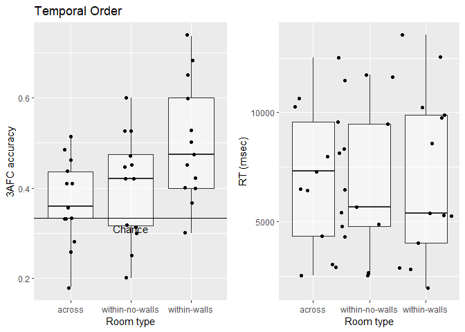

Analysis of memory task
================

# Analyse data

## Temporal order memory

<!-- -->

As you can see above, most participants now perform above chance. Below,
you see the ANOVA comparing the different conditions.

Interestingly, there was a main effect of context, p = .03. In
**uncorrected** pairwise t-tests, performance in the within-wall
condition was better than across rooms, p = .007, and better than in the
within-no-walls condition, p = .041. However, performance in the
within-no-wall condition was not better than in the across condition, p
= .45. The average values can be found here:

| context         |  accuracy |        SD |
| :-------------- | --------: | --------: |
| across          | 0.3688363 | 0.0962469 |
| within-no-walls | 0.4038462 | 0.1189249 |
| within-walls    | 0.5008097 | 0.1322718 |

The mean accuracy difference between across and within-no-walls is 0.035
(SD = 0.0795), while it is 0.132 (SD = 0.1693) for the within-wall
condition. Here is the Table 1 from his paper for *‘Which object came
next?’*

| Experiment | Context | accuracy |   SD |
| :--------- | :------ | -------: | ---: |
| Exp 1      | within  |     0.52 | 0.15 |
| Exp 1      | across  |     0.42 | 0.10 |
| Exp 2      | within  |     0.45 | 0.17 |
| Exp 2      | across  |     0.38 | 0.18 |
| Exp 3      | within  |     0.52 | 0.18 |
| Exp 3      | across  |     0.44 | 0.14 |

his boundary effects are 0.1, 0.07, 0.08 and for the question *‘Which
object came before?’*

| Experiment | Context | accuracy |   SD |
| :--------- | :------ | -------: | ---: |
| Exp 1      | within  |     0.42 | 0.15 |
| Exp 1      | across  |     0.38 | 0.13 |
| Exp 2      | within  |     0.46 | 0.21 |
| Exp 2      | across  |     0.41 | 0.16 |
| Exp 3      | within  |     0.49 | 0.18 |
| Exp 3      | across  |     0.44 | 0.17 |

here the boundary effects are 0.04, 0.05, 0.05. This is not much
different from our effect if this is not just noise. The problem is that
those low effects are observed for the question that we’re not testing.
It could very well that we just don’t have enough power for to find this
effect. The question then would be why is the effect stronger in the
within-wall condition.

### Temporal memory: across vs. within

<!-- -->

When I colllasp across both within-room conditions, the difference
between across and within rooms is significantly different, p = .008.
The mean difference is 0.0828 (SD = 0.0931).

## Room and table question

<!-- -->

As in Batch 2, participants did not perform above chance for the room
type question, p = .534 but they did for the table question, p = .005.

# Predicting trial-to-trial accruacy and influence of foil distance

For this section, I fished around to see what the relationship between
context and foil distance might be and whether the effect of context
differs as a function of the foil distance.

|                        | Estimate |   SE |      Z |      P | Sig    |
| ---------------------- | -------: | ---: | -----: | -----: | :----- |
| (Intercept)            |   \-0.54 | 0.11 | \-4.94 | 0.0000 | \*\*\* |
| contextwithin-no-walls |     0.15 | 0.16 |   0.92 | 0.3560 |        |
| contextwithin-walls    |     0.54 | 0.16 |   3.47 | 0.0005 | \*\*\* |

In a logistic regrression model (see above) with context as fixed effect
and a random intercept for each participant, the contrast between across
and within-no-wall was not significant, p = .356, while the contrast
between across and within-walls was, p \< .001.

|             | Estimate |   SE |      Z |      P | Sig    |
| ----------- | -------: | ---: | -----: | -----: | :----- |
| (Intercept) |   \-0.67 | 0.19 | \-3.47 | 0.0005 | \*\*\* |
| minDist     |     0.01 | 0.01 |   1.53 | 0.1253 |        |
| maxDist     |     0.00 | 0.00 |   0.98 | 0.3283 |        |
| meanDist    |     0.00 | 0.00 | \-0.22 | 0.8265 |        |

In another step, I tried to predict accuracy by including fixed effects
for the absolute minimum, maximum and mean distance values of foil 1
(before cue/probe) and foil 2 (after cue/probe). In other words, for
each trial I for instance used the minimum of both absolute distances.
However as can you can see above, none significantly predicts accuracy.

|             | Estimate |   SE |      Z |      P | Sig    |
| ----------- | -------: | ---: | -----: | -----: | :----- |
| (Intercept) |   \-0.65 | 0.19 | \-3.39 | 0.0007 | \*\*\* |
| dist1       |   \-0.01 | 0.00 | \-1.33 | 0.1840 |        |
| dist2       |     0.01 | 0.00 |   1.48 | 0.1382 |        |

When I use the raw distance values of foil 1 and foil 2, there again
were no significant effects even though the distance of foil 2 to the
cue/probe was relatively small, p = .138.

|                              | Estimate |   SE |      Z |      P | Sig    |
| ---------------------------- | -------: | ---: | -----: | -----: | :----- |
| (Intercept)                  |   \-0.75 | 0.17 | \-4.40 | 0.0000 | \*\*\* |
| contextwithin-no-walls       |     0.47 | 0.28 |   1.69 | 0.0912 | .      |
| contextwithin-walls          |     0.68 | 0.27 |   2.50 | 0.0123 | \*     |
| dist2                        |     0.01 | 0.01 |   1.60 | 0.1091 |        |
| contextwithin-no-walls:dist2 |   \-0.01 | 0.01 | \-1.46 | 0.1456 |        |
| contextwithin-walls:dist2    |   \-0.01 | 0.01 | \-0.63 | 0.5257 |        |

In a next step, I included context and dist2 as predictors in the
logistic regression model and allowed an interaction between both fixed
effects. As you can see none of the interactions are significant but, a)
there is again a significant contrast between across and within-walls, p
= .012. Most interestingly, there is also trend for the contrast between
across and within-no-walls, p = .091.

## Binary distance

|                                    | Estimate |   SE |      Z |      P | Sig    |
| ---------------------------------- | -------: | ---: | -----: | -----: | :----- |
| (Intercept)                        |   \-0.70 | 0.14 | \-4.83 | 0.0000 | \*\*\* |
| contextwithin-no-walls             |     0.30 | 0.24 |   1.27 | 0.2051 |        |
| contextwithin-walls                |     0.68 | 0.23 |   3.01 | 0.0026 | \*\*   |
| binDist2far                        |     0.31 | 0.19 |   1.69 | 0.0907 | .      |
| contextwithin-no-walls:binDist2far |   \-0.31 | 0.32 | \-0.98 | 0.3292 |        |
| contextwithin-walls:binDist2far    |   \-0.28 | 0.31 | \-0.89 | 0.3761 |        |

If I use a binary measure of foil distance instead of a continuous one,
then the effects don’t chance a lot actually.

The mean accuracy between trial where foil 2 is far way compared to
close is 0.0432 (SD = 0.0432), p = .167.

| context         | binDist2 |   N |  accuracy |
| :-------------- | :------- | --: | --------: |
| across          | close    | 263 | 0.3346008 |
| across          | far      | 244 | 0.4057377 |
| within-no-walls | close    | 109 | 0.4036697 |
| within-no-walls | far      | 144 | 0.4027778 |
| within-walls    | close    | 121 | 0.4958678 |
| within-walls    | far      | 133 | 0.5037594 |

I’ve furthermore tested the interaction between our contrasts (across
vs. within-walls and across vs. wihtin-no-walls) and the distance
between trials with close and far foil 2. The first contrasts shows no
interaction, 0.1564 (SD = 0.171) vs 0.1059 (SD = 0.2123), p = .333, so
that the boundary effect is similar for far and close foil 2s. The same
is true for the contrast of across vs. within-no-walls,0.0714 (SD =
0.1379) vs -0.0053 (SD = 0.1566), p = .28.

## Effect of condition

|                                   | Estimate |   SE |      Z |      P | Sig  |
| --------------------------------- | -------: | ---: | -----: | -----: | :--- |
| (Intercept)                       |   \-0.50 | 0.19 | \-2.58 | 0.0100 | \*\* |
| contextwithin-no-walls            |     0.13 | 0.29 |   0.44 | 0.6624 |      |
| contextwithin-walls               |     0.35 | 0.28 |   1.25 | 0.2116 |      |
| condition6                        |   \-0.05 | 0.30 | \-0.17 | 0.8689 |      |
| condition7                        |   \-0.09 | 0.30 | \-0.29 | 0.7700 |      |
| condition8                        |   \-0.05 | 0.30 | \-0.16 | 0.8691 |      |
| contextwithin-no-walls:condition6 |   \-0.06 | 0.44 | \-0.13 | 0.8961 |      |
| contextwithin-walls:condition6    |     0.75 | 0.44 |   1.70 | 0.0886 | .    |
| contextwithin-no-walls:condition7 |     0.28 | 0.44 |   0.65 | 0.5164 |      |
| contextwithin-walls:condition7    |     0.17 | 0.43 |   0.40 | 0.6897 |      |
| contextwithin-no-walls:condition8 |   \-0.13 | 0.44 | \-0.29 | 0.7685 |      |
| contextwithin-walls:condition8    |   \-0.05 | 0.43 | \-0.11 | 0.9089 |      |

In the last step, I included condition as fixed effect. After replacing
the problematic participants it’s a good sign that there are no
significant interactions left between any context contrast and
conditions. To see how the results differ across the different
conditions, I plot them seperately.

<!-- -->

## Effect of same table

Does it matter if both of the foils are on a different or on the same
table as the target object? To examine this question, I compare the
average accuracy across trials with both foils from the same table as
the target with that being not the case. Note that 0 means both foils or
foil2 are/is not on the same table and 1 means it is the same table.

<!-- -->

This analysis has to be interpreted very carefully because only 21 % of
trials are with both foils on the same table. Accuracy is not
significantly lower on trials where the foils are from the same tables,
p = .452. If we plug that variable into our model,

|                                       | Estimate |   SE |      Z |      P | Sig    |
| ------------------------------------- | -------: | ---: | -----: | -----: | :----- |
| (Intercept)                           |   \-0.53 | 0.12 | \-4.36 | 0.0000 | \*\*\* |
| contextwithin-no-walls                |     0.29 | 0.18 |   1.62 | 0.1046 |        |
| contextwithin-walls                   |     0.44 | 0.18 |   2.48 | 0.0132 | \*     |
| bothSameTable1                        |   \-0.06 | 0.22 | \-0.29 | 0.7726 |        |
| contextwithin-no-walls:bothSameTable1 |   \-0.74 | 0.41 | \-1.80 | 0.0721 | .      |
| contextwithin-walls:bothSameTable1    |     0.51 | 0.39 |   1.32 | 0.1877 |        |

the contrast between across and within-walls remains unchanged by the
inclusion of the variable. Interestingly, there is a trend for an
interaction between foils being on the same table with the target and
the contrast across vs. within-no-walls = .072. Below, I display the
interaction

<!-- -->

The problem with this comparison is that there are on average 6.3461538
trials in the same table case, while there are 22.8846154 in the
opposite case. For comparison, I also plot the same interaction for the
contrast across vs. within-walls.

<!-- -->

Here is the overall table:

| context         | bothSameTable |   N |  accuracy |
| :-------------- | :------------ | --: | --------: |
| across          | 0             | 395 | 0.3721519 |
| across          | 1             | 112 | 0.3571429 |
| within-no-walls | 0             | 200 | 0.4400000 |
| within-no-walls | 1             |  53 | 0.2641509 |
| within-walls    | 0             | 201 | 0.4776119 |
| within-walls    | 1             |  53 | 0.5849057 |

In addition to testing whether accuracy is worse in the rare case when
both foils are from the same table, I also tested whether it makes a
difference if only foil 2 is from the same table as the target.

<!-- -->

Note that here 47 % of trials have foil 2 and the target on the same
table. Again, accuracy is not significantly lower on trials where the
foil 2 is from the same table, p = .004. If we plug foil2 into our
model,

|                                        | Estimate |   SE |      Z |      P | Sig    |
| -------------------------------------- | -------: | ---: | -----: | -----: | :----- |
| (Intercept)                            |   \-0.50 | 0.14 | \-3.64 | 0.0003 | \*\*\* |
| contextwithin-no-walls                 |     0.23 | 0.21 |   1.10 | 0.2733 |        |
| contextwithin-walls                    |     0.58 | 0.22 |   2.65 | 0.0080 | \*\*   |
| foil2SameTable1                        |   \-0.08 | 0.19 | \-0.46 | 0.6489 |        |
| contextwithin-no-walls:foil2SameTable1 |   \-0.20 | 0.32 | \-0.62 | 0.5326 |        |
| contextwithin-walls:foil2SameTable1    |   \-0.07 | 0.31 | \-0.23 | 0.8218 |        |

nothing really changes and there is no interaction. If I enter both
distance of foil 2 and whether both objects are on the same table into
our model

|                                             | Estimate |   SE |      Z |      P | Sig    |
| ------------------------------------------- | -------: | ---: | -----: | -----: | :----- |
| (Intercept)                                 |   \-0.71 | 0.20 | \-3.65 | 0.0003 | \*\*\* |
| contextwithin-no-walls                      |     0.58 | 0.31 |   1.85 | 0.0639 | .      |
| contextwithin-walls                         |     0.55 | 0.31 |   1.78 | 0.0744 | .      |
| bothSameTable1                              |   \-0.16 | 0.37 | \-0.44 | 0.6617 |        |
| dist2                                       |     0.01 | 0.01 |   1.21 | 0.2250 |        |
| contextwithin-no-walls:bothSameTable1       |   \-0.32 | 0.77 | \-0.42 | 0.6745 |        |
| contextwithin-walls:bothSameTable1          |     0.71 | 0.68 |   1.05 | 0.2949 |        |
| contextwithin-no-walls:dist2                |   \-0.01 | 0.01 | \-1.15 | 0.2499 |        |
| contextwithin-walls:dist2                   |     0.00 | 0.01 | \-0.41 | 0.6788 |        |
| bothSameTable1:dist2                        |     0.01 | 0.01 |   0.53 | 0.5934 |        |
| contextwithin-no-walls:bothSameTable1:dist2 |   \-0.02 | 0.03 | \-0.76 | 0.4480 |        |
| contextwithin-walls:bothSameTable1:dist2    |   \-0.01 | 0.02 | \-0.51 | 0.6106 |        |

then both contrasts are close to be significant, across
vs. within-no-walls p = .064 and across within-walls p = .074 but none
of the other main effects or interaction show a trend.

# Conclusion

We have robust and strong effect in the within-wall condition and only
when we controll for distance between foil 2 to the cue/probe, there is
a trend for the contrast between across and within-no-walls. The same is
true for whether the foils are on the same table.
