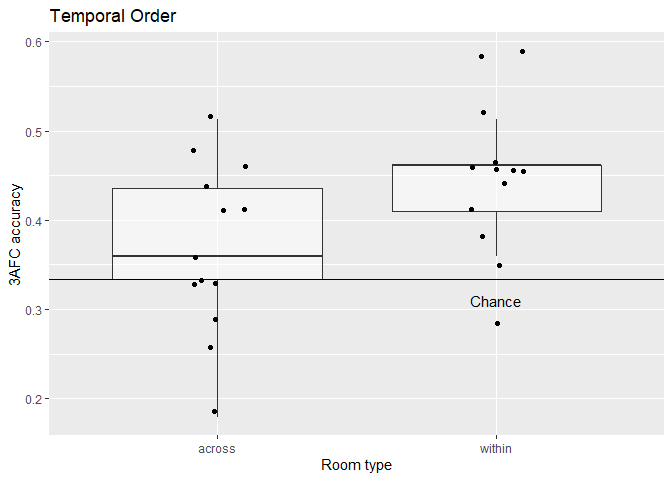

Analysis of memory task
================

# Analyse data

## Temporal order memory

<!-- -->

As you can see above, most participants now perform above chance. Below,
you see the ANOVA compring the different conditions.

Interestingly, there was a main effect of context, p = .03. In
**uncorrected** pairwise t-tests, performance in the within-wall
condition was better than across rooms, p = .007, and better than in the
within-no-walls condition, p = .041. However, performance in the
within-no-wall condition was not better than in the across condition, p
= .45. The average values can be found here:

| context         |  accuracy |        SD |
| :-------------- | --------: | --------: |
| across          | 0.3688363 | 0.0962469 |
| within-no-walls | 0.4038462 | 0.1189249 |
| within-walls    | 0.5008097 | 0.1322718 |

### Temporal memory: across vs. within

<!-- -->

When I colllasp across both within-room conditions, the difference
between across and within rooms is significantly different, p = .029.

## Room and table question

<!-- -->

As in Batch 2, participants did not perform above chance for the room
type question, p = .534 but they did for the table question, p = .005.

# Predicting trial-to-trial accruacy and influence of foil distance

For this section, I fished around to see what the relationship between
context and foil distance might be and whether the effect of context
differs as a function of the foil distance.

|                        | Estimate |   SE |      Z |      P | Sig    |
| ---------------------- | -------: | ---: | -----: | -----: | :----- |
| (Intercept)            |   \-0.54 | 0.11 | \-4.94 | 0.0000 | \*\*\* |
| contextwithin-no-walls |     0.15 | 0.16 |   0.92 | 0.3560 |        |
| contextwithin-walls    |     0.54 | 0.16 |   3.47 | 0.0005 | \*\*\* |

In a logistic regrression model (see above) with context as fixed effect
and a random intercept for each participant, the contrast between across
and within-no-wall was not significant, p = .356, while the contrast
between across and within-walls was, p \< .001.

|             | Estimate |   SE |      Z |      P | Sig    |
| ----------- | -------: | ---: | -----: | -----: | :----- |
| (Intercept) |   \-0.67 | 0.19 | \-3.47 | 0.0005 | \*\*\* |
| minDist     |     0.01 | 0.01 |   1.53 | 0.1253 |        |
| maxDist     |     0.00 | 0.00 |   0.98 | 0.3283 |        |
| meanDist    |     0.00 | 0.00 | \-0.22 | 0.8265 |        |

In another step, I tried to predict accuracy by including fixed effects
for the absolute minimum, maximum and mean distance values of foil 1
(before cue/probe) and foil 2 (after cue/probe). In other words, for
each trial I for instance used the minimum of both absolute distances.
However as can you can see above, none significantly predicts accuracy.

|             | Estimate |   SE |      Z |      P | Sig    |
| ----------- | -------: | ---: | -----: | -----: | :----- |
| (Intercept) |   \-0.65 | 0.19 | \-3.39 | 0.0007 | \*\*\* |
| dist1       |   \-0.01 | 0.00 | \-1.33 | 0.1840 |        |
| dist2       |     0.01 | 0.00 |   1.48 | 0.1382 |        |

When I use the raw distance values of foil 1 and foil 2, there again
were no significant effects even though the distance of foil 2 to the
cue/probe was relatively small, p = .138.

|                              | Estimate |   SE |      Z |      P | Sig    |
| ---------------------------- | -------: | ---: | -----: | -----: | :----- |
| (Intercept)                  |   \-0.75 | 0.17 | \-4.40 | 0.0000 | \*\*\* |
| contextwithin-no-walls       |     0.47 | 0.28 |   1.69 | 0.0912 | .      |
| contextwithin-walls          |     0.68 | 0.27 |   2.50 | 0.0123 | \*     |
| dist2                        |     0.01 | 0.01 |   1.60 | 0.1091 |        |
| contextwithin-no-walls:dist2 |   \-0.01 | 0.01 | \-1.46 | 0.1456 |        |
| contextwithin-walls:dist2    |   \-0.01 | 0.01 | \-0.63 | 0.5257 |        |

In a next step, I included context and dist2 as predictors in the
logistic regression model and allowed an interaction between both fixed
effects. As you can see none of the interactions are significant but, a)
there is again a significant contrast between across and within-walls, p
= .012. Most interestingly, there is also trend for the contrast between
across and within-no-walls, p = .091.

## Binary distance

|                                    | Estimate |   SE |      Z |      P | Sig    |
| ---------------------------------- | -------: | ---: | -----: | -----: | :----- |
| (Intercept)                        |   \-0.70 | 0.14 | \-4.83 | 0.0000 | \*\*\* |
| contextwithin-no-walls             |     0.30 | 0.24 |   1.27 | 0.2051 |        |
| contextwithin-walls                |     0.68 | 0.23 |   3.01 | 0.0026 | \*\*   |
| binDist2far                        |     0.31 | 0.19 |   1.69 | 0.0907 | .      |
| contextwithin-no-walls:binDist2far |   \-0.31 | 0.32 | \-0.98 | 0.3292 |        |
| contextwithin-walls:binDist2far    |   \-0.28 | 0.31 | \-0.89 | 0.3761 |        |

If I use a binary measure of foil distance instead of a continuous one,
then the effects don’t chance a lot actually.

## Effect of condition

|                                   | Estimate |   SE |      Z |      P | Sig  |
| --------------------------------- | -------: | ---: | -----: | -----: | :--- |
| (Intercept)                       |   \-0.50 | 0.19 | \-2.58 | 0.0100 | \*\* |
| contextwithin-no-walls            |     0.13 | 0.29 |   0.44 | 0.6623 |      |
| contextwithin-walls               |     0.35 | 0.28 |   1.25 | 0.2115 |      |
| condition5                        |   \-0.05 | 0.30 | \-0.16 | 0.8689 |      |
| condition6                        |   \-0.09 | 0.30 | \-0.29 | 0.7701 |      |
| condition7                        |   \-0.05 | 0.30 | \-0.16 | 0.8691 |      |
| contextwithin-no-walls:condition5 |   \-0.06 | 0.44 | \-0.13 | 0.8960 |      |
| contextwithin-walls:condition5    |     0.75 | 0.44 |   1.70 | 0.0886 | .    |
| contextwithin-no-walls:condition6 |     0.28 | 0.44 |   0.65 | 0.5165 |      |
| contextwithin-walls:condition6    |     0.17 | 0.43 |   0.40 | 0.6898 |      |
| contextwithin-no-walls:condition7 |   \-0.13 | 0.44 | \-0.29 | 0.7684 |      |
| contextwithin-walls:condition7    |   \-0.05 | 0.43 | \-0.11 | 0.9087 |      |

In the last step, I included condition as fixed effect. After replacing
the problematic participants it’s a good sign that there are no
significant interactions left between any context contrast and
conditions.

# Conclusion

We have robust and strong effect in the within-wall condition and only
when we controll for distance between foil 2 to the cue/probe, there is
a trend for the contrast between across and within-no-walls.
