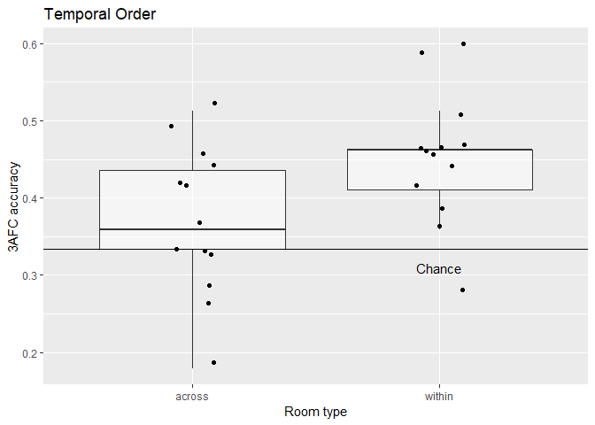

Analysis of memory task
================

Analyse data
============

Temporal order memory
---------------------

``` r
# Aggregate data 1
temporalOrder_agg <- ddply(temporalOrder_comb, c('id', 'context'), summarise, 
                           n = length(rt),
                           acc = mean(accuracy), 
                           rt = mean(rt))

# # Aggregate data 1
temporalOrder_comb$context2 <- as.character(temporalOrder_comb$context)
temporalOrder_comb[temporalOrder_comb$context == 'within-no-walls', 'context2'] <- 'within'
temporalOrder_comb[temporalOrder_comb$context == 'within-walls', 'context2'] <- 'within'

temporalOrder_agg2 <- ddply(temporalOrder_comb, c('id', 'context2'), summarise, 
                           n = length(rt),
                           acc = mean(accuracy), 
                           rt = mean(rt))

afcPlot <- ggplot(temporalOrder_agg, aes(x = context, y = acc)) + 
  geom_boxplot(alpha = 0.5,outlier.shape = NA) + 
  geom_jitter(width = 0.1) +
  geom_hline(yintercept = 1/3) +
  annotate('text', x = 2, y = 0.31, label = 'Chance') +
  labs(y = '3AFC accuracy', x = "Room type", title = 'Temporal Order')


rtPlot <- ggplot(temporalOrder_agg, aes(x = context, y = rt)) + 
  geom_boxplot(alpha = 0.5, outlier.shape = NA) + 
  geom_jitter(width = 0.5) +
  labs(y = 'RT (msec)', x = "Room type", title = '')

plot_grid(afcPlot, rtPlot)
```


As can be seen above, some participants seems to significantly perform below chance. To show this, I simulated a null distribution (see below). In an ANOVA, there were no difference between the conditions:

``` r
ezANOVA(temporalOrder_agg, dv = acc, wid = id, within = context)
```

    ## $ANOVA
    ##    Effect DFn DFd        F         p p<.05        ges
    ## 2 context   2  22 1.046171 0.3681121       0.06352534
    ## 
    ## $`Mauchly's Test for Sphericity`
    ##    Effect        W           p p<.05
    ## 2 context 0.256343 0.001106897     *
    ## 
    ## $`Sphericity Corrections`
    ##    Effect       GGe     p[GG] p[GG]<.05       HFe    p[HF] p[HF]<.05
    ## 2 context 0.5735073 0.3372555           0.5969853 0.339767

### Temporal memory: across vs. within

``` r
ggplot(temporalOrder_agg2, aes(x = context2, y = acc)) + 
  geom_boxplot(alpha = 0.5,outlier.shape = NA) + 
  geom_jitter(width = 0.1) +
  geom_hline(yintercept = 1/3) +
  annotate('text', x = 2, y = 0.31, label = 'Chance') +
  labs(y = '3AFC accuracy', x = "Room type", title = 'Temporal Order')
```


``` r
t.test(temporalOrder_agg2[temporalOrder_agg2$context2 == 'across', 4], 
       temporalOrder_agg2[temporalOrder_agg2$context2 == 'within', 4])
```

    ## 
    ##  Welch Two Sample t-test
    ## 
    ## data:  temporalOrder_agg2[temporalOrder_agg2$context2 == "across", 4] and temporalOrder_agg2[temporalOrder_agg2$context2 == "within", 4]
    ## t = -0.77254, df = 21.653, p-value = 0.4481
    ## alternative hypothesis: true difference in means is not equal to 0
    ## 95 percent confidence interval:
    ##  -0.11817261  0.05407005
    ## sample estimates:
    ## mean of x mean of y 
    ## 0.4017094 0.4337607

Room and table question
-----------------------

``` r
#Aggregate data
roomType_comb_agg <- ddply(roomType_comb, c('id'), summarise, acc = mean(accuracy), rt = mean(rt))
tableNum_comb_agg <- ddply(tableNum_comb, c('id'), summarise, acc = mean(accuracy), rt = mean(rt))

roomTable_agg <- data.frame(id = rep(1:n, 2),
                            Type = rep(c('Room', 'Table'), each = n),
                            acc = c(roomType_comb_agg$acc, tableNum_comb_agg$acc))

ggplot(roomTable_agg, aes(x = Type, y = acc)) + 
  geom_boxplot(alpha = 0.5,outlier.shape = NA) + 
  geom_jitter(width = 0.1) +
  geom_hline(yintercept = 0.5) +
  annotate('text', x = 1.5, y = 0.48, label = 'Chance') +
  labs(y = 'Accuracy', x = "Memory type", title = 'Memory for room type and table')
```



While performance for the room task was not above chance

``` r
t.test(roomType_comb_agg$acc -0.5)
```

    ## 
    ##  One Sample t-test
    ## 
    ## data:  roomType_comb_agg$acc - 0.5
    ## t = 0.13689, df = 11, p-value = 0.8936
    ## alternative hypothesis: true mean is not equal to 0
    ## 95 percent confidence interval:
    ##  -0.03221857  0.03649207
    ## sample estimates:
    ##   mean of x 
    ## 0.002136752

the performance for the table question was:

``` r
t.test(tableNum_comb_agg$acc - 0.5)
```

    ## 
    ##  One Sample t-test
    ## 
    ## data:  tableNum_comb_agg$acc - 0.5
    ## t = 2.5083, df = 11, p-value = 0.02907
    ## alternative hypothesis: true mean is not equal to 0
    ## 95 percent confidence interval:
    ##  0.01073368 0.16447999
    ## sample estimates:
    ##  mean of x 
    ## 0.08760684

Predicting trial-to-trial accruacy and influence of foil distance
=================================================================

For this section, I fished around to see what the relationship between context and foil distance might be and whether the effect of context differs as a function of the foil distance.

``` r
# Create data.frame to analyse trial-to-trial accuracy 
temporalOrder_comb_foilDist <- ddply(temporalOrder_comb,
                                     c('id', 'trial_index', 'context'),
                                     summarise,
                                     minDist = min(abs(dist1), abs(dist2)),
                                     maxDist = max(abs(dist1), abs(dist2)),
                                     meanDist = mean(abs(dist1), abs(dist2)),
                                     dist1 = dist1,
                                     dist2 = dist2,
                                     accuracy = accuracy)

# Predictin accuracy based on context
m_context <- glmer(accuracy ~ context + (1| id ), 
                   family = binomial, 
                   data = temporalOrder_comb_foilDist)
summary(m_context)
```

    ## Generalized linear mixed model fit by maximum likelihood (Laplace
    ##   Approximation) [glmerMod]
    ##  Family: binomial  ( logit )
    ## Formula: accuracy ~ context + (1 | id)
    ##    Data: temporalOrder_comb_foilDist
    ## 
    ##      AIC      BIC   logLik deviance df.resid 
    ##   1276.4   1295.7   -634.2   1268.4      932 
    ## 
    ## Scaled residuals: 
    ##     Min      1Q  Median      3Q     Max 
    ## -0.9966 -0.8213 -0.7799  1.1778  1.2983 
    ## 
    ## Random effects:
    ##  Groups Name        Variance Std.Dev.
    ##  id     (Intercept) 0.01708  0.1307  
    ## Number of obs: 936, groups:  id, 12
    ## 
    ## Fixed effects:
    ##                        Estimate Std. Error z value Pr(>|z|)    
    ## (Intercept)            -0.40002    0.10177  -3.931 8.47e-05 ***
    ## contextwithin-no-walls -0.01093    0.16400  -0.067   0.9469    
    ## contextwithin-walls     0.27184    0.16154   1.683   0.0924 .  
    ## ---
    ## Signif. codes:  0 '***' 0.001 '**' 0.01 '*' 0.05 '.' 0.1 ' ' 1
    ## 
    ## Correlation of Fixed Effects:
    ##             (Intr) cntx--
    ## cntxtwthn-- -0.535       
    ## cntxtwthn-w -0.543  0.337

This actually shows tha the contrast between across and within-walls is close to be significant.

``` r
m_foil1 <- glmer(accuracy ~ minDist + maxDist + meanDist + (1 | id ), 
                 family = binomial, 
                 data = temporalOrder_comb_foilDist)
summary(m_foil1)
```

    ## Generalized linear mixed model fit by maximum likelihood (Laplace
    ##   Approximation) [glmerMod]
    ##  Family: binomial  ( logit )
    ## Formula: accuracy ~ minDist + maxDist + meanDist + (1 | id)
    ##    Data: temporalOrder_comb_foilDist
    ## 
    ##      AIC      BIC   logLik deviance df.resid 
    ##   1278.3   1302.5   -634.2   1268.3      931 
    ## 
    ## Scaled residuals: 
    ##     Min      1Q  Median      3Q     Max 
    ## -1.0565 -0.8436 -0.7839  1.1583  1.3811 
    ## 
    ## Random effects:
    ##  Groups Name        Variance Std.Dev.
    ##  id     (Intercept) 0.01727  0.1314  
    ## Number of obs: 936, groups:  id, 12
    ## 
    ## Fixed effects:
    ##              Estimate Std. Error z value Pr(>|z|)   
    ## (Intercept) -0.571487   0.191204  -2.989   0.0028 **
    ## minDist      0.008863   0.008850   1.001   0.3166   
    ## maxDist      0.007473   0.004768   1.567   0.1170   
    ## meanDist    -0.005710   0.004581  -1.246   0.2126   
    ## ---
    ## Signif. codes:  0 '***' 0.001 '**' 0.01 '*' 0.05 '.' 0.1 ' ' 1
    ## 
    ## Correlation of Fixed Effects:
    ##          (Intr) minDst maxDst
    ## minDist  -0.477              
    ## maxDist  -0.665  0.094       
    ## meanDist  0.035 -0.302 -0.485

No absolute aggregate meassures across both foils predict accuracy.

``` r
m_foil2 <- glmer(accuracy ~ dist1 + dist2 + (1 | id ), 
                 family = binomial, 
                 data = temporalOrder_comb_foilDist)
summary(m_foil2)
```

    ## Generalized linear mixed model fit by maximum likelihood (Laplace
    ##   Approximation) [glmerMod]
    ##  Family: binomial  ( logit )
    ## Formula: accuracy ~ dist1 + dist2 + (1 | id)
    ##    Data: temporalOrder_comb_foilDist
    ## 
    ##      AIC      BIC   logLik deviance df.resid 
    ##   1276.4   1295.7   -634.2   1268.4      932 
    ## 
    ## Scaled residuals: 
    ##     Min      1Q  Median      3Q     Max 
    ## -1.0675 -0.8427 -0.7847  1.1609  1.3796 
    ## 
    ## Random effects:
    ##  Groups Name        Variance Std.Dev.
    ##  id     (Intercept) 0.01729  0.1315  
    ## Number of obs: 936, groups:  id, 12
    ## 
    ## Fixed effects:
    ##              Estimate Std. Error z value Pr(>|z|)   
    ## (Intercept) -0.568461   0.190061  -2.991  0.00278 **
    ## dist1       -0.002067   0.004246  -0.487  0.62640   
    ## dist2        0.007753   0.004353   1.781  0.07491 . 
    ## ---
    ## Signif. codes:  0 '***' 0.001 '**' 0.01 '*' 0.05 '.' 0.1 ' ' 1
    ## 
    ## Correlation of Fixed Effects:
    ##       (Intr) dist1 
    ## dist1  0.768       
    ## dist2 -0.782 -0.434

If both raw distances are entered, then the distance of foil2 is close to be significant. This foil is like the target after the probe. The other foil doesn't seem to have an influence.

``` r
m_context2 <- glmer(accuracy ~ context*dist2 + (1| id ), 
                    family = binomial, 
                    data = temporalOrder_comb_foilDist)
summary(m_context2)
```

    ## Generalized linear mixed model fit by maximum likelihood (Laplace
    ##   Approximation) [glmerMod]
    ##  Family: binomial  ( logit )
    ## Formula: accuracy ~ context * dist2 + (1 | id)
    ##    Data: temporalOrder_comb_foilDist
    ## 
    ##      AIC      BIC   logLik deviance df.resid 
    ##   1277.9   1311.8   -632.0   1263.9      929 
    ## 
    ## Scaled residuals: 
    ##     Min      1Q  Median      3Q     Max 
    ## -1.0728 -0.8435 -0.7476  1.1186  1.4343 
    ## 
    ## Random effects:
    ##  Groups Name        Variance Std.Dev.
    ##  id     (Intercept) 0.01804  0.1343  
    ## Number of obs: 936, groups:  id, 12
    ## 
    ## Fixed effects:
    ##                               Estimate Std. Error z value Pr(>|z|)    
    ## (Intercept)                  -0.630401   0.167257  -3.769 0.000164 ***
    ## contextwithin-no-walls       -0.012180   0.291659  -0.042 0.966690    
    ## contextwithin-walls           0.520861   0.279975   1.860 0.062831 .  
    ## dist2                         0.009902   0.005632   1.758 0.078737 .  
    ## contextwithin-no-walls:dist2 -0.001027   0.009505  -0.108 0.913989    
    ## contextwithin-walls:dist2    -0.010694   0.009711  -1.101 0.270784    
    ## ---
    ## Signif. codes:  0 '***' 0.001 '**' 0.01 '*' 0.05 '.' 0.1 ' ' 1
    ## 
    ## Correlation of Fixed Effects:
    ##             (Intr) cntx-- cntxt- dist2  cn--:2
    ## cntxtwthn-- -0.541                            
    ## cntxtwthn-w -0.565  0.323                     
    ## dist2       -0.790  0.452  0.471              
    ## cntxtwt--:2  0.467 -0.825 -0.279 -0.591       
    ## cntxtwth-:2  0.458 -0.262 -0.816 -0.579  0.343

If we controll for the difference of foil 2, then the effect of within-walls get bigger and both the contrast between across and within-walls and the effect of the distance of foil 2 are close to be significant.

Conclusion
==========

Obviously, this all has to be taken with the caution that a) post-hoc fishing and b) low N. So I think we should run another batch.
