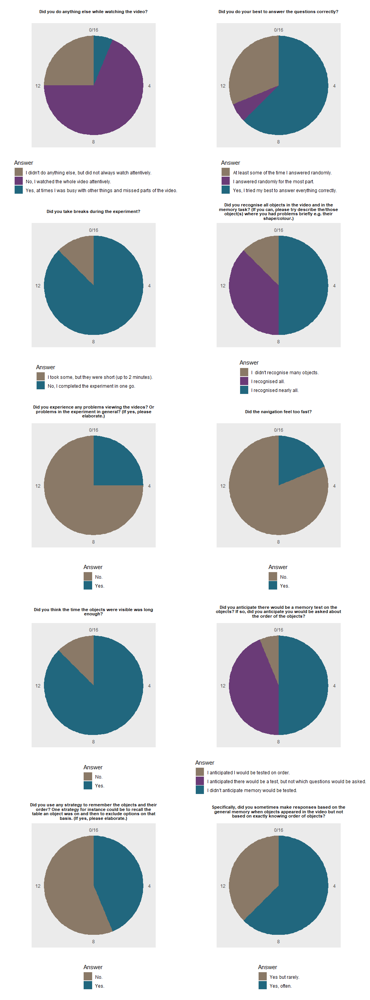

Data check boundaryVR
================

This document checks performs data checks on all the relevant things
that are saved.

# Download speed data

<table>

<caption>

Table 1: Download speeds

</caption>

<thead>

<tr>

<th style="text-align:left;">

worker\_id

</th>

<th style="text-align:left;">

studyResultId

</th>

<th style="text-align:right;">

speedMbps

</th>

</tr>

</thead>

<tbody>

<tr>

<td style="text-align:left;">

10479

</td>

<td style="text-align:left;">

26671

</td>

<td style="text-align:right;">

9.95

</td>

</tr>

<tr>

<td style="text-align:left;">

10477

</td>

<td style="text-align:left;">

26669

</td>

<td style="text-align:right;">

31.74

</td>

</tr>

<tr>

<td style="text-align:left;">

10480

</td>

<td style="text-align:left;">

26672

</td>

<td style="text-align:right;">

26.48

</td>

</tr>

<tr>

<td style="text-align:left;">

10481

</td>

<td style="text-align:left;">

26673

</td>

<td style="text-align:right;">

19.04

</td>

</tr>

<tr>

<td style="text-align:left;">

10484

</td>

<td style="text-align:left;">

26676

</td>

<td style="text-align:right;">

24.14

</td>

</tr>

<tr>

<td style="text-align:left;">

10485

</td>

<td style="text-align:left;">

26677

</td>

<td style="text-align:right;">

8.03

</td>

</tr>

<tr>

<td style="text-align:left;">

10486

</td>

<td style="text-align:left;">

26678

</td>

<td style="text-align:right;">

22.59

</td>

</tr>

<tr>

<td style="text-align:left;">

10488

</td>

<td style="text-align:left;">

26680

</td>

<td style="text-align:right;">

6.41

</td>

</tr>

<tr>

<td style="text-align:left;">

10489

</td>

<td style="text-align:left;">

26681

</td>

<td style="text-align:right;">

9.34

</td>

</tr>

<tr>

<td style="text-align:left;">

10491

</td>

<td style="text-align:left;">

26684

</td>

<td style="text-align:right;">

9.13

</td>

</tr>

<tr>

<td style="text-align:left;">

10493

</td>

<td style="text-align:left;">

26686

</td>

<td style="text-align:right;">

6.42

</td>

</tr>

<tr>

<td style="text-align:left;">

10498

</td>

<td style="text-align:left;">

26691

</td>

<td style="text-align:right;">

7.62

</td>

</tr>

<tr>

<td style="text-align:left;">

10499

</td>

<td style="text-align:left;">

26692

</td>

<td style="text-align:right;">

7.77

</td>

</tr>

<tr>

<td style="text-align:left;">

10505

</td>

<td style="text-align:left;">

26698

</td>

<td style="text-align:right;">

7.17

</td>

</tr>

<tr>

<td style="text-align:left;">

10506

</td>

<td style="text-align:left;">

26699

</td>

<td style="text-align:right;">

12.78

</td>

</tr>

<tr>

<td style="text-align:left;">

10507

</td>

<td style="text-align:left;">

26700

</td>

<td style="text-align:right;">

6.06

</td>

</tr>

</tbody>

</table>

    ##    Min. 1st Qu.  Median    Mean 3rd Qu.    Max. 
    ##   6.060   7.508   9.235  13.417  19.927  31.740

No problem with download speed data.

# Responses during video

<table>

<thead>

<tr>

<th style="text-align:left;">

worker\_id

</th>

<th style="text-align:left;">

studyResultId

</th>

<th style="text-align:left;">

vid\_ext

</th>

<th style="text-align:right;">

subjCond

</th>

<th style="text-align:right;">

counterbalance\_condition

</th>

<th style="text-align:right;">

movie

</th>

<th style="text-align:right;">

num\_keyPress

</th>

</tr>

</thead>

<tbody>

<tr>

<td style="text-align:left;">

10476

</td>

<td style="text-align:left;">

26666

</td>

<td style="text-align:left;">

.mp4

</td>

<td style="text-align:right;">

3

</td>

<td style="text-align:right;">

3

</td>

<td style="text-align:right;">

4

</td>

<td style="text-align:right;">

88

</td>

</tr>

<tr>

<td style="text-align:left;">

10477

</td>

<td style="text-align:left;">

26669

</td>

<td style="text-align:left;">

.mp4

</td>

<td style="text-align:right;">

2

</td>

<td style="text-align:right;">

6

</td>

<td style="text-align:right;">

3

</td>

<td style="text-align:right;">

90

</td>

</tr>

<tr>

<td style="text-align:left;">

10480

</td>

<td style="text-align:left;">

26672

</td>

<td style="text-align:left;">

.mp4

</td>

<td style="text-align:right;">

3

</td>

<td style="text-align:right;">

3

</td>

<td style="text-align:right;">

4

</td>

<td style="text-align:right;">

87

</td>

</tr>

<tr>

<td style="text-align:left;">

10481

</td>

<td style="text-align:left;">

26673

</td>

<td style="text-align:left;">

.mp4

</td>

<td style="text-align:right;">

3

</td>

<td style="text-align:right;">

7

</td>

<td style="text-align:right;">

4

</td>

<td style="text-align:right;">

126

</td>

</tr>

<tr>

<td style="text-align:left;">

10484

</td>

<td style="text-align:left;">

26676

</td>

<td style="text-align:left;">

.mp4

</td>

<td style="text-align:right;">

2

</td>

<td style="text-align:right;">

2

</td>

<td style="text-align:right;">

3

</td>

<td style="text-align:right;">

89

</td>

</tr>

<tr>

<td style="text-align:left;">

10485

</td>

<td style="text-align:left;">

26677

</td>

<td style="text-align:left;">

.mp4

</td>

<td style="text-align:right;">

3

</td>

<td style="text-align:right;">

7

</td>

<td style="text-align:right;">

4

</td>

<td style="text-align:right;">

89

</td>

</tr>

<tr>

<td style="text-align:left;">

10486

</td>

<td style="text-align:left;">

26678

</td>

<td style="text-align:left;">

.mp4

</td>

<td style="text-align:right;">

2

</td>

<td style="text-align:right;">

2

</td>

<td style="text-align:right;">

3

</td>

<td style="text-align:right;">

88

</td>

</tr>

<tr>

<td style="text-align:left;">

10488

</td>

<td style="text-align:left;">

26680

</td>

<td style="text-align:left;">

.mp4

</td>

<td style="text-align:right;">

3

</td>

<td style="text-align:right;">

3

</td>

<td style="text-align:right;">

4

</td>

<td style="text-align:right;">

144

</td>

</tr>

<tr>

<td style="text-align:left;">

10489

</td>

<td style="text-align:left;">

26681

</td>

<td style="text-align:left;">

.mp4

</td>

<td style="text-align:right;">

2

</td>

<td style="text-align:right;">

6

</td>

<td style="text-align:right;">

3

</td>

<td style="text-align:right;">

99

</td>

</tr>

<tr>

<td style="text-align:left;">

10491

</td>

<td style="text-align:left;">

26684

</td>

<td style="text-align:left;">

.mp4

</td>

<td style="text-align:right;">

2

</td>

<td style="text-align:right;">

2

</td>

<td style="text-align:right;">

3

</td>

<td style="text-align:right;">

98

</td>

</tr>

<tr>

<td style="text-align:left;">

10493

</td>

<td style="text-align:left;">

26686

</td>

<td style="text-align:left;">

.mp4

</td>

<td style="text-align:right;">

3

</td>

<td style="text-align:right;">

3

</td>

<td style="text-align:right;">

4

</td>

<td style="text-align:right;">

87

</td>

</tr>

<tr>

<td style="text-align:left;">

10498

</td>

<td style="text-align:left;">

26691

</td>

<td style="text-align:left;">

.mp4

</td>

<td style="text-align:right;">

3

</td>

<td style="text-align:right;">

7

</td>

<td style="text-align:right;">

4

</td>

<td style="text-align:right;">

89

</td>

</tr>

<tr>

<td style="text-align:left;">

10499

</td>

<td style="text-align:left;">

26692

</td>

<td style="text-align:left;">

.mp4

</td>

<td style="text-align:right;">

2

</td>

<td style="text-align:right;">

2

</td>

<td style="text-align:right;">

3

</td>

<td style="text-align:right;">

88

</td>

</tr>

<tr>

<td style="text-align:left;">

10505

</td>

<td style="text-align:left;">

26698

</td>

<td style="text-align:left;">

.mp4

</td>

<td style="text-align:right;">

2

</td>

<td style="text-align:right;">

6

</td>

<td style="text-align:right;">

3

</td>

<td style="text-align:right;">

89

</td>

</tr>

<tr>

<td style="text-align:left;">

10506

</td>

<td style="text-align:left;">

26699

</td>

<td style="text-align:left;">

.mp4

</td>

<td style="text-align:right;">

3

</td>

<td style="text-align:right;">

7

</td>

<td style="text-align:right;">

4

</td>

<td style="text-align:right;">

80

</td>

</tr>

<tr>

<td style="text-align:left;">

10507

</td>

<td style="text-align:left;">

26700

</td>

<td style="text-align:left;">

.mp4

</td>

<td style="text-align:right;">

2

</td>

<td style="text-align:right;">

2

</td>

<td style="text-align:right;">

3

</td>

<td style="text-align:right;">

910

</td>

</tr>

</tbody>

</table>

<table>

<caption>

Table 2: Mean inter response intervalls

</caption>

<thead>

<tr>

<th style="text-align:left;">

worker\_id

</th>

<th style="text-align:left;">

studyResultId

</th>

<th style="text-align:right;">

meanIRI

</th>

<th style="text-align:right;">

sdIRI

</th>

<th style="text-align:right;">

n

</th>

</tr>

</thead>

<tbody>

<tr>

<td style="text-align:left;">

10476

</td>

<td style="text-align:left;">

26666

</td>

<td style="text-align:right;">

7.876943e+03

</td>

<td style="text-align:right;">

4.001753e+02

</td>

<td style="text-align:right;">

88

</td>

</tr>

<tr>

<td style="text-align:left;">

10477

</td>

<td style="text-align:left;">

26669

</td>

<td style="text-align:right;">

7.708506e+03

</td>

<td style="text-align:right;">

1.133666e+03

</td>

<td style="text-align:right;">

90

</td>

</tr>

<tr>

<td style="text-align:left;">

10480

</td>

<td style="text-align:left;">

26672

</td>

<td style="text-align:right;">

7.972872e+03

</td>

<td style="text-align:right;">

2.332701e+03

</td>

<td style="text-align:right;">

87

</td>

</tr>

<tr>

<td style="text-align:left;">

10481

</td>

<td style="text-align:left;">

26673

</td>

<td style="text-align:right;">

5.487160e+03

</td>

<td style="text-align:right;">

3.245205e+03

</td>

<td style="text-align:right;">

126

</td>

</tr>

<tr>

<td style="text-align:left;">

10484

</td>

<td style="text-align:left;">

26676

</td>

<td style="text-align:right;">

7.785966e+03

</td>

<td style="text-align:right;">

8.833115e+02

</td>

<td style="text-align:right;">

89

</td>

</tr>

<tr>

<td style="text-align:left;">

10485

</td>

<td style="text-align:left;">

26677

</td>

<td style="text-align:right;">

7.769250e+03

</td>

<td style="text-align:right;">

1.023028e+03

</td>

<td style="text-align:right;">

89

</td>

</tr>

<tr>

<td style="text-align:left;">

10486

</td>

<td style="text-align:left;">

26678

</td>

<td style="text-align:right;">

7.771989e+03

</td>

<td style="text-align:right;">

7.574349e+02

</td>

<td style="text-align:right;">

88

</td>

</tr>

<tr>

<td style="text-align:left;">

10488

</td>

<td style="text-align:left;">

26680

</td>

<td style="text-align:right;">

4.784748e+03

</td>

<td style="text-align:right;">

3.998349e+03

</td>

<td style="text-align:right;">

144

</td>

</tr>

<tr>

<td style="text-align:left;">

10489

</td>

<td style="text-align:left;">

26681

</td>

<td style="text-align:right;">

7.006500e+03

</td>

<td style="text-align:right;">

1.962883e+03

</td>

<td style="text-align:right;">

99

</td>

</tr>

<tr>

<td style="text-align:left;">

10491

</td>

<td style="text-align:left;">

26684

</td>

<td style="text-align:right;">

7.010247e+03

</td>

<td style="text-align:right;">

2.209482e+03

</td>

<td style="text-align:right;">

98

</td>

</tr>

<tr>

<td style="text-align:left;">

10493

</td>

<td style="text-align:left;">

26686

</td>

<td style="text-align:right;">

7.859535e+03

</td>

<td style="text-align:right;">

4.936100e+02

</td>

<td style="text-align:right;">

87

</td>

</tr>

<tr>

<td style="text-align:left;">

10498

</td>

<td style="text-align:left;">

26691

</td>

<td style="text-align:right;">

7.774523e+03

</td>

<td style="text-align:right;">

9.708363e+02

</td>

<td style="text-align:right;">

89

</td>

</tr>

<tr>

<td style="text-align:left;">

10499

</td>

<td style="text-align:left;">

26692

</td>

<td style="text-align:right;">

7.872080e+03

</td>

<td style="text-align:right;">

6.486686e+02

</td>

<td style="text-align:right;">

88

</td>

</tr>

<tr>

<td style="text-align:left;">

10505

</td>

<td style="text-align:left;">

26698

</td>

<td style="text-align:right;">

7.785989e+03

</td>

<td style="text-align:right;">

8.380890e+02

</td>

<td style="text-align:right;">

89

</td>

</tr>

<tr>

<td style="text-align:left;">

10506

</td>

<td style="text-align:left;">

26699

</td>

<td style="text-align:right;">

7.973975e+03

</td>

<td style="text-align:right;">

2.342161e+03

</td>

<td style="text-align:right;">

80

</td>

</tr>

<tr>

<td style="text-align:left;">

10507

</td>

<td style="text-align:left;">

26700

</td>

<td style="text-align:right;">

\-1.750030e+09

</td>

<td style="text-align:right;">

5.276278e+10

</td>

<td style="text-align:right;">

910

</td>

</tr>

</tbody>

</table>

Inter response intervalls can be calculated from data.

All vidoes were correctly displayed: TRUE  
All subjcCond were correct: TRUE

# Memory task

Below we see the expected trials per conditions,

<table>

<caption>

Table 3: Factorial design for Experiment 2

</caption>

<thead>

<tr>

<th style="text-align:right;">

Condition

</th>

<th style="text-align:left;">

Room type

</th>

<th style="text-align:left;">

Start with

</th>

<th style="text-align:left;">

Block 1

</th>

<th style="text-align:left;">

Block 2

</th>

<th style="text-align:right;">

\# trials block1

</th>

<th style="text-align:right;">

\# trials block2

</th>

</tr>

</thead>

<tbody>

<tr>

<td style="text-align:right;">

1

</td>

<td style="text-align:left;">

M-shape

</td>

<td style="text-align:left;">

within

</td>

<td style="text-align:left;">

Before

</td>

<td style="text-align:left;">

After

</td>

<td style="text-align:right;">

80

</td>

<td style="text-align:right;">

80

</td>

</tr>

<tr>

<td style="text-align:right;">

2

</td>

<td style="text-align:left;">

M-shape

</td>

<td style="text-align:left;">

across

</td>

<td style="text-align:left;">

Before

</td>

<td style="text-align:left;">

After

</td>

<td style="text-align:right;">

82

</td>

<td style="text-align:right;">

82

</td>

</tr>

<tr>

<td style="text-align:right;">

3

</td>

<td style="text-align:left;">

open-plane

</td>

<td style="text-align:left;">

within

</td>

<td style="text-align:left;">

Before

</td>

<td style="text-align:left;">

After

</td>

<td style="text-align:right;">

80

</td>

<td style="text-align:right;">

80

</td>

</tr>

<tr>

<td style="text-align:right;">

4

</td>

<td style="text-align:left;">

open-plane

</td>

<td style="text-align:left;">

across

</td>

<td style="text-align:left;">

Before

</td>

<td style="text-align:left;">

After

</td>

<td style="text-align:right;">

82

</td>

<td style="text-align:right;">

82

</td>

</tr>

<tr>

<td style="text-align:right;">

5

</td>

<td style="text-align:left;">

M-shape

</td>

<td style="text-align:left;">

within

</td>

<td style="text-align:left;">

After

</td>

<td style="text-align:left;">

Before

</td>

<td style="text-align:right;">

80

</td>

<td style="text-align:right;">

80

</td>

</tr>

<tr>

<td style="text-align:right;">

6

</td>

<td style="text-align:left;">

M-shape

</td>

<td style="text-align:left;">

across

</td>

<td style="text-align:left;">

After

</td>

<td style="text-align:left;">

Before

</td>

<td style="text-align:right;">

82

</td>

<td style="text-align:right;">

82

</td>

</tr>

<tr>

<td style="text-align:right;">

7

</td>

<td style="text-align:left;">

open-plane

</td>

<td style="text-align:left;">

within

</td>

<td style="text-align:left;">

After

</td>

<td style="text-align:left;">

Before

</td>

<td style="text-align:right;">

80

</td>

<td style="text-align:right;">

80

</td>

</tr>

<tr>

<td style="text-align:right;">

8

</td>

<td style="text-align:left;">

open-plane

</td>

<td style="text-align:left;">

across

</td>

<td style="text-align:left;">

After

</td>

<td style="text-align:left;">

Before

</td>

<td style="text-align:right;">

82

</td>

<td style="text-align:right;">

82

</td>

</tr>

</tbody>

</table>

Checklist:  
1\. I checked whether the objects in video do appear in the right
order.  
2\. Check of all variables for each participant:

The data passed all tests: TRUE

<table>

<caption>

Table 4: Checking key variables of memory test

</caption>

<thead>

<tr>

<th style="text-align:right;">

worker\_id

</th>

<th style="text-align:left;">

qType

</th>

<th style="text-align:right;">

counterbalance\_condition

</th>

<th style="text-align:left;">

Check

</th>

<th style="text-align:left;">

Passed

</th>

</tr>

</thead>

<tbody>

<tr>

<td style="text-align:right;">

10476

</td>

<td style="text-align:left;">

before

</td>

<td style="text-align:right;">

3

</td>

<td style="text-align:left;">

Are the target and foils at the correct location?

</td>

<td style="text-align:left;">

TRUE

</td>

</tr>

<tr>

<td style="text-align:right;">

10476

</td>

<td style="text-align:left;">

before

</td>

<td style="text-align:right;">

3

</td>

<td style="text-align:left;">

Is the correct answer the correct anwser?

</td>

<td style="text-align:left;">

TRUE

</td>

</tr>

<tr>

<td style="text-align:right;">

10476

</td>

<td style="text-align:left;">

before

</td>

<td style="text-align:right;">

3

</td>

<td style="text-align:left;">

Are the distances correct?

</td>

<td style="text-align:left;">

TRUE

</td>

</tr>

<tr>

<td style="text-align:right;">

10476

</td>

<td style="text-align:left;">

before

</td>

<td style="text-align:right;">

3

</td>

<td style="text-align:left;">

Correct number of trials?

</td>

<td style="text-align:left;">

TRUE

</td>

</tr>

<tr>

<td style="text-align:right;">

10476

</td>

<td style="text-align:left;">

before

</td>

<td style="text-align:right;">

3

</td>

<td style="text-align:left;">

Is counter\_balance condition (subjCond, question order, room type)
correct?

</td>

<td style="text-align:left;">

TRUE

</td>

</tr>

<tr>

<td style="text-align:right;">

10476

</td>

<td style="text-align:left;">

before

</td>

<td style="text-align:right;">

3

</td>

<td style="text-align:left;">

Are the foil tables correct?

</td>

<td style="text-align:left;">

TRUE

</td>

</tr>

<tr>

<td style="text-align:right;">

10476

</td>

<td style="text-align:left;">

before

</td>

<td style="text-align:right;">

3

</td>

<td style="text-align:left;">

Is the context (within vs. across) coded correctly?

</td>

<td style="text-align:left;">

TRUE

</td>

</tr>

<tr>

<td style="text-align:right;">

10476

</td>

<td style="text-align:left;">

after

</td>

<td style="text-align:right;">

3

</td>

<td style="text-align:left;">

Are the target and foils at the correct location?

</td>

<td style="text-align:left;">

TRUE

</td>

</tr>

<tr>

<td style="text-align:right;">

10476

</td>

<td style="text-align:left;">

after

</td>

<td style="text-align:right;">

3

</td>

<td style="text-align:left;">

Is the correct answer the correct anwser?

</td>

<td style="text-align:left;">

TRUE

</td>

</tr>

<tr>

<td style="text-align:right;">

10476

</td>

<td style="text-align:left;">

after

</td>

<td style="text-align:right;">

3

</td>

<td style="text-align:left;">

Are the distances correct?

</td>

<td style="text-align:left;">

TRUE

</td>

</tr>

<tr>

<td style="text-align:right;">

10476

</td>

<td style="text-align:left;">

after

</td>

<td style="text-align:right;">

3

</td>

<td style="text-align:left;">

Correct number of trials?

</td>

<td style="text-align:left;">

TRUE

</td>

</tr>

<tr>

<td style="text-align:right;">

10476

</td>

<td style="text-align:left;">

after

</td>

<td style="text-align:right;">

3

</td>

<td style="text-align:left;">

Is counter\_balance condition (subjCond, question order, room type)
correct?

</td>

<td style="text-align:left;">

TRUE

</td>

</tr>

<tr>

<td style="text-align:right;">

10476

</td>

<td style="text-align:left;">

after

</td>

<td style="text-align:right;">

3

</td>

<td style="text-align:left;">

Are the foil tables correct?

</td>

<td style="text-align:left;">

TRUE

</td>

</tr>

<tr>

<td style="text-align:right;">

10476

</td>

<td style="text-align:left;">

after

</td>

<td style="text-align:right;">

3

</td>

<td style="text-align:left;">

Is the context (within vs. across) coded correctly?

</td>

<td style="text-align:left;">

TRUE

</td>

</tr>

<tr>

<td style="text-align:right;">

10477

</td>

<td style="text-align:left;">

before

</td>

<td style="text-align:right;">

6

</td>

<td style="text-align:left;">

Are the target and foils at the correct location?

</td>

<td style="text-align:left;">

TRUE

</td>

</tr>

<tr>

<td style="text-align:right;">

10477

</td>

<td style="text-align:left;">

before

</td>

<td style="text-align:right;">

6

</td>

<td style="text-align:left;">

Is the correct answer the correct anwser?

</td>

<td style="text-align:left;">

TRUE

</td>

</tr>

<tr>

<td style="text-align:right;">

10477

</td>

<td style="text-align:left;">

before

</td>

<td style="text-align:right;">

6

</td>

<td style="text-align:left;">

Are the distances correct?

</td>

<td style="text-align:left;">

TRUE

</td>

</tr>

<tr>

<td style="text-align:right;">

10477

</td>

<td style="text-align:left;">

before

</td>

<td style="text-align:right;">

6

</td>

<td style="text-align:left;">

Correct number of trials?

</td>

<td style="text-align:left;">

TRUE

</td>

</tr>

<tr>

<td style="text-align:right;">

10477

</td>

<td style="text-align:left;">

before

</td>

<td style="text-align:right;">

6

</td>

<td style="text-align:left;">

Is counter\_balance condition (subjCond, question order, room type)
correct?

</td>

<td style="text-align:left;">

TRUE

</td>

</tr>

<tr>

<td style="text-align:right;">

10477

</td>

<td style="text-align:left;">

before

</td>

<td style="text-align:right;">

6

</td>

<td style="text-align:left;">

Are the foil tables correct?

</td>

<td style="text-align:left;">

TRUE

</td>

</tr>

<tr>

<td style="text-align:right;">

10477

</td>

<td style="text-align:left;">

before

</td>

<td style="text-align:right;">

6

</td>

<td style="text-align:left;">

Is the context (within vs. across) coded correctly?

</td>

<td style="text-align:left;">

TRUE

</td>

</tr>

<tr>

<td style="text-align:right;">

10477

</td>

<td style="text-align:left;">

after

</td>

<td style="text-align:right;">

6

</td>

<td style="text-align:left;">

Are the target and foils at the correct location?

</td>

<td style="text-align:left;">

TRUE

</td>

</tr>

<tr>

<td style="text-align:right;">

10477

</td>

<td style="text-align:left;">

after

</td>

<td style="text-align:right;">

6

</td>

<td style="text-align:left;">

Is the correct answer the correct anwser?

</td>

<td style="text-align:left;">

TRUE

</td>

</tr>

<tr>

<td style="text-align:right;">

10477

</td>

<td style="text-align:left;">

after

</td>

<td style="text-align:right;">

6

</td>

<td style="text-align:left;">

Are the distances correct?

</td>

<td style="text-align:left;">

TRUE

</td>

</tr>

<tr>

<td style="text-align:right;">

10477

</td>

<td style="text-align:left;">

after

</td>

<td style="text-align:right;">

6

</td>

<td style="text-align:left;">

Correct number of trials?

</td>

<td style="text-align:left;">

TRUE

</td>

</tr>

<tr>

<td style="text-align:right;">

10477

</td>

<td style="text-align:left;">

after

</td>

<td style="text-align:right;">

6

</td>

<td style="text-align:left;">

Is counter\_balance condition (subjCond, question order, room type)
correct?

</td>

<td style="text-align:left;">

TRUE

</td>

</tr>

<tr>

<td style="text-align:right;">

10477

</td>

<td style="text-align:left;">

after

</td>

<td style="text-align:right;">

6

</td>

<td style="text-align:left;">

Are the foil tables correct?

</td>

<td style="text-align:left;">

TRUE

</td>

</tr>

<tr>

<td style="text-align:right;">

10477

</td>

<td style="text-align:left;">

after

</td>

<td style="text-align:right;">

6

</td>

<td style="text-align:left;">

Is the context (within vs. across) coded correctly?

</td>

<td style="text-align:left;">

TRUE

</td>

</tr>

<tr>

<td style="text-align:right;">

10480

</td>

<td style="text-align:left;">

before

</td>

<td style="text-align:right;">

3

</td>

<td style="text-align:left;">

Are the target and foils at the correct location?

</td>

<td style="text-align:left;">

TRUE

</td>

</tr>

<tr>

<td style="text-align:right;">

10480

</td>

<td style="text-align:left;">

before

</td>

<td style="text-align:right;">

3

</td>

<td style="text-align:left;">

Is the correct answer the correct anwser?

</td>

<td style="text-align:left;">

TRUE

</td>

</tr>

<tr>

<td style="text-align:right;">

10480

</td>

<td style="text-align:left;">

before

</td>

<td style="text-align:right;">

3

</td>

<td style="text-align:left;">

Are the distances correct?

</td>

<td style="text-align:left;">

TRUE

</td>

</tr>

<tr>

<td style="text-align:right;">

10480

</td>

<td style="text-align:left;">

before

</td>

<td style="text-align:right;">

3

</td>

<td style="text-align:left;">

Correct number of trials?

</td>

<td style="text-align:left;">

TRUE

</td>

</tr>

<tr>

<td style="text-align:right;">

10480

</td>

<td style="text-align:left;">

before

</td>

<td style="text-align:right;">

3

</td>

<td style="text-align:left;">

Is counter\_balance condition (subjCond, question order, room type)
correct?

</td>

<td style="text-align:left;">

TRUE

</td>

</tr>

<tr>

<td style="text-align:right;">

10480

</td>

<td style="text-align:left;">

before

</td>

<td style="text-align:right;">

3

</td>

<td style="text-align:left;">

Are the foil tables correct?

</td>

<td style="text-align:left;">

TRUE

</td>

</tr>

<tr>

<td style="text-align:right;">

10480

</td>

<td style="text-align:left;">

before

</td>

<td style="text-align:right;">

3

</td>

<td style="text-align:left;">

Is the context (within vs. across) coded correctly?

</td>

<td style="text-align:left;">

TRUE

</td>

</tr>

<tr>

<td style="text-align:right;">

10480

</td>

<td style="text-align:left;">

after

</td>

<td style="text-align:right;">

3

</td>

<td style="text-align:left;">

Are the target and foils at the correct location?

</td>

<td style="text-align:left;">

TRUE

</td>

</tr>

<tr>

<td style="text-align:right;">

10480

</td>

<td style="text-align:left;">

after

</td>

<td style="text-align:right;">

3

</td>

<td style="text-align:left;">

Is the correct answer the correct anwser?

</td>

<td style="text-align:left;">

TRUE

</td>

</tr>

<tr>

<td style="text-align:right;">

10480

</td>

<td style="text-align:left;">

after

</td>

<td style="text-align:right;">

3

</td>

<td style="text-align:left;">

Are the distances correct?

</td>

<td style="text-align:left;">

TRUE

</td>

</tr>

<tr>

<td style="text-align:right;">

10480

</td>

<td style="text-align:left;">

after

</td>

<td style="text-align:right;">

3

</td>

<td style="text-align:left;">

Correct number of trials?

</td>

<td style="text-align:left;">

TRUE

</td>

</tr>

<tr>

<td style="text-align:right;">

10480

</td>

<td style="text-align:left;">

after

</td>

<td style="text-align:right;">

3

</td>

<td style="text-align:left;">

Is counter\_balance condition (subjCond, question order, room type)
correct?

</td>

<td style="text-align:left;">

TRUE

</td>

</tr>

<tr>

<td style="text-align:right;">

10480

</td>

<td style="text-align:left;">

after

</td>

<td style="text-align:right;">

3

</td>

<td style="text-align:left;">

Are the foil tables correct?

</td>

<td style="text-align:left;">

TRUE

</td>

</tr>

<tr>

<td style="text-align:right;">

10480

</td>

<td style="text-align:left;">

after

</td>

<td style="text-align:right;">

3

</td>

<td style="text-align:left;">

Is the context (within vs. across) coded correctly?

</td>

<td style="text-align:left;">

TRUE

</td>

</tr>

<tr>

<td style="text-align:right;">

10481

</td>

<td style="text-align:left;">

before

</td>

<td style="text-align:right;">

7

</td>

<td style="text-align:left;">

Are the target and foils at the correct location?

</td>

<td style="text-align:left;">

TRUE

</td>

</tr>

<tr>

<td style="text-align:right;">

10481

</td>

<td style="text-align:left;">

before

</td>

<td style="text-align:right;">

7

</td>

<td style="text-align:left;">

Is the correct answer the correct anwser?

</td>

<td style="text-align:left;">

TRUE

</td>

</tr>

<tr>

<td style="text-align:right;">

10481

</td>

<td style="text-align:left;">

before

</td>

<td style="text-align:right;">

7

</td>

<td style="text-align:left;">

Are the distances correct?

</td>

<td style="text-align:left;">

TRUE

</td>

</tr>

<tr>

<td style="text-align:right;">

10481

</td>

<td style="text-align:left;">

before

</td>

<td style="text-align:right;">

7

</td>

<td style="text-align:left;">

Correct number of trials?

</td>

<td style="text-align:left;">

TRUE

</td>

</tr>

<tr>

<td style="text-align:right;">

10481

</td>

<td style="text-align:left;">

before

</td>

<td style="text-align:right;">

7

</td>

<td style="text-align:left;">

Is counter\_balance condition (subjCond, question order, room type)
correct?

</td>

<td style="text-align:left;">

TRUE

</td>

</tr>

<tr>

<td style="text-align:right;">

10481

</td>

<td style="text-align:left;">

before

</td>

<td style="text-align:right;">

7

</td>

<td style="text-align:left;">

Are the foil tables correct?

</td>

<td style="text-align:left;">

TRUE

</td>

</tr>

<tr>

<td style="text-align:right;">

10481

</td>

<td style="text-align:left;">

before

</td>

<td style="text-align:right;">

7

</td>

<td style="text-align:left;">

Is the context (within vs. across) coded correctly?

</td>

<td style="text-align:left;">

TRUE

</td>

</tr>

<tr>

<td style="text-align:right;">

10481

</td>

<td style="text-align:left;">

after

</td>

<td style="text-align:right;">

7

</td>

<td style="text-align:left;">

Are the target and foils at the correct location?

</td>

<td style="text-align:left;">

TRUE

</td>

</tr>

<tr>

<td style="text-align:right;">

10481

</td>

<td style="text-align:left;">

after

</td>

<td style="text-align:right;">

7

</td>

<td style="text-align:left;">

Is the correct answer the correct anwser?

</td>

<td style="text-align:left;">

TRUE

</td>

</tr>

<tr>

<td style="text-align:right;">

10481

</td>

<td style="text-align:left;">

after

</td>

<td style="text-align:right;">

7

</td>

<td style="text-align:left;">

Are the distances correct?

</td>

<td style="text-align:left;">

TRUE

</td>

</tr>

<tr>

<td style="text-align:right;">

10481

</td>

<td style="text-align:left;">

after

</td>

<td style="text-align:right;">

7

</td>

<td style="text-align:left;">

Correct number of trials?

</td>

<td style="text-align:left;">

TRUE

</td>

</tr>

<tr>

<td style="text-align:right;">

10481

</td>

<td style="text-align:left;">

after

</td>

<td style="text-align:right;">

7

</td>

<td style="text-align:left;">

Is counter\_balance condition (subjCond, question order, room type)
correct?

</td>

<td style="text-align:left;">

TRUE

</td>

</tr>

<tr>

<td style="text-align:right;">

10481

</td>

<td style="text-align:left;">

after

</td>

<td style="text-align:right;">

7

</td>

<td style="text-align:left;">

Are the foil tables correct?

</td>

<td style="text-align:left;">

TRUE

</td>

</tr>

<tr>

<td style="text-align:right;">

10481

</td>

<td style="text-align:left;">

after

</td>

<td style="text-align:right;">

7

</td>

<td style="text-align:left;">

Is the context (within vs. across) coded correctly?

</td>

<td style="text-align:left;">

TRUE

</td>

</tr>

<tr>

<td style="text-align:right;">

10484

</td>

<td style="text-align:left;">

before

</td>

<td style="text-align:right;">

2

</td>

<td style="text-align:left;">

Are the target and foils at the correct location?

</td>

<td style="text-align:left;">

TRUE

</td>

</tr>

<tr>

<td style="text-align:right;">

10484

</td>

<td style="text-align:left;">

before

</td>

<td style="text-align:right;">

2

</td>

<td style="text-align:left;">

Is the correct answer the correct anwser?

</td>

<td style="text-align:left;">

TRUE

</td>

</tr>

<tr>

<td style="text-align:right;">

10484

</td>

<td style="text-align:left;">

before

</td>

<td style="text-align:right;">

2

</td>

<td style="text-align:left;">

Are the distances correct?

</td>

<td style="text-align:left;">

TRUE

</td>

</tr>

<tr>

<td style="text-align:right;">

10484

</td>

<td style="text-align:left;">

before

</td>

<td style="text-align:right;">

2

</td>

<td style="text-align:left;">

Correct number of trials?

</td>

<td style="text-align:left;">

TRUE

</td>

</tr>

<tr>

<td style="text-align:right;">

10484

</td>

<td style="text-align:left;">

before

</td>

<td style="text-align:right;">

2

</td>

<td style="text-align:left;">

Is counter\_balance condition (subjCond, question order, room type)
correct?

</td>

<td style="text-align:left;">

TRUE

</td>

</tr>

<tr>

<td style="text-align:right;">

10484

</td>

<td style="text-align:left;">

before

</td>

<td style="text-align:right;">

2

</td>

<td style="text-align:left;">

Are the foil tables correct?

</td>

<td style="text-align:left;">

TRUE

</td>

</tr>

<tr>

<td style="text-align:right;">

10484

</td>

<td style="text-align:left;">

before

</td>

<td style="text-align:right;">

2

</td>

<td style="text-align:left;">

Is the context (within vs. across) coded correctly?

</td>

<td style="text-align:left;">

TRUE

</td>

</tr>

<tr>

<td style="text-align:right;">

10484

</td>

<td style="text-align:left;">

after

</td>

<td style="text-align:right;">

2

</td>

<td style="text-align:left;">

Are the target and foils at the correct location?

</td>

<td style="text-align:left;">

TRUE

</td>

</tr>

<tr>

<td style="text-align:right;">

10484

</td>

<td style="text-align:left;">

after

</td>

<td style="text-align:right;">

2

</td>

<td style="text-align:left;">

Is the correct answer the correct anwser?

</td>

<td style="text-align:left;">

TRUE

</td>

</tr>

<tr>

<td style="text-align:right;">

10484

</td>

<td style="text-align:left;">

after

</td>

<td style="text-align:right;">

2

</td>

<td style="text-align:left;">

Are the distances correct?

</td>

<td style="text-align:left;">

TRUE

</td>

</tr>

<tr>

<td style="text-align:right;">

10484

</td>

<td style="text-align:left;">

after

</td>

<td style="text-align:right;">

2

</td>

<td style="text-align:left;">

Correct number of trials?

</td>

<td style="text-align:left;">

TRUE

</td>

</tr>

<tr>

<td style="text-align:right;">

10484

</td>

<td style="text-align:left;">

after

</td>

<td style="text-align:right;">

2

</td>

<td style="text-align:left;">

Is counter\_balance condition (subjCond, question order, room type)
correct?

</td>

<td style="text-align:left;">

TRUE

</td>

</tr>

<tr>

<td style="text-align:right;">

10484

</td>

<td style="text-align:left;">

after

</td>

<td style="text-align:right;">

2

</td>

<td style="text-align:left;">

Are the foil tables correct?

</td>

<td style="text-align:left;">

TRUE

</td>

</tr>

<tr>

<td style="text-align:right;">

10484

</td>

<td style="text-align:left;">

after

</td>

<td style="text-align:right;">

2

</td>

<td style="text-align:left;">

Is the context (within vs. across) coded correctly?

</td>

<td style="text-align:left;">

TRUE

</td>

</tr>

<tr>

<td style="text-align:right;">

10485

</td>

<td style="text-align:left;">

before

</td>

<td style="text-align:right;">

7

</td>

<td style="text-align:left;">

Are the target and foils at the correct location?

</td>

<td style="text-align:left;">

TRUE

</td>

</tr>

<tr>

<td style="text-align:right;">

10485

</td>

<td style="text-align:left;">

before

</td>

<td style="text-align:right;">

7

</td>

<td style="text-align:left;">

Is the correct answer the correct anwser?

</td>

<td style="text-align:left;">

TRUE

</td>

</tr>

<tr>

<td style="text-align:right;">

10485

</td>

<td style="text-align:left;">

before

</td>

<td style="text-align:right;">

7

</td>

<td style="text-align:left;">

Are the distances correct?

</td>

<td style="text-align:left;">

TRUE

</td>

</tr>

<tr>

<td style="text-align:right;">

10485

</td>

<td style="text-align:left;">

before

</td>

<td style="text-align:right;">

7

</td>

<td style="text-align:left;">

Correct number of trials?

</td>

<td style="text-align:left;">

TRUE

</td>

</tr>

<tr>

<td style="text-align:right;">

10485

</td>

<td style="text-align:left;">

before

</td>

<td style="text-align:right;">

7

</td>

<td style="text-align:left;">

Is counter\_balance condition (subjCond, question order, room type)
correct?

</td>

<td style="text-align:left;">

TRUE

</td>

</tr>

<tr>

<td style="text-align:right;">

10485

</td>

<td style="text-align:left;">

before

</td>

<td style="text-align:right;">

7

</td>

<td style="text-align:left;">

Are the foil tables correct?

</td>

<td style="text-align:left;">

TRUE

</td>

</tr>

<tr>

<td style="text-align:right;">

10485

</td>

<td style="text-align:left;">

before

</td>

<td style="text-align:right;">

7

</td>

<td style="text-align:left;">

Is the context (within vs. across) coded correctly?

</td>

<td style="text-align:left;">

TRUE

</td>

</tr>

<tr>

<td style="text-align:right;">

10485

</td>

<td style="text-align:left;">

after

</td>

<td style="text-align:right;">

7

</td>

<td style="text-align:left;">

Are the target and foils at the correct location?

</td>

<td style="text-align:left;">

TRUE

</td>

</tr>

<tr>

<td style="text-align:right;">

10485

</td>

<td style="text-align:left;">

after

</td>

<td style="text-align:right;">

7

</td>

<td style="text-align:left;">

Is the correct answer the correct anwser?

</td>

<td style="text-align:left;">

TRUE

</td>

</tr>

<tr>

<td style="text-align:right;">

10485

</td>

<td style="text-align:left;">

after

</td>

<td style="text-align:right;">

7

</td>

<td style="text-align:left;">

Are the distances correct?

</td>

<td style="text-align:left;">

TRUE

</td>

</tr>

<tr>

<td style="text-align:right;">

10485

</td>

<td style="text-align:left;">

after

</td>

<td style="text-align:right;">

7

</td>

<td style="text-align:left;">

Correct number of trials?

</td>

<td style="text-align:left;">

TRUE

</td>

</tr>

<tr>

<td style="text-align:right;">

10485

</td>

<td style="text-align:left;">

after

</td>

<td style="text-align:right;">

7

</td>

<td style="text-align:left;">

Is counter\_balance condition (subjCond, question order, room type)
correct?

</td>

<td style="text-align:left;">

TRUE

</td>

</tr>

<tr>

<td style="text-align:right;">

10485

</td>

<td style="text-align:left;">

after

</td>

<td style="text-align:right;">

7

</td>

<td style="text-align:left;">

Are the foil tables correct?

</td>

<td style="text-align:left;">

TRUE

</td>

</tr>

<tr>

<td style="text-align:right;">

10485

</td>

<td style="text-align:left;">

after

</td>

<td style="text-align:right;">

7

</td>

<td style="text-align:left;">

Is the context (within vs. across) coded correctly?

</td>

<td style="text-align:left;">

TRUE

</td>

</tr>

<tr>

<td style="text-align:right;">

10486

</td>

<td style="text-align:left;">

before

</td>

<td style="text-align:right;">

2

</td>

<td style="text-align:left;">

Are the target and foils at the correct location?

</td>

<td style="text-align:left;">

TRUE

</td>

</tr>

<tr>

<td style="text-align:right;">

10486

</td>

<td style="text-align:left;">

before

</td>

<td style="text-align:right;">

2

</td>

<td style="text-align:left;">

Is the correct answer the correct anwser?

</td>

<td style="text-align:left;">

TRUE

</td>

</tr>

<tr>

<td style="text-align:right;">

10486

</td>

<td style="text-align:left;">

before

</td>

<td style="text-align:right;">

2

</td>

<td style="text-align:left;">

Are the distances correct?

</td>

<td style="text-align:left;">

TRUE

</td>

</tr>

<tr>

<td style="text-align:right;">

10486

</td>

<td style="text-align:left;">

before

</td>

<td style="text-align:right;">

2

</td>

<td style="text-align:left;">

Correct number of trials?

</td>

<td style="text-align:left;">

TRUE

</td>

</tr>

<tr>

<td style="text-align:right;">

10486

</td>

<td style="text-align:left;">

before

</td>

<td style="text-align:right;">

2

</td>

<td style="text-align:left;">

Is counter\_balance condition (subjCond, question order, room type)
correct?

</td>

<td style="text-align:left;">

TRUE

</td>

</tr>

<tr>

<td style="text-align:right;">

10486

</td>

<td style="text-align:left;">

before

</td>

<td style="text-align:right;">

2

</td>

<td style="text-align:left;">

Are the foil tables correct?

</td>

<td style="text-align:left;">

TRUE

</td>

</tr>

<tr>

<td style="text-align:right;">

10486

</td>

<td style="text-align:left;">

before

</td>

<td style="text-align:right;">

2

</td>

<td style="text-align:left;">

Is the context (within vs. across) coded correctly?

</td>

<td style="text-align:left;">

TRUE

</td>

</tr>

<tr>

<td style="text-align:right;">

10486

</td>

<td style="text-align:left;">

after

</td>

<td style="text-align:right;">

2

</td>

<td style="text-align:left;">

Are the target and foils at the correct location?

</td>

<td style="text-align:left;">

TRUE

</td>

</tr>

<tr>

<td style="text-align:right;">

10486

</td>

<td style="text-align:left;">

after

</td>

<td style="text-align:right;">

2

</td>

<td style="text-align:left;">

Is the correct answer the correct anwser?

</td>

<td style="text-align:left;">

TRUE

</td>

</tr>

<tr>

<td style="text-align:right;">

10486

</td>

<td style="text-align:left;">

after

</td>

<td style="text-align:right;">

2

</td>

<td style="text-align:left;">

Are the distances correct?

</td>

<td style="text-align:left;">

TRUE

</td>

</tr>

<tr>

<td style="text-align:right;">

10486

</td>

<td style="text-align:left;">

after

</td>

<td style="text-align:right;">

2

</td>

<td style="text-align:left;">

Correct number of trials?

</td>

<td style="text-align:left;">

TRUE

</td>

</tr>

<tr>

<td style="text-align:right;">

10486

</td>

<td style="text-align:left;">

after

</td>

<td style="text-align:right;">

2

</td>

<td style="text-align:left;">

Is counter\_balance condition (subjCond, question order, room type)
correct?

</td>

<td style="text-align:left;">

TRUE

</td>

</tr>

<tr>

<td style="text-align:right;">

10486

</td>

<td style="text-align:left;">

after

</td>

<td style="text-align:right;">

2

</td>

<td style="text-align:left;">

Are the foil tables correct?

</td>

<td style="text-align:left;">

TRUE

</td>

</tr>

<tr>

<td style="text-align:right;">

10486

</td>

<td style="text-align:left;">

after

</td>

<td style="text-align:right;">

2

</td>

<td style="text-align:left;">

Is the context (within vs. across) coded correctly?

</td>

<td style="text-align:left;">

TRUE

</td>

</tr>

<tr>

<td style="text-align:right;">

10488

</td>

<td style="text-align:left;">

before

</td>

<td style="text-align:right;">

3

</td>

<td style="text-align:left;">

Are the target and foils at the correct location?

</td>

<td style="text-align:left;">

TRUE

</td>

</tr>

<tr>

<td style="text-align:right;">

10488

</td>

<td style="text-align:left;">

before

</td>

<td style="text-align:right;">

3

</td>

<td style="text-align:left;">

Is the correct answer the correct anwser?

</td>

<td style="text-align:left;">

TRUE

</td>

</tr>

<tr>

<td style="text-align:right;">

10488

</td>

<td style="text-align:left;">

before

</td>

<td style="text-align:right;">

3

</td>

<td style="text-align:left;">

Are the distances correct?

</td>

<td style="text-align:left;">

TRUE

</td>

</tr>

<tr>

<td style="text-align:right;">

10488

</td>

<td style="text-align:left;">

before

</td>

<td style="text-align:right;">

3

</td>

<td style="text-align:left;">

Correct number of trials?

</td>

<td style="text-align:left;">

TRUE

</td>

</tr>

<tr>

<td style="text-align:right;">

10488

</td>

<td style="text-align:left;">

before

</td>

<td style="text-align:right;">

3

</td>

<td style="text-align:left;">

Is counter\_balance condition (subjCond, question order, room type)
correct?

</td>

<td style="text-align:left;">

TRUE

</td>

</tr>

<tr>

<td style="text-align:right;">

10488

</td>

<td style="text-align:left;">

before

</td>

<td style="text-align:right;">

3

</td>

<td style="text-align:left;">

Are the foil tables correct?

</td>

<td style="text-align:left;">

TRUE

</td>

</tr>

<tr>

<td style="text-align:right;">

10488

</td>

<td style="text-align:left;">

before

</td>

<td style="text-align:right;">

3

</td>

<td style="text-align:left;">

Is the context (within vs. across) coded correctly?

</td>

<td style="text-align:left;">

TRUE

</td>

</tr>

<tr>

<td style="text-align:right;">

10488

</td>

<td style="text-align:left;">

after

</td>

<td style="text-align:right;">

3

</td>

<td style="text-align:left;">

Are the target and foils at the correct location?

</td>

<td style="text-align:left;">

TRUE

</td>

</tr>

<tr>

<td style="text-align:right;">

10488

</td>

<td style="text-align:left;">

after

</td>

<td style="text-align:right;">

3

</td>

<td style="text-align:left;">

Is the correct answer the correct anwser?

</td>

<td style="text-align:left;">

TRUE

</td>

</tr>

<tr>

<td style="text-align:right;">

10488

</td>

<td style="text-align:left;">

after

</td>

<td style="text-align:right;">

3

</td>

<td style="text-align:left;">

Are the distances correct?

</td>

<td style="text-align:left;">

TRUE

</td>

</tr>

<tr>

<td style="text-align:right;">

10488

</td>

<td style="text-align:left;">

after

</td>

<td style="text-align:right;">

3

</td>

<td style="text-align:left;">

Correct number of trials?

</td>

<td style="text-align:left;">

TRUE

</td>

</tr>

<tr>

<td style="text-align:right;">

10488

</td>

<td style="text-align:left;">

after

</td>

<td style="text-align:right;">

3

</td>

<td style="text-align:left;">

Is counter\_balance condition (subjCond, question order, room type)
correct?

</td>

<td style="text-align:left;">

TRUE

</td>

</tr>

<tr>

<td style="text-align:right;">

10488

</td>

<td style="text-align:left;">

after

</td>

<td style="text-align:right;">

3

</td>

<td style="text-align:left;">

Are the foil tables correct?

</td>

<td style="text-align:left;">

TRUE

</td>

</tr>

<tr>

<td style="text-align:right;">

10488

</td>

<td style="text-align:left;">

after

</td>

<td style="text-align:right;">

3

</td>

<td style="text-align:left;">

Is the context (within vs. across) coded correctly?

</td>

<td style="text-align:left;">

TRUE

</td>

</tr>

<tr>

<td style="text-align:right;">

10489

</td>

<td style="text-align:left;">

before

</td>

<td style="text-align:right;">

6

</td>

<td style="text-align:left;">

Are the target and foils at the correct location?

</td>

<td style="text-align:left;">

TRUE

</td>

</tr>

<tr>

<td style="text-align:right;">

10489

</td>

<td style="text-align:left;">

before

</td>

<td style="text-align:right;">

6

</td>

<td style="text-align:left;">

Is the correct answer the correct anwser?

</td>

<td style="text-align:left;">

TRUE

</td>

</tr>

<tr>

<td style="text-align:right;">

10489

</td>

<td style="text-align:left;">

before

</td>

<td style="text-align:right;">

6

</td>

<td style="text-align:left;">

Are the distances correct?

</td>

<td style="text-align:left;">

TRUE

</td>

</tr>

<tr>

<td style="text-align:right;">

10489

</td>

<td style="text-align:left;">

before

</td>

<td style="text-align:right;">

6

</td>

<td style="text-align:left;">

Correct number of trials?

</td>

<td style="text-align:left;">

TRUE

</td>

</tr>

<tr>

<td style="text-align:right;">

10489

</td>

<td style="text-align:left;">

before

</td>

<td style="text-align:right;">

6

</td>

<td style="text-align:left;">

Is counter\_balance condition (subjCond, question order, room type)
correct?

</td>

<td style="text-align:left;">

TRUE

</td>

</tr>

<tr>

<td style="text-align:right;">

10489

</td>

<td style="text-align:left;">

before

</td>

<td style="text-align:right;">

6

</td>

<td style="text-align:left;">

Are the foil tables correct?

</td>

<td style="text-align:left;">

TRUE

</td>

</tr>

<tr>

<td style="text-align:right;">

10489

</td>

<td style="text-align:left;">

before

</td>

<td style="text-align:right;">

6

</td>

<td style="text-align:left;">

Is the context (within vs. across) coded correctly?

</td>

<td style="text-align:left;">

TRUE

</td>

</tr>

<tr>

<td style="text-align:right;">

10489

</td>

<td style="text-align:left;">

after

</td>

<td style="text-align:right;">

6

</td>

<td style="text-align:left;">

Are the target and foils at the correct location?

</td>

<td style="text-align:left;">

TRUE

</td>

</tr>

<tr>

<td style="text-align:right;">

10489

</td>

<td style="text-align:left;">

after

</td>

<td style="text-align:right;">

6

</td>

<td style="text-align:left;">

Is the correct answer the correct anwser?

</td>

<td style="text-align:left;">

TRUE

</td>

</tr>

<tr>

<td style="text-align:right;">

10489

</td>

<td style="text-align:left;">

after

</td>

<td style="text-align:right;">

6

</td>

<td style="text-align:left;">

Are the distances correct?

</td>

<td style="text-align:left;">

TRUE

</td>

</tr>

<tr>

<td style="text-align:right;">

10489

</td>

<td style="text-align:left;">

after

</td>

<td style="text-align:right;">

6

</td>

<td style="text-align:left;">

Correct number of trials?

</td>

<td style="text-align:left;">

TRUE

</td>

</tr>

<tr>

<td style="text-align:right;">

10489

</td>

<td style="text-align:left;">

after

</td>

<td style="text-align:right;">

6

</td>

<td style="text-align:left;">

Is counter\_balance condition (subjCond, question order, room type)
correct?

</td>

<td style="text-align:left;">

TRUE

</td>

</tr>

<tr>

<td style="text-align:right;">

10489

</td>

<td style="text-align:left;">

after

</td>

<td style="text-align:right;">

6

</td>

<td style="text-align:left;">

Are the foil tables correct?

</td>

<td style="text-align:left;">

TRUE

</td>

</tr>

<tr>

<td style="text-align:right;">

10489

</td>

<td style="text-align:left;">

after

</td>

<td style="text-align:right;">

6

</td>

<td style="text-align:left;">

Is the context (within vs. across) coded correctly?

</td>

<td style="text-align:left;">

TRUE

</td>

</tr>

<tr>

<td style="text-align:right;">

10491

</td>

<td style="text-align:left;">

before

</td>

<td style="text-align:right;">

2

</td>

<td style="text-align:left;">

Are the target and foils at the correct location?

</td>

<td style="text-align:left;">

TRUE

</td>

</tr>

<tr>

<td style="text-align:right;">

10491

</td>

<td style="text-align:left;">

before

</td>

<td style="text-align:right;">

2

</td>

<td style="text-align:left;">

Is the correct answer the correct anwser?

</td>

<td style="text-align:left;">

TRUE

</td>

</tr>

<tr>

<td style="text-align:right;">

10491

</td>

<td style="text-align:left;">

before

</td>

<td style="text-align:right;">

2

</td>

<td style="text-align:left;">

Are the distances correct?

</td>

<td style="text-align:left;">

TRUE

</td>

</tr>

<tr>

<td style="text-align:right;">

10491

</td>

<td style="text-align:left;">

before

</td>

<td style="text-align:right;">

2

</td>

<td style="text-align:left;">

Correct number of trials?

</td>

<td style="text-align:left;">

TRUE

</td>

</tr>

<tr>

<td style="text-align:right;">

10491

</td>

<td style="text-align:left;">

before

</td>

<td style="text-align:right;">

2

</td>

<td style="text-align:left;">

Is counter\_balance condition (subjCond, question order, room type)
correct?

</td>

<td style="text-align:left;">

TRUE

</td>

</tr>

<tr>

<td style="text-align:right;">

10491

</td>

<td style="text-align:left;">

before

</td>

<td style="text-align:right;">

2

</td>

<td style="text-align:left;">

Are the foil tables correct?

</td>

<td style="text-align:left;">

TRUE

</td>

</tr>

<tr>

<td style="text-align:right;">

10491

</td>

<td style="text-align:left;">

before

</td>

<td style="text-align:right;">

2

</td>

<td style="text-align:left;">

Is the context (within vs. across) coded correctly?

</td>

<td style="text-align:left;">

TRUE

</td>

</tr>

<tr>

<td style="text-align:right;">

10491

</td>

<td style="text-align:left;">

after

</td>

<td style="text-align:right;">

2

</td>

<td style="text-align:left;">

Are the target and foils at the correct location?

</td>

<td style="text-align:left;">

TRUE

</td>

</tr>

<tr>

<td style="text-align:right;">

10491

</td>

<td style="text-align:left;">

after

</td>

<td style="text-align:right;">

2

</td>

<td style="text-align:left;">

Is the correct answer the correct anwser?

</td>

<td style="text-align:left;">

TRUE

</td>

</tr>

<tr>

<td style="text-align:right;">

10491

</td>

<td style="text-align:left;">

after

</td>

<td style="text-align:right;">

2

</td>

<td style="text-align:left;">

Are the distances correct?

</td>

<td style="text-align:left;">

TRUE

</td>

</tr>

<tr>

<td style="text-align:right;">

10491

</td>

<td style="text-align:left;">

after

</td>

<td style="text-align:right;">

2

</td>

<td style="text-align:left;">

Correct number of trials?

</td>

<td style="text-align:left;">

TRUE

</td>

</tr>

<tr>

<td style="text-align:right;">

10491

</td>

<td style="text-align:left;">

after

</td>

<td style="text-align:right;">

2

</td>

<td style="text-align:left;">

Is counter\_balance condition (subjCond, question order, room type)
correct?

</td>

<td style="text-align:left;">

TRUE

</td>

</tr>

<tr>

<td style="text-align:right;">

10491

</td>

<td style="text-align:left;">

after

</td>

<td style="text-align:right;">

2

</td>

<td style="text-align:left;">

Are the foil tables correct?

</td>

<td style="text-align:left;">

TRUE

</td>

</tr>

<tr>

<td style="text-align:right;">

10491

</td>

<td style="text-align:left;">

after

</td>

<td style="text-align:right;">

2

</td>

<td style="text-align:left;">

Is the context (within vs. across) coded correctly?

</td>

<td style="text-align:left;">

TRUE

</td>

</tr>

<tr>

<td style="text-align:right;">

10493

</td>

<td style="text-align:left;">

before

</td>

<td style="text-align:right;">

3

</td>

<td style="text-align:left;">

Are the target and foils at the correct location?

</td>

<td style="text-align:left;">

TRUE

</td>

</tr>

<tr>

<td style="text-align:right;">

10493

</td>

<td style="text-align:left;">

before

</td>

<td style="text-align:right;">

3

</td>

<td style="text-align:left;">

Is the correct answer the correct anwser?

</td>

<td style="text-align:left;">

TRUE

</td>

</tr>

<tr>

<td style="text-align:right;">

10493

</td>

<td style="text-align:left;">

before

</td>

<td style="text-align:right;">

3

</td>

<td style="text-align:left;">

Are the distances correct?

</td>

<td style="text-align:left;">

TRUE

</td>

</tr>

<tr>

<td style="text-align:right;">

10493

</td>

<td style="text-align:left;">

before

</td>

<td style="text-align:right;">

3

</td>

<td style="text-align:left;">

Correct number of trials?

</td>

<td style="text-align:left;">

TRUE

</td>

</tr>

<tr>

<td style="text-align:right;">

10493

</td>

<td style="text-align:left;">

before

</td>

<td style="text-align:right;">

3

</td>

<td style="text-align:left;">

Is counter\_balance condition (subjCond, question order, room type)
correct?

</td>

<td style="text-align:left;">

TRUE

</td>

</tr>

<tr>

<td style="text-align:right;">

10493

</td>

<td style="text-align:left;">

before

</td>

<td style="text-align:right;">

3

</td>

<td style="text-align:left;">

Are the foil tables correct?

</td>

<td style="text-align:left;">

TRUE

</td>

</tr>

<tr>

<td style="text-align:right;">

10493

</td>

<td style="text-align:left;">

before

</td>

<td style="text-align:right;">

3

</td>

<td style="text-align:left;">

Is the context (within vs. across) coded correctly?

</td>

<td style="text-align:left;">

TRUE

</td>

</tr>

<tr>

<td style="text-align:right;">

10493

</td>

<td style="text-align:left;">

after

</td>

<td style="text-align:right;">

3

</td>

<td style="text-align:left;">

Are the target and foils at the correct location?

</td>

<td style="text-align:left;">

TRUE

</td>

</tr>

<tr>

<td style="text-align:right;">

10493

</td>

<td style="text-align:left;">

after

</td>

<td style="text-align:right;">

3

</td>

<td style="text-align:left;">

Is the correct answer the correct anwser?

</td>

<td style="text-align:left;">

TRUE

</td>

</tr>

<tr>

<td style="text-align:right;">

10493

</td>

<td style="text-align:left;">

after

</td>

<td style="text-align:right;">

3

</td>

<td style="text-align:left;">

Are the distances correct?

</td>

<td style="text-align:left;">

TRUE

</td>

</tr>

<tr>

<td style="text-align:right;">

10493

</td>

<td style="text-align:left;">

after

</td>

<td style="text-align:right;">

3

</td>

<td style="text-align:left;">

Correct number of trials?

</td>

<td style="text-align:left;">

TRUE

</td>

</tr>

<tr>

<td style="text-align:right;">

10493

</td>

<td style="text-align:left;">

after

</td>

<td style="text-align:right;">

3

</td>

<td style="text-align:left;">

Is counter\_balance condition (subjCond, question order, room type)
correct?

</td>

<td style="text-align:left;">

TRUE

</td>

</tr>

<tr>

<td style="text-align:right;">

10493

</td>

<td style="text-align:left;">

after

</td>

<td style="text-align:right;">

3

</td>

<td style="text-align:left;">

Are the foil tables correct?

</td>

<td style="text-align:left;">

TRUE

</td>

</tr>

<tr>

<td style="text-align:right;">

10493

</td>

<td style="text-align:left;">

after

</td>

<td style="text-align:right;">

3

</td>

<td style="text-align:left;">

Is the context (within vs. across) coded correctly?

</td>

<td style="text-align:left;">

TRUE

</td>

</tr>

<tr>

<td style="text-align:right;">

10498

</td>

<td style="text-align:left;">

before

</td>

<td style="text-align:right;">

7

</td>

<td style="text-align:left;">

Are the target and foils at the correct location?

</td>

<td style="text-align:left;">

TRUE

</td>

</tr>

<tr>

<td style="text-align:right;">

10498

</td>

<td style="text-align:left;">

before

</td>

<td style="text-align:right;">

7

</td>

<td style="text-align:left;">

Is the correct answer the correct anwser?

</td>

<td style="text-align:left;">

TRUE

</td>

</tr>

<tr>

<td style="text-align:right;">

10498

</td>

<td style="text-align:left;">

before

</td>

<td style="text-align:right;">

7

</td>

<td style="text-align:left;">

Are the distances correct?

</td>

<td style="text-align:left;">

TRUE

</td>

</tr>

<tr>

<td style="text-align:right;">

10498

</td>

<td style="text-align:left;">

before

</td>

<td style="text-align:right;">

7

</td>

<td style="text-align:left;">

Correct number of trials?

</td>

<td style="text-align:left;">

TRUE

</td>

</tr>

<tr>

<td style="text-align:right;">

10498

</td>

<td style="text-align:left;">

before

</td>

<td style="text-align:right;">

7

</td>

<td style="text-align:left;">

Is counter\_balance condition (subjCond, question order, room type)
correct?

</td>

<td style="text-align:left;">

TRUE

</td>

</tr>

<tr>

<td style="text-align:right;">

10498

</td>

<td style="text-align:left;">

before

</td>

<td style="text-align:right;">

7

</td>

<td style="text-align:left;">

Are the foil tables correct?

</td>

<td style="text-align:left;">

TRUE

</td>

</tr>

<tr>

<td style="text-align:right;">

10498

</td>

<td style="text-align:left;">

before

</td>

<td style="text-align:right;">

7

</td>

<td style="text-align:left;">

Is the context (within vs. across) coded correctly?

</td>

<td style="text-align:left;">

TRUE

</td>

</tr>

<tr>

<td style="text-align:right;">

10498

</td>

<td style="text-align:left;">

after

</td>

<td style="text-align:right;">

7

</td>

<td style="text-align:left;">

Are the target and foils at the correct location?

</td>

<td style="text-align:left;">

TRUE

</td>

</tr>

<tr>

<td style="text-align:right;">

10498

</td>

<td style="text-align:left;">

after

</td>

<td style="text-align:right;">

7

</td>

<td style="text-align:left;">

Is the correct answer the correct anwser?

</td>

<td style="text-align:left;">

TRUE

</td>

</tr>

<tr>

<td style="text-align:right;">

10498

</td>

<td style="text-align:left;">

after

</td>

<td style="text-align:right;">

7

</td>

<td style="text-align:left;">

Are the distances correct?

</td>

<td style="text-align:left;">

TRUE

</td>

</tr>

<tr>

<td style="text-align:right;">

10498

</td>

<td style="text-align:left;">

after

</td>

<td style="text-align:right;">

7

</td>

<td style="text-align:left;">

Correct number of trials?

</td>

<td style="text-align:left;">

TRUE

</td>

</tr>

<tr>

<td style="text-align:right;">

10498

</td>

<td style="text-align:left;">

after

</td>

<td style="text-align:right;">

7

</td>

<td style="text-align:left;">

Is counter\_balance condition (subjCond, question order, room type)
correct?

</td>

<td style="text-align:left;">

TRUE

</td>

</tr>

<tr>

<td style="text-align:right;">

10498

</td>

<td style="text-align:left;">

after

</td>

<td style="text-align:right;">

7

</td>

<td style="text-align:left;">

Are the foil tables correct?

</td>

<td style="text-align:left;">

TRUE

</td>

</tr>

<tr>

<td style="text-align:right;">

10498

</td>

<td style="text-align:left;">

after

</td>

<td style="text-align:right;">

7

</td>

<td style="text-align:left;">

Is the context (within vs. across) coded correctly?

</td>

<td style="text-align:left;">

TRUE

</td>

</tr>

<tr>

<td style="text-align:right;">

10499

</td>

<td style="text-align:left;">

before

</td>

<td style="text-align:right;">

2

</td>

<td style="text-align:left;">

Are the target and foils at the correct location?

</td>

<td style="text-align:left;">

TRUE

</td>

</tr>

<tr>

<td style="text-align:right;">

10499

</td>

<td style="text-align:left;">

before

</td>

<td style="text-align:right;">

2

</td>

<td style="text-align:left;">

Is the correct answer the correct anwser?

</td>

<td style="text-align:left;">

TRUE

</td>

</tr>

<tr>

<td style="text-align:right;">

10499

</td>

<td style="text-align:left;">

before

</td>

<td style="text-align:right;">

2

</td>

<td style="text-align:left;">

Are the distances correct?

</td>

<td style="text-align:left;">

TRUE

</td>

</tr>

<tr>

<td style="text-align:right;">

10499

</td>

<td style="text-align:left;">

before

</td>

<td style="text-align:right;">

2

</td>

<td style="text-align:left;">

Correct number of trials?

</td>

<td style="text-align:left;">

TRUE

</td>

</tr>

<tr>

<td style="text-align:right;">

10499

</td>

<td style="text-align:left;">

before

</td>

<td style="text-align:right;">

2

</td>

<td style="text-align:left;">

Is counter\_balance condition (subjCond, question order, room type)
correct?

</td>

<td style="text-align:left;">

TRUE

</td>

</tr>

<tr>

<td style="text-align:right;">

10499

</td>

<td style="text-align:left;">

before

</td>

<td style="text-align:right;">

2

</td>

<td style="text-align:left;">

Are the foil tables correct?

</td>

<td style="text-align:left;">

TRUE

</td>

</tr>

<tr>

<td style="text-align:right;">

10499

</td>

<td style="text-align:left;">

before

</td>

<td style="text-align:right;">

2

</td>

<td style="text-align:left;">

Is the context (within vs. across) coded correctly?

</td>

<td style="text-align:left;">

TRUE

</td>

</tr>

<tr>

<td style="text-align:right;">

10499

</td>

<td style="text-align:left;">

after

</td>

<td style="text-align:right;">

2

</td>

<td style="text-align:left;">

Are the target and foils at the correct location?

</td>

<td style="text-align:left;">

TRUE

</td>

</tr>

<tr>

<td style="text-align:right;">

10499

</td>

<td style="text-align:left;">

after

</td>

<td style="text-align:right;">

2

</td>

<td style="text-align:left;">

Is the correct answer the correct anwser?

</td>

<td style="text-align:left;">

TRUE

</td>

</tr>

<tr>

<td style="text-align:right;">

10499

</td>

<td style="text-align:left;">

after

</td>

<td style="text-align:right;">

2

</td>

<td style="text-align:left;">

Are the distances correct?

</td>

<td style="text-align:left;">

TRUE

</td>

</tr>

<tr>

<td style="text-align:right;">

10499

</td>

<td style="text-align:left;">

after

</td>

<td style="text-align:right;">

2

</td>

<td style="text-align:left;">

Correct number of trials?

</td>

<td style="text-align:left;">

TRUE

</td>

</tr>

<tr>

<td style="text-align:right;">

10499

</td>

<td style="text-align:left;">

after

</td>

<td style="text-align:right;">

2

</td>

<td style="text-align:left;">

Is counter\_balance condition (subjCond, question order, room type)
correct?

</td>

<td style="text-align:left;">

TRUE

</td>

</tr>

<tr>

<td style="text-align:right;">

10499

</td>

<td style="text-align:left;">

after

</td>

<td style="text-align:right;">

2

</td>

<td style="text-align:left;">

Are the foil tables correct?

</td>

<td style="text-align:left;">

TRUE

</td>

</tr>

<tr>

<td style="text-align:right;">

10499

</td>

<td style="text-align:left;">

after

</td>

<td style="text-align:right;">

2

</td>

<td style="text-align:left;">

Is the context (within vs. across) coded correctly?

</td>

<td style="text-align:left;">

TRUE

</td>

</tr>

<tr>

<td style="text-align:right;">

10505

</td>

<td style="text-align:left;">

before

</td>

<td style="text-align:right;">

6

</td>

<td style="text-align:left;">

Are the target and foils at the correct location?

</td>

<td style="text-align:left;">

TRUE

</td>

</tr>

<tr>

<td style="text-align:right;">

10505

</td>

<td style="text-align:left;">

before

</td>

<td style="text-align:right;">

6

</td>

<td style="text-align:left;">

Is the correct answer the correct anwser?

</td>

<td style="text-align:left;">

TRUE

</td>

</tr>

<tr>

<td style="text-align:right;">

10505

</td>

<td style="text-align:left;">

before

</td>

<td style="text-align:right;">

6

</td>

<td style="text-align:left;">

Are the distances correct?

</td>

<td style="text-align:left;">

TRUE

</td>

</tr>

<tr>

<td style="text-align:right;">

10505

</td>

<td style="text-align:left;">

before

</td>

<td style="text-align:right;">

6

</td>

<td style="text-align:left;">

Correct number of trials?

</td>

<td style="text-align:left;">

TRUE

</td>

</tr>

<tr>

<td style="text-align:right;">

10505

</td>

<td style="text-align:left;">

before

</td>

<td style="text-align:right;">

6

</td>

<td style="text-align:left;">

Is counter\_balance condition (subjCond, question order, room type)
correct?

</td>

<td style="text-align:left;">

TRUE

</td>

</tr>

<tr>

<td style="text-align:right;">

10505

</td>

<td style="text-align:left;">

before

</td>

<td style="text-align:right;">

6

</td>

<td style="text-align:left;">

Are the foil tables correct?

</td>

<td style="text-align:left;">

TRUE

</td>

</tr>

<tr>

<td style="text-align:right;">

10505

</td>

<td style="text-align:left;">

before

</td>

<td style="text-align:right;">

6

</td>

<td style="text-align:left;">

Is the context (within vs. across) coded correctly?

</td>

<td style="text-align:left;">

TRUE

</td>

</tr>

<tr>

<td style="text-align:right;">

10505

</td>

<td style="text-align:left;">

after

</td>

<td style="text-align:right;">

6

</td>

<td style="text-align:left;">

Are the target and foils at the correct location?

</td>

<td style="text-align:left;">

TRUE

</td>

</tr>

<tr>

<td style="text-align:right;">

10505

</td>

<td style="text-align:left;">

after

</td>

<td style="text-align:right;">

6

</td>

<td style="text-align:left;">

Is the correct answer the correct anwser?

</td>

<td style="text-align:left;">

TRUE

</td>

</tr>

<tr>

<td style="text-align:right;">

10505

</td>

<td style="text-align:left;">

after

</td>

<td style="text-align:right;">

6

</td>

<td style="text-align:left;">

Are the distances correct?

</td>

<td style="text-align:left;">

TRUE

</td>

</tr>

<tr>

<td style="text-align:right;">

10505

</td>

<td style="text-align:left;">

after

</td>

<td style="text-align:right;">

6

</td>

<td style="text-align:left;">

Correct number of trials?

</td>

<td style="text-align:left;">

TRUE

</td>

</tr>

<tr>

<td style="text-align:right;">

10505

</td>

<td style="text-align:left;">

after

</td>

<td style="text-align:right;">

6

</td>

<td style="text-align:left;">

Is counter\_balance condition (subjCond, question order, room type)
correct?

</td>

<td style="text-align:left;">

TRUE

</td>

</tr>

<tr>

<td style="text-align:right;">

10505

</td>

<td style="text-align:left;">

after

</td>

<td style="text-align:right;">

6

</td>

<td style="text-align:left;">

Are the foil tables correct?

</td>

<td style="text-align:left;">

TRUE

</td>

</tr>

<tr>

<td style="text-align:right;">

10505

</td>

<td style="text-align:left;">

after

</td>

<td style="text-align:right;">

6

</td>

<td style="text-align:left;">

Is the context (within vs. across) coded correctly?

</td>

<td style="text-align:left;">

TRUE

</td>

</tr>

<tr>

<td style="text-align:right;">

10506

</td>

<td style="text-align:left;">

before

</td>

<td style="text-align:right;">

7

</td>

<td style="text-align:left;">

Are the target and foils at the correct location?

</td>

<td style="text-align:left;">

TRUE

</td>

</tr>

<tr>

<td style="text-align:right;">

10506

</td>

<td style="text-align:left;">

before

</td>

<td style="text-align:right;">

7

</td>

<td style="text-align:left;">

Is the correct answer the correct anwser?

</td>

<td style="text-align:left;">

TRUE

</td>

</tr>

<tr>

<td style="text-align:right;">

10506

</td>

<td style="text-align:left;">

before

</td>

<td style="text-align:right;">

7

</td>

<td style="text-align:left;">

Are the distances correct?

</td>

<td style="text-align:left;">

TRUE

</td>

</tr>

<tr>

<td style="text-align:right;">

10506

</td>

<td style="text-align:left;">

before

</td>

<td style="text-align:right;">

7

</td>

<td style="text-align:left;">

Correct number of trials?

</td>

<td style="text-align:left;">

TRUE

</td>

</tr>

<tr>

<td style="text-align:right;">

10506

</td>

<td style="text-align:left;">

before

</td>

<td style="text-align:right;">

7

</td>

<td style="text-align:left;">

Is counter\_balance condition (subjCond, question order, room type)
correct?

</td>

<td style="text-align:left;">

TRUE

</td>

</tr>

<tr>

<td style="text-align:right;">

10506

</td>

<td style="text-align:left;">

before

</td>

<td style="text-align:right;">

7

</td>

<td style="text-align:left;">

Are the foil tables correct?

</td>

<td style="text-align:left;">

TRUE

</td>

</tr>

<tr>

<td style="text-align:right;">

10506

</td>

<td style="text-align:left;">

before

</td>

<td style="text-align:right;">

7

</td>

<td style="text-align:left;">

Is the context (within vs. across) coded correctly?

</td>

<td style="text-align:left;">

TRUE

</td>

</tr>

<tr>

<td style="text-align:right;">

10506

</td>

<td style="text-align:left;">

after

</td>

<td style="text-align:right;">

7

</td>

<td style="text-align:left;">

Are the target and foils at the correct location?

</td>

<td style="text-align:left;">

TRUE

</td>

</tr>

<tr>

<td style="text-align:right;">

10506

</td>

<td style="text-align:left;">

after

</td>

<td style="text-align:right;">

7

</td>

<td style="text-align:left;">

Is the correct answer the correct anwser?

</td>

<td style="text-align:left;">

TRUE

</td>

</tr>

<tr>

<td style="text-align:right;">

10506

</td>

<td style="text-align:left;">

after

</td>

<td style="text-align:right;">

7

</td>

<td style="text-align:left;">

Are the distances correct?

</td>

<td style="text-align:left;">

TRUE

</td>

</tr>

<tr>

<td style="text-align:right;">

10506

</td>

<td style="text-align:left;">

after

</td>

<td style="text-align:right;">

7

</td>

<td style="text-align:left;">

Correct number of trials?

</td>

<td style="text-align:left;">

TRUE

</td>

</tr>

<tr>

<td style="text-align:right;">

10506

</td>

<td style="text-align:left;">

after

</td>

<td style="text-align:right;">

7

</td>

<td style="text-align:left;">

Is counter\_balance condition (subjCond, question order, room type)
correct?

</td>

<td style="text-align:left;">

TRUE

</td>

</tr>

<tr>

<td style="text-align:right;">

10506

</td>

<td style="text-align:left;">

after

</td>

<td style="text-align:right;">

7

</td>

<td style="text-align:left;">

Are the foil tables correct?

</td>

<td style="text-align:left;">

TRUE

</td>

</tr>

<tr>

<td style="text-align:right;">

10506

</td>

<td style="text-align:left;">

after

</td>

<td style="text-align:right;">

7

</td>

<td style="text-align:left;">

Is the context (within vs. across) coded correctly?

</td>

<td style="text-align:left;">

TRUE

</td>

</tr>

<tr>

<td style="text-align:right;">

10507

</td>

<td style="text-align:left;">

before

</td>

<td style="text-align:right;">

2

</td>

<td style="text-align:left;">

Are the target and foils at the correct location?

</td>

<td style="text-align:left;">

TRUE

</td>

</tr>

<tr>

<td style="text-align:right;">

10507

</td>

<td style="text-align:left;">

before

</td>

<td style="text-align:right;">

2

</td>

<td style="text-align:left;">

Is the correct answer the correct anwser?

</td>

<td style="text-align:left;">

TRUE

</td>

</tr>

<tr>

<td style="text-align:right;">

10507

</td>

<td style="text-align:left;">

before

</td>

<td style="text-align:right;">

2

</td>

<td style="text-align:left;">

Are the distances correct?

</td>

<td style="text-align:left;">

TRUE

</td>

</tr>

<tr>

<td style="text-align:right;">

10507

</td>

<td style="text-align:left;">

before

</td>

<td style="text-align:right;">

2

</td>

<td style="text-align:left;">

Correct number of trials?

</td>

<td style="text-align:left;">

TRUE

</td>

</tr>

<tr>

<td style="text-align:right;">

10507

</td>

<td style="text-align:left;">

before

</td>

<td style="text-align:right;">

2

</td>

<td style="text-align:left;">

Is counter\_balance condition (subjCond, question order, room type)
correct?

</td>

<td style="text-align:left;">

TRUE

</td>

</tr>

<tr>

<td style="text-align:right;">

10507

</td>

<td style="text-align:left;">

before

</td>

<td style="text-align:right;">

2

</td>

<td style="text-align:left;">

Are the foil tables correct?

</td>

<td style="text-align:left;">

TRUE

</td>

</tr>

<tr>

<td style="text-align:right;">

10507

</td>

<td style="text-align:left;">

before

</td>

<td style="text-align:right;">

2

</td>

<td style="text-align:left;">

Is the context (within vs. across) coded correctly?

</td>

<td style="text-align:left;">

TRUE

</td>

</tr>

<tr>

<td style="text-align:right;">

10507

</td>

<td style="text-align:left;">

after

</td>

<td style="text-align:right;">

2

</td>

<td style="text-align:left;">

Are the target and foils at the correct location?

</td>

<td style="text-align:left;">

TRUE

</td>

</tr>

<tr>

<td style="text-align:right;">

10507

</td>

<td style="text-align:left;">

after

</td>

<td style="text-align:right;">

2

</td>

<td style="text-align:left;">

Is the correct answer the correct anwser?

</td>

<td style="text-align:left;">

TRUE

</td>

</tr>

<tr>

<td style="text-align:right;">

10507

</td>

<td style="text-align:left;">

after

</td>

<td style="text-align:right;">

2

</td>

<td style="text-align:left;">

Are the distances correct?

</td>

<td style="text-align:left;">

TRUE

</td>

</tr>

<tr>

<td style="text-align:right;">

10507

</td>

<td style="text-align:left;">

after

</td>

<td style="text-align:right;">

2

</td>

<td style="text-align:left;">

Correct number of trials?

</td>

<td style="text-align:left;">

TRUE

</td>

</tr>

<tr>

<td style="text-align:right;">

10507

</td>

<td style="text-align:left;">

after

</td>

<td style="text-align:right;">

2

</td>

<td style="text-align:left;">

Is counter\_balance condition (subjCond, question order, room type)
correct?

</td>

<td style="text-align:left;">

TRUE

</td>

</tr>

<tr>

<td style="text-align:right;">

10507

</td>

<td style="text-align:left;">

after

</td>

<td style="text-align:right;">

2

</td>

<td style="text-align:left;">

Are the foil tables correct?

</td>

<td style="text-align:left;">

TRUE

</td>

</tr>

<tr>

<td style="text-align:right;">

10507

</td>

<td style="text-align:left;">

after

</td>

<td style="text-align:right;">

2

</td>

<td style="text-align:left;">

Is the context (within vs. across) coded correctly?

</td>

<td style="text-align:left;">

TRUE

</td>

</tr>

</tbody>

</table>

# Debrief

<!-- -->

## Further comments regarding the questions

<strong>Subject: 10476 </strong> <i>Did you use any strategy to remember
the objects and their order? One strategy for instance could be to
recall the table an object was on and then to exclude options on that
basis. (If yes, please elaborate.)</i>:  
Tried to remember the table the object was on and also imaginate the
table that the objects in the options was so I could try to assimilate
but it was very difficult.  
<strong>Subject: 10477 </strong> <i>Did you use any strategy to remember
the objects and their order? One strategy for instance could be to
recall the table an object was on and then to exclude options on that
basis. (If yes, please elaborate.)</i>:  
I based my opinion on the location of the tables and sometimes
remembering some key objects  
<strong>Subject: 10477 </strong> <i>Specifically, did you sometimes make
responses based on the general memory when objects appeared in the video
but not based on exactly knowing order of objects?</i>:  
sometimes i tried to make relations between some objects but i knew that
most of the times their real world relation was not connected by the
order they were presented to me  
<strong>Subject: 10480 </strong> <i>Did you recognise all objects in the
video and in the memory task? (If you can, please try describe the/those
object(s) where you had problems briefly e.g. their
shape/colour.)</i>:  
I didn’t recognize one of the fans  
<strong>Subject: 10480 </strong> <i>Did you experience any problems
viewing the videos? Or problems in the experiment in general? (If yes,
please elaborate.)</i>:  
There was visual no feedback when picking L/S so I didn’t know if the
selection was being correctly recorded  
<strong>Subject: 10480 </strong> <i>Did you use any strategy to remember
the objects and their order? One strategy for instance could be to
recall the table an object was on and then to exclude options on that
basis. (If yes, please elaborate.)</i>:  
Tried to remember if the object appeared towards the end or the
beginning of the video. Also, there were some themes in the object’s
order (ex.: kitchen)  
<strong>Subject: 10480 </strong> <i>Specifically, did you sometimes make
responses based on the general memory when objects appeared in the video
but not based on exactly knowing order of objects?</i>:  
Yes, in very few cases I actually remembered the order.  
<strong>Subject: 10481 </strong> <i>Did you use any strategy to remember
the objects and their order? One strategy for instance could be to
recall the table an object was on and then to exclude options on that
basis. (If yes, please elaborate.)</i>:  
i try to see in witch position the object was. for example if the object
was the fist that we see in a room , the box was in my right, so with
that the object was rotated in a certain way for the viewer can see what
the object is so we could compare to the 36 inches.so the second object
in the room was at the left , so it had to be positioned in a certain
way for the viwer.  
<strong>Subject: 10484 </strong> <i>Did you use any strategy to remember
the objects and their order? One strategy for instance could be to
recall the table an object was on and then to exclude options on that
basis. (If yes, please elaborate.)</i>:  
I tried to recall if the object was on the table on the left or right,
and choose accordingly  
<strong>Subject: 10486 </strong> <i>Did you experience any problems
viewing the videos? Or problems in the experiment in general? (If yes,
please elaborate.)</i>:  
one item without box  
<strong>Subject: 10488 </strong> <i>Did you recognise all objects in the
video and in the memory task? (If you can, please try describe the/those
object(s) where you had problems briefly e.g. their
shape/colour.)</i>:  
I cant remember the football, and the larger items.  
<strong>Subject: 10489 </strong> <i>Did you experience any problems
viewing the videos? Or problems in the experiment in general? (If yes,
please elaborate.)</i>:  
there were times were the box glitched and hid what was showing like the
headphones.  
<strong>Subject: 10491 </strong> <i>Did you use any strategy to remember
the objects and their order? One strategy for instance could be to
recall the table an object was on and then to exclude options on that
basis. (If yes, please elaborate.)</i>:  
Went in with no strategy but i was expecting something fishy\!  
<strong>Subject: 10499 </strong> <i>Did you recognise all objects in the
video and in the memory task? (If you can, please try describe the/those
object(s) where you had problems briefly e.g. their
shape/colour.)</i>:  
One object I don’t remember seeing in the video was the wrench as well
as the fern looking plant. The rest I have a clear memory of seeing them
in the video.  
<strong>Subject: 10499 </strong> <i>Did you use any strategy to remember
the objects and their order? One strategy for instance could be to
recall the table an object was on and then to exclude options on that
basis. (If yes, please elaborate.)</i>:  
While doing the test I tried to remember on which table I saw the
object, was on the first or second one. I was hoping that in that way it
would be easier for me to answer correctly about the order the objects
appeared.  
<strong>Subject: 10499 </strong> <i>Specifically, did you sometimes make
responses based on the general memory when objects appeared in the video
but not based on exactly knowing order of objects?</i>:  
Yes, I had to rely on my first response. I tried to think harder about
where I might have seen them, but most of the object I answered by
visualising parts of the video where I think I’ve seen the objects.  
<strong>Subject: 10506 </strong> <i>Did you recognise all objects in the
video and in the memory task? (If you can, please try describe the/those
object(s) where you had problems briefly e.g. their
shape/colour.)</i>:  
I had problems remembering the smaller objects  
<strong>Subject: 10505 </strong> <i>Did you recognise all objects in the
video and in the memory task? (If you can, please try describe the/those
object(s) where you had problems briefly e.g. their
shape/colour.)</i>:  
It is hard to say, some of the smallest objects for example measure tape
looked different in colored background and in the white one while
answering questions.  
<strong>Subject: 10505 </strong> <i>Did you experience any problems
viewing the videos? Or problems in the experiment in general? (If yes,
please elaborate.)</i>:  
One of the boxes with dumbbell was flickering and the object appeared
before “walking” towards it, and then disappeared. When I clicked S
button it appeared once again.  
<strong>Subject: 10507 </strong> <i>Did you recognise all objects in the
video and in the memory task? (If you can, please try describe the/those
object(s) where you had problems briefly e.g. their
shape/colour.)</i>:  
Recipients like trash can or something similar. Books or magazines.  
<strong>Subject: 10507 </strong> <i>Did you use any strategy to remember
the objects and their order? One strategy for instance could be to
recall the table an object was on and then to exclude options on that
basis. (If yes, please elaborate.)</i>:  
I associated the table the object was on and position of the table
relative to the room.

## General comments

<strong>Subject: 10477 </strong>  
At the end i was getting too tired and my memory wasnt so fresh about
the order of objects so probably i made even more mistakes there.  
<strong>Subject: 10491 </strong>  
Instructions were clear, but the test was confusing\! I guess memory
overload? Splitting the video in 2 maybe would help.  
<strong>Subject: 10499 </strong>  
Quite a interesting and engaging test. It really makes your brain work
and makes your try to remember positions and order of the objects.
Really pleased.  
<strong>Subject: 10505 </strong>  
If you could give a little clue what will be the test about, I think
more answers would be correct. I realised that our minds just skip some
informations that we see probably to save space in our brains. For
example we don’t remember the way of going into university (trees, path,
if the sky was cloudy or not, if we saw the STOP sign or not) because it
is not necessary for us to live. We remember most things when something
is new and it shocks us or when we are really focused on our task.
