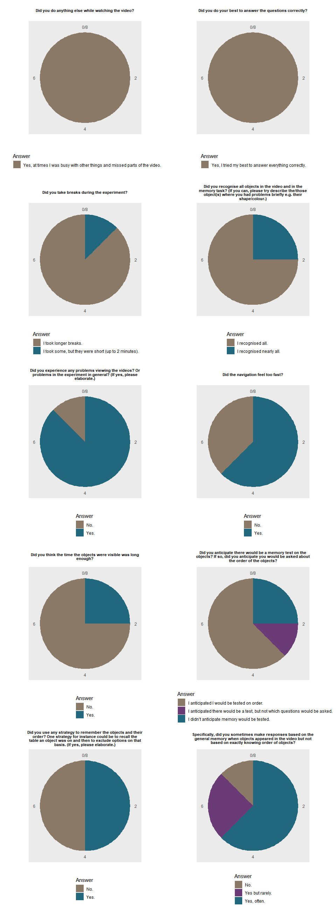

Pre-study data check boundaryVR
================

This document checks performs data checks on all the relevant things
that are saved.

<strong>Errors detected and changes made so far:</strong>

Run 1:

  - Some data sets hat trials missing at the end \> now submiting data
    at the end of JATOS.
  - targetTable is actually the probeTable \> renamed variable in
    JAVASCRIPT. Target table has to be calculated during analysis.

Run2: \* New run after changes on memoryTask script checked out.

# Download speed data

<table>

<caption>

Table 1: Download speeds

</caption>

<thead>

<tr>

<th style="text-align:left;">

worker\_id

</th>

<th style="text-align:left;">

studyResultId

</th>

<th style="text-align:right;">

speedMbps

</th>

</tr>

</thead>

<tbody>

<tr>

<td style="text-align:left;">

10380

</td>

<td style="text-align:left;">

26522

</td>

<td style="text-align:right;">

14.23

</td>

</tr>

<tr>

<td style="text-align:left;">

10381

</td>

<td style="text-align:left;">

26523

</td>

<td style="text-align:right;">

29.39

</td>

</tr>

<tr>

<td style="text-align:left;">

10382

</td>

<td style="text-align:left;">

26524

</td>

<td style="text-align:right;">

5.37

</td>

</tr>

<tr>

<td style="text-align:left;">

10383

</td>

<td style="text-align:left;">

26525

</td>

<td style="text-align:right;">

10.81

</td>

</tr>

<tr>

<td style="text-align:left;">

10385

</td>

<td style="text-align:left;">

26527

</td>

<td style="text-align:right;">

5.74

</td>

</tr>

<tr>

<td style="text-align:left;">

10387

</td>

<td style="text-align:left;">

26529

</td>

<td style="text-align:right;">

6.85

</td>

</tr>

<tr>

<td style="text-align:left;">

10390

</td>

<td style="text-align:left;">

26536

</td>

<td style="text-align:right;">

5.29

</td>

</tr>

<tr>

<td style="text-align:left;">

10391

</td>

<td style="text-align:left;">

26538

</td>

<td style="text-align:right;">

7.42

</td>

</tr>

</tbody>

</table>

    ##    Min. 1st Qu.  Median    Mean 3rd Qu.    Max. 
    ##   5.290   5.647   7.135  10.637  11.665  29.390

No problem with download speed data.

# Responses during video

<table>

<caption>

Table 2: Mean inter response intervalls

</caption>

<thead>

<tr>

<th style="text-align:left;">

worker\_id

</th>

<th style="text-align:left;">

studyResultId

</th>

<th style="text-align:right;">

meanIRI

</th>

<th style="text-align:right;">

sdIRI

</th>

<th style="text-align:right;">

n

</th>

</tr>

</thead>

<tbody>

<tr>

<td style="text-align:left;">

10382

</td>

<td style="text-align:left;">

26524

</td>

<td style="text-align:right;">

6112.222

</td>

<td style="text-align:right;">

3533.2183

</td>

<td style="text-align:right;">

10

</td>

</tr>

<tr>

<td style="text-align:left;">

10383

</td>

<td style="text-align:left;">

26525

</td>

<td style="text-align:right;">

7935.778

</td>

<td style="text-align:right;">

315.1705

</td>

<td style="text-align:right;">

10

</td>

</tr>

<tr>

<td style="text-align:left;">

10387

</td>

<td style="text-align:left;">

26529

</td>

<td style="text-align:right;">

7846.000

</td>

<td style="text-align:right;">

123.3572

</td>

<td style="text-align:right;">

4

</td>

</tr>

<tr>

<td style="text-align:left;">

10391

</td>

<td style="text-align:left;">

26538

</td>

<td style="text-align:right;">

8170.167

</td>

<td style="text-align:right;">

860.1608

</td>

<td style="text-align:right;">

7

</td>

</tr>

</tbody>

</table>

Inter response intervalls can be calculated from data.

All vidoes were correctly displayed: TRUE  
All subjcCond were correct: TRUE

# Memory task

Below we see the expected trials per conditions,

<table>

<caption>

Table 3: Factorial design for Experiment 2

</caption>

<thead>

<tr>

<th style="text-align:right;">

Condition

</th>

<th style="text-align:left;">

Room type

</th>

<th style="text-align:left;">

Start with

</th>

<th style="text-align:left;">

Block 1

</th>

<th style="text-align:left;">

Block 2

</th>

<th style="text-align:right;">

\# trials block1

</th>

<th style="text-align:right;">

\# trials block2

</th>

</tr>

</thead>

<tbody>

<tr>

<td style="text-align:right;">

1

</td>

<td style="text-align:left;">

M-shape

</td>

<td style="text-align:left;">

within

</td>

<td style="text-align:left;">

Before

</td>

<td style="text-align:left;">

After

</td>

<td style="text-align:right;">

80

</td>

<td style="text-align:right;">

80

</td>

</tr>

<tr>

<td style="text-align:right;">

2

</td>

<td style="text-align:left;">

M-shape

</td>

<td style="text-align:left;">

across

</td>

<td style="text-align:left;">

Before

</td>

<td style="text-align:left;">

After

</td>

<td style="text-align:right;">

82

</td>

<td style="text-align:right;">

82

</td>

</tr>

<tr>

<td style="text-align:right;">

3

</td>

<td style="text-align:left;">

open-plane

</td>

<td style="text-align:left;">

within

</td>

<td style="text-align:left;">

Before

</td>

<td style="text-align:left;">

After

</td>

<td style="text-align:right;">

80

</td>

<td style="text-align:right;">

80

</td>

</tr>

<tr>

<td style="text-align:right;">

4

</td>

<td style="text-align:left;">

open-plane

</td>

<td style="text-align:left;">

across

</td>

<td style="text-align:left;">

Before

</td>

<td style="text-align:left;">

After

</td>

<td style="text-align:right;">

82

</td>

<td style="text-align:right;">

82

</td>

</tr>

<tr>

<td style="text-align:right;">

5

</td>

<td style="text-align:left;">

M-shape

</td>

<td style="text-align:left;">

within

</td>

<td style="text-align:left;">

After

</td>

<td style="text-align:left;">

Before

</td>

<td style="text-align:right;">

80

</td>

<td style="text-align:right;">

80

</td>

</tr>

<tr>

<td style="text-align:right;">

6

</td>

<td style="text-align:left;">

M-shape

</td>

<td style="text-align:left;">

across

</td>

<td style="text-align:left;">

After

</td>

<td style="text-align:left;">

Before

</td>

<td style="text-align:right;">

82

</td>

<td style="text-align:right;">

82

</td>

</tr>

<tr>

<td style="text-align:right;">

7

</td>

<td style="text-align:left;">

open-plane

</td>

<td style="text-align:left;">

within

</td>

<td style="text-align:left;">

After

</td>

<td style="text-align:left;">

Before

</td>

<td style="text-align:right;">

80

</td>

<td style="text-align:right;">

80

</td>

</tr>

<tr>

<td style="text-align:right;">

8

</td>

<td style="text-align:left;">

open-plane

</td>

<td style="text-align:left;">

across

</td>

<td style="text-align:left;">

After

</td>

<td style="text-align:left;">

Before

</td>

<td style="text-align:right;">

82

</td>

<td style="text-align:right;">

82

</td>

</tr>

</tbody>

</table>

Checklist:  
1\. I checked whether the objects in video do appear in the right
order.  
2\. Check of all variables for each participant:

The data passed all tests: TRUE

<table>

<caption>

Table 4: Checking key variables of memory test

</caption>

<thead>

<tr>

<th style="text-align:right;">

worker\_id

</th>

<th style="text-align:left;">

qType

</th>

<th style="text-align:right;">

counterbalance\_condition

</th>

<th style="text-align:left;">

Check

</th>

<th style="text-align:left;">

Passed

</th>

</tr>

</thead>

<tbody>

<tr>

<td style="text-align:right;">

10402

</td>

<td style="text-align:left;">

before

</td>

<td style="text-align:right;">

2

</td>

<td style="text-align:left;">

Are the target and foils at the correct location?

</td>

<td style="text-align:left;">

TRUE

</td>

</tr>

<tr>

<td style="text-align:right;">

10402

</td>

<td style="text-align:left;">

before

</td>

<td style="text-align:right;">

2

</td>

<td style="text-align:left;">

Is the correct answer the correct anwser?

</td>

<td style="text-align:left;">

TRUE

</td>

</tr>

<tr>

<td style="text-align:right;">

10402

</td>

<td style="text-align:left;">

before

</td>

<td style="text-align:right;">

2

</td>

<td style="text-align:left;">

Are the distances correct?

</td>

<td style="text-align:left;">

TRUE

</td>

</tr>

<tr>

<td style="text-align:right;">

10402

</td>

<td style="text-align:left;">

before

</td>

<td style="text-align:right;">

2

</td>

<td style="text-align:left;">

Correct number of trials?

</td>

<td style="text-align:left;">

TRUE

</td>

</tr>

<tr>

<td style="text-align:right;">

10402

</td>

<td style="text-align:left;">

before

</td>

<td style="text-align:right;">

2

</td>

<td style="text-align:left;">

Is counter\_balance condition (subjCond, question order, room type)
correct?

</td>

<td style="text-align:left;">

TRUE

</td>

</tr>

<tr>

<td style="text-align:right;">

10402

</td>

<td style="text-align:left;">

before

</td>

<td style="text-align:right;">

2

</td>

<td style="text-align:left;">

Are the foil tables correct?

</td>

<td style="text-align:left;">

TRUE

</td>

</tr>

<tr>

<td style="text-align:right;">

10402

</td>

<td style="text-align:left;">

before

</td>

<td style="text-align:right;">

2

</td>

<td style="text-align:left;">

Is the context (within vs. across) coded correctly?

</td>

<td style="text-align:left;">

TRUE

</td>

</tr>

<tr>

<td style="text-align:right;">

10402

</td>

<td style="text-align:left;">

after

</td>

<td style="text-align:right;">

2

</td>

<td style="text-align:left;">

Are the target and foils at the correct location?

</td>

<td style="text-align:left;">

TRUE

</td>

</tr>

<tr>

<td style="text-align:right;">

10402

</td>

<td style="text-align:left;">

after

</td>

<td style="text-align:right;">

2

</td>

<td style="text-align:left;">

Is the correct answer the correct anwser?

</td>

<td style="text-align:left;">

TRUE

</td>

</tr>

<tr>

<td style="text-align:right;">

10402

</td>

<td style="text-align:left;">

after

</td>

<td style="text-align:right;">

2

</td>

<td style="text-align:left;">

Are the distances correct?

</td>

<td style="text-align:left;">

TRUE

</td>

</tr>

<tr>

<td style="text-align:right;">

10402

</td>

<td style="text-align:left;">

after

</td>

<td style="text-align:right;">

2

</td>

<td style="text-align:left;">

Correct number of trials?

</td>

<td style="text-align:left;">

TRUE

</td>

</tr>

<tr>

<td style="text-align:right;">

10402

</td>

<td style="text-align:left;">

after

</td>

<td style="text-align:right;">

2

</td>

<td style="text-align:left;">

Is counter\_balance condition (subjCond, question order, room type)
correct?

</td>

<td style="text-align:left;">

TRUE

</td>

</tr>

<tr>

<td style="text-align:right;">

10402

</td>

<td style="text-align:left;">

after

</td>

<td style="text-align:right;">

2

</td>

<td style="text-align:left;">

Are the foil tables correct?

</td>

<td style="text-align:left;">

TRUE

</td>

</tr>

<tr>

<td style="text-align:right;">

10402

</td>

<td style="text-align:left;">

after

</td>

<td style="text-align:right;">

2

</td>

<td style="text-align:left;">

Is the context (within vs. across) coded correctly?

</td>

<td style="text-align:left;">

TRUE

</td>

</tr>

<tr>

<td style="text-align:right;">

10426

</td>

<td style="text-align:left;">

before

</td>

<td style="text-align:right;">

2

</td>

<td style="text-align:left;">

Are the target and foils at the correct location?

</td>

<td style="text-align:left;">

TRUE

</td>

</tr>

<tr>

<td style="text-align:right;">

10426

</td>

<td style="text-align:left;">

before

</td>

<td style="text-align:right;">

2

</td>

<td style="text-align:left;">

Is the correct answer the correct anwser?

</td>

<td style="text-align:left;">

TRUE

</td>

</tr>

<tr>

<td style="text-align:right;">

10426

</td>

<td style="text-align:left;">

before

</td>

<td style="text-align:right;">

2

</td>

<td style="text-align:left;">

Are the distances correct?

</td>

<td style="text-align:left;">

TRUE

</td>

</tr>

<tr>

<td style="text-align:right;">

10426

</td>

<td style="text-align:left;">

before

</td>

<td style="text-align:right;">

2

</td>

<td style="text-align:left;">

Correct number of trials?

</td>

<td style="text-align:left;">

TRUE

</td>

</tr>

<tr>

<td style="text-align:right;">

10426

</td>

<td style="text-align:left;">

before

</td>

<td style="text-align:right;">

2

</td>

<td style="text-align:left;">

Is counter\_balance condition (subjCond, question order, room type)
correct?

</td>

<td style="text-align:left;">

TRUE

</td>

</tr>

<tr>

<td style="text-align:right;">

10426

</td>

<td style="text-align:left;">

before

</td>

<td style="text-align:right;">

2

</td>

<td style="text-align:left;">

Are the foil tables correct?

</td>

<td style="text-align:left;">

TRUE

</td>

</tr>

<tr>

<td style="text-align:right;">

10426

</td>

<td style="text-align:left;">

before

</td>

<td style="text-align:right;">

2

</td>

<td style="text-align:left;">

Is the context (within vs. across) coded correctly?

</td>

<td style="text-align:left;">

TRUE

</td>

</tr>

<tr>

<td style="text-align:right;">

10426

</td>

<td style="text-align:left;">

after

</td>

<td style="text-align:right;">

2

</td>

<td style="text-align:left;">

Are the target and foils at the correct location?

</td>

<td style="text-align:left;">

TRUE

</td>

</tr>

<tr>

<td style="text-align:right;">

10426

</td>

<td style="text-align:left;">

after

</td>

<td style="text-align:right;">

2

</td>

<td style="text-align:left;">

Is the correct answer the correct anwser?

</td>

<td style="text-align:left;">

TRUE

</td>

</tr>

<tr>

<td style="text-align:right;">

10426

</td>

<td style="text-align:left;">

after

</td>

<td style="text-align:right;">

2

</td>

<td style="text-align:left;">

Are the distances correct?

</td>

<td style="text-align:left;">

TRUE

</td>

</tr>

<tr>

<td style="text-align:right;">

10426

</td>

<td style="text-align:left;">

after

</td>

<td style="text-align:right;">

2

</td>

<td style="text-align:left;">

Correct number of trials?

</td>

<td style="text-align:left;">

TRUE

</td>

</tr>

<tr>

<td style="text-align:right;">

10426

</td>

<td style="text-align:left;">

after

</td>

<td style="text-align:right;">

2

</td>

<td style="text-align:left;">

Is counter\_balance condition (subjCond, question order, room type)
correct?

</td>

<td style="text-align:left;">

TRUE

</td>

</tr>

<tr>

<td style="text-align:right;">

10426

</td>

<td style="text-align:left;">

after

</td>

<td style="text-align:right;">

2

</td>

<td style="text-align:left;">

Are the foil tables correct?

</td>

<td style="text-align:left;">

TRUE

</td>

</tr>

<tr>

<td style="text-align:right;">

10426

</td>

<td style="text-align:left;">

after

</td>

<td style="text-align:right;">

2

</td>

<td style="text-align:left;">

Is the context (within vs. across) coded correctly?

</td>

<td style="text-align:left;">

TRUE

</td>

</tr>

<tr>

<td style="text-align:right;">

10431

</td>

<td style="text-align:left;">

before

</td>

<td style="text-align:right;">

3

</td>

<td style="text-align:left;">

Are the target and foils at the correct location?

</td>

<td style="text-align:left;">

TRUE

</td>

</tr>

<tr>

<td style="text-align:right;">

10431

</td>

<td style="text-align:left;">

before

</td>

<td style="text-align:right;">

3

</td>

<td style="text-align:left;">

Is the correct answer the correct anwser?

</td>

<td style="text-align:left;">

TRUE

</td>

</tr>

<tr>

<td style="text-align:right;">

10431

</td>

<td style="text-align:left;">

before

</td>

<td style="text-align:right;">

3

</td>

<td style="text-align:left;">

Are the distances correct?

</td>

<td style="text-align:left;">

TRUE

</td>

</tr>

<tr>

<td style="text-align:right;">

10431

</td>

<td style="text-align:left;">

before

</td>

<td style="text-align:right;">

3

</td>

<td style="text-align:left;">

Correct number of trials?

</td>

<td style="text-align:left;">

TRUE

</td>

</tr>

<tr>

<td style="text-align:right;">

10431

</td>

<td style="text-align:left;">

before

</td>

<td style="text-align:right;">

3

</td>

<td style="text-align:left;">

Is counter\_balance condition (subjCond, question order, room type)
correct?

</td>

<td style="text-align:left;">

TRUE

</td>

</tr>

<tr>

<td style="text-align:right;">

10431

</td>

<td style="text-align:left;">

before

</td>

<td style="text-align:right;">

3

</td>

<td style="text-align:left;">

Are the foil tables correct?

</td>

<td style="text-align:left;">

TRUE

</td>

</tr>

<tr>

<td style="text-align:right;">

10431

</td>

<td style="text-align:left;">

before

</td>

<td style="text-align:right;">

3

</td>

<td style="text-align:left;">

Is the context (within vs. across) coded correctly?

</td>

<td style="text-align:left;">

TRUE

</td>

</tr>

<tr>

<td style="text-align:right;">

10431

</td>

<td style="text-align:left;">

after

</td>

<td style="text-align:right;">

3

</td>

<td style="text-align:left;">

Are the target and foils at the correct location?

</td>

<td style="text-align:left;">

TRUE

</td>

</tr>

<tr>

<td style="text-align:right;">

10431

</td>

<td style="text-align:left;">

after

</td>

<td style="text-align:right;">

3

</td>

<td style="text-align:left;">

Is the correct answer the correct anwser?

</td>

<td style="text-align:left;">

TRUE

</td>

</tr>

<tr>

<td style="text-align:right;">

10431

</td>

<td style="text-align:left;">

after

</td>

<td style="text-align:right;">

3

</td>

<td style="text-align:left;">

Are the distances correct?

</td>

<td style="text-align:left;">

TRUE

</td>

</tr>

<tr>

<td style="text-align:right;">

10431

</td>

<td style="text-align:left;">

after

</td>

<td style="text-align:right;">

3

</td>

<td style="text-align:left;">

Correct number of trials?

</td>

<td style="text-align:left;">

TRUE

</td>

</tr>

<tr>

<td style="text-align:right;">

10431

</td>

<td style="text-align:left;">

after

</td>

<td style="text-align:right;">

3

</td>

<td style="text-align:left;">

Is counter\_balance condition (subjCond, question order, room type)
correct?

</td>

<td style="text-align:left;">

TRUE

</td>

</tr>

<tr>

<td style="text-align:right;">

10431

</td>

<td style="text-align:left;">

after

</td>

<td style="text-align:right;">

3

</td>

<td style="text-align:left;">

Are the foil tables correct?

</td>

<td style="text-align:left;">

TRUE

</td>

</tr>

<tr>

<td style="text-align:right;">

10431

</td>

<td style="text-align:left;">

after

</td>

<td style="text-align:right;">

3

</td>

<td style="text-align:left;">

Is the context (within vs. across) coded correctly?

</td>

<td style="text-align:left;">

TRUE

</td>

</tr>

<tr>

<td style="text-align:right;">

10450

</td>

<td style="text-align:left;">

before

</td>

<td style="text-align:right;">

6

</td>

<td style="text-align:left;">

Are the target and foils at the correct location?

</td>

<td style="text-align:left;">

TRUE

</td>

</tr>

<tr>

<td style="text-align:right;">

10450

</td>

<td style="text-align:left;">

before

</td>

<td style="text-align:right;">

6

</td>

<td style="text-align:left;">

Is the correct answer the correct anwser?

</td>

<td style="text-align:left;">

TRUE

</td>

</tr>

<tr>

<td style="text-align:right;">

10450

</td>

<td style="text-align:left;">

before

</td>

<td style="text-align:right;">

6

</td>

<td style="text-align:left;">

Are the distances correct?

</td>

<td style="text-align:left;">

TRUE

</td>

</tr>

<tr>

<td style="text-align:right;">

10450

</td>

<td style="text-align:left;">

before

</td>

<td style="text-align:right;">

6

</td>

<td style="text-align:left;">

Correct number of trials?

</td>

<td style="text-align:left;">

TRUE

</td>

</tr>

<tr>

<td style="text-align:right;">

10450

</td>

<td style="text-align:left;">

before

</td>

<td style="text-align:right;">

6

</td>

<td style="text-align:left;">

Is counter\_balance condition (subjCond, question order, room type)
correct?

</td>

<td style="text-align:left;">

TRUE

</td>

</tr>

<tr>

<td style="text-align:right;">

10450

</td>

<td style="text-align:left;">

before

</td>

<td style="text-align:right;">

6

</td>

<td style="text-align:left;">

Are the foil tables correct?

</td>

<td style="text-align:left;">

TRUE

</td>

</tr>

<tr>

<td style="text-align:right;">

10450

</td>

<td style="text-align:left;">

before

</td>

<td style="text-align:right;">

6

</td>

<td style="text-align:left;">

Is the context (within vs. across) coded correctly?

</td>

<td style="text-align:left;">

TRUE

</td>

</tr>

<tr>

<td style="text-align:right;">

10450

</td>

<td style="text-align:left;">

after

</td>

<td style="text-align:right;">

6

</td>

<td style="text-align:left;">

Are the target and foils at the correct location?

</td>

<td style="text-align:left;">

TRUE

</td>

</tr>

<tr>

<td style="text-align:right;">

10450

</td>

<td style="text-align:left;">

after

</td>

<td style="text-align:right;">

6

</td>

<td style="text-align:left;">

Is the correct answer the correct anwser?

</td>

<td style="text-align:left;">

TRUE

</td>

</tr>

<tr>

<td style="text-align:right;">

10450

</td>

<td style="text-align:left;">

after

</td>

<td style="text-align:right;">

6

</td>

<td style="text-align:left;">

Are the distances correct?

</td>

<td style="text-align:left;">

TRUE

</td>

</tr>

<tr>

<td style="text-align:right;">

10450

</td>

<td style="text-align:left;">

after

</td>

<td style="text-align:right;">

6

</td>

<td style="text-align:left;">

Correct number of trials?

</td>

<td style="text-align:left;">

TRUE

</td>

</tr>

<tr>

<td style="text-align:right;">

10450

</td>

<td style="text-align:left;">

after

</td>

<td style="text-align:right;">

6

</td>

<td style="text-align:left;">

Is counter\_balance condition (subjCond, question order, room type)
correct?

</td>

<td style="text-align:left;">

TRUE

</td>

</tr>

<tr>

<td style="text-align:right;">

10450

</td>

<td style="text-align:left;">

after

</td>

<td style="text-align:right;">

6

</td>

<td style="text-align:left;">

Are the foil tables correct?

</td>

<td style="text-align:left;">

TRUE

</td>

</tr>

<tr>

<td style="text-align:right;">

10450

</td>

<td style="text-align:left;">

after

</td>

<td style="text-align:right;">

6

</td>

<td style="text-align:left;">

Is the context (within vs. across) coded correctly?

</td>

<td style="text-align:left;">

TRUE

</td>

</tr>

<tr>

<td style="text-align:right;">

10453

</td>

<td style="text-align:left;">

before

</td>

<td style="text-align:right;">

7

</td>

<td style="text-align:left;">

Are the target and foils at the correct location?

</td>

<td style="text-align:left;">

TRUE

</td>

</tr>

<tr>

<td style="text-align:right;">

10453

</td>

<td style="text-align:left;">

before

</td>

<td style="text-align:right;">

7

</td>

<td style="text-align:left;">

Is the correct answer the correct anwser?

</td>

<td style="text-align:left;">

TRUE

</td>

</tr>

<tr>

<td style="text-align:right;">

10453

</td>

<td style="text-align:left;">

before

</td>

<td style="text-align:right;">

7

</td>

<td style="text-align:left;">

Are the distances correct?

</td>

<td style="text-align:left;">

TRUE

</td>

</tr>

<tr>

<td style="text-align:right;">

10453

</td>

<td style="text-align:left;">

before

</td>

<td style="text-align:right;">

7

</td>

<td style="text-align:left;">

Correct number of trials?

</td>

<td style="text-align:left;">

TRUE

</td>

</tr>

<tr>

<td style="text-align:right;">

10453

</td>

<td style="text-align:left;">

before

</td>

<td style="text-align:right;">

7

</td>

<td style="text-align:left;">

Is counter\_balance condition (subjCond, question order, room type)
correct?

</td>

<td style="text-align:left;">

TRUE

</td>

</tr>

<tr>

<td style="text-align:right;">

10453

</td>

<td style="text-align:left;">

before

</td>

<td style="text-align:right;">

7

</td>

<td style="text-align:left;">

Are the foil tables correct?

</td>

<td style="text-align:left;">

TRUE

</td>

</tr>

<tr>

<td style="text-align:right;">

10453

</td>

<td style="text-align:left;">

before

</td>

<td style="text-align:right;">

7

</td>

<td style="text-align:left;">

Is the context (within vs. across) coded correctly?

</td>

<td style="text-align:left;">

TRUE

</td>

</tr>

<tr>

<td style="text-align:right;">

10453

</td>

<td style="text-align:left;">

after

</td>

<td style="text-align:right;">

7

</td>

<td style="text-align:left;">

Are the target and foils at the correct location?

</td>

<td style="text-align:left;">

TRUE

</td>

</tr>

<tr>

<td style="text-align:right;">

10453

</td>

<td style="text-align:left;">

after

</td>

<td style="text-align:right;">

7

</td>

<td style="text-align:left;">

Is the correct answer the correct anwser?

</td>

<td style="text-align:left;">

TRUE

</td>

</tr>

<tr>

<td style="text-align:right;">

10453

</td>

<td style="text-align:left;">

after

</td>

<td style="text-align:right;">

7

</td>

<td style="text-align:left;">

Are the distances correct?

</td>

<td style="text-align:left;">

TRUE

</td>

</tr>

<tr>

<td style="text-align:right;">

10453

</td>

<td style="text-align:left;">

after

</td>

<td style="text-align:right;">

7

</td>

<td style="text-align:left;">

Correct number of trials?

</td>

<td style="text-align:left;">

TRUE

</td>

</tr>

<tr>

<td style="text-align:right;">

10453

</td>

<td style="text-align:left;">

after

</td>

<td style="text-align:right;">

7

</td>

<td style="text-align:left;">

Is counter\_balance condition (subjCond, question order, room type)
correct?

</td>

<td style="text-align:left;">

TRUE

</td>

</tr>

<tr>

<td style="text-align:right;">

10453

</td>

<td style="text-align:left;">

after

</td>

<td style="text-align:right;">

7

</td>

<td style="text-align:left;">

Are the foil tables correct?

</td>

<td style="text-align:left;">

TRUE

</td>

</tr>

<tr>

<td style="text-align:right;">

10453

</td>

<td style="text-align:left;">

after

</td>

<td style="text-align:right;">

7

</td>

<td style="text-align:left;">

Is the context (within vs. across) coded correctly?

</td>

<td style="text-align:left;">

TRUE

</td>

</tr>

<tr>

<td style="text-align:right;">

10457

</td>

<td style="text-align:left;">

before

</td>

<td style="text-align:right;">

3

</td>

<td style="text-align:left;">

Are the target and foils at the correct location?

</td>

<td style="text-align:left;">

TRUE

</td>

</tr>

<tr>

<td style="text-align:right;">

10457

</td>

<td style="text-align:left;">

before

</td>

<td style="text-align:right;">

3

</td>

<td style="text-align:left;">

Is the correct answer the correct anwser?

</td>

<td style="text-align:left;">

TRUE

</td>

</tr>

<tr>

<td style="text-align:right;">

10457

</td>

<td style="text-align:left;">

before

</td>

<td style="text-align:right;">

3

</td>

<td style="text-align:left;">

Are the distances correct?

</td>

<td style="text-align:left;">

TRUE

</td>

</tr>

<tr>

<td style="text-align:right;">

10457

</td>

<td style="text-align:left;">

before

</td>

<td style="text-align:right;">

3

</td>

<td style="text-align:left;">

Correct number of trials?

</td>

<td style="text-align:left;">

TRUE

</td>

</tr>

<tr>

<td style="text-align:right;">

10457

</td>

<td style="text-align:left;">

before

</td>

<td style="text-align:right;">

3

</td>

<td style="text-align:left;">

Is counter\_balance condition (subjCond, question order, room type)
correct?

</td>

<td style="text-align:left;">

TRUE

</td>

</tr>

<tr>

<td style="text-align:right;">

10457

</td>

<td style="text-align:left;">

before

</td>

<td style="text-align:right;">

3

</td>

<td style="text-align:left;">

Are the foil tables correct?

</td>

<td style="text-align:left;">

TRUE

</td>

</tr>

<tr>

<td style="text-align:right;">

10457

</td>

<td style="text-align:left;">

before

</td>

<td style="text-align:right;">

3

</td>

<td style="text-align:left;">

Is the context (within vs. across) coded correctly?

</td>

<td style="text-align:left;">

TRUE

</td>

</tr>

<tr>

<td style="text-align:right;">

10457

</td>

<td style="text-align:left;">

after

</td>

<td style="text-align:right;">

3

</td>

<td style="text-align:left;">

Are the target and foils at the correct location?

</td>

<td style="text-align:left;">

TRUE

</td>

</tr>

<tr>

<td style="text-align:right;">

10457

</td>

<td style="text-align:left;">

after

</td>

<td style="text-align:right;">

3

</td>

<td style="text-align:left;">

Is the correct answer the correct anwser?

</td>

<td style="text-align:left;">

TRUE

</td>

</tr>

<tr>

<td style="text-align:right;">

10457

</td>

<td style="text-align:left;">

after

</td>

<td style="text-align:right;">

3

</td>

<td style="text-align:left;">

Are the distances correct?

</td>

<td style="text-align:left;">

TRUE

</td>

</tr>

<tr>

<td style="text-align:right;">

10457

</td>

<td style="text-align:left;">

after

</td>

<td style="text-align:right;">

3

</td>

<td style="text-align:left;">

Correct number of trials?

</td>

<td style="text-align:left;">

TRUE

</td>

</tr>

<tr>

<td style="text-align:right;">

10457

</td>

<td style="text-align:left;">

after

</td>

<td style="text-align:right;">

3

</td>

<td style="text-align:left;">

Is counter\_balance condition (subjCond, question order, room type)
correct?

</td>

<td style="text-align:left;">

TRUE

</td>

</tr>

<tr>

<td style="text-align:right;">

10457

</td>

<td style="text-align:left;">

after

</td>

<td style="text-align:right;">

3

</td>

<td style="text-align:left;">

Are the foil tables correct?

</td>

<td style="text-align:left;">

TRUE

</td>

</tr>

<tr>

<td style="text-align:right;">

10457

</td>

<td style="text-align:left;">

after

</td>

<td style="text-align:right;">

3

</td>

<td style="text-align:left;">

Is the context (within vs. across) coded correctly?

</td>

<td style="text-align:left;">

TRUE

</td>

</tr>

<tr>

<td style="text-align:right;">

10455

</td>

<td style="text-align:left;">

before

</td>

<td style="text-align:right;">

2

</td>

<td style="text-align:left;">

Are the target and foils at the correct location?

</td>

<td style="text-align:left;">

TRUE

</td>

</tr>

<tr>

<td style="text-align:right;">

10455

</td>

<td style="text-align:left;">

before

</td>

<td style="text-align:right;">

2

</td>

<td style="text-align:left;">

Is the correct answer the correct anwser?

</td>

<td style="text-align:left;">

TRUE

</td>

</tr>

<tr>

<td style="text-align:right;">

10455

</td>

<td style="text-align:left;">

before

</td>

<td style="text-align:right;">

2

</td>

<td style="text-align:left;">

Are the distances correct?

</td>

<td style="text-align:left;">

TRUE

</td>

</tr>

<tr>

<td style="text-align:right;">

10455

</td>

<td style="text-align:left;">

before

</td>

<td style="text-align:right;">

2

</td>

<td style="text-align:left;">

Correct number of trials?

</td>

<td style="text-align:left;">

TRUE

</td>

</tr>

<tr>

<td style="text-align:right;">

10455

</td>

<td style="text-align:left;">

before

</td>

<td style="text-align:right;">

2

</td>

<td style="text-align:left;">

Is counter\_balance condition (subjCond, question order, room type)
correct?

</td>

<td style="text-align:left;">

TRUE

</td>

</tr>

<tr>

<td style="text-align:right;">

10455

</td>

<td style="text-align:left;">

before

</td>

<td style="text-align:right;">

2

</td>

<td style="text-align:left;">

Are the foil tables correct?

</td>

<td style="text-align:left;">

TRUE

</td>

</tr>

<tr>

<td style="text-align:right;">

10455

</td>

<td style="text-align:left;">

before

</td>

<td style="text-align:right;">

2

</td>

<td style="text-align:left;">

Is the context (within vs. across) coded correctly?

</td>

<td style="text-align:left;">

TRUE

</td>

</tr>

<tr>

<td style="text-align:right;">

10455

</td>

<td style="text-align:left;">

after

</td>

<td style="text-align:right;">

2

</td>

<td style="text-align:left;">

Are the target and foils at the correct location?

</td>

<td style="text-align:left;">

TRUE

</td>

</tr>

<tr>

<td style="text-align:right;">

10455

</td>

<td style="text-align:left;">

after

</td>

<td style="text-align:right;">

2

</td>

<td style="text-align:left;">

Is the correct answer the correct anwser?

</td>

<td style="text-align:left;">

TRUE

</td>

</tr>

<tr>

<td style="text-align:right;">

10455

</td>

<td style="text-align:left;">

after

</td>

<td style="text-align:right;">

2

</td>

<td style="text-align:left;">

Are the distances correct?

</td>

<td style="text-align:left;">

TRUE

</td>

</tr>

<tr>

<td style="text-align:right;">

10455

</td>

<td style="text-align:left;">

after

</td>

<td style="text-align:right;">

2

</td>

<td style="text-align:left;">

Correct number of trials?

</td>

<td style="text-align:left;">

TRUE

</td>

</tr>

<tr>

<td style="text-align:right;">

10455

</td>

<td style="text-align:left;">

after

</td>

<td style="text-align:right;">

2

</td>

<td style="text-align:left;">

Is counter\_balance condition (subjCond, question order, room type)
correct?

</td>

<td style="text-align:left;">

TRUE

</td>

</tr>

<tr>

<td style="text-align:right;">

10455

</td>

<td style="text-align:left;">

after

</td>

<td style="text-align:right;">

2

</td>

<td style="text-align:left;">

Are the foil tables correct?

</td>

<td style="text-align:left;">

TRUE

</td>

</tr>

<tr>

<td style="text-align:right;">

10455

</td>

<td style="text-align:left;">

after

</td>

<td style="text-align:right;">

2

</td>

<td style="text-align:left;">

Is the context (within vs. across) coded correctly?

</td>

<td style="text-align:left;">

TRUE

</td>

</tr>

<tr>

<td style="text-align:right;">

10463

</td>

<td style="text-align:left;">

before

</td>

<td style="text-align:right;">

0

</td>

<td style="text-align:left;">

Are the target and foils at the correct location?

</td>

<td style="text-align:left;">

TRUE

</td>

</tr>

<tr>

<td style="text-align:right;">

10463

</td>

<td style="text-align:left;">

before

</td>

<td style="text-align:right;">

0

</td>

<td style="text-align:left;">

Is the correct answer the correct anwser?

</td>

<td style="text-align:left;">

TRUE

</td>

</tr>

<tr>

<td style="text-align:right;">

10463

</td>

<td style="text-align:left;">

before

</td>

<td style="text-align:right;">

0

</td>

<td style="text-align:left;">

Are the distances correct?

</td>

<td style="text-align:left;">

TRUE

</td>

</tr>

<tr>

<td style="text-align:right;">

10463

</td>

<td style="text-align:left;">

before

</td>

<td style="text-align:right;">

0

</td>

<td style="text-align:left;">

Correct number of trials?

</td>

<td style="text-align:left;">

TRUE

</td>

</tr>

<tr>

<td style="text-align:right;">

10463

</td>

<td style="text-align:left;">

before

</td>

<td style="text-align:right;">

0

</td>

<td style="text-align:left;">

Is counter\_balance condition (subjCond, question order, room type)
correct?

</td>

<td style="text-align:left;">

TRUE

</td>

</tr>

<tr>

<td style="text-align:right;">

10463

</td>

<td style="text-align:left;">

before

</td>

<td style="text-align:right;">

0

</td>

<td style="text-align:left;">

Are the foil tables correct?

</td>

<td style="text-align:left;">

TRUE

</td>

</tr>

<tr>

<td style="text-align:right;">

10463

</td>

<td style="text-align:left;">

before

</td>

<td style="text-align:right;">

0

</td>

<td style="text-align:left;">

Is the context (within vs. across) coded correctly?

</td>

<td style="text-align:left;">

TRUE

</td>

</tr>

<tr>

<td style="text-align:right;">

10463

</td>

<td style="text-align:left;">

after

</td>

<td style="text-align:right;">

0

</td>

<td style="text-align:left;">

Are the target and foils at the correct location?

</td>

<td style="text-align:left;">

TRUE

</td>

</tr>

<tr>

<td style="text-align:right;">

10463

</td>

<td style="text-align:left;">

after

</td>

<td style="text-align:right;">

0

</td>

<td style="text-align:left;">

Is the correct answer the correct anwser?

</td>

<td style="text-align:left;">

TRUE

</td>

</tr>

<tr>

<td style="text-align:right;">

10463

</td>

<td style="text-align:left;">

after

</td>

<td style="text-align:right;">

0

</td>

<td style="text-align:left;">

Are the distances correct?

</td>

<td style="text-align:left;">

TRUE

</td>

</tr>

<tr>

<td style="text-align:right;">

10463

</td>

<td style="text-align:left;">

after

</td>

<td style="text-align:right;">

0

</td>

<td style="text-align:left;">

Correct number of trials?

</td>

<td style="text-align:left;">

TRUE

</td>

</tr>

<tr>

<td style="text-align:right;">

10463

</td>

<td style="text-align:left;">

after

</td>

<td style="text-align:right;">

0

</td>

<td style="text-align:left;">

Is counter\_balance condition (subjCond, question order, room type)
correct?

</td>

<td style="text-align:left;">

TRUE

</td>

</tr>

<tr>

<td style="text-align:right;">

10463

</td>

<td style="text-align:left;">

after

</td>

<td style="text-align:right;">

0

</td>

<td style="text-align:left;">

Are the foil tables correct?

</td>

<td style="text-align:left;">

TRUE

</td>

</tr>

<tr>

<td style="text-align:right;">

10463

</td>

<td style="text-align:left;">

after

</td>

<td style="text-align:right;">

0

</td>

<td style="text-align:left;">

Is the context (within vs. across) coded correctly?

</td>

<td style="text-align:left;">

TRUE

</td>

</tr>

<tr>

<td style="text-align:right;">

10466

</td>

<td style="text-align:left;">

before

</td>

<td style="text-align:right;">

4

</td>

<td style="text-align:left;">

Are the target and foils at the correct location?

</td>

<td style="text-align:left;">

TRUE

</td>

</tr>

<tr>

<td style="text-align:right;">

10466

</td>

<td style="text-align:left;">

before

</td>

<td style="text-align:right;">

4

</td>

<td style="text-align:left;">

Is the correct answer the correct anwser?

</td>

<td style="text-align:left;">

TRUE

</td>

</tr>

<tr>

<td style="text-align:right;">

10466

</td>

<td style="text-align:left;">

before

</td>

<td style="text-align:right;">

4

</td>

<td style="text-align:left;">

Are the distances correct?

</td>

<td style="text-align:left;">

TRUE

</td>

</tr>

<tr>

<td style="text-align:right;">

10466

</td>

<td style="text-align:left;">

before

</td>

<td style="text-align:right;">

4

</td>

<td style="text-align:left;">

Correct number of trials?

</td>

<td style="text-align:left;">

TRUE

</td>

</tr>

<tr>

<td style="text-align:right;">

10466

</td>

<td style="text-align:left;">

before

</td>

<td style="text-align:right;">

4

</td>

<td style="text-align:left;">

Is counter\_balance condition (subjCond, question order, room type)
correct?

</td>

<td style="text-align:left;">

TRUE

</td>

</tr>

<tr>

<td style="text-align:right;">

10466

</td>

<td style="text-align:left;">

before

</td>

<td style="text-align:right;">

4

</td>

<td style="text-align:left;">

Are the foil tables correct?

</td>

<td style="text-align:left;">

TRUE

</td>

</tr>

<tr>

<td style="text-align:right;">

10466

</td>

<td style="text-align:left;">

before

</td>

<td style="text-align:right;">

4

</td>

<td style="text-align:left;">

Is the context (within vs. across) coded correctly?

</td>

<td style="text-align:left;">

TRUE

</td>

</tr>

<tr>

<td style="text-align:right;">

10466

</td>

<td style="text-align:left;">

after

</td>

<td style="text-align:right;">

4

</td>

<td style="text-align:left;">

Are the target and foils at the correct location?

</td>

<td style="text-align:left;">

TRUE

</td>

</tr>

<tr>

<td style="text-align:right;">

10466

</td>

<td style="text-align:left;">

after

</td>

<td style="text-align:right;">

4

</td>

<td style="text-align:left;">

Is the correct answer the correct anwser?

</td>

<td style="text-align:left;">

TRUE

</td>

</tr>

<tr>

<td style="text-align:right;">

10466

</td>

<td style="text-align:left;">

after

</td>

<td style="text-align:right;">

4

</td>

<td style="text-align:left;">

Are the distances correct?

</td>

<td style="text-align:left;">

TRUE

</td>

</tr>

<tr>

<td style="text-align:right;">

10466

</td>

<td style="text-align:left;">

after

</td>

<td style="text-align:right;">

4

</td>

<td style="text-align:left;">

Correct number of trials?

</td>

<td style="text-align:left;">

TRUE

</td>

</tr>

<tr>

<td style="text-align:right;">

10466

</td>

<td style="text-align:left;">

after

</td>

<td style="text-align:right;">

4

</td>

<td style="text-align:left;">

Is counter\_balance condition (subjCond, question order, room type)
correct?

</td>

<td style="text-align:left;">

TRUE

</td>

</tr>

<tr>

<td style="text-align:right;">

10466

</td>

<td style="text-align:left;">

after

</td>

<td style="text-align:right;">

4

</td>

<td style="text-align:left;">

Are the foil tables correct?

</td>

<td style="text-align:left;">

TRUE

</td>

</tr>

<tr>

<td style="text-align:right;">

10466

</td>

<td style="text-align:left;">

after

</td>

<td style="text-align:right;">

4

</td>

<td style="text-align:left;">

Is the context (within vs. across) coded correctly?

</td>

<td style="text-align:left;">

TRUE

</td>

</tr>

<tr>

<td style="text-align:right;">

10464

</td>

<td style="text-align:left;">

before

</td>

<td style="text-align:right;">

1

</td>

<td style="text-align:left;">

Are the target and foils at the correct location?

</td>

<td style="text-align:left;">

TRUE

</td>

</tr>

<tr>

<td style="text-align:right;">

10464

</td>

<td style="text-align:left;">

before

</td>

<td style="text-align:right;">

1

</td>

<td style="text-align:left;">

Is the correct answer the correct anwser?

</td>

<td style="text-align:left;">

TRUE

</td>

</tr>

<tr>

<td style="text-align:right;">

10464

</td>

<td style="text-align:left;">

before

</td>

<td style="text-align:right;">

1

</td>

<td style="text-align:left;">

Are the distances correct?

</td>

<td style="text-align:left;">

TRUE

</td>

</tr>

<tr>

<td style="text-align:right;">

10464

</td>

<td style="text-align:left;">

before

</td>

<td style="text-align:right;">

1

</td>

<td style="text-align:left;">

Correct number of trials?

</td>

<td style="text-align:left;">

TRUE

</td>

</tr>

<tr>

<td style="text-align:right;">

10464

</td>

<td style="text-align:left;">

before

</td>

<td style="text-align:right;">

1

</td>

<td style="text-align:left;">

Is counter\_balance condition (subjCond, question order, room type)
correct?

</td>

<td style="text-align:left;">

TRUE

</td>

</tr>

<tr>

<td style="text-align:right;">

10464

</td>

<td style="text-align:left;">

before

</td>

<td style="text-align:right;">

1

</td>

<td style="text-align:left;">

Are the foil tables correct?

</td>

<td style="text-align:left;">

TRUE

</td>

</tr>

<tr>

<td style="text-align:right;">

10464

</td>

<td style="text-align:left;">

before

</td>

<td style="text-align:right;">

1

</td>

<td style="text-align:left;">

Is the context (within vs. across) coded correctly?

</td>

<td style="text-align:left;">

TRUE

</td>

</tr>

<tr>

<td style="text-align:right;">

10464

</td>

<td style="text-align:left;">

after

</td>

<td style="text-align:right;">

1

</td>

<td style="text-align:left;">

Are the target and foils at the correct location?

</td>

<td style="text-align:left;">

TRUE

</td>

</tr>

<tr>

<td style="text-align:right;">

10464

</td>

<td style="text-align:left;">

after

</td>

<td style="text-align:right;">

1

</td>

<td style="text-align:left;">

Is the correct answer the correct anwser?

</td>

<td style="text-align:left;">

TRUE

</td>

</tr>

<tr>

<td style="text-align:right;">

10464

</td>

<td style="text-align:left;">

after

</td>

<td style="text-align:right;">

1

</td>

<td style="text-align:left;">

Are the distances correct?

</td>

<td style="text-align:left;">

TRUE

</td>

</tr>

<tr>

<td style="text-align:right;">

10464

</td>

<td style="text-align:left;">

after

</td>

<td style="text-align:right;">

1

</td>

<td style="text-align:left;">

Correct number of trials?

</td>

<td style="text-align:left;">

TRUE

</td>

</tr>

<tr>

<td style="text-align:right;">

10464

</td>

<td style="text-align:left;">

after

</td>

<td style="text-align:right;">

1

</td>

<td style="text-align:left;">

Is counter\_balance condition (subjCond, question order, room type)
correct?

</td>

<td style="text-align:left;">

TRUE

</td>

</tr>

<tr>

<td style="text-align:right;">

10464

</td>

<td style="text-align:left;">

after

</td>

<td style="text-align:right;">

1

</td>

<td style="text-align:left;">

Are the foil tables correct?

</td>

<td style="text-align:left;">

TRUE

</td>

</tr>

<tr>

<td style="text-align:right;">

10464

</td>

<td style="text-align:left;">

after

</td>

<td style="text-align:right;">

1

</td>

<td style="text-align:left;">

Is the context (within vs. across) coded correctly?

</td>

<td style="text-align:left;">

TRUE

</td>

</tr>

</tbody>

</table>

# Debrief

<!-- -->

## Further comments regarding the questions

<strong>Subject: 10383 </strong> <i>Did you recognise all objects in the
video and in the memory task? (If you can, please try describe the/those
object(s) where you had problems briefly e.g. their
shape/colour.)</i>:  
Helli  
<strong>Subject: 10385 </strong> <i>Did you experience any problems
viewing the videos? Or problems in the experiment in general? (If yes,
please elaborate.)</i>:  
Lorem ipsum, or lipsum as it is sometimes known, is dummy text used in
laying out print, graphic or web designs. The passage is attributed to
an unknown typesetter in the 15th century who is thought to have
scrambled parts of Cicero’s De Finibus Bonorum et Malorum for use in a
type specimen book.  
<strong>Subject: 10385 </strong> <i>Did you use any strategy to remember
the objects and their order? One strategy for instance could be to
recall the table an object was on and then to exclude options on that
basis. (If yes, please elaborate.)</i>:  
Lorem ipsum, or lipsum as it is sometimes known, is dummy text used in
laying out print, graphic or web designs. The passage is attributed to
an unknown typesetter in the 15th century who is thought to have
scrambled parts of Cicero’s De Finibus Bonorum et Malorum for use in a
type specimen book.  
<strong>Subject: 10385 </strong> <i>Specifically, did you sometimes make
responses based on the general memory when objects appeared in the video
but not based on exactly knowing order of objects?</i>:  
Lorem ipsum, or lipsum as it is sometimes known, is dummy text used in
laying out print, graphic or web designs. The passage is attributed to
an unknown typesetter in the 15th century who is thought to have
scrambled parts of Cicero’s De Finibus Bonorum et Malorum for use in a
type specimen book.  
<strong>Subject: 10387 </strong> <i>Did you recognise all objects in the
video and in the memory task? (If you can, please try describe the/those
object(s) where you had problems briefly e.g. their
shape/colour.)</i>:  
Lorem ipsum, or lipsum as it is sometimes known, is dummy text used in
laying out print, graphic or web designs. The passage is attributed to
an unknown typesetter in the 15th century who is thought to have
scrambled parts of Cicero’s De Finibus Bonorum et Malorum for use in a
type specimen book.  
<strong>Subject: 10387 </strong> <i>Did you experience any problems
viewing the videos? Or problems in the experiment in general? (If yes,
please elaborate.)</i>:  
Lorem ipsum, or lipsum as it is sometimes known, is dummy text used in
laying out print, graphic or web designs. The passage is attributed to
an unknown typesetter in the 15th century who is thought to have
scrambled parts of Cicero’s De Finibus Bonorum et Malorum for use in a
type specimen book.  
<strong>Subject: 10387 </strong> <i>Did you use any strategy to remember
the objects and their order? One strategy for instance could be to
recall the table an object was on and then to exclude options on that
basis. (If yes, please elaborate.)</i>:  
Lorem ipsum, or lipsum as it is sometimes known, is dummy text used in
laying out print, graphic or web designs. The passage is attributed to
an unknown typesetter in the 15th century who is thought to have
scrambled parts of Cicero’s De Finibus Bonorum et Malorum for use in a
type specimen book.

## General comments

<strong>Subject: 10385 </strong>  
Lorem ipsum, or lipsum as it is sometimes known, is dummy text used in
laying out print, graphic or web designs. The passage is attributed to
an unknown typesetter in the 15th century who is thought to have
scrambled parts of Cicero’s De Finibus Bonorum et Malorum for use in a
type specimen book.  
<strong>Subject: 10387 </strong>  
Lorem ipsum, or lipsum as it is sometimes known, is dummy text used in
laying out print, graphic or web designs. The passage is attributed to
an unknown typesetter in the 15th century who is thought to have
scrambled parts of Cicero’s De Finibus Bonorum et Malorum for use in a
type specimen book.
