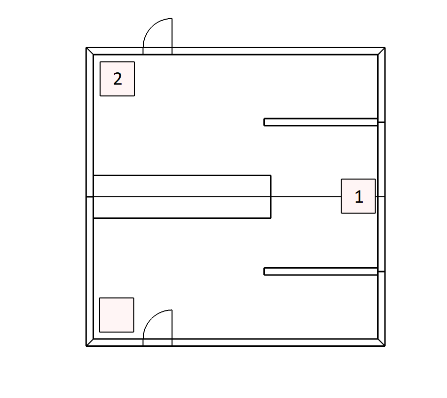

```{r setup, include=FALSE}
knitr::opts_chunk$set(echo = FALSE, message = FALSE, warning = FALSE)

# Libraries
library(plyr)
library(ggplot2)
library(cowplot)
library(gridExtra)
library(grid)
library(knitr)
library(assortedRFunctions)
library(kableExtra)
library(MRColour)
library(jsonlite)
library(reshape2)
library(latex2exp)
library(lmerTest)
library(ez)
library(BayesFactor)
theme_set(theme_grey()) 
```

# Aim of this project
This project is set-out to explore which factors influence the experience of spatial boundaries and how they affect memory. A previous study (Horner et al., 2016) let participants navigate through a series of virtual rooms. In each room they encountered two images each showing an object. A subsequent memory test revealed that participants were better at remembering which object preceded or succeeded a cue object if both cue and target were presented in the same (within a boundary) as compared to a different room (across a boundary). In our experiments, we want to find out which characteristics of spatial boundaries (e.g. prediction error, perceptual changes, uncertainty or novelty) are crucial for the effect observed by Horner et al. (2016). 
The aim of this document is to log all major results and changes  thereby documenting the evolution of the project. 

# Experiment 1
<div style="width:300px; height:200px; float:right;position: relative; padding: 10px">

</div>

In order to examine which of the factors (see above) are important for spatial boundaries, we created an M-shaped room (see illustration to the right) and an open plane room that did not feature separating walls. The latter one is similar to the one used by Horner et al. (2016). 
The aim of Experiment 1 was to test whether we can replicate the basic effect temporal order memory within boundaries > across boundaries for both room types before we investigate the effect for any other manipulation. For this replication attempt, we designed our experiment to be as close to Horner's et al. (2016) design. 

## Method
### Participant pool
We recruited participants from the website https://www.prolific.co/ for all batches except the internal pilot (batch 0).

### Procedure
In all experiments, participants first saw a video of another person navigating through a series of rooms. Note that Horner et al. (2016), participants navigated through the virtual environment themselves. After watching the video, participants completed a memory task (see below for details).

### Virtual environment and stimuli
The rooms were build with SketchUp (https://www.sketchup.com) and then imported into unity3d (https://unity.com/). We downloaded everyday objects (e.g. guitar, toys, household items etc.) from archive3d (https://archive3d.net/) and edited them either in blender (https://www.blender.org/) or in unity3d itself. We tried to find as many 3D versions of objects as possible that were also used in Horner et al. (2016). Furthermore, we tried to keep the scales of the objects realistic compared to each other.

Two other important differences were that in our experiment the layouts of all rooms of the same type were identical differing only in wall colour and floor material (wood or carpet textures), while the position of tables in Horner's experiment changed. There, the rooms were also arranged so that they formed a closed circle, in our experiment the rooms were arranged so that they all laid on a linear track. These are potential factors that could explain differences in the results. 

In our videos, M-shaped and open plane room alternated. We created four videos where the order of the objects presented was always the same. Video 1 and 2 two objects were presented in the first room. The first object-object sequence was hence within-boundaries. Video 3 and 4 showed only one object in the first room. The next object was therefore presented across the boundary. The first room in video 1 and 3 was M-shaped, while the first room in video 2 & 4 was an open plane room. The reason for this was to create four counter-balancing conditions that control for the order of sequences (within vs. across) and which room began the series. 

Like the order of the objects, the wall colours and floor materials of the rooms were constant across the videos. The only exception to this rule was that video 3 and 4 featured 45 rooms, while video 1 and 2 and one room less. The number of wall colours (blue, brown, green, grey, orange, pink, purple, red, turquoise and yellow) and floor materials (5 different carpets and 5 different wood floors) allowed us to construct 45 unique rooms. 

Both types of rooms contained three tables, all of which had a cardboard box placed on top of them. If the agent approached two of the tables (see labels 1 and 2 in figure above), the cardboard boxes disappeared.

All testing was done online. The stimulus presentation and memory task was programmed with jsPsych as well as custom Javascript/html scripts and hosted on the local MRC-CBU JATOS server.

Unfortunately, I only kept the script and code for batch 3. As small incremental changes were made that were deemed insignificant at this time. However, we did retain R-scripts that were used to create the stimulus lists. 

## Batch 0
### Description of memory task
This batch did not recruit participants from prolific but internally from our lab and department. Following Horner et al. (2016), we tested whether participants remembered the exact room a cue object was presented in. This was also assayed in a 3AFC task showing a still image of correct room along two lures. The foils were selected randomly once for all participants. It included the following constraints: foils couldn't be in the same room as target. Each object was used twice as foil. 

For this pilot, we only tested one video. For this early version of the experiment, we uploaded the video to YouTube. In subsequent batches, the video was presented within experiment itself. Because of this, participants were not required to complete any task during encoding. Note that in this experiments, we tested both forward and backward question. Also the object did not disappear after 3 secs like the subsequent batches. 

### Results
```{r}
# Load trial information
load("~/boundaryVR/data/batch0/trialData_video2.RData")
trialData_video2 <- trialData_video2[order(trialData_video2$objNum),]

# Load all data
folder         <- 'memoryTask/'
prefix         <- "~/boundaryVR/data/batch0/"
allFiles       <- list.files(paste(prefix, folder, sep = ''))
allFiles_paths <- paste(prefix, folder, allFiles, sep = '')
n              <- length(allFiles_paths)

for(i in 1:n){
  tempDF <- read.csv(allFiles_paths[i], header = TRUE, na.strings = '')
  # To be able to visualise
  tempDF$stimulus         <- NULL 
  tempDF$success          <- NULL
  tempDF$trial_type       <- NULL
  tempDF$internal_node_id <- NULL
  
  temporalOrder    <- subset(tempDF, test_part == 'temporalOrder')
  temporalOrder$rt <- as.numeric(as.character(temporalOrder$rt))
  
  response      <- rep(NA, dim(temporalOrder)[1])
  response[temporalOrder$key_press == 49] <- 1
  response[temporalOrder$key_press == 50] <- 2
  response[temporalOrder$key_press == 51] <- 3
  temporalOrder$response                  <- response
  
  # Sort by objNum
  temporalOrder <- temporalOrder[order(temporalOrder$probe),]
  
  # Add trial data
  temporalOrder$objNam       <- trialData_video2$objNam
  temporalOrder$room         <- trialData_video2$room
  temporalOrder$tempQuestion <- trialData_video2$tempQuestion
  temporalOrder$sameRoom     <- trialData_video2$sameRoom
  
  # Calculate conditions
  expConditions <- rep(NA, dim(temporalOrder)[1])
  expConditions[temporalOrder$sameRoom == 0] <- 'across'
  expConditions[temporalOrder$sameRoom == 1 & temporalOrder$room %% 2 == 0] <- 'walls'
  expConditions[temporalOrder$sameRoom == 1 & temporalOrder$room %% 2 != 0] <- 'no-walls'
  temporalOrder$expConditions <- expConditions
  
  # Calcalate accuracy
  accuracy <- rep(NA, dim(temporalOrder)[1])
  accuracy[temporalOrder$response == temporalOrder$correct_response] <- 1
  accuracy[temporalOrder$response != temporalOrder$correct_response] <- 0
  temporalOrder$accuracy <- accuracy
  
  # Aggregate
  agg1 <- ddply(temporalOrder, c('expConditions'), summarise, acc = mean(accuracy), rt = mean(rt))
  
  # Context memory
  contextMemory    <- subset(tempDF, test_part == 'contextMemory')
  contextMemory$rt <- as.numeric(as.character(contextMemory$rt))
  
  response      <- rep(NA, dim(contextMemory)[1])
  response[contextMemory$key_press == 49] <- 1
  response[contextMemory$key_press == 50] <- 2
  response[contextMemory$key_press == 51] <- 3
  contextMemory$response                  <- response
  
  # Sort by objNum
  contextMemory <- contextMemory[order(contextMemory$probe),]
  
  # Add trial data
  contextMemory$objNam       <- trialData_video2$objNam
  contextMemory$room         <- trialData_video2$room
  contextMemory$tempQuestion <- trialData_video2$tempQuestion
  contextMemory$sameRoom     <- trialData_video2$sameRoom
  
  # Calculate conditions
  expConditions <- rep(NA, dim(contextMemory)[1])
  expConditions[contextMemory$room %% 2 == 0] <- 'walls'
  expConditions[contextMemory$room %% 2 != 0] <- 'no-walls'
  contextMemory$expConditions <- expConditions
  
  # Calcalate accuracy
  accruacy <- rep(NA, dim(contextMemory)[1])
  accruacy[contextMemory$response == contextMemory$correct_response] <- 1
  accruacy[contextMemory$response != contextMemory$correct_response] <- 0
  contextMemory$accuracy <- accruacy
  
  # Aggregate
  agg2 <- ddply(contextMemory, c('expConditions'), summarise, acc = mean(accuracy), rt = mean(rt))
  
  if(i == 1){
    df_order <- agg1
    df_context <- agg2
  } else {
    df_order <- rbind(df_order, agg1)
    df_context <- rbind(df_context, agg2)
  }
}

# Rename according for batch1
df_order_b0   <- df_order 
df_context_b0 <- df_context

# Create mean tables
table1          <- ddply(df_order_b0, c('expConditions'), 
                         summarise,
                         n = length(acc), 
                         meanAcc = round(mean(acc), 2), 
                         sdAcc = round(sd(acc), 2), 
                         meanRT = round(mean(rt)), 
                         sdRT = round(sd(rt)))
table1          <- cbind(data.frame(`roomtype` = c('', 'open plane', 'M-shaped')), table1)
names(table1)   <- c('Room type', 'Boundary', 'N', 'Mean', 'SD', 'Mean', 'SD')
table1$Boundary <- c('across', 'within', 'within')
table1          <- kable(table1, format = 'html', caption = "Table 1: Temporal order memory for batch 0 with non-transformed values. ")
add_header_above(table1, c(" " = 1, " " = 1, " " = 1, "Accuracy" = 2, "RT in msec" = 2))
```

The results of the four pilot participants looked promising as their temporal order memory seems to be off the floor for both within conditions (open plane & M-shaped room). Accuracy for the open plane room in the within condition seems substantially higher than the other two conditions. This is contrasted with memory performance for the room an object was presented in (i.e. context memory). Here, performance was very close to chance that is 0.33 (M = `r round(mean(contextMemory$accuracy), 2)`).

```{r}
table2 <- ddply(df_context_b0, c('expConditions'), 
                summarise,
                n = length(acc), 
                meanAcc = round(mean(acc), 2), 
                sdAcc = round(sd(acc), 2), 
                meanRT = round(mean(rt)), 
                sdRT = round(sd(rt)))
names(table2)   <- c('Room type', 'N', 'Mean', 'SD', 'Mean', 'SD')
table2          <- kable(table2, format = 'html', caption = "Table 2: Context memory for batch 0 with non-transformed values.")
add_header_above(table2, c(" " = 1, " " = 1, "Accuracy" = 2, "RT in msec" = 2))
```

### Discussion
Additionally, our pilot participants told us that the context memory question was too difficult and discouraging. This is especially a problem for online experiments, where participants might giver up. Therefore we decided to drop this question and instead ask participant in which type of room (M-shaped vs. open plan) and on which table (1 vs. 2) an object was presented. 

## Batch 1
### Description of memory task
In this batch, the foils were +/- 4 positions away from the target object. This was done to implement tighter control of the foils. This ensured that the two foils were always from the same room type and on the same table as the target. 
Participants in this tasks were required to judge whether an object was smaller or bigger than a reference as soon as the object appeared. In this and all subsequent batches the object was visible for 3 seconds. After this, the object disappeared again and the cardboard box that was covering the object re-appeared. We chose this to control the time during which the object could be seen by the participant. 

Instead of context memory, we ask participant to choose the but room type and table type in 2AFC task. Temporal memory was probed by asking participants "What came before this object?". 

### Results
```{r}
# Load all data
prefix         <- "~/boundaryVR/data/batch1/memoryTask/"
allFiles       <- list.files(paste(prefix, sep = ''))
allFiles_paths <- paste(prefix, allFiles, sep = '')
n              <- length(allFiles_paths)

for(i in 1:n){
  ############
  # Load data files
  tempDF <- read.csv(allFiles_paths[i], header = TRUE, na.strings = '')
  
  # Recode key presses
  response      <- rep(NA, dim(tempDF)[1])
  response[tempDF$key_press == 49] <- 1
  response[tempDF$key_press == 50] <- 2
  response[tempDF$key_press == 51] <- 3
  tempDF$response <- response
  
  ############
  # Temporal order
  temporalOrder    <- subset(tempDF, test_part == 'temporalOrder')
  temporalOrder$rt <- as.numeric(as.character(temporalOrder$rt))
  
  # Calcalate accuracy
  accuracy <- rep(NA, dim(temporalOrder)[1])
  accuracy[temporalOrder$response == temporalOrder$corr_resp] <- 1
  accuracy[temporalOrder$response != temporalOrder$corr_resp] <- 0
  temporalOrder$accuracy <- accuracy

  ############
  # Room type question
  roomType      <- subset(tempDF, test_part == 'roomType')
  roomType$rt   <- as.numeric(as.character(roomType$rt))
  
  # Calculate accuracy
  accuracy <- rep(NA, dim(roomType)[1])
  accuracy[roomType$response == roomType$corr_resp] <- 1
  accuracy[roomType$response != roomType$corr_resp] <- 0
  roomType$accuracy <- accuracy
  
  ############
  # Table question
  tableNum      <- subset(tempDF, test_part == 'tableNum')
  tableNum$rt   <- as.numeric(as.character(tableNum$rt))
  
  # Recode because tables are named 2 and 3 in input data
  tableNum$response[tableNum$key_press == 49] <- 3 # for key press 1
  tableNum$response[tableNum$key_press == 50] <- 2 # for key press 2
  
  # Calculate accuracy
  accuracy <- rep(NA, dim(tableNum)[1])
  accuracy[tableNum$response == tableNum$corr_resp] <- 1
  accuracy[tableNum$response != tableNum$corr_resp] <- 0
  tableNum$accuracy <- accuracy
  
  # Add subject ID and concatenate to 1 data.frame
  if(i == 1){
    df_order    <- temporalOrder
    df_order$id <- i
    df_room     <- roomType
    df_room$id  <- i
    df_table    <- tableNum
    df_table$id <- i
  } else {
    temporalOrder$id <- i
    df_order         <- rbind(df_order, temporalOrder)
    roomType$id      <- i
    df_room          <- rbind(df_room, roomType)
    tableNum$id      <- i
    df_table         <- rbind(df_table, tableNum)
  }
}

# Rename according for batch1
df_order_b1 <- df_order 
df_room_b1  <- df_room
df_table_b1 <- df_table

# Convert ID to factor
df_order_b1$id <- as.factor(df_order_b1$id)
df_room_b1$id  <- as.factor(df_room_b1$id)
df_table_b1$id <- as.factor(df_table_b1$id)

# Recode factor levels
levels(df_order_b1$context) <- c('across', 'within-open plane', 'within-M-shape')

# Calculate mean accuracy
agg_order_b1 <- ddply(df_order_b1, c('id', 'context'), summarise, acc = mean(accuracy), rt = mean(rt))
agg_room_b1  <- ddply(df_room_b1, c('id'), summarise, acc = mean(accuracy))
agg_table_b1 <- ddply(df_table_b1, c('id'), summarise, acc = mean(accuracy))

# Do arcsine transformation
agg_order_b1$trans_acc <- arcsine_transform(agg_order_b1$acc)
agg_room_b1$trans_acc  <- arcsine_transform(agg_room_b1$acc)
agg_table_b1$trans_acc <- arcsine_transform(agg_table_b1$acc)

# Plots
plt1 <- ggplot(agg_order_b1, aes(x = context, y = trans_acc)) + 
  geom_boxplot(alpha = 0.5,outlier.shape = NA) + 
  geom_jitter(width = 0.1, height = 0) +
  geom_hline(yintercept = arcsine_transform(1/3)) +
  annotate('text', x = 2, y = arcsine_transform(1/3) - 0.03, label = 'Chance') +
  labs(y = 'arcsine(3AFC accuracy)', x = "Context", title = 'Temporal Order')

# Bind room and table together
roomTable_b1 <- data.frame(id = rep(1:n, 2),
                            Type = rep(c('Room', 'Table'), each = n),
                            acc = c(agg_room_b1$acc, agg_table_b1$acc),
                            trans_acc = c(agg_room_b1$trans_acc, agg_table_b1$trans_acc))

plt2 <- ggplot(roomTable_b1, aes(x = Type, y = trans_acc)) + 
  geom_boxplot(alpha = 0.5,outlier.shape = NA) + 
  geom_jitter(width = 0.1, height = 0) +
  geom_hline(yintercept = arcsine_transform(0.5)) +
  annotate('text', x = 1.5, y = arcsine_transform(0.5) - 0.03, label = 'Chance') +
  labs(y = 'arcsine(2AFC accuracy)', x = "Memory type", title = 'Room type and table')

plot_grid(plt1, plt2)

# Staticis
agg_order_overall_b1 <- ddply(df_order_b1, c('id'), summarise, acc = mean(accuracy), rt = mean(rt))
agg_order_overall_b1$trans_acc <- arcsine_transform(agg_order_overall_b1$acc)

# Run tests
test1 <- ttestBF(agg_order_overall_b1$trans_acc - arcsine_transform(1/3), nullInterval = c(-Inf, 0))
test1 <- round(1/as.numeric(as.vector(test1)[2]), 2)

test2 <- ttestBF(agg_room_b1$trans_acc - arcsine_transform(0.5), nullInterval = c(-Inf, 0))
test2 <- round(1/as.numeric(as.vector(test2)[2]), 2)

test3 <- ttestBF(agg_table_b1$trans_acc - arcsine_transform(0.5), nullInterval = c(-Inf, 0))
test3 <- round(as.numeric(as.vector(test3)[2]), 2)
```

As can be inferred from above, there is considerable evidence that memory performance is not above change (BF01 = `r test1`). The same is true for remembering in which room type a cue object was presented in (BF01 = `r test2`). However, there is weak evidence that participants remembered on which table the object was presented (BF10 = `r test3`).

```{r}
# Create mean tables
table1          <- ddply(agg_order_b1, c('context'), 
                         summarise,
                         n = length(acc), 
                         meanAcc = round(mean(acc), 2), 
                         sdAcc = round(sd(acc), 2), 
                         meanRT = round(mean(rt)), 
                         sdRT = round(sd(rt)))
table1          <- cbind(data.frame(`roomtype` = c('', 'open plane', 'M-shaped')), table1)
names(table1)   <- c('Room type', 'Boundary', 'N', 'Mean', 'SD', 'Mean', 'SD')
table1$Boundary <- c('across', 'within', 'within')
table1          <- kable(table1, format = 'html', 
                         caption = "Table 3: Temporal order memory for batch 1 with non-transformed values.")
add_header_above(table1, c(" " = 1, " " = 1, " " = 1, "Accuracy" = 2, "RT in msec" = 2))


table2          <- ddply(roomTable_b1, c('Type'), 
                         summarise,
                         n = length(acc), 
                         meanAcc = round(mean(acc), 2), 
                         sdAcc = round(sd(acc), 2))
table2          <- kable(table2, format = 'html', 
                         caption = "Table 4: Room and table memory for batch 1 with non-transformed values.")
add_header_above(table2, c(" " = 1, " " = 1, "Accuracy" = 2))
```

After seeing the poor memory performance that was not above chance, we got concerned that maybe participants misunderstood our instructions. Since they saw two foils (one 4 positions before and one 4 position after the target), a possibility could be that they choose any foil that came before the cue object and not necessarily selecting the target. This can be assessed by how often participants choose foil 1 versus foil 2 on incorrect trials. 

```{r}
# Load trial information
load("~/boundaryVR/experiments/Exp1/batch1/r_supportFiles/trialData_20200323_125523.RData")
# Note that counterbalancing in that images goes from 1 to 8, while it goes from 0 to 7 in the javascript
# files.

# Order trial information
trials_cond5 <- trials_cond5[order(trials_cond5$objNum),]
trials_cond6 <- trials_cond6[order(trials_cond6$objNum),]
trials_cond7 <- trials_cond7[order(trials_cond7$objNum),]
trials_cond8 <- trials_cond8[order(trials_cond8$objNum),]

# Load all data
prefix         <- "~/boundaryVR/data/batch1/memoryTask/"
allFiles       <- list.files(paste(prefix, sep = ''))
allFiles_paths <- paste(prefix, allFiles, sep = '')
n              <- length(allFiles_paths)

for(i in 1:n){
  ############
  # Loading data
  tempDF <- read.csv(allFiles_paths[i], header = TRUE, na.strings = '')
  
  ############
  # Temporal order memory
  temporalOrder <- subset(tempDF, test_part == 'temporalOrder')
  
  # Sort by objectNumber
  temporalOrder <- temporalOrder[order(temporalOrder$probe),]
  
  # get trialinfo and add to temporalOrder
  cond <- temporalOrder$condition[1] + 1 # to correct for difference
  temporalOrder$foil1Pos <- get(paste0("trials_cond", cond))$foil1Pos
  temporalOrder$foil2Pos <- get(paste0("trials_cond", cond))$foil2Pos
  
  temporalOrder$rt <- as.numeric(as.character(temporalOrder$rt))
  # Recode key presses
  response      <- rep(NA, dim(temporalOrder)[1])
  response[temporalOrder$key_press == 49] <- 1
  response[temporalOrder$key_press == 50] <- 2
  response[temporalOrder$key_press == 51] <- 3
  temporalOrder$response                  <- response
  
  # Calcalate accuracy 
  accuracy <- rep(NA, dim(temporalOrder)[1])
  accuracy[temporalOrder$response == temporalOrder$corr_resp] <- 1
  accuracy[temporalOrder$response != temporalOrder$corr_resp] <- 0
  temporalOrder$accuracy <- accuracy
  
  # Create variable that desribe whether target, foil1, foil2 was choosen
  choice <- rep('Target', dim(temporalOrder)[1])
  choice[temporalOrder$response == temporalOrder$foil1Pos] <- 'Foil 1'
  choice[temporalOrder$response == temporalOrder$foil2Pos] <- 'Foil 2'
  temporalOrder$choice <- choice
  
  # Create or bind to data.frame
  if(i == 1){
    df_order_b1    <- temporalOrder
    df_order_b1$id <- i
  } else {
    temporalOrder$id   <- i
    df_order_b1 <- rbind(df_order_b1, temporalOrder)
  }
}

# Convert to id factor
df_order_b1$id <- as.factor(df_order_b1$id)

df_order_false_b1 <- subset(df_order_b1, df_order_b1$accuracy == 0)
df_order_folis_b1 <- ddply(df_order_false_b1, c('id'), 
                             summarise,
                             n   = length(choice),
                             foil1 = table(choice)[1],
                             foil2 = table(choice)[2])

# Create percentages
df_order_folis_b1$foil1 <- df_order_folis_b1$foil1 / df_order_folis_b1$n
df_order_folis_b1$foil2 <- df_order_folis_b1$foil2 / df_order_folis_b1$n

# Melt for plotting
df_order_folis_b1 <- melt(df_order_folis_b1, id.vars =c("id"), measure.vars = c('foil1', 'foil2'))
df_order_folis_b1$trans_value <- arcsine_transform(df_order_folis_b1$value)

# Plot
ggplot(df_order_folis_b1, aes(x = variable, y = trans_value)) + 
  geom_boxplot(alpha = 0.5,outlier.shape = NA) + 
  geom_jitter(width = 0.1, height = 0) +
  labs(y = 'arcsine(Percentage of choice)', x = '', title = 'Foil choice on incorrect trials')

# Statistics
test4 <- ttestBF(df_order_folis_b1[df_order_folis_b1$variable == 'foil1', 4],
                 df_order_folis_b1[df_order_folis_b1$variable == 'foil2', 4],
                 paired = TRUE)
test4 <- reportBF(1/test4)
```

Note that Foil 1 is before the target and foil 2 is after the target but each foil is 4 positions away. We did not find a bias, in contrast we found evidence that both foils were chosen equally often (BF01 = `r test4`).

### Discussion
Despite the fact that we didn't find evidence for an bias for foil, we choose to improve our instruction by making them much clearer and collect another batch of participants. 

## Batch 2
### Description of memory task
In this batch, we asked participants "In the video you just watched, which one of the three objects at the bottom of the screen appeared immediately before this object?" in order to make sure that there is no misunderstanding as well as improving other explanations. Other than that no significant changes were made. 

### Results
```{r}
# Load trial information
load("~/boundaryVR/experiments/Exp1/batch2/r_supportFiles/trialData_20200522_182214.RData")
# Note that counterbalancing in that images goes from 1 to 8, while it goes from 0 to 7 in the javascript
# files.

# Order trial information
trials_cond5 <- trials_cond5[order(trials_cond5$objNum),]
trials_cond6 <- trials_cond6[order(trials_cond6$objNum),]
trials_cond7 <- trials_cond7[order(trials_cond7$objNum),]
trials_cond8 <- trials_cond8[order(trials_cond8$objNum),]

# Load all data
prefix         <- '~/boundaryVR/data/batch2/memoryTask/'
allFiles       <- list.files(paste(prefix, sep = ''))
allFiles_paths <- paste(prefix, allFiles, sep = '')
n              <- length(allFiles_paths)

for(i in 1:n){
  ############
  # Loading daya
  tempDF <- read.csv(allFiles_paths[i], header = TRUE, na.strings = '')
  
  # Recode key presses
  response      <- rep(NA, dim(tempDF)[1])
  response[tempDF$key_press == 49] <- 1
  response[tempDF$key_press == 50] <- 2
  response[tempDF$key_press == 51] <- 3
  tempDF$response                  <- response
  
  ############
  # Temporal order memory
  temporalOrder <- subset(tempDF, test_part == 'temporalOrder')
  
  # Sort by objectNumber
  temporalOrder <- temporalOrder[order(temporalOrder$probe),]
  
  # get trialinfo and add to temporalOrder
  cond <- temporalOrder$condition[1] + 1 # to correct for difference
  temporalOrder$foil1Pos <- get(paste0("trials_cond", cond))$foil1Pos
  temporalOrder$foil2Pos <- get(paste0("trials_cond", cond))$foil2Pos
  
  temporalOrder$rt <- as.numeric(as.character(temporalOrder$rt))

  # Calcalate accuracy 
  accuracy <- rep(NA, dim(temporalOrder)[1])
  accuracy[temporalOrder$response == temporalOrder$corr_resp] <- 1
  accuracy[temporalOrder$response != temporalOrder$corr_resp] <- 0
  temporalOrder$accuracy <- accuracy
  
  # Create variable that desribe whether target, foil1, foil2 was choosen
  choice <- rep('Target', dim(temporalOrder)[1])
  choice[temporalOrder$response == temporalOrder$foil1Pos] <- 'Foil 1'
  choice[temporalOrder$response == temporalOrder$foil2Pos] <- 'Foil 2'
  temporalOrder$choice <- choice
  
  ############
  # Room type question
  roomType      <- subset(tempDF, test_part == 'roomType')
  roomType$rt   <- as.numeric(as.character(roomType$rt))
  
  # get trialinfo and add to roomType
  cond               <- roomType$condition[1] + 1 # to correct for difference
  roomType$roomType  <- get(paste0("trials_cond", cond))$roomType
  
  corr_room <- rep(NA, nrow(roomType))
  corr_room[roomType$roomType  == "nw"] <- 1
  corr_room[roomType$roomType  == "ww"] <- 2
  roomType$corr_room <- corr_room
  
  # Calculate accuracy
  accuracy <- rep(NA, dim(roomType)[1])
  accuracy[roomType$response == roomType$corr_room] <- 1
  accuracy[roomType$response != roomType$corr_room] <- 0
  roomType$accuracy <- accuracy
  
  ############
  # Table question
  tableNum      <- subset(tempDF, test_part == 'tableNum')
  tableNum$rt   <- as.numeric(as.character(tableNum$rt))
  
  # Recode keypresses
  response      <- rep(NA, dim(tableNum)[1])
  response[tableNum$key_press == 49] <- 3 # for key press 1
  response[tableNum$key_press == 50] <- 2 # for key press 2
  tableNum$response                  <- response
  
  # Calculate accuracy
  accuracy <- rep(NA, dim(tableNum)[1])
  accuracy[tableNum$response == tableNum$corr_resp] <- 1
  accuracy[tableNum$response != tableNum$corr_resp] <- 0
  tableNum$accuracy <- accuracy
  
  # Create or bind to data.frame
  if(i == 1){
    df_order_b2    <- temporalOrder
    df_order_b2$id <- i
    df_room_b2     <- roomType
    df_room_b2$id  <- i
    df_table_b2    <- tableNum
    df_table_b2$id <- i
  } else {
    temporalOrder$id <- i
    df_order_b2      <- rbind(df_order_b2, temporalOrder)
    roomType$id      <- i
    df_room_b2       <- rbind(df_room_b2, roomType)
    tableNum$id      <- i
    df_table_b2      <- rbind(df_table_b2, tableNum)
  }
}

# Convert to id factor
df_order_b2$id <- as.factor(df_order_b2$id)
df_room_b2$id  <- as.factor(df_room_b2$id)
df_table_b2$id <- as.factor(df_table_b2$id)

# Recode factor levels
levels(df_order_b2$context) <- c('across', 'within-open plane', 'within-M-shape')

# Calculate mean accuracy
agg_order_b2 <- ddply(df_order_b2, c('id', 'context'), summarise, acc = mean(accuracy), rt = mean(rt))
agg_room_b2  <- ddply(df_room_b2, c('id'), summarise, acc = mean(accuracy))
agg_table_b2 <- ddply(df_table_b2, c('id'), summarise, acc = mean(accuracy))

# Transform accuracy
agg_order_b2$trans_acc <- arcsine_transform(agg_order_b2$acc)
agg_room_b2$trans_acc  <- arcsine_transform(agg_room_b2$acc)
agg_table_b2$trans_acc <- arcsine_transform(agg_table_b2$acc)

# Plots
plt1 <- ggplot(agg_order_b2, aes(x = context, y = trans_acc)) + 
  geom_boxplot(alpha = 0.5,outlier.shape = NA) + 
  geom_jitter(width = 0.1, height = 0) +
  geom_hline(yintercept = arcsine_transform(1/3)) +
  annotate('text', x = 2, y = arcsine_transform(1/3) + 0.4, label = 'Chance') +
  labs(y = 'arcsine(3AFC accuracy)', x = "Context", title = 'Temporal Order')

# Bind room and table together
roomTable_b2 <- data.frame(id = rep(1:n, 2),
                            Type = rep(c('Room', 'Table'), each = n),
                            acc = c(agg_room_b2$acc, agg_table_b2$acc),
                            trans_acc = c(agg_room_b2$trans_acc, agg_table_b2$trans_acc))

plt2 <- ggplot(roomTable_b2, aes(x = Type, y = trans_acc)) + 
  geom_boxplot(alpha = 0.5,outlier.shape = NA) + 
  geom_jitter(width = 0.1, height = 0) +
  geom_hline(yintercept = arcsine_transform(1/2)) +
  annotate('text', x = 1.5, y = arcsine_transform(1/2) - 0.02, label = 'Chance') +
  labs(y = 'arcsine(2AFC accuracy)', x = "Memory type", title = 'Room type and table')

plot_grid(plt1, plt2)

# Staticis
agg_order_overall_b2 <- ddply(df_order_b2, c('id'), summarise, acc = mean(accuracy), rt = mean(rt))
agg_order_overall_b2$trans_acc <- arcsine_transform(agg_order_overall_b2$acc)

test5 <- ttestBF(agg_order_overall_b2$trans_acc - arcsine_transform(1/3), nullInterval = c(-Inf, 0))
test5 <- reportBF(1/test5[2])

test6 <- ttestBF(agg_room_b2$trans_acc - arcsine_transform(1/2), nullInterval = c(-Inf, 0))
test6 <- reportBF(1/test6[2])

test7 <- ttestBF(agg_table_b2$trans_acc - arcsine_transform(1/2), nullInterval = c(-Inf, 0))
test7 <- reportBF(test7[2])
```

Unfortunately, we again found that the average performance was not above chance for temporal order memory (BF01 = `r test5`). This is true for memory for the room type as well (BF01 = `r test6`). However, the fact that participants were able to remember on which table the object was (BF10 = `r test7`) indicated that participants did remember some aspects of the task. 

```{r}
# Create mean tables
table1          <- ddply(agg_order_b2, c('context'), 
                         summarise,
                         n = length(acc), 
                         meanAcc = round(mean(acc), 2), 
                         sdAcc = round(sd(acc), 2), 
                         meanRT = round(mean(rt)), 
                         sdRT = round(sd(rt)))
table1          <- cbind(data.frame(`roomtype` = c('', 'open plane', 'M-shaped')), table1)
names(table1)   <- c('Room type', 'Boundary', 'N', 'Mean', 'SD', 'Mean', 'SD')
table1$Boundary <- c('across', 'within', 'within')
table1          <- kable(table1, format = 'html', caption = "Table 3: Temporal order memory for batch 2 with non-transformed values.")
add_header_above(table1, c(" " = 1, " " = 1, " " = 1, "Accuracy" = 2, "RT in msec" = 2))


table2          <- ddply(roomTable_b2, c('Type'), 
                         summarise,
                         n = length(acc), 
                         meanAcc = round(mean(acc), 2), 
                         sdAcc = round(sd(acc), 2))
names(table2)   <- c('Question', 'N', 'Mean', 'SD')
table2          <- kable(table2, format = 'html', caption = "Table 4: Room and table memory for batch 2 with non-transformed values.")
add_header_above(table2, c(" " = 1, " " = 1, "Accuracy" = 2))
```

We also again looked at whether there is a possible bias in choosing one foil over the other. 

```{r}
df_order_false_b2 <- subset(df_order_b2, df_order_b1$accuracy == 0)
df_order_folis_b2 <- ddply(df_order_false_b2, c('id'), 
                             summarise,
                             n   = length(choice),
                             foil1 = table(choice)[1],
                             foil2 = table(choice)[2])

# Create percentages
df_order_folis_b2$foil1 <- df_order_folis_b2$foil1 / df_order_folis_b2$n
df_order_folis_b2$foil2 <- df_order_folis_b2$foil2 / df_order_folis_b2$n

# Melt for plotting
df_order_folis_b2 <- melt(df_order_folis_b2, id.vars =c("id"), measure.vars = c('foil1', 'foil2'))
df_order_folis_b2$trans_value <- arcsine_transform(df_order_folis_b2$value)

# Plot
ggplot(df_order_folis_b2, aes(x = variable, y = trans_value)) + 
  geom_boxplot(alpha = 0.5,outlier.shape = NA) + 
  geom_jitter(width = 0.1, height = 0) +
  labs(y = 'arcsine(Percentage of choice)', x = '', title = 'Foil choice on incorrect trials')

# Statistics
test8 <- ttestBF(df_order_folis_b2[df_order_folis_b2$variable == 'foil1', 4],
                 df_order_folis_b2[df_order_folis_b2$variable == 'foil2', 4],
                 paired = TRUE)
test8 <- reportBF(1/test8)
```

We did not find a bias, in contrast we found evidence that both foils were chosen equally often (BF01 = `r test8`).  

### Additional analysis
To investigating the lack of effect, we ran a couple of additional analysis. 

#### Simulating a null distribution for temporal memory
One curious result in this batch was that some participants seem to have extremely low memory performance similar to batch 1. In order to assess, what kind of distribution would be expected with participants gave random responses, we ran a short simulation. With random guesses participants should get an average accuracy of 1/3 in the 3AFC task. To exclude those participants that actually perform below chance, I simulated a null distribution (N = 10000) for each condition since each condition has different number of trials. The distributions were ran with as binomial process that used the exact number of trials for each condition: 39, 20 and 19. 

```{r}
# Simulation parameters
nSims     <- 10000
nTrials   <- c(39, 20, 19) # trials per condiiton
accDist1  <- c()
accDist2  <- c()
accDist3  <- c()

# Simulation
for(i in 1:nSims){
  accDist1[i] <- mean(rbinom(nTrials[1], 1, 1/3))
  accDist2[i] <- mean(rbinom(nTrials[2], 1, 1/3))
  accDist3[i] <- mean(rbinom(nTrials[3], 1, 1/3))
}

# Bind to df
accDists <- data.frame(Context = rep(c('across', 'within-open plane', 'within-M-shape'), each = nSims),
                       Accuracy = c(accDist1, accDist2, accDist3))
cutOffs  <-  data.frame(Context = c('across', 'within-open plane', 'within-M-shape'),
                        Accuracy = c(quantile(accDist1, 0.05),
                                     quantile(accDist2, 0.05),
                                     quantile(accDist3, 0.05)))

# Plot distributions
ggplot(accDists, aes(x = Accuracy)) + 
  facet_grid(.~ Context) + 
  geom_histogram() + 
  geom_vline(data = cutOffs, aes(xintercept = Accuracy), linetype = 'dashed')
```

The null distribution that can be seen above shows what would be if participants answer randomly. The dashed line represents the 5th percentile, which was the cut-off for our re-analysis.
We will re-ran the analysis using the following cut-offs

```{r}
kable(cutOffs)
```

and exclude anyone scoring below any of these cut-offs. As can be seen above, the trial number per condition influences the cut-off. This is because with a smaller trial number, fewer response patterns are possible.

```{r}
nTrials        <- 5:100
percentile_5th <- c()

# Run simulation
for(i in 1:length(nTrials)){
  tempDist <- c()
  
  for(j in 1:nSims){
    tempDist[j] <- mean(rbinom(nTrials[i], 1, 1/3))
  }
  percentile_5th[i] <- quantile(tempDist, 0.05)
}

trial_sim <- data.frame(nTrials = nTrials,
                        per_5th = percentile_5th)

ggplot(trial_sim, aes(x = nTrials, y = per_5th)) + 
  geom_point() +
  labs(x = 'Number of trials', 
       y = '5th percentile', 
       title = 'Cut-off values as a function of trial number')
```

The graphic above shows the 5th percentile increases as function of the trial number. For situations with small trial numbers, lower values are still probable under the null distribution. This is because the probability of getting all trials right is higher if you have only 2 trials compared if you have a 100 trials. Hence, I would argue it's appropriate to have different cut-offs for the different conditions. While the across condition has 39 trials, the within-walls only has 19. If participants randomly guessed, I expected different null distributions even though in both cases the success probability is 1/3.

#### Excluding participants that are below 5th percentile of null distribution
##### With condition specific cut-offs
```{r}
# Create exlusion var and set to 0 as default
n       <- nrow(agg_order_overall_b2)
exclude <- rep(0, n)

for(i in 1:n){
  # Exclude if accuracy is below cut-off for given condition
  if(agg_order_b2$acc[i] < cutOffs$Accuracy[cutOffs$Context == agg_order_b2$context[i]]){
    exclude[agg_order_b2$id[i]] <- 1
  }
}

# Create subset
agg_order_b2$exclude <- rep(exclude, each = 3)
agg_order_b2_sub     <- agg_order_b2[agg_order_b2$exclude == 0, ]
```

Based on the cut-offs, I excluded `r sum(exclude)` participants from the analysis. 

```{r}
# Aggregate data
afcPlot <- ggplot(agg_order_b2_sub, aes(x = context, y = trans_acc)) + 
  geom_boxplot(alpha = 0.5,outlier.shape = NA) + 
  geom_jitter(width = 0.1) +
  geom_hline(yintercept = arcsine_transform(1/3)) +
  annotate('text', x = 2, y = arcsine_transform(1/3) - 0.1, label = 'Chance') +
  labs(y = 'arcsine(3AFC accuracy)', x = "Room type", title = 'Temporal Order')


rtPlot <- ggplot(agg_order_b2_sub, aes(x = context, y = rt)) + 
  geom_boxplot(alpha = 0.5, outlier.shape = NA) + 
  geom_jitter(width = 0.5) +
  labs(y = 'RT (msec)', x = "Room type", title = '')

plot_grid(afcPlot, rtPlot)
```

This did not change the general pattern of the results. 

##### Cut-off across conditions
Overall, there are 78 trials in the experiment. Below chance performance for that case would be `r trial_sim[trial_sim$nTrials == 78, 2]`. 

```{r}
# How many participants are excluded becuase they're below or equal to that cut-off
cutOff78 <- trial_sim[trial_sim$nTrials == 78, 2]
exclude  <- agg_order_overall_b2$id[which(agg_order_overall_b2$acc <= cutOff78)]
agg_order_b2_sub2 <- agg_order_b2[agg_order_b2$id != exclude, ]
```

There is `r num2word(length(exclude))` participant(s), to which that applies. If we exclude this participant from the analysis. Excluding `r num2word(length(exclude))` participant cannot change our results. 

#### Analysis of participants that expected a memory test
Because I didn't save a participant ID for all output, I need to manually assign the results of the memory task to the debrief questionnaire data by renaming the file names. 

```{r strings, echo = FALSE}
# Question and answer string
q_id <- c('video_viewing', 
          'q_answering', 
          'breaks', 
          'room_feeling1', 
          'room_feeling2', 
          'room_feeling3', 
          'object_recognition',
          'exp_problems',
          'navigation',
          'object_time',
          'memory1',
          'memory2', 
          'instructions')

questions_string <- c('Did you do anything else while watching the video?',
               'Did you do your best to answer the questions correctly?',
               'Did you take breaks during the experiment?',
               'Did rooms with a partition feel like they were a single room (similar to the room without a partition) \nor did they feel like two separate rooms? (Please elaborate below.)',
               'Did you feel it was harder/easier to remember the order of objects in the rooms without a partition \nrelative to those with a partition?',
               'When crossing from one part of the room to the next in a partitioned room, did that feel like you were \nmoving to a new room (a bit like walking through a door)?',
               'Did you recognise all objects in the video and in the memory task? (If you can, please try describe \nthe/those object(s) briefly.)',
               'Did you experience any problems viewing the videos? Or problems in the experiment in general? (If yes,\nplease elaborate.)',
               'Did the navigation feel too fast?',
               'Did you think the time the objects were visible was long enough?',
               'Did you anticipate there would be a memory test on the objects? If so, did you anticipate you would be \nasked about the order of the objects?',
               'Did you use any strategy to remember the objects and their order? (If yes, please elaborate.)',
               'Now, you\'ve completed the task. Can we somehow improve our instructions? (If yes, please elaborate.)')

questions <- data.frame(id = q_id,
                       question = questions_string)

answerQuestionID <- c(1, 1, 1, 2, 2, 2, 3, 3, 3, 4, 4, 4, 5 ,5, 5, 6, 6, 6, 7, 7, 7,
                      8, 8, 9, 9, 10, 10, 11, 11, 11, 12, 12, 13, 13)

answerValue <- c('other_things',
                 'unattentive',
                 'attentive',
                 'did_best',
                 'random',
                 'partly_random',
                 'yes',
                 'short_breaks',
                 'no',
                 'yes',
                 'cannot_say',
                 'no',
                 'easierWithout',
                 'noDiff',
                 'easierWith',
                 'yes',
                 'cannot_say',
                 'no',
                 'all',
                 'nearlyAll',
                 'manyNot',
                 'yes',
                 'no',
                 'yes',
                 'no',
                 'yes',
                 'no',
                 'expOrder',
                 'expTest',
                 'expNone',
                 'yes',
                 'no',
                 'yes',
                 'no')

answerString <- c('Yes, at times I was busy with other things and missed parts of the video.',
                  'I didn\'t do anything else, but did not always watch attentively.',
                  'No, I watched all the whole video attentively.',
                  'Yes, I tried my best to answer everything correctly.',
                  'I answered randomly for the most part.',
                  'At least some of the time I answered randomly.',
                  'Yes, I took breaks.',
                  'I took some, but they were short (up to 1 minute).',
                  'No, I completed the experiment in one go.',
                  'Yes, I both type of rooms felt like one.',
                  'I can\'t say.',
                  'No, the room with walls in the middle felt like two separate rooms.',
                  'It was easier without partition.',
                  'There was no diferrence.',
                  'It was easier with partition.',
                  'Yes, did feel like this.',
                  'I can\'t say.',
                  'No, I didn\'t feel like this.',
                  'I recognised all.',
                  'I recognised nearly all.',
                  'I  didn\'t recognise many objects.',
                  'Yes.',
                  'No.',
                  'Yes.',
                  'No.',
                  'Yes.',
                  'No.',
                  'I anticipated I would be tested on order.',
                  'I anticipated there would be a test, but not which questions would be asked.',
                  'I didn’t anticipate memory would be tested.',
                  'Yes.',
                  'No.',
                  'Yes.',
                  'No.')
```

```{r parseData, echo = FALSE}
nQuestions     <- 13
prefix         <- '~/boundaryVR/data/batch2/debrief/'
allFiles       <- list.files(paste(prefix, sep = ''))
allFiles_paths <- paste(prefix, allFiles, sep = '')
nSub           <- length(allFiles_paths)

general_comments <- rep(NA_character_, nSub)

for(i in 1:nSub){
  # Load JSON
  jsonString  <- readChar(allFiles_paths[i], file.info(allFiles_paths[i])$size)
  resultsList <- fromJSON(jsonString)
  
  # Get questions
  tempData              <- questions
  tempData$SubNum       <- i
  tempData$answerValue  <- NA
  tempData$answerString <- NA
  tempData$survey       <- NA
  
  # Go through list of ith participant
  for(j in 1:nQuestions){
    # Assign answer value 
    tempData$answerValue[j] <- resultsList[[paste0('q', j)]]$answer
    
    # Get answer string by subsetting answer values belonging to jth question
    temp_answerStrings       <- answerString[which(answerQuestionID == j)]
    tempData$answerString[j] <- temp_answerStrings[which(answerValue[which(answerQuestionID == j)] == tempData$answerValue[j])]
    
    # Add content of text field if it exists
    if(!is.null(resultsList[[paste0('q', j)]]$survey)){
      tempData$survey[j] <- resultsList[[paste0('q', j)]]$survey
    }
  }
  
  # Bind to df
  if(i == 1){
    debriefData <- tempData
  } else{
    debriefData <- rbind(debriefData, tempData)
  }
  
  # Get general comments
  general_comments[i] <- resultsList$general_comments
}

```

```{r}
# Get participants that expected memory task
expectedTest <- debriefData$SubNum[debriefData$id == 'memory1'] 
expectedTest <- expectedTest[debriefData$answerValue[debriefData$id == 'memory1'] != 'expNone']

# Create subset
agg_order_b2_sub3 <- agg_order_b2[agg_order_b2$id %in% expectedTest, ]

afcPlot <- ggplot(agg_order_b2_sub3, aes(x = context, y = trans_acc)) + 
  geom_boxplot(alpha = 0.5,outlier.shape = NA) + 
  geom_jitter(width = 0.1) +
  geom_hline(yintercept = arcsine_transform(1/3)) +
  annotate('text', x = 2, y = arcsine_transform(1/3) - 0.02, label = 'Chance') +
  labs(y = 'arcsine(3AFC accuracy)', x = "Room type", title = 'Temporal Order')


rtPlot <- ggplot(agg_order_b2_sub3, aes(x = context, y = rt)) + 
  geom_boxplot(alpha = 0.5, outlier.shape = NA) + 
  geom_jitter(width = 0.5) +
  labs(y = 'RT (msec)', x = "Room type", title = '')

plot_grid(afcPlot, rtPlot)
```

This also does not seem to change the results. 

#### Analysis of the debrief questionnaire
Below are pie charts for all multiple choice questions that we asked in the debrief questionnaire. 

```{r fig1, fig.height = 30, fig.width = 10}
for(i in 1:nQuestions){
  tempSubset    <- debriefData[debriefData$id == q_id[i],]
  tempDF        <- data.frame(table(tempSubset$answerString))
  names(tempDF) <- c('Answer', 'Freq')

  bp  <- ggplot(tempDF, aes(x = "", y =  Freq, fill = Answer)) + geom_bar(width = 1, stat = "identity")
  tempPie <- bp + coord_polar("y", start = 0) + scale_fill_mrc() + 
    labs(x = '', y = '', title = paste(strwrap(questions_string[i], 60), collapse = "\n")) +
    theme(axis.title.x = element_blank(),
          axis.title.y = element_blank(),
          panel.border = element_blank(),
          panel.grid = element_blank(),
          axis.ticks = element_blank(),
          plot.title = element_text(size = 8, face = "bold", hjust = 0.5),
          legend.position = "bottom",
          legend.direction = "vertical")
  assign(paste0('pie', i), tempPie)
}

plot_grid(pie1, pie2, pie3, pie4, pie5, pie6, pie7, pie8, pie9, pie10, pie11, pie12, pie13, ncol = 2, align = 'hv')
```

The majority of the questions were answered in positive way (e.g. most people watched attentively). We also asked whether going through the M-shaped room felt like a boundary. However, the results were not really conclusive as they seem to be contradictory. This was most likely due to the way that we phrased the questions. All in all, the questionnaire did not reveal any concerning issues.

### Discussion
The difference between our results and Aidan’s results could be due to different task during encoding. One option here could be to use a more semantic task as such a pleasant/unpleasant judgement could be made (like in Aidan’s exp). Another major difference was that Aidan used random foils, while we always used foils that were +/- 4 positions form the target. A task with random foils is a lot easier than +/-4. Especially since some objects will be on different tables and we saw that people do remember those. The additional analysis did not provide us with an explanation of why the memory performance was very low and why could not replicate Horner's results. 

## Batch 3
### Description of memory task
Since our additional analysis did not produce any explanations why we observe this pattern, we decided to run another batch of participants but this time having the same foil (random) selection procedure as Horner. 

### Results
```{r}
# Load all data
prefix         <- '~/boundaryVR/data/batch3/memoryTask/'
allFiles       <- list.files(paste(prefix, sep = ''))
allFiles_paths <- paste(prefix, allFiles, sep = '')
n              <- length(allFiles_paths)

# Load trial information
load("~/boundaryVR/experiments/Exp1/batch3/r_supportFiles/trialData_randomFoils.RData")
# Note that counterbalancing in that images goes from 1 to 8, while it goes from 0 to 7 in the javascript
# files.

# Order trial information
# Due to an error only 78 trials were tested during 
trials_cond5 <- trials_cond5[order(trials_cond5$objNum),][1:78,]
trials_cond6 <- trials_cond6[order(trials_cond6$objNum),][1:78,]
trials_cond7 <- trials_cond7[order(trials_cond7$objNum),][1:78,]
trials_cond8 <- trials_cond8[order(trials_cond8$objNum),][1:78,]

for(i in 1:n){
  ############
  # Loading daya
  tempDF <- read.csv(allFiles_paths[i], header = TRUE, na.strings = '')
  
  # Recode key presses
  response      <- rep(NA, dim(tempDF)[1])
  response[tempDF$key_press == 49] <- 1
  response[tempDF$key_press == 50] <- 2
  response[tempDF$key_press == 51] <- 3
  tempDF$response                  <- response
  
  ############
  # Temporal order memory
  temporalOrder <- subset(tempDF, test_part == 'temporalOrder')
  
  # Sort by objectNumber
  temporalOrder <- temporalOrder[order(temporalOrder$probe),]
  
  # get trialinfo and add to temporalOrder
  cond <- temporalOrder$condition[1] + 1 # to correct for difference
  temporalOrder$foil1Pos <- get(paste0("trials_cond", cond))$foil1Pos
  temporalOrder$foil2Pos <- get(paste0("trials_cond", cond))$foil2Pos
  
  temporalOrder$rt <- as.numeric(as.character(temporalOrder$rt))

  # Calcalate accuracy 
  accuracy <- rep(NA, dim(temporalOrder)[1])
  accuracy[temporalOrder$response == temporalOrder$corr_resp] <- 1
  accuracy[temporalOrder$response != temporalOrder$corr_resp] <- 0
  temporalOrder$accuracy <- accuracy
  
  # Create variable that desribe whether target, foil1, foil2 was choosen
  choice <- rep('Target', dim(temporalOrder)[1])
  choice[temporalOrder$response == temporalOrder$foil1Pos] <- 'Foil 1'
  choice[temporalOrder$response == temporalOrder$foil2Pos] <- 'Foil 2'
  temporalOrder$choice <- choice
  
  ############
  # Room type question
  roomType      <- subset(tempDF, test_part == 'roomType')
  roomType$rt   <- as.numeric(as.character(roomType$rt))
  
  # get trialinfo and add to roomType
  roomType$roomType  <- get(paste0("trials_cond", cond))$roomType
  
  corr_room <- rep(NA, nrow(roomType))
  corr_room[roomType$roomType  == "nw"] <- 1
  corr_room[roomType$roomType  == "ww"] <- 2
  roomType$corr_room <- corr_room
  
  # Calculate accuracy
  accuracy <- rep(NA, dim(roomType)[1])
  accuracy[roomType$response == roomType$corr_room] <- 1
  accuracy[roomType$response != roomType$corr_room] <- 0
  roomType$accuracy <- accuracy
  
  # Adding table information to temporal order memory
  # Get right information and create temp variable
  tempInfo      <- get(paste0("trials_cond",  temporalOrder$condition[1]))
  tempInfo_full <- get(paste0("trials_cond",  temporalOrder$condition[1], '_full'))
  # Order both data frames by objNum/probe
  tempInfo <- tempInfo[1:78, ] # Because of an error in the code only 78 trials exist per participant
  tempInfo <- tempInfo[order(tempInfo$objNum),]
  temporalOrder <- temporalOrder[order(temporalOrder$probe),]
  
  # Transfering information between dfs
  temporalOrder$probeTable <- tempInfo$table
  # Loop through df to get table of target, foil1 and foil2
  targetTable <- c()
  foil1Table  <- c()
  foil2Table  <- c()
  for(j in 1:dim(tempInfo)[1]){
    targetTable[j] <- tempInfo_full[tempInfo_full$objNum == tempInfo$target[j], 'table']
    foil1Table[j]  <- tempInfo_full[tempInfo_full$objNum == tempInfo$foil1[j], 'table']
    foil2Table[j]  <- tempInfo_full[tempInfo_full$objNum == tempInfo$foil2[j], 'table']
  }
  
  # Add the information to main data.frame
  temporalOrder$targetTable <- targetTable
  temporalOrder$foil1Table  <- foil1Table
  temporalOrder$foil2Table  <- foil2Table
  
  ############
  # Table question
  tableNum      <- subset(tempDF, test_part == 'tableNum')
  tableNum$rt   <- as.numeric(as.character(tableNum$rt))
  
  # Recode keypresses
  response      <- rep(NA, dim(tableNum)[1])
  response[tableNum$key_press == 49] <- 3 # for key press 1
  response[tableNum$key_press == 50] <- 2 # for key press 2
  tableNum$response                  <- response
  
  # Calculate accuracy
  accuracy <- rep(NA, dim(tableNum)[1])
  accuracy[tableNum$response == tableNum$corr_resp] <- 1
  accuracy[tableNum$response != tableNum$corr_resp] <- 0
  tableNum$accuracy <- accuracy
  
  # Create or bind to data.frame
  if(i == 1){
    df_order_b3    <- temporalOrder
    df_order_b3$id <- i
    df_room_b3     <- roomType
    df_room_b3$id  <- i
    df_table_b3    <- tableNum
    df_table_b3$id <- i
  } else {
    temporalOrder$id <- i
    df_order_b3      <- rbind(df_order_b3, temporalOrder)
    roomType$id      <- i
    df_room_b3       <- rbind(df_room_b3, roomType)
    tableNum$id      <- i
    df_table_b3      <- rbind(df_table_b3, tableNum)
  }
}

# Convert to id factor
df_order_b3$id <- as.factor(df_order_b3$id)
df_room_b3$id  <- as.factor(df_room_b3$id)
df_table_b3$id <- as.factor(df_table_b3$id)

# Recode factor levels
levels(df_order_b3$context) <- c('across', 'within-open plane', 'within-M-shape')

# Calculate mean accuracy
agg_order_b3 <- ddply(df_order_b3, c('id', 'context'), summarise, acc = mean(accuracy), rt = mean(rt))
agg_room_b3  <- ddply(df_room_b3, c('id'), summarise, acc = mean(accuracy))
agg_table_b3 <- ddply(df_table_b3, c('id'), summarise, acc = mean(accuracy))

# Transform values
agg_order_b3$trans_acc <- arcsine_transform(agg_order_b3$acc)
agg_room_b3$trans_acc  <- arcsine_transform(agg_room_b3$acc)
agg_table_b3$trans_acc <- arcsine_transform(agg_table_b3$acc)

# Plots
plt1 <- ggplot(agg_order_b3, aes(x = context, y = trans_acc)) + 
  geom_boxplot(alpha = 0.5,outlier.shape = NA) + 
  geom_jitter(width = 0.1, height = 0) +
  geom_hline(yintercept = arcsine_transform(1/3)) +
  annotate('text', x = 2, y = arcsine_transform(1/3) - 0.02, label = 'Chance') +
  labs(y = 'arscine(3AFC accuracy)', x = "Context", title = 'Temporal Order')

# Bind room and table together
roomTable_b3 <- data.frame(id = rep(1:n, 2),
                            Type = rep(c('Room', 'Table'), each = n),
                            trans_acc = c(agg_room_b3$trans_acc, agg_table_b3$trans_acc))

plt2 <- ggplot(roomTable_b3, aes(x = Type, y = trans_acc)) + 
  geom_boxplot(alpha = 0.5,outlier.shape = NA) + 
  geom_jitter(width = 0.1, height = 0) +
  geom_hline(yintercept = arcsine_transform(1/2)) +
  annotate('text', x = 1.5, y = arcsine_transform(1/2) - 0.02, label = 'Chance') +
  labs(y = 'arcsine(2AFC accuracy)', x = "Memory type", title = 'Room type and table')

plot_grid(plt1, plt2)

# Staticis
agg_order_overall_b3 <- ddply(df_order_b3, c('id'), summarise, acc = mean(accuracy), rt = mean(rt))
agg_order_overall_b3$trans_acc <- arcsine_transform(agg_order_overall_b3$acc)
test9 <- ttestBF(agg_order_overall_b3$trans_acc - arcsine_transform(1/3), nullInterval = c(-Inf, 0))
test9 <- reportBF(test9[2])

test10 <- ttestBF(agg_room_b3$trans_acc - arcsine_transform(1/2), nullInterval = c(-Inf, 0))
test10 <- reportBF(1/test10[2])

test11 <- ttestBF(agg_table_b3$trans_acc - arcsine_transform(1/2), nullInterval = c(-Inf, 0))
test11 <- reportBF(test11[2])
```

We the relaxed constraints for foils, we did find that the average performance was above chance for temporal order memory (BF10 = `r test9`). Memory for rooms (BF01 = `r test10`) and tables (BF10 = `r test11`) again showed the same pattern as in previous batches. 

```{r}
# Statistics
test12 <- reportBF(anovaBF(trans_acc ~ context, whichRandom = 'id', data = agg_order_b3, progress = FALSE))

test13 <- ttestBF(agg_order_b3$trans_acc[agg_order_b3$context == 'within-open plane'],
                  agg_order_b3$trans_acc[agg_order_b3$context == 'across'], paired = TRUE)

test14 <- ttestBF(agg_order_b3$trans_acc[agg_order_b3$context == 'within-M-shape'],
                  agg_order_b3$trans_acc[agg_order_b3$context == 'across'], paired = TRUE)

test15 <- ttestBF(agg_order_b3$trans_acc[agg_order_b3$context == 'within-M-shape'],
                  agg_order_b3$trans_acc[agg_order_b3$context == 'within-open plane'], paired = TRUE)


# Effect sizes
diff1 <- arcsine_transform(agg_order_b3$acc[agg_order_b3$context == 'within-open plane']) -     
         arcsine_transform(agg_order_b3$acc[agg_order_b3$context == 'across'])
d1    <- round(mean(diff1)/sd(diff1), 2)

diff2 <- arcsine_transform(agg_order_b3$acc[agg_order_b3$context == 'within-M-shape']) -
         arcsine_transform(agg_order_b3$acc[agg_order_b3$context == 'across'])
d2    <- round(mean(diff2)/sd(diff2), 2)

diff3 <- arcsine_transform(agg_order_b3$acc[agg_order_b3$context == 'within-M-shape']) - 
         arcsine_transform(agg_order_b3$acc[agg_order_b3$context == 'within-open plane'])
d3    <- round(mean(diff3)/sd(diff3), 2)

```

An ANOVA revealed that there was a difference between the context (across vs. within-open plane vs. within-M-shape; BF10 = `r test12`). Two-sides t-tests showed the following differences:

```{r}
table3 <- data.frame(Comparison = c('within-open plane vs. across',
                                    'within-M-shape vs. across',
                                    'within-M-shape vs. within-open plane'),
                     BF10 = c(reportBF(test13),
                              reportBF(test14),
                              reportBF(test15)),
                     D    = c(d1, d2, d3))
kable(table3)
```

```{r}
# Collapsing within conditiom
df_order_b3$context2 <- 'within'
df_order_b3$context2[df_order_b3$context == 'across'] <- 'across'
agg_order_collasp_b3 <- ddply(df_order_b3, c('id',  'context2'), summarise, acc = mean(accuracy))
agg_order_collasp_b3$trans_acc <- arcsine_transform(agg_order_collasp_b3$acc)

ggplot(agg_order_collasp_b3, aes(x = context2, y = trans_acc)) + 
  geom_boxplot(alpha = 0.5,outlier.shape = NA) + 
  geom_jitter(width = 0.1) +
  geom_hline(yintercept = arcsine_transform(1/3)) +
  annotate('text', x = 2, y = arcsine_transform(1/3) - 0.02, label = 'Chance') +
  labs(y = 'arcsine(3AFC accuracy)', x = "Room type", title = 'Collapsing the within conditions')

test16 <- ttestBF(agg_order_collasp_b3[agg_order_collasp_b3$context2 == 'across', 4],
                  agg_order_collasp_b3[agg_order_collasp_b3$context2 == 'within', 4],  paired = TRUE)

test16 <- reportBF(test16)

diffScores <- agg_order_collasp_b3[agg_order_collasp_b3$context2 == 'within', 4] -
              agg_order_collasp_b3[agg_order_collasp_b3$context2 == 'across', 4] 
effSize    <- round(mean(diffScores)/sd(diffScores), 2)
```

The difference between collapsed condition (across vs. within) was large and reliable (BF10 = `r test16`, d = `r effSize`). 

```{r}
agg_order_b3_grand <- ddply(agg_order_b3, c('context'), summarise, accuracy = mean(acc), SD = sd(acc))
kable(agg_order_b3_grand)

boundaryEffect1 <-  agg_order_b3$acc[agg_order_b3$context == 'within-open plane'] - 
                    agg_order_b3$acc[agg_order_b3$context == 'across']
boundaryEffect2 <-  agg_order_b3$acc[agg_order_b3$context == 'within-M-shape'] - 
                    agg_order_b3$acc[agg_order_b3$context == 'across']

m1  <-  round(mean(boundaryEffect1), 4)
sd1 <-  round(sd(boundaryEffect1), 4)
m2  <-  round(mean(boundaryEffect2), 4)
sd2 <-  round(sd(boundaryEffect2), 4)

# Aidan's results
# Which object came next?
aidansData1 <- data.frame(Experiment = c('Exp 1', 'Exp 1', 'Exp 2', 'Exp 2', 'Exp 3', 'Exp 3'),
                         Context = c('within', 'across', 'within', 'across', 'within', 'across'),
                         accuracy = c(0.52, 0.42, 0.45, 0.38, 0.52, 0.44),
                         SD = c(0.15, 0.1, 0.17, 0.18, 0.18, 0.14))

v1 <- aidansData1$accuracy[aidansData1$Context == 'within'] - aidansData1$accuracy[aidansData1$Context == 'across']

# Which object came before?
aidansData2 <- data.frame(Experiment = c('Exp 1', 'Exp 1', 'Exp 2', 'Exp 2', 'Exp 3', 'Exp 3'),
                         Context = c('within', 'across', 'within', 'across', 'within', 'across'),
                         accuracy = c(0.42, 0.38, 0.46, 0.41, 0.49, 0.44),
                         SD = c(0.15, 0.13, 0.21, 0.16, 0.18, 0.17))

v2 <- aidansData2$accuracy[aidansData2$Context == 'within'] - aidansData2$accuracy[aidansData2$Context == 'across']
```

The mean accuracy difference between across and within-no-walls is `r m1` (SD = `r sd1`), while it is `r m2` (SD = `r sd2`) for the within-wall condition. Here is the Table 1 from Horner et al. (2016) for *'Which object came next?'*
```{r}
kable(aidansData1, format = 'html', caption = "Data from Aidan's Experiments: Which object came next?")
```

his boundary effects are `r v1` and for the question *'Which object came before?'*
```{r}
kable(aidansData2, format = 'html', caption = "Data from Aidan's Experiments: Which object came before?")
```

here the boundary effects are `r v2`. This is not much different from our effects. The problem is that those low effects are observed for the question that we're not testing. It could very well that we just don't have enough power to find this effect. To find out whether there are any factors that can explain why the effect was stronger in the within M-shape condition, I ran several exploratory analyses. 

#### Exploratory analysis
```{r}
df_order_b3_foilDist <- ddply(df_order_b3,
                              c('id', 'trial_index', 'context'),
                              summarise,
                              minDist = min(abs(dist1), abs(dist2)),
                              maxDist = max(abs(dist1), abs(dist2)),
                              meanDist = mean(abs(dist1), abs(dist2)),
                              dist1 = dist1,
                              dist2 = dist2,
                              accuracy = accuracy)

m_foil1 <- glmer(accuracy ~ minDist + maxDist + meanDist + (1 | id ), 
                 family = binomial, 
                 data = df_order_b3_foilDist)

table2 <- createResultTable(m_foil1)
kable(table2)
```

In another step, I tried to predict accuracy by including fixed effects for the absolute minimum, maximum and mean distance values of foil 1 (before cue/probe) and foil 2 (after cue/probe). In other words, for each trial I for instance used the minimum of both absolute distances. However as can you can see above, none significantly predicts accuracy. 

```{r}
m_foil2 <- glmer(accuracy ~ dist1 + dist2 + (1 | id ), 
                 family = binomial, 
                 data = df_order_b3_foilDist)

table3 <- createResultTable(m_foil2)
kable(table3)
```

When I use the raw distance values of foil 1 and foil 2, there again were no significant effects even though the distance of foil 2 to the cue/probe was relatively small, p `r pValue(table3$P[3])`.

```{r}
m_context2 <- glmer(accuracy ~ context*dist2 + (1| id ), 
                    family = binomial, 
                    data = df_order_b3_foilDist)

table4 <- createResultTable(m_context2)
kable(table4)
```

In a next step, I included context and dist2 as predictors in the logistic regression model and allowed an interaction between both fixed effects. As you can see none of the interactions are significant but, a) there is again a significant contrast between across and within-walls, p `r pValue(table4$P[3])`. Most interestingly, there is also trend for the contrast between across and within-no-walls, p `r pValue(table4$P[2])`.  

##### Binary distance
```{r}
binDist2 <- rep('close', nrow(df_order_b3_foilDist))
binDist2[df_order_b3_foilDist$dist2 >= median(df_order_b3_foilDist$dist2)] <- 'far'
df_order_b3_foilDist$binDist2 <- binDist2

m_context3 <- glmer(accuracy ~ context*binDist2 + (1| id ), 
                    family = binomial, 
                    data = df_order_b3_foilDist)

table5 <- createResultTable(m_context3)
kable(table5)
```

If I use a binary measure of foil distance instead of a continuous one, then the effects don't chance a lot actually. 

```{r}
binDist2_agg1 <- ddply(df_order_b3_foilDist, 
                      c('id', 'binDist2'), 
                      summarise, 
                      N = length(accuracy), 
                      accuracy = mean(accuracy))

result6 <- ttestBF(arcsine_transform(binDist2_agg1$accuracy[binDist2_agg1$binDist2 == 'far']),
                   arcsine_transform(binDist2_agg1$accuracy[binDist2_agg1$binDist2 == 'close']),
                   paired = TRUE)

result6 <- reportBF(result6)
diff2   <- binDist2_agg1$accuracy[binDist2_agg1$binDist2 == 'far'] - binDist2_agg1$accuracy[binDist2_agg1$binDist2 == 'close']

binDist2_agg2 <- ddply(df_order_b3_foilDist, 
                      c('id', 'context', 'binDist2'), 
                      summarise, 
                      N = length(accuracy), 
                      accuracy = mean(accuracy))
```

The mean accuracy between trial where foil 2 is far way compared to close is `r round(mean(diff2), 4)` (SD = `r round(mean(diff2), 4)`), BF10 = `r result6`. 

```{r}
kable(ddply(df_order_b3_foilDist, 
                      c('context', 'binDist2'), 
                      summarise, 
                      N = length(accuracy), 
                      accuracy = mean(accuracy)))

# within-walls: far vs. close
diff3.1 <- arcsine_transform(binDist2_agg2$accuracy[binDist2_agg2$context == 'within-M-shape' & binDist2_agg2$binDist2 == 'close']) - 
           arcsine_transform(binDist2_agg2$accuracy[binDist2_agg2$context == 'across' & binDist2_agg2$binDist2 == 'close'])

diff3.2 <- arcsine_transform(binDist2_agg2$accuracy[binDist2_agg2$context == 'within-M-shape' & binDist2_agg2$binDist2 == 'far']) - 
           arcsine_transform(binDist2_agg2$accuracy[binDist2_agg2$context == 'across' & binDist2_agg2$binDist2 == 'far'])

con1 <- diff3.1 - diff3.2
result7 <- reportBF(ttestBF(con1))

# within-no-wall: far vs. close
diff3.3 <- arcsine_transform(binDist2_agg2$accuracy[binDist2_agg2$context == 'within-open plane' & binDist2_agg2$binDist2 == 'close']) - 
           arcsine_transform(binDist2_agg2$accuracy[binDist2_agg2$context == 'across' & binDist2_agg2$binDist2 == 'close'])

diff3.4 <- arcsine_transform(binDist2_agg2$accuracy[binDist2_agg2$context == 'within-open plane' & binDist2_agg2$binDist2 == 'far']) - 
           arcsine_transform(binDist2_agg2$accuracy[binDist2_agg2$context == 'across' & binDist2_agg2$binDist2 == 'far'])

con2 <- diff3.3 - diff3.4
result8 <- reportBF(ttestBF(con1))
```

I've furthermore tested the interaction between our contrasts (across vs. within-walls and across vs. within-no-walls) and the distance between trials with close and far foil 2. The first contrasts shows no interaction, `r round(mean(diff3.1), 4)` (SD = `r round(sd(diff3.1), 4)`) vs `r round(mean(diff3.2), 4)` (SD = `r round(sd(diff3.2), 4)`), $BF_{10]$ = `r result7`, so that the boundary effect is similar for far and close foil 2s. The same is true for the contrast of across vs. within-no-walls,`r round(mean(diff3.3), 4)` (SD = `r round(sd(diff3.3), 4)`) vs `r round(mean(diff3.4), 4)` (SD = `r round(sd(diff3.4), 4)`), $BF_{10}$ = `r result8`.

## Effect of condition
```{r}
df_order_b3$condition <- as.factor(df_order_b3$condition)
m_context4 <- glmer(accuracy ~ context*condition + (1| id ), 
                   family = binomial, 
                   data = df_order_b3)

table6 <- createResultTable(m_context4)
kable(table6)
```

In the last step, I included condition as fixed effect. After replacing the problematic participants it's a good sign that there are no significant interactions left between any context contrast and conditions. 

## Effect of same table
Does it matter if both of the foils are on a different or on the same table as the target object? To examine this question, I compare the average accuracy across trials with both foils from the same table as the target with that being not the case. Note that 0 means both foils or foil2 are/is not on the same table and 1 means it is the same table. 

```{r}
bothSameTable <- rep(0, nrow(df_order_b3))
# if both are the same
bothSameTable[df_order_b3$targetTable == df_order_b3$foil1Table & df_order_b3$targetTable == df_order_b3$foil2Table] <- 1 
df_order_b3$bothSameTable <- as.factor(bothSameTable)

bothSameTable_agg <- ddply(df_order_b3, c('id', 'bothSameTable'), summarise, accuracy =  mean(accuracy))
bothSameTable_agg$trans_acc <- arcsine_transform(bothSameTable_agg$accuracy)

ggplot(bothSameTable_agg, aes(x = bothSameTable, y = trans_acc)) + 
  geom_boxplot(alpha = 0.5, outlier.shape = NA) + 
  geom_jitter(width = 0.1) +
  geom_hline(yintercept = arcsine_transform(1/3)) +
  annotate('text', x = 2, y = arcsine_transform(1/3) - 0.02, label = 'Chance') +
  labs(y = 'arcsine(3AFC accuracy)', x = "Both foils from the same tables", title = 'Temporal Order (both tables)')

diff_bothTables <- bothSameTable_agg[bothSameTable_agg$bothSameTable  == 0, 4] - 
                   bothSameTable_agg[bothSameTable_agg$bothSameTable  == 1, 4]

result9         <- reportBF(1/ttestBF(diff_bothTables))
```

This analysis has to be interpreted very carefully because only `r round(mean(bothSameTable), 2)*100` % of trials are with both foils on the same table. Accuracy is not significantly lower on trials where the foils are from the same tables, $BF_{01}$ =  `r result9`. If we plug that variable into our model,

```{r}
m_context4 <- glmer(accuracy ~ context*bothSameTable + (1| id ), 
                    family = binomial, 
                    data = df_order_b3)

table6 <- createResultTable(m_context4)
kable(table6)
```

the contrast between across and within-walls remains unchanged by the inclusion of the variable. Interestingly, there is a trend for an interaction between foils being on the same table with the target and the contrast across vs. within-no-walls `r pValue(table6$P[5])`. Below, I display the interaction

```{r}
interaction_agg     <- ddply(df_order_b3, c('id', 'context', 'bothSameTable'), 
                             summarise, N = length(accuracy), 
                             accuracy =  mean(accuracy))

interaction_agg_sub <- interaction_agg[interaction_agg$context == 'across' | 
                                       interaction_agg$context == 'within-no-walls', ]

interaction_agg_sub$trans_acc <- arcsine_transform(interaction_agg_sub$accuracy)

ggplot(interaction_agg_sub, aes(x = context, y = trans_acc)) + 
  facet_wrap( ~ bothSameTable  , ncol = 2) +
  geom_boxplot(alpha = 0.5,outlier.shape = NA) + 
  geom_jitter(width = 0.1) +
  geom_hline(yintercept = arcsine_transform(1/3)) +
  annotate('text', x = 1, y = arcsine_transform(1/3) - 0.02, label = 'Chance') +
  labs(y = 'arcsine(3AFC accuracy)', x = "Room type", title = 'Across vs. within-no-walls as function of foils being on same table')
```

The problem with this comparison is that there are on average `r  mean(interaction_agg_sub$N[interaction_agg_sub$bothSameTable == 1])` trials in the same table case, while there are `r  mean(interaction_agg_sub$N[interaction_agg_sub$bothSameTable == 0])` in the opposite case. For comparison, I also plot the same interaction for the contrast across vs. within-walls.

```{r}
interaction_agg_sub2 <- interaction_agg[interaction_agg$context == 'across' | 
                                       interaction_agg$context == 'within-walls', ]

interaction_agg_sub2$trans_acc <- arcsine_transform(interaction_agg_sub2$accuracy)

ggplot(interaction_agg_sub2, aes(x = context, y = trans_acc)) + 
  facet_wrap( ~ bothSameTable  , ncol = 2) +
  geom_boxplot(alpha = 0.5,outlier.shape = NA) + 
  geom_jitter(width = 0.1) +
  geom_hline(yintercept = arcsine_transform(1/3)) +
  annotate('text', x = 1, y = arcsine_transform(1/3) - 0.02, label = 'Chance') +
  labs(y = 'arcsine(3AFC accuracy)', x = "Room type", title = 'Across vs. within-walls as function of foils being on same table')
```

Here is the overall table:
```{r}
kable(ddply(df_order_b3, c('context', 'bothSameTable'), summarise, N = length(accuracy), accuracy =  mean(accuracy)))
```

In addition to testing whether accuracy is worse in the rare case when both foils are from the same table, I also tested whether it makes a difference if only foil 2 is from the same table as the target. 

```{r}
foil2SameTable <- rep(0, dim(df_order_b3)[1])
# if both are the same
foil2SameTable[df_order_b3$targetTable == df_order_b3$foil2Table] <- 1 
df_order_b3$foil2SameTable <- as.factor(foil2SameTable)

foil2SameTable_agg <- ddply(df_order_b3, 
                            c('id', 'foil2SameTable'), 
                            summarise, 
                            N = length(accuracy), 
                            accuracy =  mean(accuracy))

foil2SameTable_agg$trans_acc <- arcsine_transform(foil2SameTable_agg$accuracy)

ggplot(foil2SameTable_agg, aes(x = foil2SameTable, y = trans_acc)) + 
  geom_boxplot(alpha = 0.5, outlier.shape = NA) + 
  geom_jitter(width = 0.1) +
  geom_hline(yintercept = arcsine_transform(1/3)) +
  annotate('text', x = 1.5, y = arcsine_transform(1/3) -0.02, label = 'Chance') +
  labs(y = 'arcsine(3AFC accuracy)', x = "Foil 2 from the same tables", title = 'Temporal Order (only foil 2)')

diff_foil2SameTable <- foil2SameTable_agg[foil2SameTable_agg$foil2SameTable  == 0, 'trans_acc'] - 
                       foil2SameTable_agg[foil2SameTable_agg$foil2SameTable  == 1, 'trans_acc'] 
result10            <- reportBF(1/ttestBF(diff_foil2SameTable))
```

Note that here `r round(mean(foil2SameTable), 2)*100` % of trials have foil 2 and the target on the same table. Again, accuracy is not significantly lower on trials where the foil 2 is from the same table, $BF_{01}$ `r result10`. If we plug foil2 into our model,

```{r}
m_context5 <- glmer(accuracy ~ context*foil2SameTable + (1| id ), 
                    family = binomial, 
                    data = df_order_b3)

table7 <- createResultTable(m_context5)
kable(table7)
```

nothing really changes and there is no interaction. If I enter both distance of foil 2 and whether both objects are on the same table into our model

```{r}
m_context6 <- glmer(accuracy ~ context*bothSameTable*dist2 + (1| id ), 
                    family = binomial, 
                    data = df_order_b3)

table8 <- createResultTable(m_context6)
kable(table8)
```

then both contrasts are close to be significant, across vs. within-no-walls p `r pValue(table8$P[2])` and across within-walls p `r  pValue(table8$P[3])` but none of the other main effects or interaction show a trend. 

### Discussion
In contrast to our expectation, we found that only m-shape rooms showed a boundary effect. This might be noise but if anything we would have expected to see a boundary effect only for open-plane rooms. This is because we thought that adding the walls might introduce a within room boundary. To exclude this possibility, was the primary reason for running the experiment in the first place because our plan is to add manipulation that introduce boundaries on top of something that is not a boundary. Unfortunately, our exploratory analyses did not provide or suggest any reason for this peculiar result. However, note this is not surprising as we had extremely low number of observation in some of the conditions of the exploratory analyses. Before we start with this second phase of this project we will therefore need to run another experiment that shows that both rooms on their own show boundary effects. 

# Experiment 2
## Design 
In this version of the task, participants are asked both temporal order question (Which object was before? vs. Which object was after?) in a blocked fashion. The order of this is randomised. In this experiment, we have 8 unique conditions,

```{r}
table9 <- data.frame(v1 = 1:8,
                     v2 = c('M-shape', 'M-shape', 'open-plane', 'open-plane', 'M-shape', 'M-shape', 'open-plane', 'open-plane'),
                     v3 = c('within', 'across', 'within', 'across', 'within', 'across', 'within', 'across'),
                     v4 = c(rep('Before', 4), rep('After', 4)),
                     v5 = c(rep('After', 4), rep('Before', 4)))

names(table9) <- c('Condition', 'Room type', 'Start with', 'Block 1', 'Block 2')
kable(table9, format = 'html', caption = "Table 9: Factorial design for Experiment 2")
```

These 8 between-subject conditions are fully crossed: room type (M-shape vs. open-plane), the fist inter-item connection (within vs. across) and the direction of temporal order memory that is tested first (Which object was before? vs. Which object was after?). To keep the experiment from getting too long, room type and table type questions were scraped as we have enough evidence that participants can only remember on which table an object was. 

Behind the scenes, we also made a couple of changes in unity3d. First, rooms are now split into two per scene that that are loaded by crossing over the door. This allowed me to use my laptop's GPU to render the rooms much more efficiently. A pair of rooms now can be baked in less than 5 minutes. Previously, I have baked all 44/45 rooms in one go overnight. The problem with that approach is that each time I had to change something, I would have to bake everything again. In the first experiments, objects were like the room static, which meant that I had to bake them as well and if I wanted to change something, I would have to bake everything again as well. Now, objects are set dynamically, which allows me to change them much more easily. However, at the moment I have to set the transform position and rotations manually keeping track of those values in a spreadsheet to make sure I am using the same values across all four videos. In future experiment, I should also script this. One way would be to edit all prefabs and make them child to an empty game object in a way that they are at zero on the y-axis and have neutral orientation. This will allow me to instantiate all object with default values while making sure their position and orientation is correct. 

In addition to the change in lighting, I created a script that moves the camera through a series of way points that are the same across all videos. In the first experiment, I created videos of me controlling a first person character. This might have introduces biases and differences between videos and between within and across room objects associations. For instance, in the first experiment videos showed up to 1 minute difference. Now, the time the camera needs to get from table to table the within a room is matched to the time the camera needs to get to table to table across rooms (7.8 vs 7.9 secs). All videos now have roughly the same length (11:30 min). I also made small changes to object with regards to their colour and size and swapped on object because it might have been to difficult to recognise.  

## Design analysis of sequential design
Since we did find a difference between across and within room associations for the M-shaped room but not for the open-plane room, we will run a sequential Bayesian data collection on both conditions separately starting with the open-plane room. At first we will run 12 participants for the open-plane room condition, after which we will check the evidence whether there is a difference between across and within room associations. We will increase the sample size by increments of four until we either reach a $BF_{10}$ of 6 or 1/6 or the maximum sample size of 36 that is currently constrained by our remaining balance on prolific (£431.66). After we have reached either of those stopping criteria, we will do the same for m-shape room (starting at 12 and incrementing by 4) until we reach a criterion for this condition. In case, we obtain an inconclusive results for the open-plane room and we still have resources left, we will increase the sample size for the open-plane room. The same is also true the other way around for the m-shaped room. 

In order to assess whether this data collection plan is able to provide conclusive evidence ($BF_{10}$ > 6 | < 1/6), I ran a simplified simulation with directional Bayesian _t_-tests with minimum sample size of 12 and maximum of 36 with effect sizes d = 0, 0.44 and 0.78 that correspond to a null effect and effect sizes that we observed in Experiment 1 Batch 3. 

```{r}
# Load data
load("analysis/powerAnalysis_Exp2_2.RData")
```


```{r}
# For plotting
minN         <- 12
maxN         <- 36
barWidth     <- 0.9
panMar       <- 0.1
bar_yAxis    <- 0.7
hist_yAxis   <- 2900
middle_xlim  <- c(-5.5, 5.5)
crit1        <- 6
crit2        <- 1/6
breaksVal    <- c(-5, -2, 0, 2, 5)
breaksLab    <- c('1/6', '1/3', '1', '3', '6')
```

### Null effect
```{r}
df_H0$trans_bf <- NA
df_H0$trans_bf[df_H0$bf < 1] <- -1/df_H0$bf[df_H0$bf < 1] + 1
df_H0$trans_bf[df_H0$bf > 1] <- df_H0$bf[df_H0$bf > 1] - 1

df_H0_agg <- ddply(df_H0, c('id'), summarise, n = n[length(n)], bf = bf[length(bf)])
df_H0_agg$support <- 'undecided'
df_H0_agg$support[df_H0_agg$bf > crit1] <- 'H1'
df_H0_agg$support[df_H0_agg$bf < crit2] <- 'H0'

# Creates band
df_H0_agg$band                                           <- '> 10'
df_H0_agg$band[df_H0_agg$bf < 10 & df_H0_agg$bf > 6]     <- '> 6'
df_H0_agg$band[df_H0_agg$bf < 6 & df_H0_agg$bf > 3]      <- '> 3'
df_H0_agg$band[df_H0_agg$bf < 3 & df_H0_agg$bf > 1]      <- '> 1'
df_H0_agg$band[df_H0_agg$bf < 1 & df_H0_agg$bf > 1/3]    <- '< 1'
df_H0_agg$band[df_H0_agg$bf < 1/3 & df_H0_agg$bf > 1/6]  <- '< 1/3'
df_H0_agg$band[df_H0_agg$bf < 1/6 & df_H0_agg$bf > 1/10] <- '< 1/6'
df_H0_agg$band[df_H0_agg$bf < 1/10]                      <- '< 1/10'

# Create factor band
df_H0_agg$band <- factor(df_H0_agg$band, levels = c('> 10', '> 6', '> 3', '> 1', '< 1', '< 1/3', '< 1/6', '< 1/10'))


# Get back to main DF
df_H0$band <- rep(df_H0_agg$band, table(df_H0$id))


# Create upper histogram
df_H0_agg_supp_H1 <- ddply(subset(df_H0_agg, support == 'H1'),
                           c('n', 'band'),
                           summarise,
                           freq = length(bf)/nIter)

# Upper Histogram
upper_hist_d0 <- ggplot(df_H0_agg_supp_H1, aes(x = n, y = freq, fill = band)) + 
 geom_bar(stat = "identity", show.legend = FALSE, alpha = 0.5, width = barWidth)  +
 scale_fill_BF() +
 coord_cartesian(ylim = c(0, bar_yAxis), xlim = c(minN - 0.5, maxN + 0.5), expand = FALSE) +
  labs(y = 'Frequency', x = NULL) +
  theme(axis.title.x = element_blank(),
        axis.text.x = element_blank(),
        axis.ticks.x = element_blank(),
        plot.margin = unit(c(panMar, panMar, panMar, 0), "cm"))

# Create line plot
linePlotd0 <- ggplot(df_H0, aes(x = n, y = trans_bf, group = id, colour = band)) + 
  geom_line(alpha = 0.05, show.legend = FALSE) + 
  scale_colour_BF() +
  geom_hline(yintercept = 5) +
  geom_hline(yintercept = -5) +
  scale_y_continuous(breaks = breaksVal,
                     labels = breaksLab) +
  coord_cartesian(xlim = c(minN, maxN), ylim = middle_xlim, expand = FALSE) +
  labs(y = expression(BF[10]), x = NULL) +
  theme(axis.title.x = element_blank(),
        axis.text.x = element_blank(),
        axis.ticks.x = element_blank(),
        plot.margin = unit(c(panMar, panMar, panMar, 0), "cm"))

# Create right histogram
df_H0_agg_undecided <- subset(df_H0_agg, df_H0_agg$n == maxN & df_H0_agg$bf < crit1 & df_H0_agg$bf > crit2)
df_H0_agg_undecided$trans_bf <- NA
df_H0_agg_undecided$trans_bf[df_H0_agg_undecided$bf < 1] <- -1/df_H0_agg_undecided$bf[df_H0_agg_undecided$bf < 1] + 1
df_H0_agg_undecided$trans_bf[df_H0_agg_undecided$bf > 1] <- df_H0_agg_undecided$bf[df_H0_agg_undecided$bf > 1] - 1

right_hist_d0 <- ggplot(df_H0_agg_undecided, aes(x = trans_bf, fill = band)) +
  coord_flip(ylim = c(0, hist_yAxis), xlim = middle_xlim, expand = FALSE) +
  geom_histogram(alpha = 0.5, show.legend = FALSE) +
  scale_fill_BF(drop = FALSE) +
  labs(y = 'Count', x = NULL) +
  theme(axis.title.y = element_blank(),
        axis.text.y = element_blank(),
        axis.ticks.y = element_blank(),
        axis.title.x = element_blank(),
        axis.text.x = element_blank(),
        axis.ticks.x = element_blank(),
        plot.margin = unit(c(panMar, panMar, panMar, 0), "cm"))

# Create lower histogram
df_H0_agg_supp_H0 <- ddply(subset(df_H0_agg, support == 'H0'),
                           c('n', 'band'),
                           summarise,
                           freq = length(bf)/nIter)

# If there are no values for this
if(nrow(df_H0_agg_supp_H0) == 0){
  df_H0_agg_supp_H0 <- data.frame(n = seq(minN, maxN, batchSize),
                                band = rep('< 1/10', 5),
                                freq = rep(0, 5))
}


lower_hist_d0 <- ggplot(df_H0_agg_supp_H0, aes(x = n, y = freq, fill = band)) + 
  scale_y_reverse() +
  scale_fill_BF(drop = F) +
  geom_bar(stat = "identity", show.legend = FALSE, alpha = 0.5, width = barWidth) + 
  labs(y = 'Frequency', x = 'Sample size') +
  coord_cartesian(ylim = c(bar_yAxis, 0), xlim = c(minN -0.5, maxN + 0.5), expand = FALSE) +
  theme(plot.margin = unit(c(panMar, panMar, panMar, 0), "cm"))

# Get blank plot
blank <- grid.rect(gp=gpar(col="white"))

# Get legend plot
legendPlot <- ggplot(df_H0_agg_undecided, aes(x = trans_bf, fill = band)) +
  geom_histogram(alpha = 0.5) +
  scale_fill_BF(drop = FALSE) +
  theme(plot.margin = unit(c(0, 0, 0, 0), "cm")) +
  guides(fill = guide_legend(title = expression(BF[10])))

legend <- cowplot::get_legend(legendPlot)


# Combine everything into one plot
## Get Grobs
gplot1 <- ggplotGrob(upper_hist_d0)
gplot2 <- ggplotGrob(linePlotd0)
gplot3 <- ggplotGrob(right_hist_d0) # not adjusted
gplot4 <- ggplotGrob(lower_hist_d0)

# Align widths
maxWidth = grid::unit.pmax(gplot1$widths, gplot2$widths, gplot4$widths)
gplot1$widths <- as.list(maxWidth)
gplot2$widths <- as.list(maxWidth)
gplot4$widths <- as.list(maxWidth)

# Align heights
maxHeight = grid::unit.pmax(gplot2$heights, gplot3$heights)
gplot2$heights <- as.list(maxHeight)
gplot3$heights <- as.list(maxHeight)

lay <- rbind(c(1,2,3),
             c(4,5,3),
             c(6,7,3))

grid.arrange(grobs = list(gplot1, blank, legend, gplot2, gplot3, gplot4, blank),
             newpage = FALSE,
             top =  grid.text(expression("Bayesian sequential design analysis with max sample size of 38 (d"[true]*" = 0.00)")),
             layout_matrix = lay,
             widths = c(12, 3, 2))
```

```{r}
table10 <- as.data.frame(table(df_H0_agg$band)/nIter)
names(table10) <- c('Support', 'Percent')
kable(table10, format = 'html', caption = "Table 10: Results of simulation for null effect")
```

### Effect size similar to open-plane room (within vs. across)
```{r}
df_H1$trans_bf <- NA
df_H1$trans_bf[df_H1$bf < 1] <- -1/df_H1$bf[df_H1$bf < 1] + 1
df_H1$trans_bf[df_H1$bf > 1] <- df_H1$bf[df_H1$bf > 1] - 1

df_H1_agg <- ddply(df_H1, c('id'), summarise, n = n[length(n)], bf = bf[length(bf)])
df_H1_agg$support <- 'undecided'
df_H1_agg$support[df_H1_agg$bf > crit1] <- 'H1'
df_H1_agg$support[df_H1_agg$bf < crit2] <- 'H0'

# Creates band
df_H1_agg$band                                           <- '> 10'
df_H1_agg$band[df_H1_agg$bf < 10 & df_H1_agg$bf > 6]     <- '> 6'
df_H1_agg$band[df_H1_agg$bf < 6 & df_H1_agg$bf > 3]      <- '> 3'
df_H1_agg$band[df_H1_agg$bf < 3 & df_H1_agg$bf > 1]      <- '> 1'
df_H1_agg$band[df_H1_agg$bf < 1 & df_H1_agg$bf > 1/3]    <- '< 1'
df_H1_agg$band[df_H1_agg$bf < 1/3 & df_H1_agg$bf > 1/6]  <- '< 1/3'
df_H1_agg$band[df_H1_agg$bf < 1/6 & df_H1_agg$bf > 1/10] <- '< 1/6'
df_H1_agg$band[df_H1_agg$bf < 1/10]                      <- '< 1/10'

# Create factor band
df_H1_agg$band <- factor(df_H1_agg$band, levels = c('> 10', '> 6', '> 3', '> 1', '< 1', '< 1/3', '< 1/6', '< 1/10'))


# Get back to main DF
df_H1$band <- rep(df_H1_agg$band, table(df_H1$id))


# Create upper histogram
df_H1_agg_supp_H1 <- ddply(subset(df_H1_agg, support == 'H1'),
                           c('n', 'band'),
                           summarise,
                           freq = length(bf)/nIter)

# Upper Histogram
upper_hist_d0 <- ggplot(df_H1_agg_supp_H1, aes(x = n, y = freq, fill = band)) + 
  geom_bar(stat = "identity", show.legend = FALSE, alpha = 0.5, width = barWidth)  +
  scale_fill_BF() +
  coord_cartesian(ylim = c(0, bar_yAxis), xlim = c(minN - 0.5, maxN + 0.5), expand = FALSE) +
  labs(y = 'Frequency', x = NULL) +
  theme(axis.title.x = element_blank(),
        axis.text.x = element_blank(),
        axis.ticks.x = element_blank(),
        plot.margin = unit(c(panMar, panMar, panMar, 0), "cm"))

# Create line plot
linePlotd0 <- ggplot(df_H1, aes(x = n, y = trans_bf, group = id, colour = band)) + 
  geom_line(alpha = 0.05, show.legend = FALSE) + 
  scale_colour_BF() +
  geom_hline(yintercept = 5) +
  geom_hline(yintercept = -5) +
  scale_y_continuous(breaks = breaksVal,
                     labels = breaksLab) +
  coord_cartesian(xlim = c(minN, maxN), ylim = middle_xlim, expand = FALSE) +
  labs(y = expression(BF[10]), x = NULL) +
  theme(axis.title.x = element_blank(),
        axis.text.x = element_blank(),
        axis.ticks.x = element_blank(),
        plot.margin = unit(c(panMar, panMar, panMar, 0), "cm"))

# Create right histogram
df_H1_agg_undecided <- subset(df_H1_agg, df_H1_agg$n == maxN & df_H1_agg$bf < crit1 & df_H1_agg$bf > crit2)
df_H1_agg_undecided$trans_bf <- NA
df_H1_agg_undecided$trans_bf[df_H1_agg_undecided$bf < 1] <- -1/df_H1_agg_undecided$bf[df_H1_agg_undecided$bf < 1] + 1
df_H1_agg_undecided$trans_bf[df_H1_agg_undecided$bf > 1] <- df_H1_agg_undecided$bf[df_H1_agg_undecided$bf > 1] - 1

right_hist_d0 <- ggplot(df_H1_agg_undecided, aes(x = trans_bf, fill = band)) +
  coord_flip(ylim = c(0, hist_yAxis), xlim = middle_xlim, expand = FALSE) +
  geom_histogram(alpha = 0.5, show.legend = FALSE) +
  scale_fill_BF(drop = FALSE) +
  labs(y = 'Count', x = NULL) +
  theme(axis.title.y = element_blank(),
        axis.text.y = element_blank(),
        axis.ticks.y = element_blank(),
        axis.title.x = element_blank(),
        axis.text.x = element_blank(),
        axis.ticks.x = element_blank(),
        plot.margin = unit(c(panMar, panMar, panMar, 0), "cm"))

# Create lower histogram
df_H1_agg_supp_H0 <- ddply(subset(df_H1_agg, support == 'H0'),
                           c('n', 'band'),
                           summarise,
                           freq = length(bf)/nIter)

# If there are no values for this
if(nrow(df_H1_agg_supp_H0) == 0){
  df_H1_agg_supp_H0 <- data.frame(n = seq(minN, maxN, batchSize),
                                  band = rep('< 1/10', 5),
                                  freq = rep(0, 5))
}


lower_hist_d0 <- ggplot(df_H1_agg_supp_H0, aes(x = n, y = freq, fill = band)) + 
  scale_y_reverse() +
  scale_fill_BF(drop = F) +
  geom_bar(stat = "identity", show.legend = FALSE, alpha = 0.5, width = barWidth) + 
  labs(y = 'Frequency', x = 'Sample size') +
  coord_cartesian(ylim = c(bar_yAxis, 0), xlim = c(minN -0.5, maxN + 0.5), expand = FALSE) +
  theme(plot.margin = unit(c(panMar, panMar, panMar, 0), "cm"))

# Get blank plot
blank <- grid.rect(gp=gpar(col="white"))

# Get legend plot
legendPlot <- ggplot(df_H1_agg_undecided, aes(x = trans_bf, fill = band)) +
  geom_histogram(alpha = 0.5) +
  scale_fill_BF(drop = FALSE) +
  theme(plot.margin = unit(c(0, 0, 0, 0), "cm")) +
  guides(fill = guide_legend(title = expression(BF[10])))

legend <- cowplot::get_legend(legendPlot)


# Combine everything into one plot
## Get Grobs
gplot1 <- ggplotGrob(upper_hist_d0)
gplot2 <- ggplotGrob(linePlotd0)
gplot3 <- ggplotGrob(right_hist_d0) # not adjusted
gplot4 <- ggplotGrob(lower_hist_d0)

# Align widths
maxWidth = grid::unit.pmax(gplot1$widths, gplot2$widths, gplot4$widths)
gplot1$widths <- as.list(maxWidth)
gplot2$widths <- as.list(maxWidth)
gplot4$widths <- as.list(maxWidth)

# Align heights
maxHeight = grid::unit.pmax(gplot2$heights, gplot3$heights)
gplot2$heights <- as.list(maxHeight)
gplot3$heights <- as.list(maxHeight)

lay <- rbind(c(1,2,3),
             c(4,5,3),
             c(6,7,3))

grid.arrange(grobs = list(gplot1, blank, legend, gplot2, gplot3, gplot4, blank),
             newpage = FALSE,
             top =  grid.text(expression("Bayesian sequential design analysis with max sample size of 38 (d"[true]*" = 0.44)")),
             layout_matrix = lay,
             widths = c(12, 3, 2))
```

```{r}
table11 <- as.data.frame(table(df_H1_agg$band)/nIter)
names(table11) <- c('Support', 'Percent')
kable(table11, format = 'html', caption = "Table 11: Results of simulation for effect size similar to open-plane room (within vs. across)")
```

### Effect size similar to m-shaped room versus across: 
```{r}
df_H2$trans_bf <- NA
df_H2$trans_bf[df_H2$bf < 1] <- -1/df_H2$bf[df_H2$bf < 1] + 1
df_H2$trans_bf[df_H2$bf > 1] <- df_H2$bf[df_H2$bf > 1] - 1

df_H2_agg <- ddply(df_H2, c('id'), summarise, n = n[length(n)], bf = bf[length(bf)])
df_H2_agg$support <- 'undecided'
df_H2_agg$support[df_H2_agg$bf > crit1] <- 'H1'
df_H2_agg$support[df_H2_agg$bf < crit2] <- 'H0'

# Creates band
df_H2_agg$band                                           <- '> 10'
df_H2_agg$band[df_H2_agg$bf < 10 & df_H2_agg$bf > 6]     <- '> 6'
df_H2_agg$band[df_H2_agg$bf < 6 & df_H2_agg$bf > 3]      <- '> 3'
df_H2_agg$band[df_H2_agg$bf < 3 & df_H2_agg$bf > 1]      <- '> 1'
df_H2_agg$band[df_H2_agg$bf < 1 & df_H2_agg$bf > 1/3]    <- '< 1'
df_H2_agg$band[df_H2_agg$bf < 1/3 & df_H2_agg$bf > 1/6]  <- '< 1/3'
df_H2_agg$band[df_H2_agg$bf < 1/6 & df_H2_agg$bf > 1/10] <- '< 1/6'
df_H2_agg$band[df_H2_agg$bf < 1/10]                      <- '< 1/10'

# Create factor band
df_H2_agg$band <- factor(df_H2_agg$band, levels = c('> 10', '> 6', '> 3', '> 1', '< 1', '< 1/3', '< 1/6', '< 1/10'))


# Get back to main DF
df_H2$band <- rep(df_H2_agg$band, table(df_H2$id))


# Create upper histogram
df_H2_agg_supp_H1 <- ddply(subset(df_H2_agg, support == 'H1'),
                           c('n', 'band'),
                           summarise,
                           freq = length(bf)/nIter)

# Upper Histogram
upper_hist_d0 <- ggplot(df_H2_agg_supp_H1, aes(x = n, y = freq, fill = band)) + 
  geom_bar(stat = "identity", show.legend = FALSE, alpha = 0.5, width = barWidth)  +
  scale_fill_BF() +
  coord_cartesian(ylim = c(0, bar_yAxis), xlim = c(minN - 0.5, maxN + 0.5), expand = FALSE) +
  labs(y = 'Frequency', x = NULL) +
  theme(axis.title.x = element_blank(),
        axis.text.x = element_blank(),
        axis.ticks.x = element_blank(),
        plot.margin = unit(c(panMar, panMar, panMar, 0), "cm"))

# Create line plot
linePlotd0 <- ggplot(df_H2, aes(x = n, y = trans_bf, group = id, colour = band)) + 
  geom_line(alpha = 0.05, show.legend = FALSE) + 
  scale_colour_BF() +
  geom_hline(yintercept = 5) +
  geom_hline(yintercept = -5) +
  scale_y_continuous(breaks = breaksVal,
                     labels = breaksLab) +
  coord_cartesian(xlim = c(minN, maxN), ylim = middle_xlim, expand = FALSE) +
  labs(y = expression(BF[10]), x = NULL) +
  theme(axis.title.x = element_blank(),
        axis.text.x = element_blank(),
        axis.ticks.x = element_blank(),
        plot.margin = unit(c(panMar, panMar, panMar, 0), "cm"))

# Create right histogram
df_H2_agg_undecided <- subset(df_H2_agg, df_H2_agg$n == maxN & df_H2_agg$bf < crit1 & df_H2_agg$bf > crit2)
df_H2_agg_undecided$trans_bf <- NA
df_H2_agg_undecided$trans_bf[df_H2_agg_undecided$bf < 1] <- -1/df_H2_agg_undecided$bf[df_H2_agg_undecided$bf < 1] + 1
df_H2_agg_undecided$trans_bf[df_H2_agg_undecided$bf > 1] <- df_H2_agg_undecided$bf[df_H2_agg_undecided$bf > 1] - 1

right_hist_d0 <- ggplot(df_H2_agg_undecided, aes(x = trans_bf, fill = band)) +
  coord_flip(ylim = c(0, hist_yAxis), xlim = middle_xlim, expand = FALSE) +
  geom_histogram(alpha = 0.5, show.legend = FALSE) +
  scale_fill_BF(drop = FALSE) +
  labs(y = 'Count', x = NULL) +
  theme(axis.title.y = element_blank(),
        axis.text.y = element_blank(),
        axis.ticks.y = element_blank(),
        axis.title.x = element_blank(),
        axis.text.x = element_blank(),
        axis.ticks.x = element_blank(),
        plot.margin = unit(c(panMar, panMar, panMar, 0), "cm"))

# Create lower histogram
df_H2_agg_supp_H0 <- ddply(subset(df_H2_agg, support == 'H0'),
                           c('n', 'band'),
                           summarise,
                           freq = length(bf)/nIter)

# If there are no values for this
if(nrow(df_H2_agg_supp_H0) == 0){
  df_H2_agg_supp_H0 <- data.frame(n = seq(minN, maxN, batchSize),
                                  band = rep('< 1/10', 5),
                                  freq = rep(0, 5))
}


lower_hist_d0 <- ggplot(df_H2_agg_supp_H0, aes(x = n, y = freq, fill = band)) + 
  scale_y_reverse() +
  scale_fill_BF(drop = F) +
  geom_bar(stat = "identity", show.legend = FALSE, alpha = 0.5, width = barWidth) + 
  labs(y = 'Frequency', x = 'Sample size') +
  coord_cartesian(ylim = c(bar_yAxis, 0), xlim = c(minN -0.5, maxN + 0.5), expand = FALSE) +
  theme(plot.margin = unit(c(panMar, panMar, panMar, 0), "cm"))

# Get blank plot
blank <- grid.rect(gp=gpar(col="white"))

# Get legend plot
legendPlot <- ggplot(df_H2_agg_undecided, aes(x = trans_bf, fill = band)) +
  geom_histogram(alpha = 0.5) +
  scale_fill_BF(drop = FALSE) +
  theme(plot.margin = unit(c(0, 0, 0, 0), "cm")) +
  guides(fill = guide_legend(title = expression(BF[10])))

legend <- cowplot::get_legend(legendPlot)


# Combine everything into one plot
## Get Grobs
gplot1 <- ggplotGrob(upper_hist_d0)
gplot2 <- ggplotGrob(linePlotd0)
gplot3 <- ggplotGrob(right_hist_d0) # not adjusted
gplot4 <- ggplotGrob(lower_hist_d0)

# Align widths
maxWidth = grid::unit.pmax(gplot1$widths, gplot2$widths, gplot4$widths)
gplot1$widths <- as.list(maxWidth)
gplot2$widths <- as.list(maxWidth)
gplot4$widths <- as.list(maxWidth)

# Align heights
maxHeight = grid::unit.pmax(gplot2$heights, gplot3$heights)
gplot2$heights <- as.list(maxHeight)
gplot3$heights <- as.list(maxHeight)

lay <- rbind(c(1,2,3),
             c(4,5,3),
             c(6,7,3))

grid.arrange(grobs = list(gplot1, blank, legend, gplot2, gplot3, gplot4, blank),
             newpage = FALSE,
             top = grid.text(expression("Bayesian sequential design analysis with max sample size of 38 (d"[true]*" = 0.78)")),
             layout_matrix = lay,
             widths = c(12, 3, 2))
```

```{r}
table12 <- as.data.frame(table(df_H2_agg$band)/nIter)
names(table12) <- c('Support', 'Percent')
kable(table12, format = 'html', caption = "Table 12: Results of simulation for effect size similar to m-shaped room (within vs. across)")
```

### Summary
```{r}
table13 <- data.frame(v1 = c('d = 0.00', 'd = 0.44', 'd = 0.78'),
                      v2 = c(median(df_H0_agg$n), median(df_H1_agg$n), median(df_H2_agg$n)),
                      v3 = c(sum(table10[7:8, 2]), sum(table11[1:2, 2]), sum(table12[1:2, 2])),
                      v  = c(sum(table10[1:2, 2]), sum(table11[7:8, 2]), sum(table12[7:8, 2])))
names(table13) <- c('Effect size', 'Median sample size', 'Evidence rate', 'Misleading evidence rate')
kable(table13, format = 'html', caption = 'Table 13: Summary of design analysis simulation.')
```

As can be seen in the table above expect for the third simulation, the evidence rate is not very high and around 60%. Luckily, however the rate of misleading evidence is low throughout (<= 0.03). We will go ahead despite the relatively low evidence rate considering that we might not need a sample size of 38 for the m-shape room, so that we can use the remaining resources for the open-plane room. 

## Updated maximum sample size
```{r}
# Money and experiment parameteres
balance      <- 431.66 # GBP
payPerHour   <- 6      # GBP
surcharge    <- 1.4    # GBP Percent from prolific
expDuration  <- 30/60  # Hours
costPerSlot  <- expDuration*payPerHour*surcharge # GBP
maxSlots     <- floor(balance/costPerSlot) # Maximum number of slots with that balance and costs
slotsPerCond <- floor((floor(maxSlots/2)/4))*4 # Maximum number of slots per between subject condition
```

Since the actual experiment is shorter than expected in the design analysis (30 min instead of 40 min), we can now test `r maxSlots` participants in total and the max. sample size per condition is `r slotsPerCond`. This is now the updated stopping rule. 

## Planned analysis
Our main planned analysis is a paired t-test between within and across room associations for both room types on arcsince transformed accuracy data of the first block. We will use directional t-tests as we expect within room associations to be better than across room associations. We restrict this analysis to data from the first block as it is possible that the second block will not yield an effect due to interference from the first block. This is the analysis informs our stopping criteria. Once we expended all our money or reached the evidence criteria, we will continue with additional analyses. 

As additional analyses we plan to run a Bayesian ANOVA with with factors boundary (within vs across), question (Which object came before? vs. Which object came after?) and block (Block 1 and Block 2). The aim of this analysis is to find whether this is the case. In case, we find no modulation, we will also include data . Furthermore, we will run another ANOVA with boundary and room type as factors to investigate whether the boundary effect (if existing) is stronger comparing both room times. Since, this involves are between subject comparison that is not directional, we might not have sample size that is big enough. Therefore, we do not make this part of our stopping rule. 


## Results
```{r}
exp2_path      <- "~/boundaryVR/data/Exp2"
```

### Responses during video
```{r}
# Get files
folder         <- '/video/'
allFiles       <- list.files(paste0(exp2_path, folder))
allFiles_paths <- paste0(exp2_path, folder, allFiles)
n              <- length(allFiles_paths)

# Var
worker_id               <- c()
studyResultId            <- c()
vid_ext                  <- c()
subjCond                 <- c()
counterbalance_condition <- c()
num_keyPress             <- c()
movie                    <- c()
subjCond_corr            <- c()
movide_corr              <- c()
# Add video name
# Loop through all files
for(i in 1:n){
  jsonString                  <- readChar(allFiles_paths[i], file.info(allFiles_paths[i])$size)
  resultsList                 <- fromJSON(jsonString)
  worker_id[i]                <- resultsList$workerId
  studyResultId[i]            <- resultsList$studyResultId
  vid_ext[i]                  <- resultsList$vid_ext
  subjCond[i]                 <- resultsList$subjCond
  counterbalance_condition[i] <- resultsList$counterbalance_condition
  num_keyPress[i]             <- length(resultsList$whichKey)
  # Extract the the movie number
  movie[i]                    <- as.numeric(substr(resultsList$movie, nchar(resultsList$movie), nchar(resultsList$movie)))
  
  # Check whether correct video was displayed
  if(counterbalance_condition[i] == 0){
    subjCond_corr <- subjCond[i] == 0
    movide_corr   <- movie[i] == subjCond[i] + 1
  } else if(counterbalance_condition[i] == 1){
    subjCond_corr <- subjCond[i] == 1
    movide_corr   <- movie[i] == subjCond[i] + 1
  } else if(counterbalance_condition[i] == 2){
    subjCond_corr <- subjCond[i] == 2
    movide_corr   <- movie[i] == subjCond[i] + 1
  } else if(counterbalance_condition[i] == 3){
    subjCond_corr <- subjCond[i] == 3
    movide_corr   <- movie[i] == subjCond[i] + 1
  } else if(counterbalance_condition[i] == 4){
    subjCond_corr <- subjCond[i] == 0
    movide_corr   <- movie[i] == subjCond[i] + 1
  } else if(counterbalance_condition[i] == 5){
    subjCond_corr <- subjCond[i] == 1
    movide_corr   <- movie[i] == subjCond[i] + 1
  } else if(counterbalance_condition[i] == 6){
    subjCond_corr <- subjCond[i] == 2
    movide_corr   <- movie[i] == subjCond[i] + 1
  } else if(counterbalance_condition[i] == 7){
    subjCond_corr <- subjCond[i] == 3
    movide_corr   <- movie[i] == subjCond[i] + 1
  }
  
  # Create response data.frame if number of responses is above one
  if(num_keyPress[i] > 1){
    tempDF <- data.frame(worker_id = worker_id[i], 
                         studyResultId = studyResultId[i],
                         keyPressed = resultsList$whichKey, 
                         timeStamp = resultsList$timeStamps)
    
    if(i == 1 | !exists('df_video_exp2')){
      df_video_exp2 <- tempDF
    } else {
      df_video_exp2 <- rbind(df_video_exp2, tempDF)
    }
    }
}


# Create aggregate info df
df_video_exp2_info <- data.frame(worker_id,
                                 studyResultId, 
                                 vid_ext,
                                 subjCond,
                                 counterbalance_condition,
                                 movie,
                                 num_keyPress)

# Calculate inter-response intervalls
df_video_exp2_intervalls <- ddply(df_video_exp2, 
                                  c('worker_id', 'studyResultId'), 
                                  summarise,
                                  IRI = c(diff(timeStamp), NA))

df_video_exp2_intervalls_agg <- ddply(df_video_exp2_intervalls, 
                                      c('worker_id', 'studyResultId'), summarise,
                                      meanIRI = mean(IRI, na.rm = TRUE),
                                      sdIRI   = sd(IRI, na.rm = TRUE),
                                      n       = length(IRI))
```

The response during the video were mostly without anything noteworthy apart from the fact that three participants had more than approximately 88 responses (126, 144, 910). My suspicion is that those just pressed more than one because they didn't get any feedback. This is also actually mentioned in the feedback. Apart from those three participants, participants had an expected inter-response interval of circa 7 secs, which is consistent with the time between objects.

There is actually one thing that I don't understand for the participants with 910 key presses that is the first four entries are extremely high numbers: `r df_video_exp2$timeStamp[df_video_exp2$worker_id == 10507][1]`. However, in the script the time stamp are calculated relative to the video start, see
```
		$(document).on('keypress', function(e) {
		    if (e.which == 115 || e.which == 108) {
		        e.preventDefault()
		        var d = new Date();
		        var n = d.getTime();
		        whichKey.push(e.which);
		        timeStamps.push(n - vid_start);
		    }
		}) 
```
subsequent values are much smaller (`r df_video_exp2$timeStamp[df_video_exp2$worker_id == 10507][5]`). This value is consistent with the first values for other participants. If have no idea how this can work. Where do these large values come from? 

In one video file, there was an error for one of the objects (object was visible before they approached the table) but this shouldn't have too much of an impact. 

### Memory task
Note that all tests here directional. Our current sample size is 16. 

```{r}
folder         <- '/memoryTask/'
allFiles       <- list.files(paste0(exp2_path, folder))
allFiles_paths <- paste0(exp2_path, folder, allFiles)
n              <- length(allFiles_paths)

# Loop
for(i in 1:n){
  ############
  # Loading daya
  tempDF <- read.csv(allFiles_paths[i], header = TRUE, na.strings = '')
  
  # Recode key presses
  response      <- rep(NA, nrow(tempDF))
  response[tempDF$key_press == 49] <- 1
  response[tempDF$key_press == 50] <- 2
  response[tempDF$key_press == 51] <- 3
  tempDF$response                  <- response
  
  # Convert RT to numeric  
  tempDF$rt <- suppressWarnings(as.numeric(as.character(tempDF$rt)))
  
  ############
  # Temporal order memory 1
  temporalOrder1 <- subset(tempDF, test_part == 'temporalOrder1')
  
  # Calculate accuracy 
  accuracy <- rep(NA, nrow(temporalOrder1))
  accuracy[temporalOrder1$response == temporalOrder1$corr_resp] <- 1
  accuracy[temporalOrder1$response != temporalOrder1$corr_resp] <- 0
  temporalOrder1$accuracy <- accuracy
  
  # Create variable that desribe whether target, foil1, foil2 was choosen
  choice <- rep('Target', nrow(temporalOrder1))
  choice[temporalOrder1$response == temporalOrder1$foil1Pos] <- 'Foil 1'
  choice[temporalOrder1$response == temporalOrder1$foil2Pos] <- 'Foil 2'
  temporalOrder1$choice <- choice
  
  # Direction of question
  if(temporalOrder1$questionOrder[1] == 0){
    temporalOrder1$questionType = 'before'
  } else {
    temporalOrder1$questionType = 'after'
  }
  
   ############
  # Temporal order memory 2
  temporalOrder2 <- subset(tempDF, test_part == 'temporalOrder2')

  # Calcalate accuracy 
  accuracy <- rep(NA, nrow(temporalOrder2))
  accuracy[temporalOrder2$response == temporalOrder2$corr_resp] <- 1
  accuracy[temporalOrder2$response != temporalOrder2$corr_resp] <- 0
  temporalOrder2$accuracy <- accuracy
  
  # Create variable that desribe whether target, foil1, foil2 was choosen
  choice <- rep('Target', nrow(temporalOrder2))
  choice[temporalOrder2$response == temporalOrder2$foil1Pos] <- 'Foil 1'
  choice[temporalOrder2$response == temporalOrder2$foil2Pos] <- 'Foil 2'
  temporalOrder2$choice <- choice
  
  # Direction of question
  if(temporalOrder2$questionOrder[1] == 0){
    temporalOrder2$questionType = 'after'
  } else {
    temporalOrder2$questionType = 'before'
  }
  
  # Create or bind to data.frame
  if(i == 1){
    df_order_exp2    <- rbind(temporalOrder1, temporalOrder2)
    df_order_exp2$id <- i
  } else {
    temporalOrder1$id <- i
    temporalOrder2$id <- i
    df_order_exp2      <- rbind(df_order_exp2, rbind(temporalOrder1, temporalOrder2))
  }
}

# Convert to id factor
df_order_exp2$id <- as.factor(df_order_exp2$id)
df_order_exp2$stimulus <- as.character(df_order_exp2$stimulus)
```

```{r}
agg_order_exp2 <- ddply(df_order_exp2, c('worker_id', 'roomType', 'context', 'test_part', 'questionType', 'counterbalance_condition'), 
                        summarise, 
                        n = length(accuracy),
                        acc = mean(accuracy), 
                        rt = mean(rt))

# Transform values
agg_order_exp2$trans_acc <- arcsine_transform(agg_order_exp2$acc)

agg_order_exp2_sub1 <- subset(agg_order_exp2, test_part  == 'temporalOrder1')
```

Below, is the main comparison on which I base the stopping rule. This is responses taken from the first block of the experiment (collapsed across question type). and in that case the $BF_{10}$ is < 1/6. 

```{r}
stoppingTest <- ttestBF(agg_order_exp2_sub1$trans_acc[agg_order_exp2_sub1$context == 'within'],
                        agg_order_exp2_sub1$trans_acc[agg_order_exp2_sub1$context == 'across'],
                        paired = TRUE,
                        nullInterval = c(-Inf, 0))

main_BF <- reportBF(stoppingTest[2])

ggplot(agg_order_exp2_sub1, aes(x = context, y = trans_acc)) + 
  geom_line(aes(group = worker_id)) +
  geom_point() +
  geom_boxplot(width = 0.5, alpha = 0.5) + 
  geom_hline(yintercept = arcsine_transform(1/3)) +
  annotate('text', x = 0.75, y = arcsine_transform(1/3) -0.06, label = 'Chance') +
  annotate('text', x = 1.5, 
           y = max(agg_order_exp2_sub1$trans_acc) + 0.1, 
           label = TeX(paste0('$BF_{10} = ', main_BF))) + 
  labs(title = 'First block: within vs. across', y = "arcsine(3AFC accruacy)", x = 'Boundary condition')
```


```{r,fig.height = 15, fig.width = 10}
ggplot(agg_order_exp2, aes(x = context, y = trans_acc)) + 
  facet_grid(counterbalance_condition ~ questionType) + 
  geom_line(aes(group = worker_id)) +
  geom_point() +
  geom_boxplot(width = 0.5, alpha = 0.5) + 
  geom_hline(yintercept = arcsine_transform(1/3)) +
  annotate('text', x = 0.75, y = arcsine_transform(1/3) -0.06, label = 'Chance')  + 
  labs(title = 'Counterbalance by question type', y = "arcsine(3AFC accruacy)", x = 'Boundary condition')
```

If we look at the effect for each question type and counterbalancing condition separately, it seems that the overall trend is relatively consistent except for condition 6. Furthermore, I investigated whether there are systematic differences between the counterbalance conditions with regard to the foils that were used. 

```{r}
# Calculate targetTable and distances
df_order_exp2_dist <- ddply(df_order_exp2,
                              c('id', 'trial_index', 'context', 'questionType', 'counterbalance_condition'),
                              summarise,
                              minDist     = min(abs(dist1), abs(dist2)),
                              maxDist     = max(abs(dist1), abs(dist2)),
                              meanDist    = mean(abs(dist1), abs(dist2)),
                              targetTable = setdiff(2:3, probeTable),
                              probeTable  = probeTable,
                              foil1Table  = foil1Table,
                              foil2Table  = foil2Table,
                              dist1 = dist1,
                              dist2 = dist2,
                              accuracy = accuracy)

# Is foil 1 and foil 2 on same table as target?
df_order_exp2_dist$foil1_sameTable <- df_order_exp2_dist$targetTable == df_order_exp2_dist$foil1Table 
df_order_exp2_dist$foil2_sameTable <- df_order_exp2_dist$targetTable == df_order_exp2_dist$foil2Table 

df_order_exp2_dist_agg <- ddply(df_order_exp2_dist,
                                c('context', 'counterbalance_condition'),
                                summarise,
                                accuracy = round(mean(accuracy), 2),
                                minMean = round(mean(minDist), 2),
                                minSD = round(sd(minDist), 2),
                                maxMean = round(mean(maxDist), 2),
                                maxSD = round(sd(maxDist), 2),
                                meanMean = round(mean(meanDist), 2),
                                meanSD = round(sd(meanDist), 2),
                                foil1_sameTable = round(mean(foil1_sameTable), 2),
                                foil2_sameTable = round(mean(foil2_sameTable), 2))

names(df_order_exp2_dist_agg) <- c('Context', 'Condition', 'Accuracy', 'Mean', 'SD', 'Mean', 'SD', 'Mean', 'SD', 'Same table 1', 'Same table 2')

conditionTable  <- kable(df_order_exp2_dist_agg, format = 'html', 
                         caption = "Table: Difference between condition with regard to counterbalancing conditions")
add_header_above(conditionTable, c(" " = 3, "Min. distance" = 2, "Max. distance" = 2, "Mean distance" = 2,  "Foil on" = 2))
```

The last two columns show how often the foils (1 & 2) are on the same table was the target. As a reminder, foil 1 is always from before the target and foil 2 is always after the target. Below it can be seen whether any foil type was chosen more often than the other.

```{r}
df_order_false_exp2 <- subset(df_order_exp2, accuracy == 0)
df_order_foils_exp2 <- ddply(df_order_false_exp2, c('id', 'questionType'), 
                             summarise,
                             n   = length(choice),
                             foil1 = table(choice)[1],
                             foil2 = table(choice)[2])

# Create percentages
df_order_foils_exp2$foil1 <- df_order_foils_exp2$foil1 / df_order_foils_exp2$n
df_order_foils_exp2$foil2 <- df_order_foils_exp2$foil2 / df_order_foils_exp2$n

# Melt for plotting
df_order_foils_exp2 <- melt(df_order_foils_exp2, id.vars =c("id", "questionType"), measure.vars = c('foil1', 'foil2'))
df_order_foils_exp2$trans_value <- arcsine_transform(df_order_foils_exp2$value)

# Plot
ggplot(df_order_foils_exp2, aes(x = variable, y = trans_value)) + 
  facet_grid(~questionType)+
  geom_boxplot(alpha = 0.5,outlier.shape = NA) + 
  geom_jitter(width = 0.1, height = 0) +
  labs(y = 'arcsine(Percentage of choice)', x = '', title = 'Foil choice on incorrect trials')
  
choiceBF <- ttestBF(df_order_foils_exp2$trans_value[df_order_foils_exp2$questionType == 'after' & df_order_foils_exp2$variable == "foil1"],
                    df_order_foils_exp2$trans_value[df_order_foils_exp2$questionType == 'after' & df_order_foils_exp2$variable == "foil2"],
                    paired = TRUE)

choiceBF <- reportBF(choiceBF)
```

However the evidence for different choice rates of foil 1 vs. foil 2 for the after question is low (BF10 = `r choiceBF`, two-sided). Furthermore, I checked whether foils being on the same table as the target influences the results.

```{r}
df_order_table_exp2 <- ddply(df_order_exp2_dist, c('id', 'questionType', 'foil1_sameTable', 'foil2_sameTable'), 
                             summarise,
                             acc   = mean(accuracy))

# Making one variable
sameTable <- rep('none', nrow(df_order_table_exp2))
sameTable[df_order_table_exp2$foil1_sameTable == TRUE & df_order_table_exp2$foil2_sameTable == FALSE] <- 'Foil 1 only'
sameTable[df_order_table_exp2$foil1_sameTable == FALSE & df_order_table_exp2$foil2_sameTable == TRUE] <- 'Foil 2 only'
sameTable[df_order_table_exp2$foil1_sameTable == TRUE & df_order_table_exp2$foil2_sameTable == TRUE] <- 'Both'

df_order_table_exp2$sameTable <- sameTable
df_order_table_exp2$trans_acc <- arcsine_transform(df_order_table_exp2$acc)

ggplot(df_order_table_exp2, aes(x = sameTable, y = trans_acc, fill = sameTable)) +
  facet_grid(~questionType) +
  geom_jitter(width = 0.1, height = 0, show.legend = FALSE) +
  geom_boxplot(alpha = 0.5, outlier.shape = NA, show.legend = FALSE) +
  geom_hline(yintercept = arcsine_transform(1/3)) +
  annotate('text', x = 1, y = arcsine_transform(1/3) -0.5, label = 'Chance')  + 
  labs(y = 'arcsine(3AFC accuracy)', x = 'Foils on same table', title = 'Accuracy by foils on the same table')
```

```{r}
df_order_table_exp2$questionType <- as.factor(df_order_table_exp2$questionType)
df_order_table_exp2$foil1_sameTable <- as.factor(df_order_table_exp2$foil1_sameTable)
df_order_table_exp2$foil2_sameTable <- as.factor(df_order_table_exp2$foil2_sameTable)
foilTable_anova <- anovaBF(trans_acc ~ foil1_sameTable*foil2_sameTable*questionType  + id, 
                           data = df_order_table_exp2, 
                           whichRandom = "id",
                           whichModels = 'top', 
                           progress = FALSE)

questionTypeBF <- reportBF(1/foilTable_anova[7])
```

In an ANOVA question type (before vs. after), foil1 on the same table and foil 2 on the same table, there is only evidence for a main effect of question type (BF10 = `r questionTypeBF`).

The picture also doesn't really change if I plot both question types of the first block seperately. 

```{r}
ggplot(agg_order_exp2, aes(x = context, y = trans_acc)) + 
  facet_grid(~questionType) +
  geom_line(aes(group = worker_id)) +
  geom_point() +
  geom_boxplot(width = 0.5, alpha = 0.5) + 
  geom_hline(yintercept = arcsine_transform(1/3)) +
  annotate('text', x = 0.75, y = arcsine_transform(1/3) -0.06, label = 'Chance') + 
  labs(title = 'First block: within vs. across', y = "arcsine(3AFC accruacy)", x = 'Boundary condition')
```

The effect is even stronger if I take data from both blocks collapsing across both question types.  

```{r}
agg_order_exp2_bothBlocks <- ddply(df_order_exp2, 
                                  c('worker_id', 'roomType', 'context'), 
                                  summarise, 
                                  acc = mean(accuracy), 
                                  rt = mean(rt))

agg_order_exp2_bothBlocks$trans_acc <- arcsine_transform(agg_order_exp2_bothBlocks$acc)


stoppingTest <- ttestBF(agg_order_exp2_bothBlocks$trans_acc[agg_order_exp2_bothBlocks$context == 'within'],
                        agg_order_exp2_bothBlocks$trans_acc[agg_order_exp2_bothBlocks$context == 'across'],
                        paired = TRUE,
                        nullInterval = c(-Inf, 0))

main_BF <- reportBF(stoppingTest[2])

ggplot(agg_order_exp2_bothBlocks, aes(x = context, y = trans_acc)) + 
  geom_line(aes(group = worker_id)) +
  geom_point() +
  geom_boxplot(width = 0.5, alpha = 0.5) + 
  geom_hline(yintercept = arcsine_transform(1/3)) +
  annotate('text', x = 0.75, y = arcsine_transform(1/3) - 0.06, label = 'Chance') +
  annotate('text', x = 1.5, 
           y = max(agg_order_exp2_bothBlocks$trans_acc) + 0.1, 
           label = TeX(paste0('$BF_{10} = ', main_BF))) + 
  labs(title = 'Both blocks: within vs. across', y = "arcsine(3AFC accruacy)", x = 'Boundary condition')
```

As can be seen below, over all memory performance is well above chance.

```{r}
agg_order_exp2_overall <- ddply(df_order_exp2, 
                               c('worker_id', 'counterbalance_condition'), 
                                 summarise, 
                                 acc = mean(accuracy), 
                                 rt = mean(rt))


agg_order_exp2_overall$trans_acc <- arcsine_transform(agg_order_exp2_overall$acc)

test1 <- ttestBF(agg_order_exp2_overall$trans_acc - arcsine_transform(1/3),
                    nullInterval = c(-Inf, 0))

overallMemory <- reportBF(test1[2])

ggplot(agg_order_exp2_overall, aes(y = trans_acc, x = 1)) + 
  geom_point()+
  geom_boxplot(alpha = 0.5, width = 0.5) +
  geom_hline(yintercept = arcsine_transform(1/3)) +
  annotate('text', x = 0.9, y = arcsine_transform(1/3) -0.06, label = 'Chance') + 
  annotate('text', x = 1, 
           y = max(agg_order_exp2_overall$trans_acc) + 0.1, 
           label = TeX(paste0('$BF_{10} = ', overallMemory))) +
  labs(title = 'Overall memory performance', y = "arcsine(3AFC accruacy)")


```

Average over all memory performance is `r mean_SD_str(mean(agg_order_exp2_overall$acc), sd(agg_order_exp2_overall$acc))`. 

Because of this really surprising results, I checked _again_ whether the label within and across were correct. For this I checked video 3 and ensured that for towel was indeed preceded by the lamp in the same room as the source data that I created in R stated. An error could have been the reason, but this is not the case. From the source data frame in R, I created a .js file, so it could be that while the soruce data frame in R is correct, but I did an error in here. However, this is also not the case. I checked the same for video 4 (note only video 3 and video 4 were shown this time).

### Debrief
```{r}
# Question and answer string
q_id <- c('video_viewing', 
          'q_answering', 
          'breaks', 
          'object_recognition',
          'exp_problems',
          'navigation',
          'object_time',
          'memory1',
          'strategy1', 
          'strategy2',
          'instructions')

questions_string <- c('Did you do anything else while watching the video?',
  'Did you do your best to answer the questions correctly?',
  'Did you take breaks during the experiment?',
  'Did you recognise all objects in the video and in the memory task? (If you can, please try describe the/those object(s) where you had problems briefly e.g. their shape/colour.)',
  'Did you experience any problems viewing the videos? Or problems in the experiment in general? (If yes, please elaborate.)',
  'Did the navigation feel too fast?',
  'Did you think the time the objects were visible was long enough?',
  'Did you anticipate there would be a memory test on the objects? If so, did you anticipate you would be asked about the order of the objects?',
  'Did you use any strategy to remember the objects and their order? One strategy for instance could be to recall the table an object was on and then to exclude options on that basis. (If yes, please elaborate.)',
  'Specifically, did you sometimes make responses based on the general memory when objects appeared in the video but not based on exactly knowing order of objects?',
  "Now, you've completed the task. Can we somehow improve our instructions? Please describe the instructions for memory task very briefly.")

questions <- data.frame(id = q_id,
                       question = questions_string)

answerQuestionID <- c(1, 1, 1,
                      2, 2, 2,
                      3, 3, 3,
                      4, 4, 4,
                      5, 5,
                      6, 6,
                      7, 7,
                      8, 8, 8,
                      9, 9,
                      10, 10, 10)

answerValue <- c('other_things', 'unattentive', 'attentive',
                 "did_best", "partly_random", "random",
                 "yes", "short_breaks", "no",
                 "all", "nearlyAll", "manyNot",
                 "yes", "no",
                 "yes", "no",
                 "yes", "no",
                 "expOrder", "expTest", "expNone",
                 "yes", "no",
                 "often", "rare", "no")

answerString <- c("Yes, at times I was busy with other things and missed parts of the video.",
                  "I didn't do anything else, but did not always watch attentively.",
                  "No, I watched the whole video attentively.",
                  "Yes, I tried my best to answer everything correctly.",
                  "At least some of the time I answered randomly.",
                  "I answered randomly for the most part.",
                  "I took longer breaks.",
                  "I took some, but they were short (up to 2 minutes).",
                  "No, I completed the experiment in one go.",
                  "I recognised all.",
                  "I recognised nearly all.",
                  "I  didn't recognise many objects.",
                  "Yes.",
                  "No.",
                  "Yes.",
                  "No.",
                  "Yes.",
                  "No.",
                  "I anticipated I would be tested on order.",
                  "I anticipated there would be a test, but not which questions would be asked.",
                  "I didn’t anticipate memory would be tested.",
                  "Yes.",
                  "No.",
                  "Yes, often.",
                  "Yes but rarely.",
                  "No.")
```


```{r parseData2, echo = FALSE}
nQuestions     <- 10
folder         <- '/debrief/'
allFiles       <- list.files(paste0(exp2_path, folder))
allFiles_paths <- paste0(exp2_path, folder, allFiles)
nSub           <- length(allFiles_paths)

general_comments <- rep(NA_character_, nSub)
worker_ids       <- rep(NA, nSub)

for(i in 1:nSub){
  # Load JSON
  jsonString  <- readChar(allFiles_paths[i], file.info(allFiles_paths[i])$size)
  resultsList <- fromJSON(jsonString)
  
  # Get questions
  tempData              <- questions
  tempData$SubNum       <- i
  tempData$worker_id    <- resultsList$workerId
  tempData$answerValue  <- NA
  tempData$answerString <- NA
  tempData$survey       <- NA
  
  # Go through list of ith participant
  for(j in 1:nQuestions){
    # Assign answer value 
    tempData$answerValue[j] <- resultsList[[paste0('q', j)]]$answer
    
    # Get answer string by subsetting answer values belonging to jth question
    temp_answerStrings       <- answerString[which(answerQuestionID == j)]
    tempData$answerString[j] <- temp_answerStrings[which(answerValue[which(answerQuestionID == j)] == tempData$answerValue[j])]
    
    # Add content of text field if it exists
    if(!is.null(resultsList[[paste0('q', j)]]$survey)){
      tempData$survey[j] <- resultsList[[paste0('q', j)]]$survey
    }
  }
  
  # Bind to df
  if(i == 1){
    debriefData <- tempData
  } else{
    debriefData <- rbind(debriefData, tempData)
  }
  
  # Get general comments
  general_comments[i] <- resultsList$general_comments
  worker_ids[i]      <- resultsList$workerId
}

```


```{r fig12, fig.height = 27, fig.width = 10}
for(i in 1:nQuestions){
  tempSubset    <- debriefData[debriefData$id == q_id[i],]
  tempDF        <- data.frame(table(tempSubset$answerString))
  names(tempDF) <- c('Answer', 'Freq')

  bp  <- ggplot(tempDF, aes(x = "", y =  Freq, fill = Answer)) + geom_bar(width = 1, stat = "identity")
  tempPie <- bp + coord_polar("y", start = 0) + scale_fill_mrc() + 
    labs(x = '', y = '', title = paste(strwrap(questions_string[i], 60), collapse = "\n")) +
    theme(axis.title.x = element_blank(),
          axis.title.y = element_blank(),
          panel.border = element_blank(),
          panel.grid = element_blank(),
          axis.ticks = element_blank(),
          plot.title = element_text(size = 8, face = "bold", hjust = 0.5),
          legend.position = "bottom",
          legend.direction = "vertical")
  assign(paste0('pie', i), tempPie)
}

plot_grid(pie1, pie2, pie3, pie4, pie5, pie6, pie7, pie8, pie9, pie10, ncol = 2, align = 'hv')
```

#### Further comments regarding the questions
```{r, results = 'asis'}
for(i in 1:nrow(debriefData)){
  if(!(is.na(debriefData$survey[i]) | debriefData$survey[i] == "")){
    printText2rmarkdown(paste("<strong>Subject:", debriefData$worker_id[i], "</strong> "))
    printText2rmarkdown(paste0("<i>", debriefData$question[i], "</i>:\n"))
    printText2rmarkdown(paste0(debriefData$survey[i], "\n"))
  }
}
```

### General comments
```{r, results = 'asis'}
for(i in 1:length(general_comments)){
  if(!(is.na(general_comments[i]) | general_comments[i] == "")){
    printText2rmarkdown(paste("<strong>Subject:", worker_ids[i], "</strong>\n"))
    printText2rmarkdown(paste0(general_comments[i], "\n"))
  }
}
```

## Discussion
Because of the quite surprising result that there is evidence that within room association are __not__ better remembered than across room association. We could not find any evidence that specific counter balancing conditions or errors in the code were responsible for this. Especially the latter was excluded as a possibility because I repeatedly compared the videos (as the truth) to the respective data that is generated and can say that the labels were not just swapped. 
We decided to stop this experiment meaning not collecting data for the m-shaped room. Since as the first step we wanted to establish the basic effect from Horner et al. (2016) as a baseline we decided to go back to the drawing board. We concluded that one of the problems might be that our overall memory performance while nominally above chance, is too low to allow manipulations to affect any variance. 

# Experiment 3
## Planned changes
```{r}
# Just averaging Aidan's table
aidan_overall <- round(mean(c(aidansData1$accuracy, aidansData2$accuracy)), 2)

# Our overall memory performance
our_overall <- round(mean(agg_order_exp2_overall$acc), 2)
```

Surprisingly, we did not find any effect for open-plane rooms so far. In discussion, we found that memory performance in Horner et al (2016) was slight higher with `r aidan_overall` across experiments and conditions than our memory performance, which was `r our_overall`. Our aim now is to improve overall memory performance and hope that this will allow to find an effect.

To do this, we decided on three major changes a) memory encoding in Experiment 3 will be intentional, b) there will be two study-test cycles so that only 44 objects at a time will be encoded in block and c) we will try to make the rooms more distinct. The latter can be reached in myriad ways. In the Experiment 1 & 2, only five different wall colours and floor textures were used. I will now try to find many more textures in order to make rooms more distinct perceptually. Further options are adding more decoration to the rooms (e.g. wall paints or symbols) or even adding music or sounds to different rooms. The feasibility of latter options will be evaluated. Another change 'under the hood' will be that a script will know ensure that all objects have the same orientation across all videos. In previous version, I still had to manually set the positions and orientation, which sometimes led to errors. 

two groups: 1 m- and o-shape room. 
