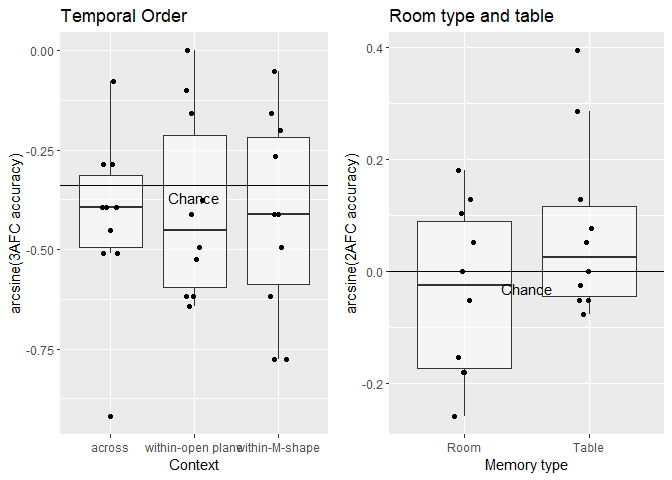
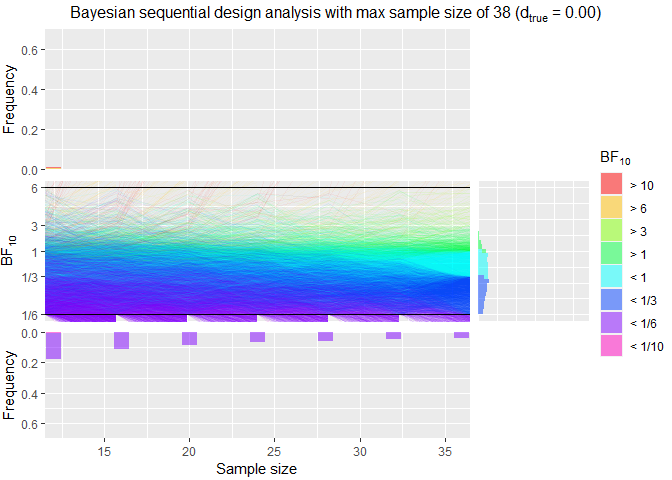
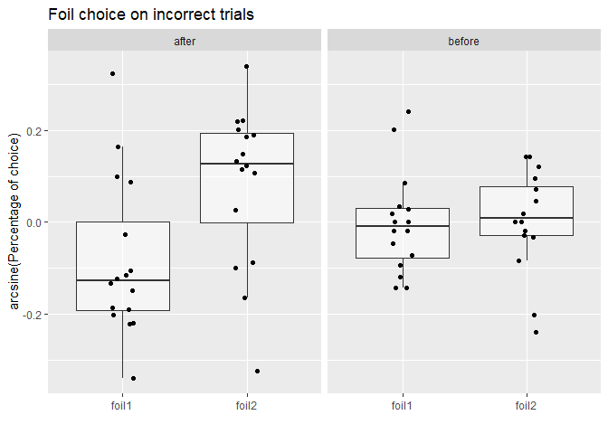
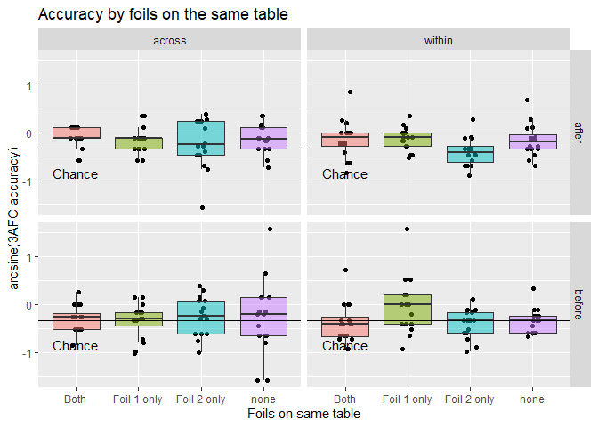

Notebook for boundary VR
================
Joern Alexander Quent
29 March, 2021

  - [Aim of this project](#aim-of-this-project)
  - [Experiment 1](#experiment-1)
      - [Method](#method)
          - [Participant pool](#participant-pool)
          - [Procedure](#procedure)
          - [Virtual environment and
            stimuli](#virtual-environment-and-stimuli)
      - [Batch 0](#batch-0)
          - [Description of memory task](#description-of-memory-task)
          - [Results](#results)
          - [Discussion](#discussion)
      - [Batch 1](#batch-1)
          - [Description of memory task](#description-of-memory-task-1)
          - [Results](#results-1)
          - [Discussion](#discussion-1)
      - [Batch 2](#batch-2)
          - [Description of memory task](#description-of-memory-task-2)
          - [Results](#results-2)
          - [Additional analysis](#additional-analysis)
              - [Simulating a null distribution for temporal
                memory](#simulating-a-null-distribution-for-temporal-memory)
              - [Excluding participants that are below 5th percentile of
                null
                distribution](#excluding-participants-that-are-below-5th-percentile-of-null-distribution)
              - [Analysis of participants that expected a memory
                test](#analysis-of-participants-that-expected-a-memory-test)
              - [Analysis of the debrief
                questionnaire](#analysis-of-the-debrief-questionnaire)
          - [Discussion](#discussion-2)
      - [Batch 3](#batch-3)
          - [Description of memory task](#description-of-memory-task-3)
          - [Results](#results-3)
              - [Exploratory analysis](#exploratory-analysis)
      - [Effect of condition](#effect-of-condition)
      - [Effect of same table](#effect-of-same-table)
          - [Discussion](#discussion-3)
  - [Experiment 2](#experiment-2)
      - [Design](#design)
      - [Design analysis of sequential
        design](#design-analysis-of-sequential-design)
          - [Null effect](#null-effect)
          - [Effect size similar to open-plane room (within
            vs. across)](#effect-size-similar-to-open-plane-room-within-vs.-across)
          - [Effect size similar to m-shaped room versus
            across:](#effect-size-similar-to-m-shaped-room-versus-across)
          - [Summary](#summary)
      - [Updated maximum sample size](#updated-maximum-sample-size)
      - [Planned analysis](#planned-analysis)
      - [Results](#results-4)
          - [Responses during video](#responses-during-video)
          - [Memory task](#memory-task)
          - [Debrief](#debrief)
              - [Further comments regarding the
                questions](#further-comments-regarding-the-questions)
          - [General comments](#general-comments)
      - [Discussion](#discussion-4)
  - [Experiment 3](#experiment-3)
      - [Planned changes](#planned-changes)

# Aim of this project

This project is set-out to explore which factors influence the
experience of spatial boundaries and how they affect memory. A previous
study (Horner et al., 2016) let participants navigate through a series
of virtual rooms. In each room they encountered two images each showing
an object. A subsequent memory test revealed that participants were
better at remembering which object preceded or succeeded a cue object if
both cue and target were presented in the same (within a boundary) as
compared to a different room (across a boundary). In our experiments, we
want to find out which characteristics of spatial boundaries
(e.g. prediction error, perceptual changes, uncertainty or novelty) are
crucial for the effect observed by Horner et al. (2016). The aim of this
document is to log all major results and changes thereby documenting the
evolution of the project.

# Experiment 1

<div style="width:300px; height:200px; float:right;position: relative; padding: 10px">


</div>

In order to examine which of the factors (see above) are important for
spatial boundaries, we created an M-shaped room (see illustration to the
right) and an open plane room that did not feature separating walls. The
latter one is similar to the one used by Horner et al. (2016). The aim
of Experiment 1 was to test whether we can replicate the basic effect
temporal order memory within boundaries \> across boundaries for both
room types before we investigate the effect for any other manipulation.
For this replication attempt, we designed our experiment to be as close
to Horner’s et al. (2016) design.

## Method

### Participant pool

We recruited participants from the website <https://www.prolific.co/>
for all batches except the internal pilot (batch 0).

### Procedure

In all experiments, participants first saw a video of another person
navigating through a series of rooms. Note that Horner et al. (2016),
participants navigated through the virtual environment themselves. After
watching the video, participants completed a memory task (see below for
details).

### Virtual environment and stimuli

The rooms were build with SketchUp (<https://www.sketchup.com>) and then
imported into unity3d (<https://unity.com/>). We downloaded everyday
objects (e.g. guitar, toys, household items etc.) from archive3d
(<https://archive3d.net/>) and edited them either in blender
(<https://www.blender.org/>) or in unity3d itself. We tried to find as
many 3D versions of objects as possible that were also used in Horner et
al. (2016). Furthermore, we tried to keep the scales of the objects
realistic compared to each other.

Two other important differences were that in our experiment the layouts
of all rooms of the same type were identical differing only in wall
colour and floor material (wood or carpet textures), while the position
of tables in Horner’s experiment changed. There, the rooms were also
arranged so that they formed a closed circle, in our experiment the
rooms were arranged so that they all laid on a linear track. These are
potential factors that could explain differences in the results.

In our videos, M-shaped and open plane room alternated. We created four
videos where the order of the objects presented was always the same.
Video 1 and 2 two objects were presented in the first room. The first
object-object sequence was hence within-boundaries. Video 3 and 4 showed
only one object in the first room. The next object was therefore
presented across the boundary. The first room in video 1 and 3 was
M-shaped, while the first room in video 2 & 4 was an open plane room.
The reason for this was to create four counter-balancing conditions that
control for the order of sequences (within vs. across) and which room
began the series.

Like the order of the objects, the wall colours and floor materials of
the rooms were constant across the videos. The only exception to this
rule was that video 3 and 4 featured 45 rooms, while video 1 and 2 and
one room less. The number of wall colours (blue, brown, green, grey,
orange, pink, purple, red, turquoise and yellow) and floor materials (5
different carpets and 5 different wood floors) allowed us to construct
45 unique rooms.

Both types of rooms contained three tables, all of which had a cardboard
box placed on top of them. If the agent approached two of the tables
(see labels 1 and 2 in figure above), the cardboard boxes disappeared.

All testing was done online. The stimulus presentation and memory task
was programmed with jsPsych as well as custom Javascript/html scripts
and hosted on the local MRC-CBU JATOS server.

Unfortunately, I only kept the script and code for batch 3. As small
incremental changes were made that were deemed insignificant at this
time. However, we did retain R-scripts that were used to create the
stimulus lists.

## Batch 0

### Description of memory task

This batch did not recruit participants from prolific but internally
from our lab and department. Following Horner et al. (2016), we tested
whether participants remembered the exact room a cue object was
presented in. This was also assayed in a 3AFC task showing a still image
of correct room along two lures. The foils were selected randomly once
for all participants. It included the following constraints: foils
couldn’t be in the same room as target. Each object was used twice as
foil.

For this pilot, we only tested one video. For this early version of the
experiment, we uploaded the video to YouTube. In subsequent batches, the
video was presented within experiment itself. Because of this,
participants were not required to complete any task during encoding.
Note that in this experiments, we tested both forward and backward
question. Also the object did not disappear after 3 secs like the
subsequent batches.

### Results

<table>

<caption>

Table 1: Temporal order memory for batch 0 with non-transformed values.

</caption>

<thead>

<tr>

<th style="border-bottom:hidden" colspan="1">

</th>

<th style="border-bottom:hidden" colspan="1">

</th>

<th style="border-bottom:hidden" colspan="1">

</th>

<th style="border-bottom:hidden; padding-bottom:0; padding-left:3px;padding-right:3px;text-align: center; " colspan="2">

<div style="border-bottom: 1px solid #ddd; padding-bottom: 5px; ">

Accuracy

</div>

</th>

<th style="border-bottom:hidden; padding-bottom:0; padding-left:3px;padding-right:3px;text-align: center; " colspan="2">

<div style="border-bottom: 1px solid #ddd; padding-bottom: 5px; ">

RT in msec

</div>

</th>

</tr>

<tr>

<th style="text-align:left;">

Room type

</th>

<th style="text-align:left;">

Boundary

</th>

<th style="text-align:right;">

N

</th>

<th style="text-align:right;">

Mean

</th>

<th style="text-align:right;">

SD

</th>

<th style="text-align:right;">

Mean

</th>

<th style="text-align:right;">

SD

</th>

</tr>

</thead>

<tbody>

<tr>

<td style="text-align:left;">

</td>

<td style="text-align:left;">

across

</td>

<td style="text-align:right;">

4

</td>

<td style="text-align:right;">

0.48

</td>

<td style="text-align:right;">

0.23

</td>

<td style="text-align:right;">

6614

</td>

<td style="text-align:right;">

3599

</td>

</tr>

<tr>

<td style="text-align:left;">

open plane

</td>

<td style="text-align:left;">

within

</td>

<td style="text-align:right;">

4

</td>

<td style="text-align:right;">

0.67

</td>

<td style="text-align:right;">

0.11

</td>

<td style="text-align:right;">

6274

</td>

<td style="text-align:right;">

3125

</td>

</tr>

<tr>

<td style="text-align:left;">

M-shaped

</td>

<td style="text-align:left;">

within

</td>

<td style="text-align:right;">

4

</td>

<td style="text-align:right;">

0.51

</td>

<td style="text-align:right;">

0.33

</td>

<td style="text-align:right;">

5389

</td>

<td style="text-align:right;">

2181

</td>

</tr>

</tbody>

</table>

The results of the four pilot participants looked promising as their
temporal order memory seems to be off the floor for both within
conditions (open plane & M-shaped room). Accuracy for the open plane
room in the within condition seems substantially higher than the other
two conditions. This is contrasted with memory performance for the room
an object was presented in (i.e. context memory). Here, performance was
very close to chance that is 0.33 (M = 0.35).

<table>

<caption>

Table 2: Context memory for batch 0 with non-transformed values.

</caption>

<thead>

<tr>

<th style="border-bottom:hidden" colspan="1">

</th>

<th style="border-bottom:hidden" colspan="1">

</th>

<th style="border-bottom:hidden; padding-bottom:0; padding-left:3px;padding-right:3px;text-align: center; " colspan="2">

<div style="border-bottom: 1px solid #ddd; padding-bottom: 5px; ">

Accuracy

</div>

</th>

<th style="border-bottom:hidden; padding-bottom:0; padding-left:3px;padding-right:3px;text-align: center; " colspan="2">

<div style="border-bottom: 1px solid #ddd; padding-bottom: 5px; ">

RT in msec

</div>

</th>

</tr>

<tr>

<th style="text-align:left;">

Room type

</th>

<th style="text-align:right;">

N

</th>

<th style="text-align:right;">

Mean

</th>

<th style="text-align:right;">

SD

</th>

<th style="text-align:right;">

Mean

</th>

<th style="text-align:right;">

SD

</th>

</tr>

</thead>

<tbody>

<tr>

<td style="text-align:left;">

no-walls

</td>

<td style="text-align:right;">

4

</td>

<td style="text-align:right;">

0.39

</td>

<td style="text-align:right;">

0.04

</td>

<td style="text-align:right;">

2277

</td>

<td style="text-align:right;">

1222

</td>

</tr>

<tr>

<td style="text-align:left;">

walls

</td>

<td style="text-align:right;">

4

</td>

<td style="text-align:right;">

0.36

</td>

<td style="text-align:right;">

0.05

</td>

<td style="text-align:right;">

2740

</td>

<td style="text-align:right;">

1301

</td>

</tr>

</tbody>

</table>

### Discussion

Additionally, our pilot participants told us that the context memory
question was too difficult and discouraging. This is especially a
problem for online experiments, where participants might giver up.
Therefore we decided to drop this question and instead ask participant
in which type of room (M-shaped vs. open plan) and on which table (1
vs. 2) an object was presented.

## Batch 1

### Description of memory task

In this batch, the foils were +/- 4 positions away from the target
object. This was done to implement tighter control of the foils. This
ensured that the two foils were always from the same room type and on
the same table as the target. Participants in this tasks were required
to judge whether an object was smaller or bigger than a reference as
soon as the object appeared. In this and all subsequent batches the
object was visible for 3 seconds. After this, the object disappeared
again and the cardboard box that was covering the object re-appeared. We
chose this to control the time during which the object could be seen by
the participant.

Instead of context memory, we ask participant to choose the but room
type and table type in 2AFC task. Temporal memory was probed by asking
participants “What came before this object?”.

### Results

<!-- -->

As can be inferred from above, there is considerable evidence that
memory performance is not above change (BF01 = 6.75). The same is true
for remembering in which room type a cue object was presented in (BF01 =
5.07). However, there is weak evidence that participants remembered on
which table the object was presented (BF10 = 1.29).

<table>

<caption>

Table 3: Temporal order memory for batch 1 with non-transformed values.

</caption>

<thead>

<tr>

<th style="border-bottom:hidden" colspan="1">

</th>

<th style="border-bottom:hidden" colspan="1">

</th>

<th style="border-bottom:hidden" colspan="1">

</th>

<th style="border-bottom:hidden; padding-bottom:0; padding-left:3px;padding-right:3px;text-align: center; " colspan="2">

<div style="border-bottom: 1px solid #ddd; padding-bottom: 5px; ">

Accuracy

</div>

</th>

<th style="border-bottom:hidden; padding-bottom:0; padding-left:3px;padding-right:3px;text-align: center; " colspan="2">

<div style="border-bottom: 1px solid #ddd; padding-bottom: 5px; ">

RT in msec

</div>

</th>

</tr>

<tr>

<th style="text-align:left;">

Room type

</th>

<th style="text-align:left;">

Boundary

</th>

<th style="text-align:right;">

N

</th>

<th style="text-align:right;">

Mean

</th>

<th style="text-align:right;">

SD

</th>

<th style="text-align:right;">

Mean

</th>

<th style="text-align:right;">

SD

</th>

</tr>

</thead>

<tbody>

<tr>

<td style="text-align:left;">

</td>

<td style="text-align:left;">

across

</td>

<td style="text-align:right;">

10

</td>

<td style="text-align:right;">

0.30

</td>

<td style="text-align:right;">

0.09

</td>

<td style="text-align:right;">

3799

</td>

<td style="text-align:right;">

1625

</td>

</tr>

<tr>

<td style="text-align:left;">

open plane

</td>

<td style="text-align:left;">

within

</td>

<td style="text-align:right;">

10

</td>

<td style="text-align:right;">

0.31

</td>

<td style="text-align:right;">

0.11

</td>

<td style="text-align:right;">

3622

</td>

<td style="text-align:right;">

1399

</td>

</tr>

<tr>

<td style="text-align:left;">

M-shaped

</td>

<td style="text-align:left;">

within

</td>

<td style="text-align:right;">

10

</td>

<td style="text-align:right;">

0.30

</td>

<td style="text-align:right;">

0.11

</td>

<td style="text-align:right;">

3901

</td>

<td style="text-align:right;">

1921

</td>

</tr>

</tbody>

</table>

<table>

<caption>

Table 4: Room and table memory for batch 1 with non-transformed values.

</caption>

<thead>

<tr>

<th style="border-bottom:hidden" colspan="1">

</th>

<th style="border-bottom:hidden" colspan="1">

</th>

<th style="border-bottom:hidden; padding-bottom:0; padding-left:3px;padding-right:3px;text-align: center; " colspan="2">

<div style="border-bottom: 1px solid #ddd; padding-bottom: 5px; ">

Accuracy

</div>

</th>

</tr>

<tr>

<th style="text-align:left;">

Type

</th>

<th style="text-align:right;">

n

</th>

<th style="text-align:right;">

meanAcc

</th>

<th style="text-align:right;">

sdAcc

</th>

</tr>

</thead>

<tbody>

<tr>

<td style="text-align:left;">

Room

</td>

<td style="text-align:right;">

10

</td>

<td style="text-align:right;">

0.48

</td>

<td style="text-align:right;">

0.08

</td>

</tr>

<tr>

<td style="text-align:left;">

Table

</td>

<td style="text-align:right;">

10

</td>

<td style="text-align:right;">

0.54

</td>

<td style="text-align:right;">

0.08

</td>

</tr>

</tbody>

</table>

After seeing the poor memory performance that was not above chance, we
got concerned that maybe participants misunderstood our instructions.
Since they saw two foils (one 4 positions before and one 4 position
after the target), a possibility could be that they choose any foil that
came before the cue object and not necessarily selecting the target.
This can be assessed by how often participants choose foil 1 versus foil
2 on incorrect trials.

<!-- -->

Note that Foil 1 is before the target and foil 2 is after the target but
each foil is 4 positions away. We did not find a bias, in contrast we
found evidence that both foils were chosen equally often (BF01 = 3.15).

### Discussion

Despite the fact that we didn’t find evidence for an bias for foil, we
choose to improve our instruction by making them much clearer and
collect another batch of participants.

## Batch 2

### Description of memory task

In this batch, we asked participants “In the video you just watched,
which one of the three objects at the bottom of the screen appeared
immediately before this object?” in order to make sure that there is no
misunderstanding as well as improving other explanations. Other than
that no significant changes were made.

### Results

<!-- -->

Unfortunately, we again found that the average performance was not above
chance for temporal order memory (BF01 = 2.23). This is true for memory
for the room type as well (BF01 = 2.33). However, the fact that
participants were able to remember on which table the object was (BF10 =
7.16) indicated that participants did remember some aspects of the task.

<table>

<caption>

Table 3: Temporal order memory for batch 2 with non-transformed values.

</caption>

<thead>

<tr>

<th style="border-bottom:hidden" colspan="1">

</th>

<th style="border-bottom:hidden" colspan="1">

</th>

<th style="border-bottom:hidden" colspan="1">

</th>

<th style="border-bottom:hidden; padding-bottom:0; padding-left:3px;padding-right:3px;text-align: center; " colspan="2">

<div style="border-bottom: 1px solid #ddd; padding-bottom: 5px; ">

Accuracy

</div>

</th>

<th style="border-bottom:hidden; padding-bottom:0; padding-left:3px;padding-right:3px;text-align: center; " colspan="2">

<div style="border-bottom: 1px solid #ddd; padding-bottom: 5px; ">

RT in msec

</div>

</th>

</tr>

<tr>

<th style="text-align:left;">

Room type

</th>

<th style="text-align:left;">

Boundary

</th>

<th style="text-align:right;">

N

</th>

<th style="text-align:right;">

Mean

</th>

<th style="text-align:right;">

SD

</th>

<th style="text-align:right;">

Mean

</th>

<th style="text-align:right;">

SD

</th>

</tr>

</thead>

<tbody>

<tr>

<td style="text-align:left;">

</td>

<td style="text-align:left;">

across

</td>

<td style="text-align:right;">

12

</td>

<td style="text-align:right;">

0.33

</td>

<td style="text-align:right;">

0.14

</td>

<td style="text-align:right;">

5871

</td>

<td style="text-align:right;">

2697

</td>

</tr>

<tr>

<td style="text-align:left;">

open plane

</td>

<td style="text-align:left;">

within

</td>

<td style="text-align:right;">

12

</td>

<td style="text-align:right;">

0.36

</td>

<td style="text-align:right;">

0.15

</td>

<td style="text-align:right;">

5284

</td>

<td style="text-align:right;">

2281

</td>

</tr>

<tr>

<td style="text-align:left;">

M-shaped

</td>

<td style="text-align:left;">

within

</td>

<td style="text-align:right;">

12

</td>

<td style="text-align:right;">

0.38

</td>

<td style="text-align:right;">

0.19

</td>

<td style="text-align:right;">

5542

</td>

<td style="text-align:right;">

2262

</td>

</tr>

</tbody>

</table>

<table>

<caption>

Table 4: Room and table memory for batch 2 with non-transformed values.

</caption>

<thead>

<tr>

<th style="border-bottom:hidden" colspan="1">

</th>

<th style="border-bottom:hidden" colspan="1">

</th>

<th style="border-bottom:hidden; padding-bottom:0; padding-left:3px;padding-right:3px;text-align: center; " colspan="2">

<div style="border-bottom: 1px solid #ddd; padding-bottom: 5px; ">

Accuracy

</div>

</th>

</tr>

<tr>

<th style="text-align:left;">

Question

</th>

<th style="text-align:right;">

N

</th>

<th style="text-align:right;">

Mean

</th>

<th style="text-align:right;">

SD

</th>

</tr>

</thead>

<tbody>

<tr>

<td style="text-align:left;">

Room

</td>

<td style="text-align:right;">

12

</td>

<td style="text-align:right;">

0.51

</td>

<td style="text-align:right;">

0.06

</td>

</tr>

<tr>

<td style="text-align:left;">

Table

</td>

<td style="text-align:right;">

12

</td>

<td style="text-align:right;">

0.59

</td>

<td style="text-align:right;">

0.11

</td>

</tr>

</tbody>

</table>

We also again looked at whether there is a possible bias in choosing one
foil over the other.

<!-- -->

We did not find a bias, in contrast we found evidence that both foils
were chosen equally often (BF01 = 1.08).

### Additional analysis

To investigating the lack of effect, we ran a couple of additional
analysis.

#### Simulating a null distribution for temporal memory

One curious result in this batch was that some participants seem to have
extremely low memory performance similar to batch 1. In order to assess,
what kind of distribution would be expected with participants gave
random responses, we ran a short simulation. With random guesses
participants should get an average accuracy of 1/3 in the 3AFC task. To
exclude those participants that actually perform below chance, I
simulated a null distribution (N = 10000) for each condition since each
condition has different number of trials. The distributions were ran
with as binomial process that used the exact number of trials for each
condition: 39, 20 and 19.

<!-- -->

The null distribution that can be seen above shows what would be if
participants answer randomly. The dashed line represents the 5th
percentile, which was the cut-off for our re-analysis. We will re-ran
the analysis using the following cut-offs

<table>

<thead>

<tr>

<th style="text-align:left;">

Context

</th>

<th style="text-align:right;">

Accuracy

</th>

</tr>

</thead>

<tbody>

<tr>

<td style="text-align:left;">

across

</td>

<td style="text-align:right;">

0.2051282

</td>

</tr>

<tr>

<td style="text-align:left;">

within-open plane

</td>

<td style="text-align:right;">

0.1500000

</td>

</tr>

<tr>

<td style="text-align:left;">

within-M-shape

</td>

<td style="text-align:right;">

0.1578947

</td>

</tr>

</tbody>

</table>

and exclude anyone scoring below any of these cut-offs. As can be seen
above, the trial number per condition influences the cut-off. This is
because with a smaller trial number, fewer response patterns are
possible.

<!-- -->

The graphic above shows the 5th percentile increases as function of the
trial number. For situations with small trial numbers, lower values are
still probable under the null distribution. This is because the
probability of getting all trials right is higher if you have only 2
trials compared if you have a 100 trials. Hence, I would argue it’s
appropriate to have different cut-offs for the different conditions.
While the across condition has 39 trials, the within-walls only has 19.
If participants randomly guessed, I expected different null
distributions even though in both cases the success probability is 1/3.

#### Excluding participants that are below 5th percentile of null distribution

##### With condition specific cut-offs

Based on the cut-offs, I excluded 2 participants from the analysis.

<!-- -->

This did not change the general pattern of the results.

##### Cut-off across conditions

Overall, there are 78 trials in the experiment. Below chance performance
for that case would be 0.2435897.

There is one participant(s), to which that applies. If we exclude this
participant from the analysis. Excluding one participant cannot change
our results.

#### Analysis of participants that expected a memory test

Because I didn’t save a participant ID for all output, I need to
manually assign the results of the memory task to the debrief
questionnaire data by renaming the file names.

<!-- -->

This also does not seem to change the results.

#### Analysis of the debrief questionnaire

Below are pie charts for all multiple choice questions that we asked in
the debrief questionnaire.

<!-- -->

The majority of the questions were answered in positive way (e.g. most
people watched attentively). We also asked whether going through the
M-shaped room felt like a boundary. However, the results were not really
conclusive as they seem to be contradictory. This was most likely due to
the way that we phrased the questions. All in all, the questionnaire did
not reveal any concerning issues.

### Discussion

The difference between our results and Aidan’s results could be due to
different task during encoding. One option here could be to use a more
semantic task as such a pleasant/unpleasant judgement could be made
(like in Aidan’s exp). Another major difference was that Aidan used
random foils, while we always used foils that were +/- 4 positions form
the target. A task with random foils is a lot easier than +/-4.
Especially since some objects will be on different tables and we saw
that people do remember those. The additional analysis did not provide
us with an explanation of why the memory performance was very low and
why could not replicate Horner’s results.

## Batch 3

### Description of memory task

Since our additional analysis did not produce any explanations why we
observe this pattern, we decided to run another batch of participants
but this time having the same foil (random) selection procedure as
Horner.

### Results

<!-- -->

We the relaxed constraints for foils, we did find that the average
performance was above chance for temporal order memory (BF10 = 24.48).
Memory for rooms (BF01 = 2.15) and tables (BF10 = 19.29) again showed
the same pattern as in previous batches.

An ANOVA revealed that there was a difference between the context
(across vs. within-open plane vs. within-M-shape; BF10 = 3.28).
Two-sides t-tests showed the following differences:

<table>

<thead>

<tr>

<th style="text-align:left;">

Comparison

</th>

<th style="text-align:right;">

BF10

</th>

<th style="text-align:right;">

D

</th>

</tr>

</thead>

<tbody>

<tr>

<td style="text-align:left;">

within-open plane vs. across

</td>

<td style="text-align:right;">

0.73

</td>

<td style="text-align:right;">

0.43

</td>

</tr>

<tr>

<td style="text-align:left;">

within-M-shape vs. across

</td>

<td style="text-align:right;">

3.89

</td>

<td style="text-align:right;">

0.77

</td>

</tr>

<tr>

<td style="text-align:left;">

within-M-shape vs. within-open plane

</td>

<td style="text-align:right;">

1.12

</td>

<td style="text-align:right;">

0.53

</td>

</tr>

</tbody>

</table>

<!-- -->

The difference between collapsed condition (across vs. within) was large
and reliable (BF10 = 6.77, d = 0.88).

<table>

<thead>

<tr>

<th style="text-align:left;">

context

</th>

<th style="text-align:right;">

accuracy

</th>

<th style="text-align:right;">

SD

</th>

</tr>

</thead>

<tbody>

<tr>

<td style="text-align:left;">

across

</td>

<td style="text-align:right;">

0.3688363

</td>

<td style="text-align:right;">

0.0962469

</td>

</tr>

<tr>

<td style="text-align:left;">

within-open plane

</td>

<td style="text-align:right;">

0.4038462

</td>

<td style="text-align:right;">

0.1189249

</td>

</tr>

<tr>

<td style="text-align:left;">

within-M-shape

</td>

<td style="text-align:right;">

0.5008097

</td>

<td style="text-align:right;">

0.1322718

</td>

</tr>

</tbody>

</table>

The mean accuracy difference between across and within-no-walls is 0.035
(SD = 0.0795), while it is 0.132 (SD = 0.1693) for the within-wall
condition. Here is the Table 1 from Horner et al. (2016) for *‘Which
object came next?’*

<table>

<caption>

Data from Aidan’s Experiments: Which object came next?

</caption>

<thead>

<tr>

<th style="text-align:left;">

Experiment

</th>

<th style="text-align:left;">

Context

</th>

<th style="text-align:right;">

accuracy

</th>

<th style="text-align:right;">

SD

</th>

</tr>

</thead>

<tbody>

<tr>

<td style="text-align:left;">

Exp 1

</td>

<td style="text-align:left;">

within

</td>

<td style="text-align:right;">

0.52

</td>

<td style="text-align:right;">

0.15

</td>

</tr>

<tr>

<td style="text-align:left;">

Exp 1

</td>

<td style="text-align:left;">

across

</td>

<td style="text-align:right;">

0.42

</td>

<td style="text-align:right;">

0.10

</td>

</tr>

<tr>

<td style="text-align:left;">

Exp 2

</td>

<td style="text-align:left;">

within

</td>

<td style="text-align:right;">

0.45

</td>

<td style="text-align:right;">

0.17

</td>

</tr>

<tr>

<td style="text-align:left;">

Exp 2

</td>

<td style="text-align:left;">

across

</td>

<td style="text-align:right;">

0.38

</td>

<td style="text-align:right;">

0.18

</td>

</tr>

<tr>

<td style="text-align:left;">

Exp 3

</td>

<td style="text-align:left;">

within

</td>

<td style="text-align:right;">

0.52

</td>

<td style="text-align:right;">

0.18

</td>

</tr>

<tr>

<td style="text-align:left;">

Exp 3

</td>

<td style="text-align:left;">

across

</td>

<td style="text-align:right;">

0.44

</td>

<td style="text-align:right;">

0.14

</td>

</tr>

</tbody>

</table>

his boundary effects are 0.1, 0.07, 0.08 and for the question *‘Which
object came before?’*

<table>

<caption>

Data from Aidan’s Experiments: Which object came before?

</caption>

<thead>

<tr>

<th style="text-align:left;">

Experiment

</th>

<th style="text-align:left;">

Context

</th>

<th style="text-align:right;">

accuracy

</th>

<th style="text-align:right;">

SD

</th>

</tr>

</thead>

<tbody>

<tr>

<td style="text-align:left;">

Exp 1

</td>

<td style="text-align:left;">

within

</td>

<td style="text-align:right;">

0.42

</td>

<td style="text-align:right;">

0.15

</td>

</tr>

<tr>

<td style="text-align:left;">

Exp 1

</td>

<td style="text-align:left;">

across

</td>

<td style="text-align:right;">

0.38

</td>

<td style="text-align:right;">

0.13

</td>

</tr>

<tr>

<td style="text-align:left;">

Exp 2

</td>

<td style="text-align:left;">

within

</td>

<td style="text-align:right;">

0.46

</td>

<td style="text-align:right;">

0.21

</td>

</tr>

<tr>

<td style="text-align:left;">

Exp 2

</td>

<td style="text-align:left;">

across

</td>

<td style="text-align:right;">

0.41

</td>

<td style="text-align:right;">

0.16

</td>

</tr>

<tr>

<td style="text-align:left;">

Exp 3

</td>

<td style="text-align:left;">

within

</td>

<td style="text-align:right;">

0.49

</td>

<td style="text-align:right;">

0.18

</td>

</tr>

<tr>

<td style="text-align:left;">

Exp 3

</td>

<td style="text-align:left;">

across

</td>

<td style="text-align:right;">

0.44

</td>

<td style="text-align:right;">

0.17

</td>

</tr>

</tbody>

</table>

here the boundary effects are 0.04, 0.05, 0.05. This is not much
different from our effects. The problem is that those low effects are
observed for the question that we’re not testing. It could very well
that we just don’t have enough power to find this effect. To find out
whether there are any factors that can explain why the effect was
stronger in the within M-shape condition, I ran several exploratory
analyses.

#### Exploratory analysis

<table>

<thead>

<tr>

<th style="text-align:left;">

</th>

<th style="text-align:right;">

Estimate

</th>

<th style="text-align:right;">

SE

</th>

<th style="text-align:right;">

Z

</th>

<th style="text-align:right;">

P

</th>

<th style="text-align:left;">

Sig

</th>

</tr>

</thead>

<tbody>

<tr>

<td style="text-align:left;">

(Intercept)

</td>

<td style="text-align:right;">

\-0.67

</td>

<td style="text-align:right;">

0.19

</td>

<td style="text-align:right;">

\-3.47

</td>

<td style="text-align:right;">

0.0005

</td>

<td style="text-align:left;">

\*\*\*

</td>

</tr>

<tr>

<td style="text-align:left;">

minDist

</td>

<td style="text-align:right;">

0.01

</td>

<td style="text-align:right;">

0.01

</td>

<td style="text-align:right;">

1.53

</td>

<td style="text-align:right;">

0.1253

</td>

<td style="text-align:left;">

</td>

</tr>

<tr>

<td style="text-align:left;">

maxDist

</td>

<td style="text-align:right;">

0.00

</td>

<td style="text-align:right;">

0.00

</td>

<td style="text-align:right;">

0.98

</td>

<td style="text-align:right;">

0.3283

</td>

<td style="text-align:left;">

</td>

</tr>

<tr>

<td style="text-align:left;">

meanDist

</td>

<td style="text-align:right;">

0.00

</td>

<td style="text-align:right;">

0.00

</td>

<td style="text-align:right;">

\-0.22

</td>

<td style="text-align:right;">

0.8265

</td>

<td style="text-align:left;">

</td>

</tr>

</tbody>

</table>

In another step, I tried to predict accuracy by including fixed effects
for the absolute minimum, maximum and mean distance values of foil 1
(before cue/probe) and foil 2 (after cue/probe). In other words, for
each trial I for instance used the minimum of both absolute distances.
However as can you can see above, none significantly predicts accuracy.

<table>

<thead>

<tr>

<th style="text-align:left;">

</th>

<th style="text-align:right;">

Estimate

</th>

<th style="text-align:right;">

SE

</th>

<th style="text-align:right;">

Z

</th>

<th style="text-align:right;">

P

</th>

<th style="text-align:left;">

Sig

</th>

</tr>

</thead>

<tbody>

<tr>

<td style="text-align:left;">

(Intercept)

</td>

<td style="text-align:right;">

\-0.65

</td>

<td style="text-align:right;">

0.19

</td>

<td style="text-align:right;">

\-3.39

</td>

<td style="text-align:right;">

0.0007

</td>

<td style="text-align:left;">

\*\*\*

</td>

</tr>

<tr>

<td style="text-align:left;">

dist1

</td>

<td style="text-align:right;">

\-0.01

</td>

<td style="text-align:right;">

0.00

</td>

<td style="text-align:right;">

\-1.33

</td>

<td style="text-align:right;">

0.1840

</td>

<td style="text-align:left;">

</td>

</tr>

<tr>

<td style="text-align:left;">

dist2

</td>

<td style="text-align:right;">

0.01

</td>

<td style="text-align:right;">

0.00

</td>

<td style="text-align:right;">

1.48

</td>

<td style="text-align:right;">

0.1382

</td>

<td style="text-align:left;">

</td>

</tr>

</tbody>

</table>

When I use the raw distance values of foil 1 and foil 2, there again
were no significant effects even though the distance of foil 2 to the
cue/probe was relatively small, p = .138.

<table>

<thead>

<tr>

<th style="text-align:left;">

</th>

<th style="text-align:right;">

Estimate

</th>

<th style="text-align:right;">

SE

</th>

<th style="text-align:right;">

Z

</th>

<th style="text-align:right;">

P

</th>

<th style="text-align:left;">

Sig

</th>

</tr>

</thead>

<tbody>

<tr>

<td style="text-align:left;">

(Intercept)

</td>

<td style="text-align:right;">

\-0.75

</td>

<td style="text-align:right;">

0.17

</td>

<td style="text-align:right;">

\-4.40

</td>

<td style="text-align:right;">

0.0000

</td>

<td style="text-align:left;">

\*\*\*

</td>

</tr>

<tr>

<td style="text-align:left;">

contextwithin-open plane

</td>

<td style="text-align:right;">

0.47

</td>

<td style="text-align:right;">

0.28

</td>

<td style="text-align:right;">

1.69

</td>

<td style="text-align:right;">

0.0912

</td>

<td style="text-align:left;">

.

</td>

</tr>

<tr>

<td style="text-align:left;">

contextwithin-M-shape

</td>

<td style="text-align:right;">

0.68

</td>

<td style="text-align:right;">

0.27

</td>

<td style="text-align:right;">

2.50

</td>

<td style="text-align:right;">

0.0123

</td>

<td style="text-align:left;">

  - 
    
    </td>
    
    </tr>
    
    <tr>
    
    <td style="text-align:left;">
    
    dist2
    
    </td>
    
    <td style="text-align:right;">
    
    0.01
    
    </td>
    
    <td style="text-align:right;">
    
    0.01
    
    </td>
    
    <td style="text-align:right;">
    
    1.60
    
    </td>
    
    <td style="text-align:right;">
    
    0.1091
    
    </td>
    
    <td style="text-align:left;">
    
    </td>
    
    </tr>
    
    <tr>
    
    <td style="text-align:left;">
    
    contextwithin-open plane:dist2
    
    </td>
    
    <td style="text-align:right;">
    
    \-0.01
    
    </td>
    
    <td style="text-align:right;">
    
    0.01
    
    </td>
    
    <td style="text-align:right;">
    
    \-1.46
    
    </td>
    
    <td style="text-align:right;">
    
    0.1456
    
    </td>
    
    <td style="text-align:left;">
    
    </td>
    
    </tr>
    
    <tr>
    
    <td style="text-align:left;">
    
    contextwithin-M-shape:dist2
    
    </td>
    
    <td style="text-align:right;">
    
    \-0.01
    
    </td>
    
    <td style="text-align:right;">
    
    0.01
    
    </td>
    
    <td style="text-align:right;">
    
    \-0.63
    
    </td>
    
    <td style="text-align:right;">
    
    0.5257
    
    </td>
    
    <td style="text-align:left;">
    
    </td>
    
    </tr>
    
    </tbody>
    
    </table>

In a next step, I included context and dist2 as predictors in the
logistic regression model and allowed an interaction between both fixed
effects. As you can see none of the interactions are significant but, a)
there is again a significant contrast between across and within-walls, p
= .012. Most interestingly, there is also trend for the contrast between
across and within-no-walls, p = .091.

##### Binary distance

<table>

<thead>

<tr>

<th style="text-align:left;">

</th>

<th style="text-align:right;">

Estimate

</th>

<th style="text-align:right;">

SE

</th>

<th style="text-align:right;">

Z

</th>

<th style="text-align:right;">

P

</th>

<th style="text-align:left;">

Sig

</th>

</tr>

</thead>

<tbody>

<tr>

<td style="text-align:left;">

(Intercept)

</td>

<td style="text-align:right;">

\-0.70

</td>

<td style="text-align:right;">

0.14

</td>

<td style="text-align:right;">

\-4.83

</td>

<td style="text-align:right;">

0.0000

</td>

<td style="text-align:left;">

\*\*\*

</td>

</tr>

<tr>

<td style="text-align:left;">

contextwithin-open plane

</td>

<td style="text-align:right;">

0.30

</td>

<td style="text-align:right;">

0.24

</td>

<td style="text-align:right;">

1.27

</td>

<td style="text-align:right;">

0.2051

</td>

<td style="text-align:left;">

</td>

</tr>

<tr>

<td style="text-align:left;">

contextwithin-M-shape

</td>

<td style="text-align:right;">

0.68

</td>

<td style="text-align:right;">

0.23

</td>

<td style="text-align:right;">

3.01

</td>

<td style="text-align:right;">

0.0026

</td>

<td style="text-align:left;">

\*\*

</td>

</tr>

<tr>

<td style="text-align:left;">

binDist2far

</td>

<td style="text-align:right;">

0.31

</td>

<td style="text-align:right;">

0.19

</td>

<td style="text-align:right;">

1.69

</td>

<td style="text-align:right;">

0.0907

</td>

<td style="text-align:left;">

.

</td>

</tr>

<tr>

<td style="text-align:left;">

contextwithin-open plane:binDist2far

</td>

<td style="text-align:right;">

\-0.31

</td>

<td style="text-align:right;">

0.32

</td>

<td style="text-align:right;">

\-0.98

</td>

<td style="text-align:right;">

0.3292

</td>

<td style="text-align:left;">

</td>

</tr>

<tr>

<td style="text-align:left;">

contextwithin-M-shape:binDist2far

</td>

<td style="text-align:right;">

\-0.28

</td>

<td style="text-align:right;">

0.31

</td>

<td style="text-align:right;">

\-0.89

</td>

<td style="text-align:right;">

0.3761

</td>

<td style="text-align:left;">

</td>

</tr>

</tbody>

</table>

If I use a binary measure of foil distance instead of a continuous one,
then the effects don’t chance a lot actually.

The mean accuracy between trial where foil 2 is far way compared to
close is 0.0432 (SD = 0.0432), BF10 = 0.65.

<table>

<thead>

<tr>

<th style="text-align:left;">

context

</th>

<th style="text-align:left;">

binDist2

</th>

<th style="text-align:right;">

N

</th>

<th style="text-align:right;">

accuracy

</th>

</tr>

</thead>

<tbody>

<tr>

<td style="text-align:left;">

across

</td>

<td style="text-align:left;">

close

</td>

<td style="text-align:right;">

263

</td>

<td style="text-align:right;">

0.3346008

</td>

</tr>

<tr>

<td style="text-align:left;">

across

</td>

<td style="text-align:left;">

far

</td>

<td style="text-align:right;">

244

</td>

<td style="text-align:right;">

0.4057377

</td>

</tr>

<tr>

<td style="text-align:left;">

within-open plane

</td>

<td style="text-align:left;">

close

</td>

<td style="text-align:right;">

109

</td>

<td style="text-align:right;">

0.4036697

</td>

</tr>

<tr>

<td style="text-align:left;">

within-open plane

</td>

<td style="text-align:left;">

far

</td>

<td style="text-align:right;">

144

</td>

<td style="text-align:right;">

0.4027778

</td>

</tr>

<tr>

<td style="text-align:left;">

within-M-shape

</td>

<td style="text-align:left;">

close

</td>

<td style="text-align:right;">

121

</td>

<td style="text-align:right;">

0.4958678

</td>

</tr>

<tr>

<td style="text-align:left;">

within-M-shape

</td>

<td style="text-align:left;">

far

</td>

<td style="text-align:right;">

133

</td>

<td style="text-align:right;">

0.5037594

</td>

</tr>

</tbody>

</table>

I’ve furthermore tested the interaction between our contrasts (across
vs. within-walls and across vs. within-no-walls) and the distance
between trials with close and far foil 2. The first contrasts shows no
interaction, 0.3299 (SD = 0.3597) vs 0.2312 (SD = 0.4636), \(BF_{10]\) =
0.39, so that the boundary effect is similar for far and close foil 2s.
The same is true for the contrast of across vs. within-no-walls,0.1494
(SD = 0.3008) vs -0.0085 (SD = 0.339), \(BF_{10}\) = 0.39.

## Effect of condition

<table>

<thead>

<tr>

<th style="text-align:left;">

</th>

<th style="text-align:right;">

Estimate

</th>

<th style="text-align:right;">

SE

</th>

<th style="text-align:right;">

Z

</th>

<th style="text-align:right;">

P

</th>

<th style="text-align:left;">

Sig

</th>

</tr>

</thead>

<tbody>

<tr>

<td style="text-align:left;">

(Intercept)

</td>

<td style="text-align:right;">

\-0.50

</td>

<td style="text-align:right;">

0.19

</td>

<td style="text-align:right;">

\-2.58

</td>

<td style="text-align:right;">

0.0100

</td>

<td style="text-align:left;">

\*\*

</td>

</tr>

<tr>

<td style="text-align:left;">

contextwithin-open plane

</td>

<td style="text-align:right;">

0.13

</td>

<td style="text-align:right;">

0.29

</td>

<td style="text-align:right;">

0.44

</td>

<td style="text-align:right;">

0.6624

</td>

<td style="text-align:left;">

</td>

</tr>

<tr>

<td style="text-align:left;">

contextwithin-M-shape

</td>

<td style="text-align:right;">

0.35

</td>

<td style="text-align:right;">

0.28

</td>

<td style="text-align:right;">

1.25

</td>

<td style="text-align:right;">

0.2116

</td>

<td style="text-align:left;">

</td>

</tr>

<tr>

<td style="text-align:left;">

condition5

</td>

<td style="text-align:right;">

\-0.05

</td>

<td style="text-align:right;">

0.30

</td>

<td style="text-align:right;">

\-0.17

</td>

<td style="text-align:right;">

0.8689

</td>

<td style="text-align:left;">

</td>

</tr>

<tr>

<td style="text-align:left;">

condition6

</td>

<td style="text-align:right;">

\-0.09

</td>

<td style="text-align:right;">

0.30

</td>

<td style="text-align:right;">

\-0.29

</td>

<td style="text-align:right;">

0.7700

</td>

<td style="text-align:left;">

</td>

</tr>

<tr>

<td style="text-align:left;">

condition7

</td>

<td style="text-align:right;">

\-0.05

</td>

<td style="text-align:right;">

0.30

</td>

<td style="text-align:right;">

\-0.16

</td>

<td style="text-align:right;">

0.8691

</td>

<td style="text-align:left;">

</td>

</tr>

<tr>

<td style="text-align:left;">

contextwithin-open plane:condition5

</td>

<td style="text-align:right;">

\-0.06

</td>

<td style="text-align:right;">

0.44

</td>

<td style="text-align:right;">

\-0.13

</td>

<td style="text-align:right;">

0.8961

</td>

<td style="text-align:left;">

</td>

</tr>

<tr>

<td style="text-align:left;">

contextwithin-M-shape:condition5

</td>

<td style="text-align:right;">

0.75

</td>

<td style="text-align:right;">

0.44

</td>

<td style="text-align:right;">

1.70

</td>

<td style="text-align:right;">

0.0886

</td>

<td style="text-align:left;">

.

</td>

</tr>

<tr>

<td style="text-align:left;">

contextwithin-open plane:condition6

</td>

<td style="text-align:right;">

0.28

</td>

<td style="text-align:right;">

0.44

</td>

<td style="text-align:right;">

0.65

</td>

<td style="text-align:right;">

0.5164

</td>

<td style="text-align:left;">

</td>

</tr>

<tr>

<td style="text-align:left;">

contextwithin-M-shape:condition6

</td>

<td style="text-align:right;">

0.17

</td>

<td style="text-align:right;">

0.43

</td>

<td style="text-align:right;">

0.40

</td>

<td style="text-align:right;">

0.6897

</td>

<td style="text-align:left;">

</td>

</tr>

<tr>

<td style="text-align:left;">

contextwithin-open plane:condition7

</td>

<td style="text-align:right;">

\-0.13

</td>

<td style="text-align:right;">

0.44

</td>

<td style="text-align:right;">

\-0.29

</td>

<td style="text-align:right;">

0.7685

</td>

<td style="text-align:left;">

</td>

</tr>

<tr>

<td style="text-align:left;">

contextwithin-M-shape:condition7

</td>

<td style="text-align:right;">

\-0.05

</td>

<td style="text-align:right;">

0.43

</td>

<td style="text-align:right;">

\-0.11

</td>

<td style="text-align:right;">

0.9089

</td>

<td style="text-align:left;">

</td>

</tr>

</tbody>

</table>

In the last step, I included condition as fixed effect. After replacing
the problematic participants it’s a good sign that there are no
significant interactions left between any context contrast and
conditions.

## Effect of same table

Does it matter if both of the foils are on a different or on the same
table as the target object? To examine this question, I compare the
average accuracy across trials with both foils from the same table as
the target with that being not the case. Note that 0 means both foils or
foil2 are/is not on the same table and 1 means it is the same table.

<!-- -->

This analysis has to be interpreted very carefully because only 24 % of
trials are with both foils on the same table. Accuracy is not
significantly lower on trials where the foils are from the same tables,
\(BF_{01}\) = 3.03. If we plug that variable into our model,

<table>

<thead>

<tr>

<th style="text-align:left;">

</th>

<th style="text-align:right;">

Estimate

</th>

<th style="text-align:right;">

SE

</th>

<th style="text-align:right;">

Z

</th>

<th style="text-align:right;">

P

</th>

<th style="text-align:left;">

Sig

</th>

</tr>

</thead>

<tbody>

<tr>

<td style="text-align:left;">

(Intercept)

</td>

<td style="text-align:right;">

\-0.57

</td>

<td style="text-align:right;">

0.12

</td>

<td style="text-align:right;">

\-4.66

</td>

<td style="text-align:right;">

0.0000

</td>

<td style="text-align:left;">

\*\*\*

</td>

</tr>

<tr>

<td style="text-align:left;">

contextwithin-open plane

</td>

<td style="text-align:right;">

0.13

</td>

<td style="text-align:right;">

0.19

</td>

<td style="text-align:right;">

0.68

</td>

<td style="text-align:right;">

0.4941

</td>

<td style="text-align:left;">

</td>

</tr>

<tr>

<td style="text-align:left;">

contextwithin-M-shape

</td>

<td style="text-align:right;">

0.56

</td>

<td style="text-align:right;">

0.18

</td>

<td style="text-align:right;">

3.18

</td>

<td style="text-align:right;">

0.0015

</td>

<td style="text-align:left;">

\*\*

</td>

</tr>

<tr>

<td style="text-align:left;">

bothSameTable1

</td>

<td style="text-align:right;">

0.10

</td>

<td style="text-align:right;">

0.22

</td>

<td style="text-align:right;">

0.48

</td>

<td style="text-align:right;">

0.6347

</td>

<td style="text-align:left;">

</td>

</tr>

<tr>

<td style="text-align:left;">

contextwithin-open plane:bothSameTable1

</td>

<td style="text-align:right;">

0.05

</td>

<td style="text-align:right;">

0.36

</td>

<td style="text-align:right;">

0.13

</td>

<td style="text-align:right;">

0.8972

</td>

<td style="text-align:left;">

</td>

</tr>

<tr>

<td style="text-align:left;">

contextwithin-M-shape:bothSameTable1

</td>

<td style="text-align:right;">

\-0.05

</td>

<td style="text-align:right;">

0.39

</td>

<td style="text-align:right;">

\-0.12

</td>

<td style="text-align:right;">

0.9008

</td>

<td style="text-align:left;">

</td>

</tr>

</tbody>

</table>

the contrast between across and within-walls remains unchanged by the
inclusion of the variable. Interestingly, there is a trend for an
interaction between foils being on the same table with the target and
the contrast across vs. within-no-walls = .897. Below, I display the
interaction

<!-- -->

The problem with this comparison is that there are on average 9.3076923
trials in the same table case, while there are 29.6923077 in the
opposite case. For comparison, I also plot the same interaction for the
contrast across vs. within-walls.

<!-- -->

Here is the overall table:

<table>

<thead>

<tr>

<th style="text-align:left;">

context

</th>

<th style="text-align:left;">

bothSameTable

</th>

<th style="text-align:right;">

N

</th>

<th style="text-align:right;">

accuracy

</th>

</tr>

</thead>

<tbody>

<tr>

<td style="text-align:left;">

across

</td>

<td style="text-align:left;">

0

</td>

<td style="text-align:right;">

386

</td>

<td style="text-align:right;">

0.3626943

</td>

</tr>

<tr>

<td style="text-align:left;">

across

</td>

<td style="text-align:left;">

1

</td>

<td style="text-align:right;">

121

</td>

<td style="text-align:right;">

0.3884298

</td>

</tr>

<tr>

<td style="text-align:left;">

within-open plane

</td>

<td style="text-align:left;">

0

</td>

<td style="text-align:right;">

180

</td>

<td style="text-align:right;">

0.3944444

</td>

</tr>

<tr>

<td style="text-align:left;">

within-open plane

</td>

<td style="text-align:left;">

1

</td>

<td style="text-align:right;">

73

</td>

<td style="text-align:right;">

0.4246575

</td>

</tr>

<tr>

<td style="text-align:left;">

within-M-shape

</td>

<td style="text-align:left;">

0

</td>

<td style="text-align:right;">

207

</td>

<td style="text-align:right;">

0.4975845

</td>

</tr>

<tr>

<td style="text-align:left;">

within-M-shape

</td>

<td style="text-align:left;">

1

</td>

<td style="text-align:right;">

47

</td>

<td style="text-align:right;">

0.5106383

</td>

</tr>

</tbody>

</table>

In addition to testing whether accuracy is worse in the rare case when
both foils are from the same table, I also tested whether it makes a
difference if only foil 2 is from the same table as the target.

<!-- -->

Note that here 48 % of trials have foil 2 and the target on the same
table. Again, accuracy is not significantly lower on trials where the
foil 2 is from the same table, \(BF_{01}\) 2.87. If we plug foil2 into
our model,

<table>

<thead>

<tr>

<th style="text-align:left;">

</th>

<th style="text-align:right;">

Estimate

</th>

<th style="text-align:right;">

SE

</th>

<th style="text-align:right;">

Z

</th>

<th style="text-align:right;">

P

</th>

<th style="text-align:left;">

Sig

</th>

</tr>

</thead>

<tbody>

<tr>

<td style="text-align:left;">

(Intercept)

</td>

<td style="text-align:right;">

\-0.82

</td>

<td style="text-align:right;">

0.15

</td>

<td style="text-align:right;">

\-5.46

</td>

<td style="text-align:right;">

0.0000

</td>

<td style="text-align:left;">

\*\*\*

</td>

</tr>

<tr>

<td style="text-align:left;">

contextwithin-open plane

</td>

<td style="text-align:right;">

0.59

</td>

<td style="text-align:right;">

0.22

</td>

<td style="text-align:right;">

2.65

</td>

<td style="text-align:right;">

0.0081

</td>

<td style="text-align:left;">

\*\*

</td>

</tr>

<tr>

<td style="text-align:left;">

contextwithin-M-shape

</td>

<td style="text-align:right;">

0.92

</td>

<td style="text-align:right;">

0.22

</td>

<td style="text-align:right;">

4.23

</td>

<td style="text-align:right;">

0.0000

</td>

<td style="text-align:left;">

\*\*\*

</td>

</tr>

<tr>

<td style="text-align:left;">

foil2SameTable1

</td>

<td style="text-align:right;">

0.53

</td>

<td style="text-align:right;">

0.19

</td>

<td style="text-align:right;">

2.81

</td>

<td style="text-align:right;">

0.0050

</td>

<td style="text-align:left;">

\*\*

</td>

</tr>

<tr>

<td style="text-align:left;">

contextwithin-open plane:foil2SameTable1

</td>

<td style="text-align:right;">

\-0.88

</td>

<td style="text-align:right;">

0.32

</td>

<td style="text-align:right;">

\-2.75

</td>

<td style="text-align:right;">

0.0060

</td>

<td style="text-align:left;">

\*\*

</td>

</tr>

<tr>

<td style="text-align:left;">

contextwithin-M-shape:foil2SameTable1

</td>

<td style="text-align:right;">

\-0.75

</td>

<td style="text-align:right;">

0.32

</td>

<td style="text-align:right;">

\-2.34

</td>

<td style="text-align:right;">

0.0193

</td>

<td style="text-align:left;">

  - 
    
    </td>
    
    </tr>
    
    </tbody>
    
    </table>

nothing really changes and there is no interaction. If I enter both
distance of foil 2 and whether both objects are on the same table into
our model

<table>

<thead>

<tr>

<th style="text-align:left;">

</th>

<th style="text-align:right;">

Estimate

</th>

<th style="text-align:right;">

SE

</th>

<th style="text-align:right;">

Z

</th>

<th style="text-align:right;">

P

</th>

<th style="text-align:left;">

Sig

</th>

</tr>

</thead>

<tbody>

<tr>

<td style="text-align:left;">

(Intercept)

</td>

<td style="text-align:right;">

\-0.77

</td>

<td style="text-align:right;">

0.19

</td>

<td style="text-align:right;">

\-4.00

</td>

<td style="text-align:right;">

0.0001

</td>

<td style="text-align:left;">

\*\*\*

</td>

</tr>

<tr>

<td style="text-align:left;">

contextwithin-open plane

</td>

<td style="text-align:right;">

0.39

</td>

<td style="text-align:right;">

0.34

</td>

<td style="text-align:right;">

1.14

</td>

<td style="text-align:right;">

0.2524

</td>

<td style="text-align:left;">

</td>

</tr>

<tr>

<td style="text-align:left;">

contextwithin-M-shape

</td>

<td style="text-align:right;">

0.63

</td>

<td style="text-align:right;">

0.31

</td>

<td style="text-align:right;">

2.04

</td>

<td style="text-align:right;">

0.0414

</td>

<td style="text-align:left;">

  - 
    
    </td>
    
    </tr>
    
    <tr>
    
    <td style="text-align:left;">
    
    bothSameTable1
    
    </td>
    
    <td style="text-align:right;">
    
    0.10
    
    </td>
    
    <td style="text-align:right;">
    
    0.36
    
    </td>
    
    <td style="text-align:right;">
    
    0.26
    
    </td>
    
    <td style="text-align:right;">
    
    0.7916
    
    </td>
    
    <td style="text-align:left;">
    
    </td>
    
    </tr>
    
    <tr>
    
    <td style="text-align:left;">
    
    dist2
    
    </td>
    
    <td style="text-align:right;">
    
    0.01
    
    </td>
    
    <td style="text-align:right;">
    
    0.01
    
    </td>
    
    <td style="text-align:right;">
    
    1.39
    
    </td>
    
    <td style="text-align:right;">
    
    0.1637
    
    </td>
    
    <td style="text-align:left;">
    
    </td>
    
    </tr>
    
    <tr>
    
    <td style="text-align:left;">
    
    contextwithin-open plane:bothSameTable1
    
    </td>
    
    <td style="text-align:right;">
    
    0.22
    
    </td>
    
    <td style="text-align:right;">
    
    0.61
    
    </td>
    
    <td style="text-align:right;">
    
    0.36
    
    </td>
    
    <td style="text-align:right;">
    
    0.7211
    
    </td>
    
    <td style="text-align:left;">
    
    </td>
    
    </tr>
    
    <tr>
    
    <td style="text-align:left;">
    
    contextwithin-M-shape:bothSameTable1
    
    </td>
    
    <td style="text-align:right;">
    
    0.24
    
    </td>
    
    <td style="text-align:right;">
    
    0.67
    
    </td>
    
    <td style="text-align:right;">
    
    0.36
    
    </td>
    
    <td style="text-align:right;">
    
    0.7154
    
    </td>
    
    <td style="text-align:left;">
    
    </td>
    
    </tr>
    
    <tr>
    
    <td style="text-align:left;">
    
    contextwithin-open plane:dist2
    
    </td>
    
    <td style="text-align:right;">
    
    \-0.01
    
    </td>
    
    <td style="text-align:right;">
    
    0.01
    
    </td>
    
    <td style="text-align:right;">
    
    \-0.97
    
    </td>
    
    <td style="text-align:right;">
    
    0.3330
    
    </td>
    
    <td style="text-align:left;">
    
    </td>
    
    </tr>
    
    <tr>
    
    <td style="text-align:left;">
    
    contextwithin-M-shape:dist2
    
    </td>
    
    <td style="text-align:right;">
    
    0.00
    
    </td>
    
    <td style="text-align:right;">
    
    0.01
    
    </td>
    
    <td style="text-align:right;">
    
    \-0.26
    
    </td>
    
    <td style="text-align:right;">
    
    0.7958
    
    </td>
    
    <td style="text-align:left;">
    
    </td>
    
    </tr>
    
    <tr>
    
    <td style="text-align:left;">
    
    bothSameTable1:dist2
    
    </td>
    
    <td style="text-align:right;">
    
    0.00
    
    </td>
    
    <td style="text-align:right;">
    
    0.01
    
    </td>
    
    <td style="text-align:right;">
    
    0.09
    
    </td>
    
    <td style="text-align:right;">
    
    0.9255
    
    </td>
    
    <td style="text-align:left;">
    
    </td>
    
    </tr>
    
    <tr>
    
    <td style="text-align:left;">
    
    contextwithin-open plane:bothSameTable1:dist2
    
    </td>
    
    <td style="text-align:right;">
    
    \-0.01
    
    </td>
    
    <td style="text-align:right;">
    
    0.02
    
    </td>
    
    <td style="text-align:right;">
    
    \-0.41
    
    </td>
    
    <td style="text-align:right;">
    
    0.6832
    
    </td>
    
    <td style="text-align:left;">
    
    </td>
    
    </tr>
    
    <tr>
    
    <td style="text-align:left;">
    
    contextwithin-M-shape:bothSameTable1:dist2
    
    </td>
    
    <td style="text-align:right;">
    
    \-0.01
    
    </td>
    
    <td style="text-align:right;">
    
    0.02
    
    </td>
    
    <td style="text-align:right;">
    
    \-0.58
    
    </td>
    
    <td style="text-align:right;">
    
    0.5616
    
    </td>
    
    <td style="text-align:left;">
    
    </td>
    
    </tr>
    
    </tbody>
    
    </table>

then both contrasts are close to be significant, across
vs. within-no-walls p = .252 and across within-walls p = .041 but none
of the other main effects or interaction show a trend.

### Discussion

In contrast to our expectation, we found that only m-shape rooms showed
a boundary effect. This might be noise but if anything we would have
expected to see a boundary effect only for open-plane rooms. This is
because we thought that adding the walls might introduce a within room
boundary. To exclude this possibility, was the primary reason for
running the experiment in the first place because our plan is to add
manipulation that introduce boundaries on top of something that is not a
boundary. Unfortunately, our exploratory analyses did not provide or
suggest any reason for this peculiar result. However, note this is not
surprising as we had extremely low number of observation in some of the
conditions of the exploratory analyses. Before we start with this second
phase of this project we will therefore need to run another experiment
that shows that both rooms on their own show boundary effects.

# Experiment 2

## Design

In this version of the task, participants are asked both temporal order
question (Which object was before? vs. Which object was after?) in a
blocked fashion. The order of this is randomised. In this experiment, we
have 8 unique conditions,

<table>

<caption>

Table 9: Factorial design for Experiment 2

</caption>

<thead>

<tr>

<th style="text-align:right;">

Condition

</th>

<th style="text-align:left;">

Room type

</th>

<th style="text-align:left;">

Start with

</th>

<th style="text-align:left;">

Block 1

</th>

<th style="text-align:left;">

Block 2

</th>

</tr>

</thead>

<tbody>

<tr>

<td style="text-align:right;">

1

</td>

<td style="text-align:left;">

M-shape

</td>

<td style="text-align:left;">

within

</td>

<td style="text-align:left;">

Before

</td>

<td style="text-align:left;">

After

</td>

</tr>

<tr>

<td style="text-align:right;">

2

</td>

<td style="text-align:left;">

M-shape

</td>

<td style="text-align:left;">

across

</td>

<td style="text-align:left;">

Before

</td>

<td style="text-align:left;">

After

</td>

</tr>

<tr>

<td style="text-align:right;">

3

</td>

<td style="text-align:left;">

open-plane

</td>

<td style="text-align:left;">

within

</td>

<td style="text-align:left;">

Before

</td>

<td style="text-align:left;">

After

</td>

</tr>

<tr>

<td style="text-align:right;">

4

</td>

<td style="text-align:left;">

open-plane

</td>

<td style="text-align:left;">

across

</td>

<td style="text-align:left;">

Before

</td>

<td style="text-align:left;">

After

</td>

</tr>

<tr>

<td style="text-align:right;">

5

</td>

<td style="text-align:left;">

M-shape

</td>

<td style="text-align:left;">

within

</td>

<td style="text-align:left;">

After

</td>

<td style="text-align:left;">

Before

</td>

</tr>

<tr>

<td style="text-align:right;">

6

</td>

<td style="text-align:left;">

M-shape

</td>

<td style="text-align:left;">

across

</td>

<td style="text-align:left;">

After

</td>

<td style="text-align:left;">

Before

</td>

</tr>

<tr>

<td style="text-align:right;">

7

</td>

<td style="text-align:left;">

open-plane

</td>

<td style="text-align:left;">

within

</td>

<td style="text-align:left;">

After

</td>

<td style="text-align:left;">

Before

</td>

</tr>

<tr>

<td style="text-align:right;">

8

</td>

<td style="text-align:left;">

open-plane

</td>

<td style="text-align:left;">

across

</td>

<td style="text-align:left;">

After

</td>

<td style="text-align:left;">

Before

</td>

</tr>

</tbody>

</table>

These 8 between-subject conditions are fully crossed: room type (M-shape
vs. open-plane), the fist inter-item connection (within vs. across) and
the direction of temporal order memory that is tested first (Which
object was before? vs. Which object was after?). To keep the experiment
from getting too long, room type and table type questions were scraped
as we have enough evidence that participants can only remember on which
table an object was.

Behind the scenes, we also made a couple of changes in unity3d. First,
rooms are now split into two per scene that that are loaded by crossing
over the door. This allowed me to use my laptop’s GPU to render the
rooms much more efficiently. A pair of rooms now can be baked in less
than 5 minutes. Previously, I have baked all 44/45 rooms in one go
overnight. The problem with that approach is that each time I had to
change something, I would have to bake everything again. In the first
experiments, objects were like the room static, which meant that I had
to bake them as well and if I wanted to change something, I would have
to bake everything again as well. Now, objects are set dynamically,
which allows me to change them much more easily. However, at the moment
I have to set the transform position and rotations manually keeping
track of those values in a spreadsheet to make sure I am using the same
values across all four videos. In future experiment, I should also
script this. One way would be to edit all prefabs and make them child to
an empty game object in a way that they are at zero on the y-axis and
have neutral orientation. This will allow me to instantiate all object
with default values while making sure their position and orientation is
correct.

In addition to the change in lighting, I created a script that moves the
camera through a series of way points that are the same across all
videos. In the first experiment, I created videos of me controlling a
first person character. This might have introduces biases and
differences between videos and between within and across room objects
associations. For instance, in the first experiment videos showed up to
1 minute difference. Now, the time the camera needs to get from table to
table the within a room is matched to the time the camera needs to get
to table to table across rooms (7.8 vs 7.9 secs). All videos now have
roughly the same length (11:30 min). I also made small changes to object
with regards to their colour and size and swapped on object because it
might have been to difficult to recognise.

## Design analysis of sequential design

Since we did find a difference between across and within room
associations for the M-shaped room but not for the open-plane room, we
will run a sequential Bayesian data collection on both conditions
separately starting with the open-plane room. At first we will run 12
participants for the open-plane room condition, after which we will
check the evidence whether there is a difference between across and
within room associations. We will increase the sample size by increments
of four until we either reach a \(BF_{10}\) of 6 or 1/6 or the maximum
sample size of 36 that is currently constrained by our remaining balance
on prolific (£431.66). After we have reached either of those stopping
criteria, we will do the same for m-shape room (starting at 12 and
incrementing by 4) until we reach a criterion for this condition. In
case, we obtain an inconclusive results for the open-plane room and we
still have resources left, we will increase the sample size for the
open-plane room. The same is also true the other way around for the
m-shaped room.

In order to assess whether this data collection plan is able to provide
conclusive evidence (\(BF_{10}\) \> 6 | \< 1/6), I ran a simplified
simulation with directional Bayesian *t*-tests with minimum sample size
of 12 and maximum of 36 with effect sizes d = 0, 0.44 and 0.78 that
correspond to a null effect and effect sizes that we observed in
Experiment 1 Batch 3.

### Null effect

<!-- -->

<table>

<caption>

Table 10: Results of simulation for null effect

</caption>

<thead>

<tr>

<th style="text-align:left;">

Support

</th>

<th style="text-align:right;">

Percent

</th>

</tr>

</thead>

<tbody>

<tr>

<td style="text-align:left;">

\> 10

</td>

<td style="text-align:right;">

0.0139

</td>

</tr>

<tr>

<td style="text-align:left;">

\> 6

</td>

<td style="text-align:right;">

0.0162

</td>

</tr>

<tr>

<td style="text-align:left;">

\> 3

</td>

<td style="text-align:right;">

0.0059

</td>

</tr>

<tr>

<td style="text-align:left;">

\> 1

</td>

<td style="text-align:right;">

0.0389

</td>

</tr>

<tr>

<td style="text-align:left;">

\< 1

</td>

<td style="text-align:right;">

0.1547

</td>

</tr>

<tr>

<td style="text-align:left;">

\< 1/3

</td>

<td style="text-align:right;">

0.1871

</td>

</tr>

<tr>

<td style="text-align:left;">

\< 1/6

</td>

<td style="text-align:right;">

0.5742

</td>

</tr>

<tr>

<td style="text-align:left;">

\< 1/10

</td>

<td style="text-align:right;">

0.0091

</td>

</tr>

</tbody>

</table>

### Effect size similar to open-plane room (within vs. across)

<!-- -->

<table>

<caption>

Table 11: Results of simulation for effect size similar to open-plane
room (within vs. across)

</caption>

<thead>

<tr>

<th style="text-align:left;">

Support

</th>

<th style="text-align:right;">

Percent

</th>

</tr>

</thead>

<tbody>

<tr>

<td style="text-align:left;">

\> 10

</td>

<td style="text-align:right;">

0.3258

</td>

</tr>

<tr>

<td style="text-align:left;">

\> 6

</td>

<td style="text-align:right;">

0.3063

</td>

</tr>

<tr>

<td style="text-align:left;">

\> 3

</td>

<td style="text-align:right;">

0.0762

</td>

</tr>

<tr>

<td style="text-align:left;">

\> 1

</td>

<td style="text-align:right;">

0.1525

</td>

</tr>

<tr>

<td style="text-align:left;">

\< 1

</td>

<td style="text-align:right;">

0.1010

</td>

</tr>

<tr>

<td style="text-align:left;">

\< 1/3

</td>

<td style="text-align:right;">

0.0165

</td>

</tr>

<tr>

<td style="text-align:left;">

\< 1/6

</td>

<td style="text-align:right;">

0.0216

</td>

</tr>

<tr>

<td style="text-align:left;">

\< 1/10

</td>

<td style="text-align:right;">

0.0001

</td>

</tr>

</tbody>

</table>

### Effect size similar to m-shaped room versus across:

<!-- -->

<table>

<caption>

Table 12: Results of simulation for effect size similar to m-shaped room
(within vs. across)

</caption>

<thead>

<tr>

<th style="text-align:left;">

Support

</th>

<th style="text-align:right;">

Percent

</th>

</tr>

</thead>

<tbody>

<tr>

<td style="text-align:left;">

\> 10

</td>

<td style="text-align:right;">

0.6871

</td>

</tr>

<tr>

<td style="text-align:left;">

\> 6

</td>

<td style="text-align:right;">

0.2992

</td>

</tr>

<tr>

<td style="text-align:left;">

\> 3

</td>

<td style="text-align:right;">

0.0065

</td>

</tr>

<tr>

<td style="text-align:left;">

\> 1

</td>

<td style="text-align:right;">

0.0064

</td>

</tr>

<tr>

<td style="text-align:left;">

\< 1

</td>

<td style="text-align:right;">

0.0006

</td>

</tr>

<tr>

<td style="text-align:left;">

\< 1/3

</td>

<td style="text-align:right;">

0.0000

</td>

</tr>

<tr>

<td style="text-align:left;">

\< 1/6

</td>

<td style="text-align:right;">

0.0002

</td>

</tr>

<tr>

<td style="text-align:left;">

\< 1/10

</td>

<td style="text-align:right;">

0.0000

</td>

</tr>

</tbody>

</table>

### Summary

<table>

<caption>

Table 13: Summary of design analysis simulation.

</caption>

<thead>

<tr>

<th style="text-align:left;">

Effect size

</th>

<th style="text-align:right;">

Median sample size

</th>

<th style="text-align:right;">

Evidence rate

</th>

<th style="text-align:right;">

Misleading evidence rate

</th>

</tr>

</thead>

<tbody>

<tr>

<td style="text-align:left;">

d = 0.00

</td>

<td style="text-align:right;">

28

</td>

<td style="text-align:right;">

0.5833

</td>

<td style="text-align:right;">

0.0301

</td>

</tr>

<tr>

<td style="text-align:left;">

d = 0.44

</td>

<td style="text-align:right;">

28

</td>

<td style="text-align:right;">

0.6321

</td>

<td style="text-align:right;">

0.0217

</td>

</tr>

<tr>

<td style="text-align:left;">

d = 0.78

</td>

<td style="text-align:right;">

12

</td>

<td style="text-align:right;">

0.9863

</td>

<td style="text-align:right;">

0.0002

</td>

</tr>

</tbody>

</table>

As can be seen in the table above expect for the third simulation, the
evidence rate is not very high and around 60%. Luckily, however the rate
of misleading evidence is low throughout (\<= 0.03). We will go ahead
despite the relatively low evidence rate considering that we might not
need a sample size of 38 for the m-shape room, so that we can use the
remaining resources for the open-plane room.

## Updated maximum sample size

Since the actual experiment is shorter than expected in the design
analysis (30 min instead of 40 min), we can now test 102 participants in
total and the max. sample size per condition is 48. This is now the
updated stopping rule.

## Planned analysis

Our main planned analysis is a paired t-test between within and across
room associations for both room types on arcsince transformed accuracy
data of the first block. We will use directional t-tests as we expect
within room associations to be better than across room associations. We
restrict this analysis to data from the first block as it is possible
that the second block will not yield an effect due to interference from
the first block. This is the analysis informs our stopping criteria.
Once we expended all our money or reached the evidence criteria, we will
continue with additional analyses.

As additional analyses we plan to run a Bayesian ANOVA with with factors
boundary (within vs across), question (Which object came before?
vs. Which object came after?) and block (Block 1 and Block 2). The aim
of this analysis is to find whether this is the case. In case, we find
no modulation, we will also include data . Furthermore, we will run
another ANOVA with boundary and room type as factors to investigate
whether the boundary effect (if existing) is stronger comparing both
room times. Since, this involves are between subject comparison that is
not directional, we might not have sample size that is big enough.
Therefore, we do not make this part of our stopping rule.

## Results

### Responses during video

The response during the video were mostly without anything noteworthy
apart from the fact that three participants had more than approximately
88 responses (126, 144, 910). My suspicion is that those just pressed
more than one because they didn’t get any feedback. This is also
actually mentioned in the feedback. Apart from those three participants,
participants had an expected inter-response interval of circa 7 secs,
which is consistent with the time between objects.

There is actually one thing that I don’t understand for the participants
with 910 key presses that is the first four entries are extremely high
numbers: 1.590778110^{12}. However, in the script the time stamp are
calculated relative to the video start, see

``` 
        $(document).on('keypress', function(e) {
            if (e.which == 115 || e.which == 108) {
                e.preventDefault()
                var d = new Date();
                var n = d.getTime();
                whichKey.push(e.which);
                timeStamps.push(n - vid_start);
            }
        }) 
```

subsequent values are much smaller (3133). This value is consistent with
the first values for other participants. If have no idea how this can
work. Where do these large values come from?

In one video file, there was an error for one of the objects (object was
visible before they approached the table) but this shouldn’t have too
much of an impact.

### Memory task

Note that all tests here directional. Our current sample size is 16.

Below, is the main comparison on which I base the stopping rule. This is
responses taken from the first block of the experiment (collapsed across
question type). and in that case the \(BF_{10}\) is \< 1/6.

<!-- -->

<!-- -->

If we look at the effect for each question type and counterbalancing
condition separately, it seems that the overall trend is relatively
consistent except for condition 6. Furthermore, I investigated whether
there are systematic differences between the counterbalance conditions
with regard to the foils that were used.

<table>

<caption>

Table: Difference between condition with regard to counterbalancing
conditions

</caption>

<thead>

<tr>

<th style="border-bottom:hidden" colspan="3">

</th>

<th style="border-bottom:hidden; padding-bottom:0; padding-left:3px;padding-right:3px;text-align: center; " colspan="2">

<div style="border-bottom: 1px solid #ddd; padding-bottom: 5px; ">

Min. distance

</div>

</th>

<th style="border-bottom:hidden; padding-bottom:0; padding-left:3px;padding-right:3px;text-align: center; " colspan="2">

<div style="border-bottom: 1px solid #ddd; padding-bottom: 5px; ">

Max. distance

</div>

</th>

<th style="border-bottom:hidden; padding-bottom:0; padding-left:3px;padding-right:3px;text-align: center; " colspan="2">

<div style="border-bottom: 1px solid #ddd; padding-bottom: 5px; ">

Mean distance

</div>

</th>

<th style="border-bottom:hidden; padding-bottom:0; padding-left:3px;padding-right:3px;text-align: center; " colspan="2">

<div style="border-bottom: 1px solid #ddd; padding-bottom: 5px; ">

Foil on

</div>

</th>

</tr>

<tr>

<th style="text-align:left;">

Context

</th>

<th style="text-align:right;">

Condition

</th>

<th style="text-align:right;">

Accuracy

</th>

<th style="text-align:right;">

Mean

</th>

<th style="text-align:right;">

SD

</th>

<th style="text-align:right;">

Mean

</th>

<th style="text-align:right;">

SD

</th>

<th style="text-align:right;">

Mean

</th>

<th style="text-align:right;">

SD

</th>

<th style="text-align:right;">

Same table 1

</th>

<th style="text-align:right;">

Same table 2

</th>

</tr>

</thead>

<tbody>

<tr>

<td style="text-align:left;">

across

</td>

<td style="text-align:right;">

2

</td>

<td style="text-align:right;">

0.47

</td>

<td style="text-align:right;">

12.12

</td>

<td style="text-align:right;">

8.25

</td>

<td style="text-align:right;">

33.74

</td>

<td style="text-align:right;">

18.48

</td>

<td style="text-align:right;">

23.23

</td>

<td style="text-align:right;">

18.70

</td>

<td style="text-align:right;">

0.50

</td>

<td style="text-align:right;">

0.54

</td>

</tr>

<tr>

<td style="text-align:left;">

across

</td>

<td style="text-align:right;">

3

</td>

<td style="text-align:right;">

0.38

</td>

<td style="text-align:right;">

11.27

</td>

<td style="text-align:right;">

7.53

</td>

<td style="text-align:right;">

34.37

</td>

<td style="text-align:right;">

17.70

</td>

<td style="text-align:right;">

22.95

</td>

<td style="text-align:right;">

17.45

</td>

<td style="text-align:right;">

0.46

</td>

<td style="text-align:right;">

0.51

</td>

</tr>

<tr>

<td style="text-align:left;">

across

</td>

<td style="text-align:right;">

6

</td>

<td style="text-align:right;">

0.35

</td>

<td style="text-align:right;">

12.12

</td>

<td style="text-align:right;">

8.26

</td>

<td style="text-align:right;">

33.74

</td>

<td style="text-align:right;">

18.50

</td>

<td style="text-align:right;">

23.23

</td>

<td style="text-align:right;">

18.71

</td>

<td style="text-align:right;">

0.50

</td>

<td style="text-align:right;">

0.54

</td>

</tr>

<tr>

<td style="text-align:left;">

across

</td>

<td style="text-align:right;">

7

</td>

<td style="text-align:right;">

0.36

</td>

<td style="text-align:right;">

11.27

</td>

<td style="text-align:right;">

7.53

</td>

<td style="text-align:right;">

34.37

</td>

<td style="text-align:right;">

17.70

</td>

<td style="text-align:right;">

22.95

</td>

<td style="text-align:right;">

17.45

</td>

<td style="text-align:right;">

0.46

</td>

<td style="text-align:right;">

0.51

</td>

</tr>

<tr>

<td style="text-align:left;">

within

</td>

<td style="text-align:right;">

2

</td>

<td style="text-align:right;">

0.42

</td>

<td style="text-align:right;">

11.16

</td>

<td style="text-align:right;">

6.78

</td>

<td style="text-align:right;">

35.36

</td>

<td style="text-align:right;">

16.52

</td>

<td style="text-align:right;">

23.40

</td>

<td style="text-align:right;">

17.43

</td>

<td style="text-align:right;">

0.38

</td>

<td style="text-align:right;">

0.40

</td>

</tr>

<tr>

<td style="text-align:left;">

within

</td>

<td style="text-align:right;">

3

</td>

<td style="text-align:right;">

0.37

</td>

<td style="text-align:right;">

11.24

</td>

<td style="text-align:right;">

7.80

</td>

<td style="text-align:right;">

35.29

</td>

<td style="text-align:right;">

16.63

</td>

<td style="text-align:right;">

22.11

</td>

<td style="text-align:right;">

16.87

</td>

<td style="text-align:right;">

0.50

</td>

<td style="text-align:right;">

0.52

</td>

</tr>

<tr>

<td style="text-align:left;">

within

</td>

<td style="text-align:right;">

6

</td>

<td style="text-align:right;">

0.41

</td>

<td style="text-align:right;">

11.16

</td>

<td style="text-align:right;">

6.78

</td>

<td style="text-align:right;">

35.36

</td>

<td style="text-align:right;">

16.53

</td>

<td style="text-align:right;">

23.40

</td>

<td style="text-align:right;">

17.45

</td>

<td style="text-align:right;">

0.38

</td>

<td style="text-align:right;">

0.40

</td>

</tr>

<tr>

<td style="text-align:left;">

within

</td>

<td style="text-align:right;">

7

</td>

<td style="text-align:right;">

0.29

</td>

<td style="text-align:right;">

11.24

</td>

<td style="text-align:right;">

7.80

</td>

<td style="text-align:right;">

35.29

</td>

<td style="text-align:right;">

16.63

</td>

<td style="text-align:right;">

22.11

</td>

<td style="text-align:right;">

16.87

</td>

<td style="text-align:right;">

0.50

</td>

<td style="text-align:right;">

0.52

</td>

</tr>

</tbody>

</table>

The last two columns show how often the foils (1 & 2) are on the same
table was the target. As a reminder, foil 1 is always from before the
target and foil 2 is always after the target. Below it can be seen
whether any foil type was chosen more often than the other.

<!-- -->

However the evidence for different choice rates of foil 1 vs. foil 2 for
the after question is low (BF10 = 1.15, two-sided). Furthermore, I
checked whether foils being on the same table as the target influences
the results.

<!-- -->

In an ANOVA question type (before vs. after), foil1 on the same table
and foil 2 on the same table, there is only evidence for a main effect
of question type (BF10 = 1.77).

The picture also doesn’t really change if I plot both question types of
the first block seperately.

<!-- -->

The effect is even stronger if I take data from both blocks collapsing
across both question types.

<!-- -->

As can be seen below, over all memory performance is well above chance.

<!-- -->

Average over all memory performance is 0.39 (0.07).

Because of this really surprising results, I checked *again* whether the
label within and across were correct. For this I checked video 3 and
ensured that for towel was indeed preceded by the lamp in the same room
as the source data that I created in R stated. An error could have been
the reason, but this is not the case. From the source data frame in R, I
created a .js file, so it could be that while the soruce data frame in R
is correct, but I did an error in here. However, this is also not the
case. I checked the same for video 4 (note only video 3 and video 4 were
shown this time).

### Debrief

<!-- -->

#### Further comments regarding the questions

<strong>Subject: 10476 </strong> <i>Did you use any strategy to remember
the objects and their order? One strategy for instance could be to
recall the table an object was on and then to exclude options on that
basis. (If yes, please elaborate.)</i>:  
Tried to remember the table the object was on and also imaginate the
table that the objects in the options was so I could try to assimilate
but it was very difficult.  
<strong>Subject: 10477 </strong> <i>Did you use any strategy to remember
the objects and their order? One strategy for instance could be to
recall the table an object was on and then to exclude options on that
basis. (If yes, please elaborate.)</i>:  
I based my opinion on the location of the tables and sometimes
remembering some key objects  
<strong>Subject: 10477 </strong> <i>Specifically, did you sometimes make
responses based on the general memory when objects appeared in the video
but not based on exactly knowing order of objects?</i>:  
sometimes i tried to make relations between some objects but i knew that
most of the times their real world relation was not connected by the
order they were presented to me  
<strong>Subject: 10480 </strong> <i>Did you recognise all objects in the
video and in the memory task? (If you can, please try describe the/those
object(s) where you had problems briefly e.g. their
shape/colour.)</i>:  
I didn’t recognize one of the fans  
<strong>Subject: 10480 </strong> <i>Did you experience any problems
viewing the videos? Or problems in the experiment in general? (If yes,
please elaborate.)</i>:  
There was visual no feedback when picking L/S so I didn’t know if the
selection was being correctly recorded  
<strong>Subject: 10480 </strong> <i>Did you use any strategy to remember
the objects and their order? One strategy for instance could be to
recall the table an object was on and then to exclude options on that
basis. (If yes, please elaborate.)</i>:  
Tried to remember if the object appeared towards the end or the
beginning of the video. Also, there were some themes in the object’s
order (ex.: kitchen)  
<strong>Subject: 10480 </strong> <i>Specifically, did you sometimes make
responses based on the general memory when objects appeared in the video
but not based on exactly knowing order of objects?</i>:  
Yes, in very few cases I actually remembered the order.  
<strong>Subject: 10481 </strong> <i>Did you use any strategy to remember
the objects and their order? One strategy for instance could be to
recall the table an object was on and then to exclude options on that
basis. (If yes, please elaborate.)</i>:  
i try to see in witch position the object was. for example if the object
was the fist that we see in a room , the box was in my right, so with
that the object was rotated in a certain way for the viewer can see what
the object is so we could compare to the 36 inches.so the second object
in the room was at the left , so it had to be positioned in a certain
way for the viwer.  
<strong>Subject: 10484 </strong> <i>Did you use any strategy to remember
the objects and their order? One strategy for instance could be to
recall the table an object was on and then to exclude options on that
basis. (If yes, please elaborate.)</i>:  
I tried to recall if the object was on the table on the left or right,
and choose accordingly  
<strong>Subject: 10486 </strong> <i>Did you experience any problems
viewing the videos? Or problems in the experiment in general? (If yes,
please elaborate.)</i>:  
one item without box  
<strong>Subject: 10488 </strong> <i>Did you recognise all objects in the
video and in the memory task? (If you can, please try describe the/those
object(s) where you had problems briefly e.g. their
shape/colour.)</i>:  
I cant remember the football, and the larger items.  
<strong>Subject: 10489 </strong> <i>Did you experience any problems
viewing the videos? Or problems in the experiment in general? (If yes,
please elaborate.)</i>:  
there were times were the box glitched and hid what was showing like the
headphones.  
<strong>Subject: 10491 </strong> <i>Did you use any strategy to remember
the objects and their order? One strategy for instance could be to
recall the table an object was on and then to exclude options on that
basis. (If yes, please elaborate.)</i>:  
Went in with no strategy but i was expecting something fishy\!  
<strong>Subject: 10499 </strong> <i>Did you recognise all objects in the
video and in the memory task? (If you can, please try describe the/those
object(s) where you had problems briefly e.g. their
shape/colour.)</i>:  
One object I don’t remember seeing in the video was the wrench as well
as the fern looking plant. The rest I have a clear memory of seeing them
in the video.  
<strong>Subject: 10499 </strong> <i>Did you use any strategy to remember
the objects and their order? One strategy for instance could be to
recall the table an object was on and then to exclude options on that
basis. (If yes, please elaborate.)</i>:  
While doing the test I tried to remember on which table I saw the
object, was on the first or second one. I was hoping that in that way it
would be easier for me to answer correctly about the order the objects
appeared.  
<strong>Subject: 10499 </strong> <i>Specifically, did you sometimes make
responses based on the general memory when objects appeared in the video
but not based on exactly knowing order of objects?</i>:  
Yes, I had to rely on my first response. I tried to think harder about
where I might have seen them, but most of the object I answered by
visualising parts of the video where I think I’ve seen the objects.  
<strong>Subject: 10506 </strong> <i>Did you recognise all objects in the
video and in the memory task? (If you can, please try describe the/those
object(s) where you had problems briefly e.g. their
shape/colour.)</i>:  
I had problems remembering the smaller objects  
<strong>Subject: 10505 </strong> <i>Did you recognise all objects in the
video and in the memory task? (If you can, please try describe the/those
object(s) where you had problems briefly e.g. their
shape/colour.)</i>:  
It is hard to say, some of the smallest objects for example measure tape
looked different in colored background and in the white one while
answering questions.  
<strong>Subject: 10505 </strong> <i>Did you experience any problems
viewing the videos? Or problems in the experiment in general? (If yes,
please elaborate.)</i>:  
One of the boxes with dumbbell was flickering and the object appeared
before “walking” towards it, and then disappeared. When I clicked S
button it appeared once again.  
<strong>Subject: 10507 </strong> <i>Did you recognise all objects in the
video and in the memory task? (If you can, please try describe the/those
object(s) where you had problems briefly e.g. their
shape/colour.)</i>:  
Recipients like trash can or something similar. Books or magazines.  
<strong>Subject: 10507 </strong> <i>Did you use any strategy to remember
the objects and their order? One strategy for instance could be to
recall the table an object was on and then to exclude options on that
basis. (If yes, please elaborate.)</i>:  
I associated the table the object was on and position of the table
relative to the room.

### General comments

<strong>Subject: 10477 </strong>  
At the end i was getting too tired and my memory wasnt so fresh about
the order of objects so probably i made even more mistakes there.  
<strong>Subject: 10491 </strong>  
Instructions were clear, but the test was confusing\! I guess memory
overload? Splitting the video in 2 maybe would help.  
<strong>Subject: 10499 </strong>  
Quite a interesting and engaging test. It really makes your brain work
and makes your try to remember positions and order of the objects.
Really pleased.  
<strong>Subject: 10505 </strong>  
If you could give a little clue what will be the test about, I think
more answers would be correct. I realised that our minds just skip some
informations that we see probably to save space in our brains. For
example we don’t remember the way of going into university (trees, path,
if the sky was cloudy or not, if we saw the STOP sign or not) because it
is not necessary for us to live. We remember most things when something
is new and it shocks us or when we are really focused on our task.

## Discussion

Because of the quite surprising result that there is evidence that
within room association are **not** better remembered than across room
association. We could not find any evidence that specific counter
balancing conditions or errors in the code were responsible for this.
Especially the latter was excluded as a possibility because I repeatedly
compared the videos (as the truth) to the respective data that is
generated and can say that the labels were not just swapped. We decided
to stop this experiment meaning not collecting data for the m-shaped
room. Since as the first step we wanted to establish the basic effect
from Horner et al. (2016) as a baseline we decided to go back to the
drawing board. We concluded that one of the problems might be that our
overall memory performance while nominally above chance, is too low to
allow manipulations to affect any variance.

# Experiment 3

## Planned changes

Surprisingly, we did not find any effect for open-plane rooms so far. In
discussion, we found that memory performance in Horner et al (2016) was
slight higher with 0.44 across experiments and conditions than our
memory performance, which was 0.39. Our aim now is to improve overall
memory performance and hope that this will allow to find an effect.

To do this, we decided on three major changes a) memory encoding in
Experiment 3 will be intentional, b) there will be two study-test cycles
so that only 44 objects at a time will be encoded in block and c) we
will try to make the rooms more distinct. The latter can be reached in
myriad ways. In the Experiment 1 & 2, only five different wall colours
and floor textures were used. I will now try to find many more textures
in order to make rooms more distinct perceptually. Further options are
adding more decoration to the rooms (e.g. wall paints or symbols) or
even adding music or sounds to different rooms. The feasibility of
latter options will be evaluated. Another change ‘under the hood’ will
be that a script will know ensure that all objects have the same
orientation across all videos. In previous version, I still had to
manually set the positions and orientation, which sometimes led to
errors.

two groups: 1 m- and o-shape room.
